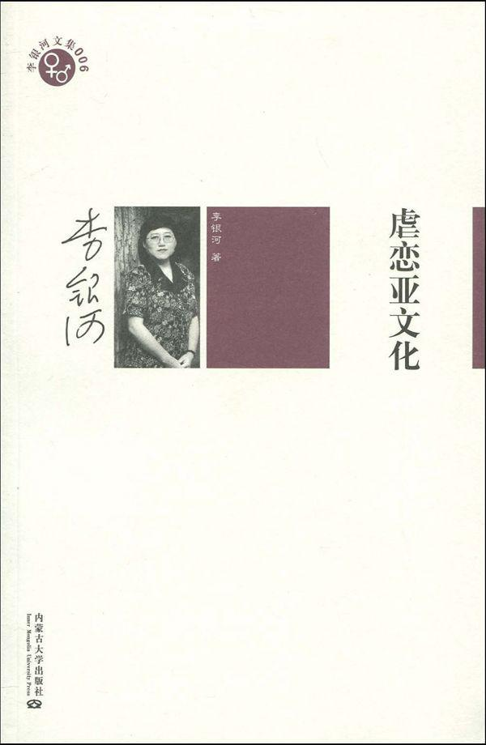
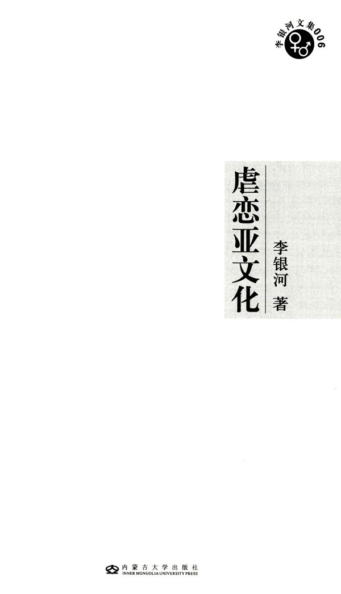

<aside>

<a href="#目录">目录</a>

</aside>

 

  

[下载 李银河-虐恋亚文化.mobi](李银河-虐恋亚文化.mobi)

[下载 李银河-虐恋亚文化.pdf](李银河-虐恋亚文化.pdf)

# 作者简介

李银河，1952年生于北京，山西大学历史系学士，美国匹兹堡大学社会学系硕士、博士，现为中国社会科学院研究员、教授、博士生导师。

李银河是当代中国最富社会影响力的学者之一，主要研究领域是妇女社会学、家庭社会学、性别研究、性社会学。她的许多理论对中国社会学的发展和中国社会的进步起到了推动性作用。1999年，被《亚洲周刊》评为中国50位最具影响的人物之一。2004年，被《南方人物周刊》评为“影响中国公共知识分子50人”之一。2008年，入选“中国改革开放30年30名社会人物”。

### 图书在版编目（CIP）数据

虐恋亚文化／李银河著．—呼和浩特：内蒙古大学出版社，2009.10

（李银河文集）

ISBN 978-7-81115-746-8

Ⅰ．虐…  Ⅱ．李…  Ⅲ．性问题—研究—西方国家  Ⅳ．C913.14

 

中国版本图书馆CIP数据核字（2009）第174639号

<table id="table1">
<tr>
<td>书&emsp;&emsp;名</td>
<td>虐恋亚文化</td>
</tr>
<td>著&emsp;&emsp;者</td>
<td>李银河</td>
</tr>
<tr>
<td>责任编辑</td>
<td>理绥</td>
</tr>
<tr>
<td>封面设计</td>
<td></td>
</tr>
<tr>
<td>出&emsp;&emsp;版</td>
<td>内蒙古大学出版社   呼和浩特市大学西路235号（010021）</td>
</tr>
<tr>
<td>发&emsp;&emsp;行</td> 
<td>内蒙古新华书店</td>
</tr>
<tr>
<td>印&emsp;&emsp;刷</td> 
<td>三河尚艺印装有限公司</td>
</tr>
<tr>
<td>开&emsp;&emsp;本</td> 
<td>787mm×1092mm  1/16</td>
</tr>
<tr>
<td>印&emsp;&emsp;张</td>
<td>21.5</td>
</tr>
<tr>
<td>字&emsp;&emsp;数</td> 
<td>240千</td>
</tr>
<tr>
<td>日&emsp;&emsp;期</td>
<td>2009年10月第1版&emsp;2009年10月第1次印刷</td>
</tr>
<tr>
<td>标准书号</td>
<td>ISBN 978-7-81115-746-8</td>
</tr>
<tr>
<td>定&emsp;&emsp;价</td>
<td>34.00元</td>
</tr>
</table>

<h1 id="出版说明">出版说明</h1>

李银河先生是当代中国最有影响力的公共知识分子之一，她的思想与新中国的进步密不可分。本次出版的《李银河文集》是她三十年来学术思想的精华，我社推出此套文集，既是对李银河先生学术思想的阶段性总结，也是对祖国六十年华诞的一份献礼。

《李银河文集》共包括十本，按作者完稿的大体时间为序：《社会学精要》《性社会学》《生育与村落文化》《中国女性的感情与性》《同性恋亚文化》《虐恋亚文化》《性的问题》《福柯与性》《一爷之孙》《后村的女人们》。

其中，《社会学精要》和《后村的女人们——农村性别权力关系》是作者从未出版过的新作。《社会学精要》是一部社会学入门之作。全书介绍了孔德、斯宾塞、涂尔干、韦伯、帕累托等八位著名社会学家的学术思想，这八位学者，或是社会学学科的创始人，或是不同时期、不同流派的主要代表人；该作品还概括阐释了九部经典社会学名著，探讨了社会学的研究领域和研究方法。《后村的女人们——农村性别权力关系》，是一份翔实生动的调查研究报告，也是李银河教授关于农村家庭权力关系的最新研究作品。该项调查始于2006年秋，2007年夏结束，成书于2008年，2009年补充整理后，首次出版面世。该报告以描述性研究方法，全面分析了冀鲁两省交界处一个普通村庄的家庭结构、性别权力关系等现状，针对女性的不同社会角色——作为女儿、妻子和母亲，研究她们在上学、就业、婚嫁、抚育后代、家务劳动、参与社会和政治活动等方面与男人的权力差异，从而得出在当代农村家庭权力关系中男女仍不平等、但这种不平等正随着社会进步日渐消减的结论。中国地域广阔，农村调查难以使用严格的随机抽样样本。这项调查沿用社会学研究的村落调查的惯用做法，对一个村庄下了深入访谈的功夫，以弥补无法随机抽样的不足。该书调查内容详细、真实，是一份有趣的社会学研究文本，是对农村家庭权力关系的生动描述和解析。

此外，八部曾经出版过的作品是：译著《性社会学》（原著约翰·盖格农），关于中国家庭关系的个案研究《一爷之孙》，关于地域与生育观念关系的《生育与村落文化》，半结构化访谈报告《中国女性的感情与性》，探讨人类性行为与哲理根源的评论《福柯与性》，以及最能代表李银河教授学术思想的《同性恋亚文化》《虐恋亚文化》和《性的问题》等著作。

在编校这套文集的过程中，我们在李银河教授的帮助下，补齐了部分段落，统一了十本书的编辑体例，并将书中所涉及引文均以脚注形式列在页下，以便于读者阅读、查考。此外，我们还重新核查、增补了参考文献，并按学术作品国际通行格式排序，使本次的版本较以往更为准确、全面、权威。

2006年12月，我社曾出版《李银河自选集》一书，深受读者欢迎。在汲取经验的基础上，此次编辑出版十卷本《李银河文集》，责任编辑多次亲赴北京，聆听李银河先生意见，多次修订，几度改版，殚精竭虑，只望能将作者三十多年的学术思想精华，较为完整、准确地介绍给读者。

编辑过程中，得到李银河先生的热情指导和她的学生王水的大力协助，得到学界、出版界许多师友的热情帮助，在此一并致谢。

由于编者水平所限，文集中差误之处难免，在此祈请读者和学界专家批评指正，以备再版时修正。

编  者

2009年10月

<h1 id="目录">目录</h1>

[出版说明](#出版说明) 

[序言](#序言) 

[第一章&emsp;虐恋亚文化](#第一章) 
[虐恋的规模](#虐恋的规模) 
[虐恋的特征](#虐恋的特征) 
[虐恋亚文化的形成与变迁](#虐恋亚文化的形成与变迁) 
[虐恋者的社会处境](#虐恋者的社会处境) 

[第二章&emsp;虐恋个案](#第二章) 
[第一类：异性虐恋关系，其中男性施虐女性受虐](#第一类) 
[第二类：异性虐恋关系，其中女性施虐男性受虐](#第二类) 
[第三类：同性虐恋关系，男性](#第三类) 
[第四类：同性虐恋关系，女性](#第四类) 
[第五类：其他种类的虐恋活动](#第五类) 

[第三章&emsp;虐恋作品](#第三章) 
[萨德（The Marquis de Sade）的作品](#萨德) 
[马索克（Sacher-Masoch）的作品](#马索克) 
[波琳·瑞芝（Pauline Reage）的《O的故事》](#波琳瑞芝) 
[斯文宾（Algernon Swinburne）的性鞭笞诗作](#斯文宾) 
[麦当娜的《性》](#麦当娜) 
[其他主流文学中的虐恋内容](#其他主流文学中的虐恋内容) 
[一般的虐恋色情作品](#一般的虐恋色情作品) 
[报刊读者来信](#报刊读者来信) 
[校园幽默与厕所文学](#校园幽默与厕所文学) 
[虐恋作品的特征](#虐恋作品的特征) 

[第四章&emsp;虐恋成因](#第四章) 
[欲望还是快乐](#欲望还是快乐) 
[生理因素](#生理因素) 
[童年经历](#童年经历) 
[攻击性](#攻击性) 
[焦虑感与恐惧感](#焦虑感与恐惧感) 
[负罪感](#负罪感) 
[对爱的渴求](#对爱的渴求) 
[权力关系](#权力关系) 

[第五章&emsp;虐恋政治](#第五章) 
[关于受虐倾向与女性气质的关系](#关于受虐倾向与女性气质的关系) 
[第一种立场：虐恋在政治上是不正确的](#第一种立场) 
[第二种立场：虐恋在政治上是正确的](#第二种立场) 
[第三种立场：虐恋与政治无关，性与政治分开](#第三种立场) 

[第六章&emsp;虐恋的启示](#第六章) 
[社会受虐倾向问题](#社会受虐倾向问题) 
[对权力关系的反叛](#对权力关系的反叛) 
[虐恋与宗教精神的关系](#虐恋与宗教精神的关系) 
[快乐原则问题](#快乐原则问题) 
[男女同体的境界](#男女同体的境界) 
[第二次性革命](#第二次性革命) 
[性的解放与从性中解放](#性的解放与从性中解放) 

[参考文献](#参考文献)

<h1 id="序言">序言</h1>

“虐恋”这个词英文为 sadomasochism, 有时又简写为SM、S-M、S/M或S&M。这一概念最早是由艾宾（Richard von Krafft-Ebing，1840-1903）创造的，是他首次将施虐倾向（sadism）与受虐倾向（masochism）这两个概念引进学术界，使之成为被广泛接受和使用的概念。受虐倾向一词是他用奥地利作家马索克的名字演化而成的，但施虐倾向一词并不是由他首创，而是最早于1836年出现于法国的字典，到19世纪80年代才传播到德国的。我采用的“虐恋”这一译法是我国老一辈社会学家潘光旦先生提出的。这个译法令人击节赞赏，因为它不仅简洁，而且表达出一层特殊含义：这种倾向与人类的恋爱行为有关，而不仅仅是施虐和受虐活动。

虐恋似乎是一个离中国相当遥远的世界，至少在表面上看是这样：中国既没有虐恋者的俱乐部，也没有很多虐恋者去心理医生那里求治。有西方人把这看成是中国的一个特色，他们说：“在中国的色情艺术品中，攻击性或虐恋的形象极其罕见。”<a id="sup1-1" href="#footnote1-1">(1)</a>然而我坚信，中国的文化虽然有其独特性，但中国人与世界上其他人的共同点多于不同点。这是基于我在中国与国外其他地方多年生活的经验之谈。在我多年的调查研究生涯中，也确实遇到过虐恋的个案：在关于女性的性与爱的调查中有虐恋个案，在关于男同性恋的调查中也有虐恋个案，还有从杂志社转来的向其求助的虐恋个案。虽然数量微不足道，但至少证明，虐恋绝不是其他文化中特有的现象。

人们搞研究总要为自己找“合法性”。我曾在另一项研究中引福柯之言，证明好奇心可以成立为研究的理由。但这还不够。虐恋现象不仅是神秘、有趣的社会现象，而且在当今世界有着越来越重要的意义，而且可以预言，它在人类生活中所占的分量还会继续加重。这不仅是因为有更多的人参与虐恋活动，如福柯所言，“这种现象是一种比过去更为普遍的实践”<a id="sup1-2" href="#footnote1-2">(2)</a>，也不仅因为虐恋的形象在大众传媒中出现得越来越频繁，而且因为虐恋作为一种特殊的人类性倾向，对于理解人类的性本质与性活动，对于理解和建立亲密而强烈的人际关系，对于理解社会结构中的权力关系，对于理解一般人性及人的肉体和精神状况，都颇具启发性。

在我看来，性思潮中最具革命意义的有两个分离，其一是将性快感与生殖行为分离开来，这一点已经成为当今世界大多数人的实践，就连最看重生育价值的中国人也参加进这一实践之中，虽然有许多人是迫于计划生育政策而不得不改变了他们对性的观念的——除非他除了生那一两个孩子之外完全禁欲；其二是将性快感及其他身体快感与生殖器官分离开来，当今世界中一种最先锋的性思潮是让性活动走出生殖器官的范围，将其扩展到身体的其他部分。社会批判学派在论述这种思潮的意义，女权主义也在讨论这种思潮对于女性的特殊价值。而虐恋的意义之一就在于它使快感与生殖器官相分离，在虐恋活动中，有时甚至可以完全脱离生殖器官，如福柯所说：“它的另一个观念是把身体的所有部分都变成性的工具。”<a id="sup1-3" href="#footnote1-3">(3)</a>福柯以虐恋活动为证据提出了“快感的非性化”的观念，这就使虐恋不再仅仅是少数人追求快感的活动，而具有了开发人的身心领域、创造新的快感形式的意义。

虐恋还有一个重大的哲学意义：对人性中非理性方面的揭示。自文艺复兴以来，理性一直是被最为看重的一种价值。它似乎代表了启蒙和进步，与中世纪的蒙昧相对立。人们不仅认为理性优于非理性，而且认为应当用理性来解释一切。而实际上，有许多事是不能用理性来解释的。比如说艺术和人对美的感觉就很难用理性来解释。虐恋就有点像一种艺术，它是生活的艺术，是性的艺术。福柯关于虐恋的最常被人引用的一段名言是：“为这一实践赋予的概念不像爱的概念那么久远；它是一种广泛的文化现象，精确地说，出现于18世纪末年。它造成了西方想像力的一次最伟大的转变：向心灵的谵妄状态的非理性转变。”<a id="sup1-4" href="#footnote1-4">(4)</a>福柯认为，虐恋不是一种性变态，而是一个文化现象，是“欲望的无限想像”。虐恋的意义不仅在于它是一种广泛的文化现象，还在于它造成了西方想像力的一次最伟大的非理性转变。我想福柯之所以会为非理性赋予正面价值，可能是认为启蒙运动以来对理性的强调过了头，矫枉过正了，这也正是当今西方许多新思潮（后现代主义、女权主义等）的看法，有些激进女权主义者甚至将理性与男权社会联系在一起加以批判，为非理性“正名”。按照这种逻辑，虐恋活动也具有为非理性赋予正面价值的意义。

此外值得一提的是虐恋活动的娱乐价值：它是一种成年人的游戏，是一种平常人的戏剧活动。它可以将寻常的生活变为戏剧。它为暗淡的生活增加色彩，为乏味的生活增加趣味，使平淡变为强烈，使疏远变为亲密。它又是一种优雅的消闲活动，这也是越来越多有钱有闲的人们参与其中的原因。说到有钱有闲，大多数中国人会略感不快，因为他们大多无钱无闲，我相信这也是虐恋活动在西方发达国家极为活跃而在中国却较为少见的原因之一。但是我对大多数中国人会变得越来越有钱有闲持乐观态度，因此不避“超前消费”之嫌，将虐恋世界的秘密乐趣揭示一二，就算让有钱有闲和即将有钱有闲的中国人看点“西洋景”罢。

福柯曾表达过这样一个思想：一个在性方面完全没有禁忌的社会是不可想像的。但是他希望至少要保证人们选择性活动方式的自由权利，以及改变规范的自由权利。我对中国文化在性方面总的看法非常不乐观，福柯曾批评我们对手淫的看法停留在18世纪欧洲的水平上，不仅如此，在我看来，我们对同性恋的看法和做法还停留在西方20世纪60年代以前的水平上，而对于色情材料和卖淫的看法和做法也远远没有达到现代社会的水平。因此西方学术界对于性问题的所有讨论，西方的性实践，对于大多数中国人来说完全像外星球的事一样遥远。这其中文化的因素当然是最重要的，但是我在此斗胆提出一个假设：假设中国文化的包袱对于我们不再是那么沉重；假设中国人除了吃饱穿暖传宗接代之外也有了一点对性快乐的要求；假设中国人也愿意有选择性活动方式的自由；假设中国人也喜欢使自己的生活变得更有
趣、更快乐一些。

作者

1997年12月22日

  

<a id="footnote1-1" href="sup1-1">(1)</a> Faust, B. Women, Sex, and Pornography. London: Melbourne House, 1980. 78

<a id="footnote1-2" href="sup1-2">(2)</a> Foucault, M. Politics, Philosophy, Culture, Interviews and Other Writings, 1977—1984. Edited by
Kritzman, L. D., New York and London: Routledge, 1988. 298

<a id="footnote1-3" href="sup1-3">(3)</a> Foucault, M. Politics，Philosophy, Culture,  Interviews and Other Writings, 1977—1984. Editedby Kritzman, L. D., New York and London: Routledge, 1988. 299

<a id="footnote1-4" href="sup1-4">(4)</a> Gibson. P. C. and Gibson, R. Dirty Looks, Women, Pornography, Power. London: BFI Publishing, 1993. 207

<h1 id="第一章">第一章&emsp;虐恋亚文化</h1>

我对虐恋的定义是这样的：它是一种将快感与痛感联系在一起的性活动，或者说是一种通过痛感获得快感的性活动。必须加以说明的是，所谓痛感有两个内涵，其一是肉体痛苦（如鞭打导致的痛感），其二是精神的痛苦（如统治与服从关系中的羞辱所导致的痛苦感觉）。如果对他人施加痛苦可以导致自身的性唤起，那就属于施虐倾向范畴；如果接受痛苦可以导致自身的性唤起，那就属于受虐倾向范畴。虐恋关系中最主要的内容是统治与屈从关系和导致心理与肉体痛苦的行为。虐恋活动中最常见的两种形式是鞭打和捆绑。因此有人又将虐恋活动概括为D&B（discipline and bondage）或简写为DBSM。

瑞克（Theodor Reik）为虐恋下过一个形象的定义：“一位威尼斯智者说：对于一个男人来说，只要女人既能令他快乐又能令他不快乐，他就是个年轻人；如果女人只能令他快乐，他就是一个中年人；如果女人既不能令他快乐又不能令他不快乐，他就是一个老年人。现在我们不论年龄，有受虐倾向的人属于哪一类？他是一个只有令他不快乐才能令他快乐的人。”<a id="sup2-1" href="#footnote2-1">(1)</a>高度概括地说，虐恋倾向是快感与痛感的结合。

<h2 id="虐恋的规模">虐恋的规模</h2>

涉及虐恋的大规模社会调查不多，其中以虐恋为内容的专项调查更少。现有的一些虐恋的统计数字大都是关于性的综合调查中的部分内容，而且有的调查并未直接以虐恋活动为目标，而是使用了较为间接的指标，如调查对象对有虐恋内容的故事的反应等等。

目前可以找到的最早的统计资料是金西（Kinsey）调查中的数字：金西报告表明，有约1/5的男性和1/8的女性对虐恋类的故事有过性唤起的反应。更精确地说，从未因虐恋故事得到性唤起的在男性中占78％；在女性中占88％。

<table class="stats-table">
<caption>曾因虐恋类故事而性唤起的比例 <a id="sup2-2" href="#footnote2-2">(2)</a></caption>
<tr>
<th>性唤起反应</th>
<th>女性</th>
<th>男性</th>
</tr>
<tr>
<td>肯定和（或）经常有反应</td>
<td>3%</td>
<td>10%</td>
</tr>
<tr>
<td>有一些反应</td>
<td>9%</td>
<td>12%</td>
</tr>
<tr>
<td>从无反应</td>
<td>88%</td>
<td>78%</td>
</tr>
<tr style="border-top: 2px solid #000;">
<td>人数</td>
<td>2880</td>
<td>1016</td>
</tr>
</table>

据亨特（Hunt）的统计，从20世纪50年代开始，虐恋现象有增长趋势，但比例仍旧很低。其中女性受虐者比例超过施虐者比例，男性施虐者比例超过受虐者比例，统计数字如下：

<table class="stats-table">
<caption>通过施加或接受疼痛得到过性快感的人数（美国全国抽样，比例） <a id="sup2-2" href="#footnote2-2">(3)</a></caption>
<tr>
<th></th>
<th>男</th>
<th>女</th>
</tr>
<tr>
<td>施加疼痛</td>
<td>4.8%</td>
<td>2.1%</td>
</tr>
<tr>
<td>接受疼痛</td>
<td>2.5%</td>
<td>4.6%</td>
</tr>
</table>

在英国一项对性活动中辅助工具及手段的使用的调查中发现，以鞭打作为性活动辅助手段者在人口中占有一定的比例：

<table class="stats-table">
<caption>色情活动与工具使用情况（英国，％）</caption>
<tr>
<th>种类</th>
<th>经常</th>
<th>有时</th>
<th>从不</th>
<th>不详</th>
</tr>
<tr>
<td>服饰</td>
<td>3.3</td>
<td>18.2</td>
<td>68.4</td>
<td>10.1</td>
</tr>
<tr>
<td>书刊图片</td>
<td>4.0</td>
<td>28.4</td>
<td>58.6</td>
<td>8.9</td>
</tr>
<tr>
<td>鞭打</td>
<td>1.5</td>
<td>6.4</td>
<td>75.4</td>
<td>16.6</td>
</tr>
<tr>
<td>游戏</td>
<td>1.1</td>
<td>8.4</td>
<td>74.9</td>
<td>15.6</td>
</tr>
</table>

关于虐恋活动和有虐恋倾向者比较保守的估计是在人口中不超过10％：有实证调查显示，在性关系中有过虐恋活动的在人口中占10％。<a id="sup2-4" href="#footnote2-4">(4)</a>一项对美国人的调查表明，人口中有5％至10％的人有通过虐恋活动寻求性快感的经历，虽然有些人只是偶一为之。在1987年，根据美国科罗拉多州一个大学城的调查结果，约10％的人有过虐恋经历。<a id="sup2-5" href="#footnote2-5">(5)</a>

另一种估计比例要大得多，这一估计是根据一项实证调查做出的：至少有30％的人用虐恋游戏增强性活动的效果。有更大比例的人承认，他们的性幻想中包含统治与服从的因素。<a id="sup2-6" href="#footnote2-6">(6)</a>如果这一统计数字属实，旧有的以虐恋为变态的说法就不能成立了：30％绝对应当算作常态，而非变态了。一位虐恋者欣慰地说：“知道像我们这样的人有如此之多，我们是如此的不同而又是如此的一致，这真是一件令人快意的事。”<a id="sup2-7" href="#footnote2-7">(7)</a>

金西调查还发现，有相当大一个比例的人在做爱时有轻微的虐恋行为，如咬和打的动作。在异性恋的抚爱和性交过程中、在同性恋关系中，最常见的虐恋式反应是吮咬（lovebite）的动作，许多人都曾对性伴侣身体的不同部位做过这种动作。这种行为在灵长类动物中很普遍，在人类性行为中也远比大多数人所想像得更普遍。<a id="sup2-8" href="#footnote2-8">(8)</a>

<table class="stats-table">
<caption>对吮咬的反应 <a id="sup2-9" href="#footnote2-9">(9)</a></caption>
<tr>
<th>性唤起反应</th>
<th>女性</th>
<th>男性</th>
</tr>
<tr>
<td>肯定和（或）经常有反应</td>
<td>26%</td>
<td>26%</td>
</tr>
<tr>
<td>有一些反应</td>
<td>29%</td>
<td>24%</td>
</tr>
<tr>
<td>从无反应</td>
<td>45%</td>
<td>50%</td>
</tr>
<tr style="border-top: 2px solid #000;">
<td>人数</td>
<td>2200</td>
<td>567</td>
</tr>
</table>

《花花公子》杂志的调查是以在自慰时的虐恋想像为题的，其调查结果也属于虐恋倾向比例比较高的，尤其在女性中：

<table class="stats-table">
<caption>在自慰时想像过被迫性交的人数（比例） <a id="sup2-10" href="#footnote2-10">(10)</a></caption>
<tr>
<th colspan="2">男</th>
<th colspan="2">女</th>
</tr>
<tr style="font-size: 14px">
<td>35岁以下</td>
<td>35岁以上</td>
<td>35岁以下</td>
<td>35岁以上</td>
</tr>
<tr style="border-bottom: 2px solid #000">
<td>14%</td>
<td>5%</td>
<td>24%</td>
<td>12%</td>
</tr>
</table>

马斯特斯与约翰逊（Masters and Johnson）在1979年对异性恋与同性恋性幻想的比较研究表明，关于“强迫性的性遭遇”的幻想在男女两性中都相当普遍，在同性恋者和异性恋者之间没有显著区别。<a id="sup2-11" href="#footnote2-11">(11)</a>由于马斯特斯等人的工作重心在治疗与性有关的心理问题上，他们提出，并非所有的癖好都有相同的强烈程度。“我们发现，某些类型的癖好是容易矫正的，尤其是露阴癖、观淫癖和淫秽电话癖；有些就很难矫正，如恋童癖、虐恋癖或恋物癖。（异装癖处于二者之间。）”“在虐恋倾向的治疗中，医生或许能够帮助当事人在他们的性行为方式中增加新的非虐恋的行为，但完全根除虐恋活动的巨大的性唤起力量的企图往往最多只能获得暂时的成功。”

还有专门以女性为调查对象的研究发现，10％至15％的女性的性幻想是有受虐倾向的。 <a id="sup2-12" href="#footnote2-12">(12)</a>金西调查则表明，有6％的女性梦到过被强奸，2％的女性梦到强奸导致性快感。<a id="sup2-13" href="#footnote2-13">(13)</a>在1972年，一项对141名中产阶级家庭主妇的调查表明，49％的调查对象有过统治与屈从一类的性幻想。<a id="sup2-14" href="#footnote2-14">(14)</a>对许多女性来说，虐恋想像是她们最典型的性幻想内容。

在关于虐恋活动的统计调查中，人们常常引用的是一项以1000名男同性恋者为对象的调查——斯巴达报告，因为其中有30％的调查对象参与过虐恋活动，也因为该项调查量化程度较高。调查表明，调查对象参与过的虐恋活动包括拳交、施虐与受虐、捆绑与鞭打、羞辱、戏水运动（与小便有关的性活动）及与大便有关的性活动。

虐恋活动在男同性恋活动中不是一种很少见的特殊行为，根据对男同性恋日常活动的调查，发现统治与屈从、性别角色扮演是男同性恋性活动的基本形式。根据斯巴达报告，有14.5％的男同性恋者做过拳交活动的主动方，8.2％做过拳交的被动方。这种活动大多在倶乐部中当着众多兴奋的围观者公开进行。斯巴达报告还表明，有76％的人承认喜欢肛交，12％的人不喜欢肛交。当然，肛交应当并不比其他方式的性活动具有更多的虐恋色彩，但是从报告中看，许多从事肛交的人在情感上将其视为统治与屈从关系的性感化表现形式。在调查问卷中有这样的问题：“在肛交活动中，你一般是在上者（top）还是在下者（bottom）？如果二者都做过，是如何决定的：是由你的伴侣决定的，还是由你的情绪决定的，或由其他因素决定的？”而“在上者”与“在下者”这种提法是虐恋关系中主动角色与被动角色的标准称谓。一位调查对象在开放问卷中写道：“肛交中既有情感上的统治与屈从，又有两人间的亲密关系，还同兽性的感觉及快感掺杂在一起，这些感觉难舍难
分地联系在一起。”<a id="sup2-15" href="#footnote2-15">(15)</a>

另一项调查是以双性恋者为对象的。这是旧金山双性恋中心所做的一项调查，样本容量150人。在调查前的12个月当中，有近30％的男女双性恋调查对象参与过虐恋活动。男女两性在从事虐恋活动时都是与异性伴侣做的多，但在其中统治与服从的角色分配与性别无关，即某种角色并不固定于某一性别。虐恋活动频率低于每月1次。参与同女性进行的虐恋活动的男性中有3/4也参与过同男性的虐恋活动。参与虐恋活动的女性中有半数活动对象有男有女。<a id="sup2-16" href="#footnote2-16">(16)</a>

<table class="stats-table">
<caption>双性恋者的虐恋活动 <a id="sup2-17" href="#footnote2-17">(17)</a></caption>
<tr>
<th></th>
<th>男（49人）</th>
<th>女（44人）</th>
</tr>
<tr>
<td>过去12个月有过虐恋活动</td>
<td>28.6%</td>
<td>27.3%</td>
</tr>
<tr>
<td>伴侣性别</td>
<td></td>
<td></td>
</tr>
<tr>
<td>男或女</td>
<td>28.6%</td>
<td>41.6%</td>
</tr>
<tr>
<td>男和女</td>
<td>71.4%</td>
<td>58.3%</td>
</tr>
</table>

<table class="stats-table">
<caption>异性恋者、同性恋者和双性恋者虐恋活动比较 <a id="sup2-18" href="#footnote2-18">(18)</a></caption>
<tr>
<th colspan="4">与异性伴侣的虐恋活动</th>
<th colspan="4">与同性伴侣的虐恋活动</th>
</tr>
<tr>
<td colspan="2" style="text-align: center">男</td>
<td colspan="2">女</td>
<td colspan="2">男</td>
<td colspan="2">女</td>
</tr>
<tr>
<td>4.8%</td>
<td>16.5%</td>
<td>9.6%</td>
<td>24.5%</td>
<td>16.8%</td>
<td>10.6%</td>
<td>19.6%</td>
<td>17.6%</td>
</tr>
</table>

由上表可以看出，在异性恋者、同性恋者和双性恋者这三类人当中，参与虐恋活动比例最大的是女双性恋者与异性伴侣的虐恋活动（24.5％）；以下依次是：女同性恋者与同性伴侣（19.6％）；女双性恋者与同性伴侣（17.6％）；男同性恋者与同性伴侣（16.8％）；男双性恋者与异性伴侣（16.5％）；男双性恋者与同性伴侣（10.6％）；参与虐恋活动比例最低的是异性恋男女，其中女性参与虐恋活动者的比例是男性的两倍。如果这一调查数据是可信的，我们可以得出以下结论：双性恋者和同性恋者参与虐恋活动的比例大大高于异性恋者。造成这一差异的原因可能在于，一般来说，同性恋和双性恋比异性恋更为“出轨”，因此有这种性倾向的人更喜欢尝试各种不同形式的性行为；还有一种可能就是前面提到的同性恋性活动本身所包含的统治与屈从的因素使他们更容易卷入虐恋活动。

另一类统计调查是以虐恋者为对象的，与前述调查相比，此类调查就不再能提供虐恋者在人口中所占的比例，而只能以虐恋者自身的某些特征为调查内容了。摩瑟（Charles Moser）对225名自认为虐恋者的男女调查对象的调查结论认为，没有任何证据可以证明这些自我认定为虐恋者的个人的心理功能有问题。其中大多数人反对关于虐恋倾向是天生本能或者是精神疾病的看法；45％的调查对象说，一般的性行为也可以使他们得到性满足，甚至比虐恋更能使他们得到性满足。调查的结论是：虐恋人群的性活动并非仅限于虐恋这一种方式。<a id="sup2-19" href="#footnote2-19">(19)</a>在另一项个案调查中，也发现了类似的案例，一对虐恋者说：“我们在20次性生活中有19次是‘正常的’，1次是虐恋。”<a id="sup2-20" href="#footnote2-20">(20)</a>

一项以前西德男性虐恋者为对象进行的调查发现，虐恋者的一些主要特征如下表所示：

<table class="stats-table">
<caption>245名男性虐恋者的特征（比例：％） <a id="sup2-21" href="#footnote2-21">(21)</a></caption>
<tr>
<td>上一年曾有过虐恋活动</td>
</tr>
<tr>
<td>&emsp;-- 每周至少一次</td>
<td>20</td>
</tr>
<tr>
<td>&emsp;-- 完全没有过</td>
<td>15</td>
</tr>
<tr>
<td>虐恋是性活动的唯一方式</td>
<td>16</td>
</tr>
<tr>
<td>虐恋是偶尔为之的性活动方式</td>
<td>16</td>
</tr>
<tr>
<td>虐恋对达到快感不可或缺</td>
<td>15</td>
</tr>
<tr>
<td>通过虐恋达到过性快感</td>
<td>45</td>
</tr>
<tr>
<td>在自慰中采用过自我折磨方式</td>
<td>28</td>
</tr>
<tr>
<td>绝对异性恋</td>
<td>30</td>
</tr>
<tr>
<td>双性恋</td>
<td>31</td>
</tr>
<tr>
<td>同性恋</td>
<td>38</td>
</tr>
<tr>
<td>因虐恋倾向寻求过治疗</td>
<td>10</td>
</tr>
<tr>
<td>曾自杀未遂</td>
<td>9</td>
</tr>
</table>

上述被调查者是通过报刊广告部门和虐恋者俱乐部的线索找到的。其中多数人的妻子不能配合丈夫的虐恋倾向，许多虐恋者没有把自己的情况告诉妻子。此次调查还发现，虐恋活动的中位值是1年5次。半数调查对象现有的虐恋伴侣保持关系超过1年，其他一些人的关系短于1周。大多数调查对象说，即使可以自由选择性倾向，他们仍然愿意保留虐恋倾向，求治者所占的比例不大，热情不高。绝对施虐者和绝对受虐者较少，多数人交换角色。绝对虐恋者和仅仅依靠虐恋活动才能达到性快感的人比例不大。更为常见的是，可以通过完全没有虐恋内容的性活动达到性快感。

此次调查发现，在虐恋关系的场景中经常被提及的道具有：藤条、鞭子、绳索及其他“拷问”刑具。有些人有以肛门插入为中心的各类活动。皮衣和高统皮靴是常见的服饰，各类制服（指军人制服、警察制服等）则较为少见。有些人使用橡胶服饰和女性服饰。有些人报告说，在自慰过程中有采用自我捆绑、自我鞭打及乳头自虐等行为。虐恋者最早发现自己这一性倾向的时间差异很大：大多数在19岁后，但也有人在30岁后才发现自己有这种倾向。在25岁以上的人当中，对虐恋倾向的认同（“走出来”）程度有差异——异性恋者的认同程度明显低于同性恋者和双性恋者。<a id="sup2-22" href="#footnote2-22">(22)</a>

在1987年美国的一项调查中，178名男性虐恋者填写了问卷。他们中的大多数是异性恋者，受过良好教育，对统治与屈从两种角色都喜欢（角色互换）。他们做过和喜欢的活动包括：羞辱，捆绑，鞭打，恋物行为，主人和奴隶的角色游戏等。

金西性学研究所的格伯哈德（Gebhard）说，不同程度的恋物倾向、观淫倾向、捆绑鞭打和虐恋倾向在绝大多数男性中都存在，只有其极端形式才应当被视为反常。艾利斯和格伯哈德都认为，所有的“异常”性实践都植根于男性的基本本能之中，植根于性关系中统治与服从的普遍倾向之中。

<h2 id="虐恋的特征">虐恋的特征</h2>

在虐恋亚文化中，虐恋者之间的关系是各种各样的。从关系的时间长短看，既有短期的临时伴侣，也有长期伴侣，有些甚至是夫妇关系；既有几十年的关系，也有几个月、几天的关系。从生活方式的角度看，对有些人来说，虐恋的角色是“全天候”或“专职”的生活方式，譬如一些男女“主人”和他们的男女“奴隶”的关系就是这样；对另一些人来说，虐恋只是“临时工作”式的或“兼职”式的，周末相聚或假期共同出去度假。从虐恋的角色扮演来看，有的像父与子的关系，有的是主人和奴隶的关系，有的是教师和学生的关系，有的是典狱长与囚徒的关系，有的是军官与士兵的关系，等等。关于角色互换问题，既有施虐受虐角色始终固定不变的关系，也有施虐受虐角色互换的关系。从性别来看，则可以概括为四大类：第一类是男性施虐女性受虐，第二类是女性施虐男性受虐，第三类是男男关系，第四类是女女关系。

尽管虐恋关系之间差异如此之大，它们还是具有一些共同的特征。

虐恋的第一个最重要的共同特征是，参与者是自愿的。这就是真正的暴力及其施暴者、受害者与虐恋关系的根本区别之所在。虐恋就像色情领域的阴和阳，相互的关注和尊重是最重要的。在相互自愿和尊重这些原则中，最重要的原则是自愿。正如一位研究者所说的那样：“自愿是虐恋的核心概念，如果一个人不是自愿的，那么‘地牢’的门对他是关闭的。”<a id="sup2-23" href="#footnote2-23">(23)</a>

有一种相反的观点认为，一位真正的施虐者对于自愿的受虐者不会感兴趣，而只对不自愿的受虐者感兴趣。为证明这一观点，德鲁兹（Deleuze）举萨德和马索克作品为例分别作为不自愿的虐恋活动与自愿虐恋活动的代表：在萨德的小说《朱丝汀》中，一伙虐待狂教士的一位受害者说：“他们希望能够确知他们的罪行能带来眼泪；任何女孩只要是自愿来这里的，他们就会把她赶走。”在马索克那里，情况完全相反：受虐是自愿的。在他看来，一个受虐狂男人容不下一个真正的施虐狂。他当然会要求拷打他的女人具有某种特征，但这些特征要由他根据自己秘密的计划来塑造、来训练、来规定，一个真正有施虐倾向的女人是绝不可能胜任的。在马索克的《穿貂皮衣的维纳斯》一书中，受虐者塞弗林是施虐者万达的老师，他不得不训练她怎样扮演女主人的角色，直到她能胜任。而在萨德那里，是完全没有协议可言的。这就是自愿的虐恋关系与不自愿的虐恋关系的区别。因此马索克的世界与萨德的世界毫不相干。德鲁兹还把这种区别引申为施虐与受虐这两种人格的区别：受虐者即使没有身在梦中也愿意以为自己是在梦中，而施虐者即使是在梦中也不愿相信自己是身在梦中。<a id="sup2-24" href="#footnote2-24">(24)</a>

按照德鲁兹的这种说法，在萨德那里，施虐与受虐双方的关系是被迫的，而在马索克那里，双方的关系才是自愿的。对于这两位作家的作品而言，这种概括或许没错，但是必须指出的是：现代人的虐恋实践与萨德小说中的人物及其活动方式有很大不同。此外，在幻想中的萨德式行为与现实中的萨德式行为是有区别的。在虐恋活动的现代形式中，如果施虐与受虐双方有一方是不自愿的，关系的性质就改变了：它将不再是虐恋关系，而是施暴者与受害者的关系，因此应当不再属于虐恋关系的范畴。应当将真实的虐恋关系与幻想中的虐恋关系加以区别：有许多虐恋者在幻想中将虐恋关系想像为非自愿的、被胁迫的，因为这类幻想更能使他们动情，但是他们并不愿真正陷入这种关系之中去，他们与虐恋伴侣之间的关系也不是被迫的，而是自愿的。即使是那些通过签合同等方式陷入主奴关系的人、那些以主奴身份为生活方式的人，这一关系的最初建立也大多是自愿的，而不是被迫的。因此，还是没有超出自愿的范畴。

虐恋活动的第二个共同特征是，在活动之前双方往往会事先就角色分配、活动内容、情节场景等细节做好约定。虐恋活动中的一个极其重要的原则是当事人在举行活动之前就整个活动做坦诚而详尽的讨论。一旦决定建立关系，双方大都会对即将发生的行为细节做出详细的约定。施与和接受，肉体痛苦或心理羞辱，大多遵循一个事先仔细安排好的脚本。对预期的情节的任何改动都有可能降低性快感的程度和活动的满意度。

双方必须要约定的内容有：什么样的剧情和角色可以使双方得到性唤起；要不要有第三者或更多的人参加，他们是什么样的人；双方能忍受的限度是什么；可不可以使用“安全词”（safe word。因为在行为过程中，当一方说“不”或“停下”时，对方不知此话是真是假，而且说“不”的一方可能在束缚中，不可能主动躲开他已经不再能忍受的疼痛，为这种情况事先约好的词就是安全词）；采用什么样的性安全措施；什么样的行为和角色会唤起不愉快的回忆因此是应当避免的；什么时候结束这次活动等等。如果违反了事先约定的情节，虐恋活动会出现危险，导致惊慌和愤怒。因此在商业性虐恋活动中，施虐一方要有精神和物质两方面的技巧，一位虐恋专职女主人（dominatrix）说：“在B&D活动中，的确需要懂行的人，因为它很容易失控。你必须始终保持冷静。”<a id="sup2-25" href="#footnote2-25">(25)</a>

虐恋活动的第三个共同特征是，在大多数情况下，总是由接受者（有受虐倾向者）而不是由施与者（有施虐倾向者）来安排和控制活动的内容和程度。受虐者清楚知道能唤起自己性欲的疼痛的程度，因此他们在性活动之前大多与伴侣协商妥当，使自己所能承受的疼痛限度不至于被超过。在金西收集的档案中，有一部虐恋活动的纪录片，其中有这样一个情节：一位施虐者把燃烧的蜡烛油滴在被捆起来的伴侣的阴茎上。但是，在做这件事时，他极其仔细地观察受虐者的表情，当他看到对方快忍受不了时，就会把蜡烛移开，直到蜡油冷却。一位观察者说：我突然意识到，实际上是受虐者在控制着施虐者的手。

有人甚至认为，虐恋行为可以被视为受虐者的自慰活动在戏剧舞台上的演出。施虐者所出演的角色是为了帮助受虐者实现他的幻想。受虐者对整个表演的控制权和导演权必须受到施虐者的尊重。如果施虐者超出了约定的角色，例如，如果施虐者把受虐者鞭打得太厉害，超过了受虐者的忍受限度，如果施虐者对自己所扮演的角色过分投入或者过于自行其是等等，整个游戏就失败了。当然，在一次成功的虐恋活动中，虽然是受虐者在控制整个事件过程，但是施虐者必须有很好的直觉：知道什么情况下应当继续，无论受虐者在怎样哭喊、抗议；什么情况下应当停止。

虐恋群体的第四个特征是，受虐者多于施虐者。弗莱德（Nancy Friday）在她对3000名男性的性幻想的调查中发现，在这些男性的性幻想中，统治女人的欲望似乎是个例外，而不是规律。在她的调查对象中，男性受虐与施虐的性幻想的比例是四比一。她的调查结果与对卖淫业的调查结果相符：她们的顾客中，花钱做受虐者的人数要超过做施虐者的人数。男人几乎像女人一样喜欢在性幻想中选择受虐的角色，将疼痛视为快乐的象征性代价，对于渴望那些在他们看来是“肮脏”的行为有负罪感。

对这一现象有这样一种解释：在虐恋活动中，施虐一方比较费力，他（她）必须掌握所发生的一切，发明各种情节动作，注意掌握限度，不能使对方受到真正的伤害，而受虐一方只需听命而行，比较轻松。因此据圈内人说，受虐者的比例总是大大超过施虐者的原因在于人性的懒惰，以为去做事不如听命去做事。传统两性关系中一向由男性占据的光荣的统治地位，在虐恋关系中无论对男人女人都丧失了吸引力。由于需求巨大，社会上已形成了一个被称作“为受虐倾向服务者（masochist servers）”的人群，他们并不一定是喜欢统治角色的人，但同意扮演这一角色。除了心理原因，受虐角色更吸引人是因为它收益更大：受虐一方总是处于注意的中心，是虐恋戏剧中的真正消费者；施虐一方只是在满足他或她的欲望，是虐恋活动中的服务方。

虐恋关系的第五个特征是，施虐倾向和受虐倾向往往出现在同一个人身上，即虐恋的主动形式与被动形式常常发生在同一个人身上。这是弗洛伊德最先提出的看法，他说：“一个在性关系中能够从对他人施加痛苦中感到快乐的人，也能够享受从性关系中接受痛苦的快乐。一个有施虐倾向的人通常同时又是一个有受虐倾向的人，虽然这一变态的主动或被动方面在他身上发展得更为强烈，在他的性活动中表现为主要倾向。”<a id="sup2-26" href="#footnote2-26">(26)</a>他认为，施虐者大多有过受虐的经历：恰恰因为施虐者自身曾经有过将快感与痛感联系在一起的体验，他才能够通过施加疼痛获得快乐。如果一个施虐者从来没有亲身体验过将痛感与快感联系在一起的受虐经验，他很难从他人的痛苦中发现快乐。而且，弗洛伊德还认为，这种对立面的结合“具有重大的理论意义”。他将这种现象同双性恋中男性气质与女性气质的结合联系起来，这两者的区别和对立在心理分析中常被表述为主动性与被动性的区别和对立。

但是，一些虐恋者从个人经验角度出发，不同意这一观点，例如马库斯就说过：“作为一个有受虐倾向的女人，我唯一难以接受的理论是，我同时又是个有施虐倾向的人。”<a id="sup2-27" href="#footnote2-27">(27)</a>这虽然只是从她个人的感受得出的结论，但是可以肯定，有些虐恋者只喜欢施虐角色或受虐角色，从来不换为另一角色，也找不到扮演另一种角色的感觉。

虐恋活动的第六个共同特征是幻想的极端重要性。在虐恋活动中，幻想占有极其重要的地位。在一些实际案例中，一位因杀鸡的景象而性唤起的人渐渐变成一见到鸡腿就会唤起；一位因学校鞭打学生而性唤起的人会变成一看到绷紧的裤子就性唤起；一位因献祭幻想而唤起的人变成只要看到被捆绑起来的男人就唤起；还有人听到铁链的响声或听到“鞭打”一词就性唤起。这是否说明幻想是不重要的了呢？瑞克的看法完全相反，他认为，这些景象恰恰成为幻想的释放闸门，一旦开启这道闸门，所有的幻想就喷涌而出。有些有受虐倾向的人仅仅因为受责骂受羞辱就可以得到性兴奋。他遇到这样一个案例，当事人只要听到父亲常说的一句话“你小心点，不许再犯”就会感到性兴奋，他跪在地上，一遍又一遍地听这句话，直到最后他带着恐惧的表情说：“我可以站起来了吗？”<a id="sup2-28" href="#footnote2-28">(28)</a>幻想显然在这里起到很重要的作用。

弗洛伊德也注意到虐恋的幻想因素，他说：“在一些个案中，当事人对受鞭打的真正经历感到不可忍受，但在后来的幻想中，情形却会发生微妙的变化，幻想中的惩罚总是不会给儿童带来严重伤害的那一种。”<a id="sup2-29" href="#footnote2-29">(29)</a>

虐恋活动的重要理论家柯丽菲亚（Pat Califia）说：“理解虐恋的关键概念是‘幻想’。所有的角色、对话、恋物癖式的服饰以及性活动，都是一幕剧情或一种仪式的组成部分。参与者是在扩展他们的性快乐，而不是在摧残对方或压抑对方。一个施虐者或受虐者完全清醒地认识到，在虐恋游戏中的角色绝不适合于同其他人的交往，幻想中的角色也绝不是她的全部本性的总和。虐恋亚文化是一个剧场，在其中可以上演性的戏剧……”“三年前我决定不再忽视自己的性幻想。从两岁开始，我就开始构造一个私人的世界，在这个世界里充满统治、服从、惩罚和痛苦。禁忌、意识的觉醒和治疗都没有能够损害这些可怕幻想
的魅力。”<a id="sup2-30" href="#footnote2-30">(30)</a>

虐恋活动的第七个共同特征是其游戏性质、表演性质、仪式性质和象征性质。虐恋活动的主旨是将现实转换为戏剧，以及身份和角色的转换：奴隶转换为主人，成人转换为婴儿，痛感转换为快感，男性转换为女性，然后再换回来。这也是它同真正的残忍与暴力的区别之所在。在大多数情况下，此类活动都只包含轻微的或游戏性的伤害，很少导致真正的肉体疼痛和暴力。在虐恋社群中，人们将伤害（hurting）与戕害（harming）做出了区分。前者只造成心理或生理的痛楚，后者才造成真正的需要医药救治的肉体伤害。在虐恋活动中，真正造成性伙伴受伤到需要救治程度的情形是极为罕见的。发生在陌生人之间的无缘无故的暴力不会使有受虐倾向的人感到性感，也不会进入他们的活动中去。

作为一种游戏和戏剧，虐恋活动有它的游戏规则。有人对虐恋游戏规则做了如下概括：

1. 在上者和在下者在称谓上有区别。
2. 在上者与在下者在所占据的位置上有区别。
3. 在下者所穿衣物应当比在上者少。
4. 在下者应当穿传统仆人的服装。
5. 在下者应当穿异性的服装。
6. 在下者应当被捆绑。
7. 在下者被禁止说话，或只可遵命说话，戴眼罩或戴面具。
8. 在下者达到或禁止达到性高潮应当遵命而行。
9. 在下者应当被当做家具或动物来对待。
10. 在下者的身体上应当被穿上铁环或打上烙印，表明主人对他的永久所有权。<a id="sup2-31" href="#footnote2-31">(31)</a>

这些规定虽然听上去有点骇人听闻，但虐恋远远不是对无助一方的专横统治，而是相互的、自愿的和游戏性的，所有的活动内容都是事先策划好的，令人想起安排严谨的仪式和剧场的剧目。成功的虐恋活动可以同成功的戏剧媲美，它需要大量的直觉、想像力、创造性和双方的合作。

一位虐恋俱乐部负责人的话清楚地表明虐恋活动的游戏性质，他说：“为什么不到Skin Two（伦敦的一家最著名的虐恋倶乐部）去买上一些好玩的设备，你这个礼拜可以当一礼拜的奴隶……大家来玩吧。”<a id="sup2-32" href="#footnote2-32">(32)</a>因此，把虐恋称为成年人的游戏是很贴切的。

对于有虐恋倾向的人来说，仪式性的活动是不可或缺的，因为它是幻想世界的缩影。然而，尽管幻想的因素极为重要，虐恋者往往不能仅凭幻想解决性欲冲动，因此总会以不同的频率重复虐恋活动。在一段特定的时间之内，虐恋活动将合理性搁置一旁，创造出另一套行为规范的仪式或空间。在这一空间之外，它看上去是无意义或荒唐的；但在一空间之内，它就是一切。它允许参与者双方表达自身的同等权利，而内心的这个角落在其他空间是不可表达的。通过角色扮演，参与者创造出另一种身份的自我，那既不是他本人，又不是非本人，而是他的自我的一部分。

虐恋的第八个特征是其表演性和挑逗性。虐恋活动有一种将折磨、痛苦、羞辱表演出来的冲动。卢梭曾讲过，尽管他感到羞耻之极，他还是有一种向路过的女人露出赤裸臀部的冲动，表现出虐恋的露阴性质，又可称为“挑逗性”。这种暴露或希望被人看到的冲动实际上是对性惩罚的期待。有些暴露冲动在想像中就可以完成，达到性满足。一位幻想被放在屠宰案上肢解的女孩仅仅想像别人都不理踩她就可以唤起兴奋：一位定期去妓女那里受鞭打的男人说，脱衣动作和暴露臀部并不比随后的鞭打更不重要。自恋倾向在暴露中很重要。在一位有献祭幻想的男人的想像中，所有的被送上祭坛的男子都是最漂亮的。

虐恋的表演性质不仅表现在想像中的美，也表现在不美上。有一位女性在一切可能的时机让人们注意到她一无是处、平庸、不漂亮，好像她要让全世界的人都知道她是多么的卑微。许多有受虐倾向的人对自己的弱点不以为耻，反以为荣。他们的做法与掩饰缺点的伪善正好相反，是故意暴露自己的缺点。向他人展示自己受苦受难是受虐倾向的一个特点。

有一个个案，一位年轻男子对着镜子自我鞭打，只有看到自己臀部血迹斑斑的鞭痕时，才能达到性快感。然而，这种孤独只是身体上的，不是心理上的，受虐者想像中总有一个旁观者。这个想像中的目击者从他的暴露与疼痛之中获得快乐。这种一个人的虐恋活动实际上是由一个人扮演两种角色，它同两人的虐恋关系只有一步之遥，这种人或迟或早要在现实生活中找到他的伴侣。

受虐倾向的一个要点是要吸引别人的注意力。旁观者或目击者要看到受虐者的不适、伤痛和耻辱。在社会受虐倾向中，受虐者要看的是他的失败、他的缺点、他的愚蠢或他的卑微。弗洛伊德说，一个真正的受虐狂在别人要打他时会主动把脸凑过去，也就是说，他邀请别人打他。从在鞭打中寻求性快感，到基督的别人打你左脸你把右脸给他的原则，再到甘地的非暴力运动，中间的联系清晰可见。

受虐者的挑逗性表现就像一个淘气孩子，他对妈妈说：如果我继续这样做，你会怎样对待我？受虐者的捣乱和淘气（masochistic sabotage）是激怒施虐者的一种方式。许多受虐者总是在被残忍地对待后才屈从于某种行为，好像如果不受责备和羞辱他们就不能做这件事。激怒对方的一个典型事例是荷马（Homer），他不断地讽刺和挖苦希腊的英雄，直到受了一次猛烈的鞭刑。他可以被视为挑逗式的受虐者的典型。

虐恋的第九个特征是等待和悬念。在马索克的小说中有大量被吊、被钉上十字架及其他肉体的悬吊景象。严格地说，受虐倾向就是一种等待的状态，一位有受虐倾向的人在等待这一概念的最纯粹的意义上体验它。德鲁兹说悬念、等待、恋物和幻想聚集在一起，形成了受虐倾向独特的星座。”<a id="sup2-33" href="#footnote2-33">(33)</a>有很多受虐者并不真正喜欢肉体疼痛，有些人甚至很反感。受虐的快乐来自强烈的预期。他们快感的来源不是疼痛，而是羞辱，对羞辱的预期则是它的作料。这就是瑞克所说的受虐倾向中的“悬疑因素”。他曾说过：“受虐的快感更多依赖于对痛苦的预期，而非痛苦本身。”<a id="sup2-34" href="#footnote2-34">(34)</a>

在孩子的社会教化过程中，他们被反复教导的是：必须等待，不能马上实现他所希望得到的一切满足。延迟本能需要的满足是文化的要求。这样做不仅能增加孩子的安全感，而且能使他适应外部世界和社会生活的状况。人们全都从儿时开始就受到训练，训练使他们能够放弃对最感兴趣的本能冲动的立即满足。弗洛伊德将文化的要求称为现实原则，这一原则并不是让人放弃对快乐的追求，而是使这一追求受到生活的必然性和对环境的适应性的限制。现实原则并不是否定快乐原则，而是限制它的彻底实现。所有的人全都或多或少地学会了延迟自己期望的满足。

表面看去，有受虐倾向的人最适应这个延迟，延迟甚至为他带来快感。他似乎特别适应于忍受这种痛苦的紧张状态，好像特别有耐心。他不是仅仅接受它而已，他还要去寻求这种痛苦，把它变成他的快乐。但是，这恰恰证明他对于现实是多么不耐烦。他真的接受了现实吗？没有，他将现实夸张地表现出来。一方面是超出现实的焦虑和痛苦，另一方面从现实原则的统治对快感的延迟中获得快感。

虐恋者通过对某种行为的焦虑而增强情绪。他的性快感总与焦虑相伴，这是正常性经历中没有或极为少见的现象。这种悬念与孩子期待打开圣诞礼物的心情相仿，与罪犯等待陪审团的判决的心情相仿。除了悬念之外，还有拖延。就像孩子把好吃的东西拖到最后一口再吃，或自慰时拖延高潮到来的时间。在一位男性的献祭幻想中，他总是把自己想像成下一个祭品，等待被阉割和烧死。

此外还有折磨本身的拖延。一位女性喜欢穿上特别紧的紧身衣，考验自己能忍受多久。在许多虐恋活动中，都有有意延迟快感到来时间的做法。“它的折磨令人陶醉。”这是一位受虐者对受虐时的性感觉的说法。

拖延还表现为在经历了惩罚、羞辱和不适之后，最终的快感才会到来。悬念和期待相一致。在一个让妓女鞭打他的男性的个案中，对鞭打的期待比鞭打本身具有更重要的作用。真正使他得到享受的是对惩罚和羞辱的恐惧感。焦虑本身成为快感的要素。受虐的快感更多地依赖于对痛苦的期待而不是痛苦本身。

瑞克引用一个德国民间故事，其中讲到一个人喜欢上山不喜欢下山，他的解释是这样的：下山时他不能不想着爬下一座山的辛苦；而当他辛苦地往山上爬时，心里充满对下山的预期和快感。这就是受虐倾向的感觉，他在一切顺遂时感到压抑，在经受磨难时才感到愉快。<a id="sup2-35" href="#footnote2-35">(35)</a>虐恋活动的第十个特征是它对想像力和创造力的大量需求，此类活动对想像力的需求超过其他一切性活动。性交形式无论怎样变换，也只是一种动作而已，而虐恋活动却是戏剧。一个动作不能构成虐恋，它需要一系列的事件，而这些事件并不一定与性有关。这样虐恋就比其他一切性行为包含了更多的想像力和戏剧性，更多的可能性。

实证调查表明，大多数虐恋者都是极富想像力和创造力的，他们在寻求性的感觉和个人实现中往往更强调精神，而不是肉体。有一位专营虐恋服务的妓女说，她有一位顾客是个迷恋各种制服的人，“他每隔一周的周五来我家，每次都换一套他自制的新服装，皮革的、橡胶的、防火材料的、垃圾袋、电灯泡、花、水果、金属、轮胎，无奇不有，这个人的确是个天才。”<a id="sup2-36" href="#footnote2-36">(36)</a>有些虐恋者只需要代表其欲望的语言，他们给“文字上的女人”写信，写自己的幻想和脚本。有些虐恋杂志在男性“奴隶”的照片下留了空白，旁边像学校作业指导式地写着：“我要求你在每张照片下填上你想像的希纳夫人对她的奴隶所说的话。”<a id="sup2-37" href="#footnote2-37">(37)</a>这种活动有些几乎可以同文学创作媲美。

虐恋活动的第十一个特征是其幽默感，它并不全是认真的。当然，当一对虐恋夫妇玩虐恋游戏时是很郑重的，他们身穿黑皮装束，履行各种仪式，气氛严肃，有时甚至很恐怖，在那时他们恐怕不会笑。但在这整个事件中，蕴含着巨大的幽默感。虐恋活跃分子的圈子里常常流传着许多奇闻轶事。在英国一年至少有一两次，虐恋者会举办夏季烧烤晚会，在晚会上人们会搞赛马活动——有受虐倾向的男人和女人会拉着小马车，他们的主人坐在车上喊“快跑”。一位虐恋者这样说：“如果你喜欢这个，它很性感。我个人不觉得赛马特别性感，但这些人觉得性感，从中得到很多快乐。有一场比赛是三辆马车，一对是男性屈从女性统治，一对是男性统治女性屈从，第三对是女同性恋。跑得最慢的要因为输了比赛受鞭笞，跑第二名的因为弯没有拐好受鞭笞，跑第一名的则因为赢了比赛受鞭笞。你确实需要一点幽默感，但如果你参与进去，它是很恐怖的。它有不同程度的活动。其中确实有一种英国式的幽默。但是当你真正进入角色后，你不会笑。你们是在私人场合做这种事的。”<a id="sup2-38" href="#footnote2-38">(38)</a>

虐恋关系的第十二个共同特征是当事人双方的关系往往极端亲密、了解和信赖。在虐恋关系中存在着一种亲密的交流，如果不交流，不把内心深藏的欲望告诉对方，就不可能建立起虐恋的关系。因此，认真的虐恋活动是在那些互相了解非常之深的人们之间进行的——他们甚至是结了婚的。虐恋双方都相信性伴侣不会做任何真正严重伤害自己或造成永久性创伤的事。可以想像，如果一方能够让对方把自己捆绑起来，蒙住双眼，完全丧失行动的能力，他必须对对方极端信赖，他极少能够同意陌生人对自己做这种事。这种信任使人摆脱了日常生活的现实世界。在这里蕴含着虐恋最核心最富正面意义的内涵——两个人之间的真正的亲密关系，或者说是一种“共谋关系”。这种关系在现实社会中并不是很容易建立的。虐恋活动的权威解释者罗宾（Gayle Rubin）说:“好的拳交和虐恋活动对关注、亲密和信赖有极大的要求，因此，甚至偶然的交往也会导致很深刻的情感和长期的友谊。”<a id="sup2-39" href="#footnote2-39">(39)</a>

虐恋活动的最后一个共同特征是，由于它带有恋物性质，此类活动有时甚至可以完全取代生殖器性活动。在伦敦最著名的虐恋俱乐部Skin Two中是没有性交活动的。在拳交过程中（有时一次活动要持续几个小时），双方都不一定能一直保持勃起状态，接受方可以在不勃起状态得到快感。因此有人称拳交为肛门瑜珈（anal yoga）。这一实践因此成为福柯理论的有力证据——为福柯理论所反对的两种观念是：身体快感只能来自性快感，性快感是所有快感之源。福柯的朋友有一次对他说：在一些虐恋活动中，有时甚至完全不发生勃起。他们为这一现象及其象征性意义感到兴奋和欣喜。

福柯从虐恋活动中得出了他关于“快感的非性化”的重要观点，他指出：“我不认为这一性实践运动是泄露或暴露出深藏于我们无意识中的虐恋倾向什么的。我认为虐恋远远超过了这个；它是对快感的新的可能性的真正创造，这种快感的可能性是人们以前从未体验到的。那种关于虐恋与内心深处的暴力有关的观点，关于虐恋实践是这种暴力、这种攻击性的释放的观点是很愚昧的。我们深知，那些人在做的事情不是什么攻击性的表现，他们是在用他们身体的某些奇特的部位——通过身体的性感化——发明快感的新的可能性。我认为这是一种创造，一种创造性的事业，它有一个主要的特征，我称之为快感的非性化（即非生殖器官化）。那种认为身体的快感应当总是来自性快感的观念，以及那种认为性快感是我们所有可能的快感之源的观念，我认为是相当错误的。这一实践坚持认为，我们可以从非常奇怪的事物中，从我们身体非常奇特的部位中，在非常不寻常的情形中制造快感。”<a id="sup2-40" href="#footnote2-40">(40)</a>

福柯关于快感的非性化的观点引起了许多误解，他在说非性化时所使用的“性”这个词是法文的sexe，指的是性器官。他说虐恋是快感的非性化，不是指虐恋使快感同所有的性活动相脱离（尽管从狭义上说虐恋确实使性快感与性交相脱离），而是说虐恋使性快感与生殖器官相脱离。虐恋活动中的捆绑、剃去毛发、乳头折磨、阴茎和睾丸折磨、穿刺、羞辱、鞭打和拳交，在制造强烈快感时，程度不同地超越了生殖器官本身；它包括身体非生殖器部位的性感化，如乳头、肛门、皮肤和身体的整个表面。它发现了对生殖器的除了刺激它达到快感之外的其他性感用法。因此，虐恋表现为身体的性感机制的新格局，“性敏感带”的重新布局，打破了生殖器官对性感的传统独裁。它甚至是对男性生殖器的重新性感化，使它成为一个脆弱的部位，而不是一个崇拜的对象。在所有这些方面，虐恋表现为现代的性主体面对作为客体的身体。这二者的相逢导致了主体、性、快感和身体之间关系的改变。虐恋就成为这种潜在的自我转变的成功实践。

除此之外，虐恋活动还有一些值得注意的社会学特征：

首先，虐恋活动中特别引人注目也颇有争议的是其性别特征：大多数调查表明，参与虐恋活动的男性多于女性，有受虐倾向的男性也多于女性。从英国维多利亚时代的色情小说分析，鞭笞者为女性的大大多于男性，而接受鞭笞者大多是男性。这一点很重要。有人因此认为，在英国，男人从受人鞭笞得到比鞭笞别人更多的快感，而女人特别喜欢鞭笞男人，超过了男人喜欢鞭笞女人。在许多异性恋虐恋关系中，所谓传统的性角色总是被颠倒过来的——男人扮演屈从或受虐的角色。

许多局外人以为，男人花钱雇女人，一定是为了发泄他的施虐倾向，而实际情况恰恰相反：绝大多数商业性虐恋活动中，男人是受虐者，女人是施虐者；男人是“奴隶”，女人是“主人”。一位扮演虐恋专职“女主人”的澳大利亚妓女说：的确有少数“屈从的”女孩喜欢受鞭打，她们为少数“统治的”男人服务，这些男人喜欢施虐，不喜欢受虐。但是她顾客中的大多数是为了屈从，为了放弃自我，为了受折磨才找她的，他们为此花大笔的钱。他们到她那里寻求惩罚、羞辱、恐惧和折磨，直到他们忍耐力的极限。另一位专营虐恋的妓女说：有那么多的男人愿意穿上橡胶服装或皮革服装，愿意被捆起来，锁起来，愿意被鞭打，愿意穿女人的衣服，愿意被尿淋在身上，愿意受一位女性统治者的虐待。这些活动大多不包括性交在内。这些男人都是结了婚的，有家有口。他们绝不会在任何人面前泄露这个隐私。一位新西兰的妓女说，在新西兰情况也相似，一般总是男人喜欢受鞭打。

纽约的一家虐恋组织（The Eulenspiegel Society）创建于1976年，到1984年共拥有300名交纳会费的正式成员。会员中有三分之二是男性，三分之一是女性。这个组织的主要成员是异性恋的受虐者，大多数男性成员是受虐者，女人中大约有一半是施虐者，一半是受虐者。组织的秘书长高蒂（Goldie）是一个受虐者，但据她说，在这里，希望受女人统治的男人绝不少见，她说：“如果我向每个希望我鞭打他的男人收一美元，我马上就会成为大富翁。”<a id="sup2-41" href="#footnote2-41">(41)</a>所有的实证调查一再表明：在虐恋世界中，男性作为被动者和屈从者绝非反常现象，而是最为常见的现象。

但是有些人认为这种说法缺少证据，即无法证明男性比女性更喜欢受虐，女性比男性更喜欢施虐，并认为这只是出于有受虐倾向的男人的想像。实际上心理治疗的实践表明，在求治的女性中有大量女性存在受虐倾向，她们希望被统治、被鞭打、被虐待，只有这样才能性唤起；相反，喜欢鞭打或虐待男人以获得性快感的女人却极为少见。那种脚蹬高跟皮靴手持皮鞭的女人大多出于男性受虐狂的想像，或者是那些希望以满足顾客的此类性幻想招揽顾客的妓女。

那么为什么在虐恋亚文化中女性受虐者显得比男性受虐者要少？是因为男性中有受虐倾向的人确实比女性多吗？一种比较慎重的观点认为，还不能就此过早下结论，因为存在许多其他的可能性：首先，由于长期生活于对两性实行双重标准的男权社会中，女性的羞耻感和道德感太强，以致对于自己的所有的变态性冲动都会产生难以克制的抵制心理。与此相类似的一个现象是，购买色情材料的女性也比男性少见，因为这样做似乎违反女性气质，因此，一个女人如果想购买虐恋色情品就要有比男人大一百倍的勇气。一位有受虐倾向的女性说：我们连正常的性生活都不能公开讨论，如果被怀疑为变态就只有钻老鼠洞了。瑞克也认为，长期以来，人们都以为虐恋主要发生在男性当中，其实是女性中有受虐倾向的人很少暴露出自己这一倾向的缘故。其次，虽然从报刊杂志中刊登的虐恋广告看存在着男多女少的情况，有更多的男性寻求女主人，只有很少的女性寻找统治她们的男人，但其原因有可能是希望统治女性的男性太多，因此女性用不着登广告搜寻这样的男人；还有可能是因为女性惧怕搞坏名声不敢登广告；或者是她们害怕真正的而非游戏伴侣式的虐待狂。此外还应注意到，在男性刊登的广告中有不少是寻找女性奴隶的。

此外，关于寻求治疗的虐恋者当中男性多于女性的原因有可能是由于女性缺少独立的经济收入，“又有几位妻子敢在丈夫面前拿出一张治疗反常性欲的医院账单呢？”<a id="sup2-42" href="#footnote2-42">(42)</a>

虐恋的第二个社会学特征是其阶层特征：有调查表明，虐恋倾向越是在社会上层越常见。从小遭受家庭暴力的下层阶级子弟中有虐恋倾向的较少，虐恋倾向却在幸福的中产阶级家庭里长大的人们中盛行。一位有中产阶级家庭背景的男同性恋虐恋者说，“我们这些人中各个阶层的都有，但以中产阶级子弟为主。我们受到我们的教育、我们的背景和我们父母的金钱的保护。同工人阶级的子弟有区别，中产阶级的男孩更上道，他们更善于搞虐恋。他们的想像力更丰富，他们更有创造性。大多数工人阶级的男孩只是喜欢性交插入或被插入。这就是他们想像力的极限。他们不会搞特别精细的风格高雅的前戏活动
（foreplay）。”<a id="sup2-43" href="#footnote2-43">(43)</a>

大多数研究表明，参与虐恋活动的人大都具有绅士风度和自由主义观点，在教育水平上高于平均水平。一位澳大利亚的虐恋专业妓女说，她的顾客大多数是商人、律师、医生、高级警官、公司经理和教士。“他们个个衣冠楚楚，绝不是那种你能在大街上随便结识的人，倒有可能是你的顶头上司。”<a id="sup2-44" href="#footnote2-44">(44)</a>

虐恋者中多有中产阶级和上流社会人士，可能来自一种补偿心理：那些在社会中有权有势的人才会产生对丧失权力的幻想，也才能将无能为力的状况性感化。因此，虐恋的吸引力似乎为那些在日常生活中最有权威的人所专有，他们希望有那么一段时间放弃这种权威。这些在现实中大权在握的人往往在虐恋关系中是受虐一方，他们认为，下决心把自己交给别人来摆布，让一切该发生的事情发生，是一种能力，也是一种解脱。在虐恋活动中他们放弃了一切权力和责任，只做那些“主人”吩咐他们做的事情，这些事情有时仅仅是为了“主人”的快乐。他们认为，使自己的身体对性伴侣完全开放，供他的想像驰骋，供他随意使用、支配，是非常性感的事情，能使人得到性唤起。

对于虐恋倾向的阶层特征还有一个经济上的解释：为什么在妓院的“地牢”和“刑讯室”里受羞辱的往往是成功的、有钱的、有地位的男人？对这一问题的经济解释是，由于此类“特殊服务”比一般卖淫活动收费昂贵许多，所以只有这些人才有经济能力享受这种消费。

虐恋的第三个社会学特征是其民族特征：有人提出虐恋是非常英国味的东西，因为它是一种很沉重的东西。虽然鞭打和性感折磨总是和马索克（他是奥地利人）联系在一起的，但是通过鞭打和其他种类的肉体惩罚达到性满足的现象却总是和英国联系在一起。它表明，在英国和英语国家，对性的焦虑感远远超过了欧洲大陆的其他国家。在英语书籍当中，许多内容与这一主题有关；没有一部妓院手册中没有性鞭笞的内容；许多关于性鞭笞情景的画册在社会上流行；虐恋倾向常常会导致丈夫和妻子的分居；女性礼仪学校设置了为这一嗜好服务的课程；在公众舞台上也常常公开讨论这个主题。在英国，不但从17、18世纪起就有大量的从事虐恋服务的专营妓院和妓女，在维多利亚时期的地下色情文学中，虐恋也是一种最常见的要素。在19世纪初年，在伦敦建立了很多为有此爱好的人所设的场所，其中的主要活动就是性鞭笞；女人们在师傅的教导下学习性鞭笞的技巧，学习优雅有效地使用鞭子的艺术。女人被认为是“较少兽性的”、“更有控制力的”人，因此可以担当在男人表现出动物本性时加以惩罚的重任。

直到现代，虐恋的形象在英国的大众传媒中仍然十分常见，而且有愈演愈烈之势。例如，在现代影视的一般娱乐节目中，常会看到身穿虐恋行头（皮革服装、皮革项圈吊带）的人物；电视广告如同性恋热线（Gay Line）等广告中会出现虐恋者形象；在伦敦新近上演的新编芭蕾舞剧《天鹅湖》中也出现了身穿黑色皮衣手持皮鞭的虐恋者形象；电台、电视台常有与虐恋有关的讨论咨询节目。

1997年2月4日晚11时，英国有线电视台播出的一个访谈节目中，一位职业女主人（life-style dominatrix）携其男性“奴隶”登场接受访问。那位女士在虐恋的专门服装上罩了一件风衣，那位男士体格健壮，英俊性感，他穿得很少，只有一件黑皮背心和一条黑皮短裤。他的脖子上戴着一只皮带圈，圈上连着一条皮索，皮索的另一头自始至终攥在“女主人”的手中。“女主人”坐在沙发上和主持人谈笑风生，向主持人展示她带来的皮鞭。那位“奴隶”始终跪在主人身边，双手锁在背后，一言不发，但他的眼神始终不离女主人，表情柔顺，甚至流露出一种仪式性的崇拜表情。据那位女士说，她拥有10～15名男性奴隶，是她从对她所登广告做出回应的上百人中精选出来的。她把他们“训练”成驯服的奴隶，采用的方法有令其做家务劳动和“轻度的责罚”等等。

英国的大众传媒中虐恋形象出现的频率之高给人留下深刻印象。有虐恋者指出：“由此可见，在英国，越来越多的人们正在看到自己本性中的其他一些方面，去了解他们自己。他们可能会在自己的生活中发现一点虐恋倾向。情感上的虐恋倾向始终存在。就看看撒切尔夫人吧——一个语言上的虐待狂。她是个施虐狂，议员们就是她的奴隶。漫画家早就在拿这开玩笑了。现在虐恋正以性的方式渗透整个社会。”<a id="sup2-45" href="#footnote2-45">(45)</a>

当然，在美国、德国、法国及北欧国家，也都有大量的虐恋活动存在，认为它主要属于英国只是一家之言。英国属于在社交活动中极为强调端庄的民族，因此羞辱才会被认为特别刺激，并进一步被性感化。鞭笞的兴趣为什么在维多利亚时代最为盛行，一个明显的原因是那个时期的禁欲倾向和社会风气的极度看重端庄，对阴部或羞处的暴露所带来的羞耻感极度强烈。因此，与其说虐恋倾向属于某一民族，不如说它有可能与某个民族强调仪态端庄的程度有关，例如日本也是一个极为强调社交礼仪和端庄的民族，虐恋亚文化在日本也很盛行，有大量的虐恋酒吧、俱乐部和虐恋色情材料存在。这或许说明，端庄在一种文化中地位越是重要，丧失端庄、受到羞辱在人们心目中就越是可怕，从而引起过多的焦虑。虐恋中的羞辱因素是对端庄的补偿，或者说是对过度强调端庄的反动。

有一种观点认为，对端庄的重视直接来自儿童期的进食训练与如厕训练。据调查，德国儿童的进食和如厕训练也像英国一样严厉。而英国和德国是全欧洲仅有的两个有性鞭笞传统的国家。在法国、西班牙和意大利，传统上对母乳喂养、如厕习惯都要宽松随意得多，而这些国家都没有表现出像英国和德国那样对鞭笞的兴趣。<a id="sup2-46" href="#footnote2-46">(46)</a>

虐恋活动的第四个社会学特征是它的商业价值：市场的商业行为将虐恋行为带入性活动方式选择的主流之中，因为市场要求不断创新，而在80年代，各种性活动方式都被开发过了，不再新鲜。市场需要新的未开发的处女地，而唯一的处女地，也许是最后一块处女地，就是虐恋了。虐恋不仅是最后一块未经开发的处女地，而且是性活动的各种形式当中与商业活动联系最多的一种形式。这是因为，虐恋带有恋物性质，它需要各种道具。在一般性行为中，人的手、嘴、生殖器就是“工具”；而在虐恋中，这些“工具”就远远不够了，它需要鞭子、手铐、锁链、绳索及各种专门服装。这些设备对于虐恋活动来说不是可有可无的，而是必不可少的。在一般性行为中，残酷气氛和人造工具是不需要的，而在虐恋中，即使是完全无害的仪式性的残酷气氛，也一定要由一些特殊设备来造就。而且为了有新鲜感，这些设备还要不断变更。这就使虐恋活动成为生意人愿意投资而且有利可图的对象。例如英国有一位专门从事女同性恋和虐恋者服饰制售业的安德鲁女士（Kathy Andrew），她制售皮革紧身衣、皮革乳罩、各式皮带吊带等，在80年代中期，她生意兴旺，每年产销量都要翻一番。

此外，虐恋活动还有这样一些社会特征：它较少发生于已婚者当中，多发生于未婚伴侣当中；从事虐恋活动的年轻者大大多于年长者等等。

<h2 id="虐恋亚文化的形成与变迁">虐恋亚文化的形成与变迁</h2>

严格地说，虐恋亚文化的出现应追溯到17世纪和18世纪，福柯认为，18世纪末是虐恋文化现象出现的精确时间。在其后的几百年间，虐恋亚文化有了极大的发展，它不再仅仅是一些人们的个人行为，甚至也不是游离于社会生活之外的纯粹在私人场合进行的活动，而逐渐成为一种越来越引人注目的社会和文化的现象。

（1）17世纪末至20世纪上半叶：

虐恋亚文化首先出现在文学活动和商业性虐恋服务中。最早的虐恋文学当然是虐恋一词所由产生的两位著名作家萨德（Sade）和马索克（Masoch）的作品，虐恋（sadomasochism）一词最早就是由心理学家艾宾根据他们两人的名字创造出来的。除他们两人外，还有大量有名和无名的作家的署名或匿名的文学作品，尤其在英国，这些作品使虐恋成为维多利亚时代地下色情文学的一个明显特征。

对性鞭笞（sexual flagellation）的广泛爱好——欧洲大陆称之为“英国恶习”（English vice）——造就了大量性鞭答题材的书刊。实际上它不仅满足了性鞭笞爱好者的需求，也满足了性鞭笞观淫者（the flagellant voyeurs）的需求。在1838年，伦敦一位出版商坎农（Cannon）说，在他的出版物中，鞭笞这一内容的书从很早就存在，而如今在伦敦人们仍然深深耽溺其中，不少于20家专门机构完全靠这类活动来谋利。

调查表明，在虐恋活动中，喜欢扮演受虐角色的比喜欢施虐角色的人数要多。此外，参与社会上的虐恋活动的男性比女性人数要多，这就意味着男性受虐者比较不容易找到女性施虐者。由于女性施虐者严重短缺，于是这方面的收费专业从业人员应运而生。值得提起注意的是：在伴侣式的私人场合进行的虐恋活动与商业交换式的虐恋关系有着明显的区别——商业性虐恋活动属于劳动范畴，而伴侣式虐恋活动则仅仅属于情感的范畴。商业虐恋活动应被视为只是冰山之一角，更大量的虐恋活动还是伴侣式的私下活动。

早在17世纪末，英国就有虐恋性质的商业服务，即专营性鞭笞的妓院和妓女。到了18世纪时，英国已经成为一个以从鞭打中获取性快乐而著称的国家。瓦德（Edward Ward）报导了17世纪末18世纪初伦敦的性鞭笞妓院的情形。他的《伦敦间谍》一书最早出版于1698年，是对当时伦敦大众文化的宝贵记录。作者在其中以第一人称写作，讲到一次同友人去妓院的经历。当他问友人刚才一位顾客询问“有没有鞭子”是什么意思时，友人向他解释道：这个反常的禽兽付给那些妓女钱，然后她们会脱掉他的裤子，鞭打他。在整个鞭笞过程中，他不断地请求施刑者发慈悲，就像被绑在鞭笞台上的罪犯请求宽恕那样。但是他越是哀求，鞭笞就越是猛烈。她们鞭打他，直到他兽性的快感得到宣泄。<a id="sup2-47" href="#footnote2-47">(47)</a>

伦敦有名的性鞭笞妓院有查莫斯夫人（Mrs Chalmers）和挪伊夫人（Mrs Noyeu）的妓院，琼斯夫人（Mrs Jones）的妓院，伯吉斯夫人（Mrs Burgess）的妓院，普利斯夫人（Mrs Pryce）的妓院等，其中最有名的是伯克利夫人（Mrs Berkley）的妓院。伯克利夫人在同行中是最富于想像力和创造力的一位。她常常把藤条浸在水中使其保持绿色和柔韧性，她拥有各色各样的皮鞭，在夏天还在水瓶里放满新鲜的荨麻。她可以满足有受虐倾向的人们的各种愿望。在1828年伯克利夫人甚至设计了一种鞭笞机械，被人们称为“伯克利木马” （Berkley Horse）。其实它不是一架机器，而是一个设有特别空档的小梯子，包有皮革，可以使受鞭笞者选择任何一种角度和姿势。“伯克利木马”名闻遐迩，远播到德国，因为除英国人之外，德国人也属于特别热衷于这一活动的民族。伯克利夫人仅因这一项发明在1828～1836这8年间就盈利10000英镑，还不算她的其他收入。由此可见，当时英国有性鞭笞爱好的人数量有多大。

在伯克利夫人去世后，接替她的“首席鞭笞女皇”地位的有著名的詹姆斯夫人（Mrs James），以及埃玛利夫人（Mrs Emma Lee），菲利普夫人（Mrs Phillips），牧羊女夫人（Mrs Shepherd）和莎拉波特夫人（Mrs Sarah Potter）。据报道，杰弗瑞夫人（Mrs Jeffrie）将其妓院房间装修成刑讯室的模样，在房顶上装有专门供吊人之用的铁环，房间里备有可以将人弄成各种角度的刑凳，还有拷问架，鞭笞工具有藤条、皮鞭、冬青枝条及扎成束的绳鞭。总之，据估计，性鞭笞活动的规模之大、爱好者之众，恐怕远远超过人们的想像。

英国著名诗人斯文宾（Swinburne）曾是伦敦环路7号性鞭笞妓院的常客。那里有两位可敬的浓妆艳抹的金发夫人愿意鞭打绅士顾客。“当一位优雅的有教养的夫人以体面的姿态和雅致的态度挥舞皮鞭时，施刑和受苦都变成了一种真正的欢乐……”<a id="sup2-48" href="#footnote2-48">(48)</a>

在一些妓院中，还有女人受鞭打的表演供有施虐倾向的顾客观赏，虐恋者的兴奋和肉感的快乐来自击溃和羞辱美丽而羞涩的年轻女郎的精神。这一表演反复演出。受鞭笞者或者是情愿的，或者是不情愿的。假如受鞭笞者是不情愿的，“她会被强有力的臂膀抓住，拽回来，强按在椅子上。在她跪下去时，夫人会掀起她的裙子，让抓住她的人把裙子边抓紧，使她即将受鞭笞的臀部呈现出新月的形状……在猛烈的鞭笞之下，雪白变成了深红，鞭声响亮，鞭打接着鞭打，呻吟连着呻吟。”<a id="sup2-49" href="#footnote2-49">(49)</a>

从17、18世纪起，人们就可以看到收费虐恋活动的广告：“严厉的掌刑者征集适当的学生”，“喜欢宠物的女人征求愿做宠物的人到她的游戏室来”，“在上者某某夫人等候驯服的奴隶前来签约”，“本人使用传统方式矫正坏习惯”等等。时至今日，仍然有大量性鞭笞广告出现在英国的报刊上，例如：“严厉的前女管家寻求校外学生，请拨电话……”“柳条凳和鞭笞，请拨电话……”因此有人说：“如果《O的故事》中的罗西城堡真的存在，如果它收取那些人住者的费用，满足他们服侍他人的需求（尤其如果它接受男性），它将成为世界上最为繁忙的旅店。”<a id="sup2-50" href="#footnote2-50">(50)</a>社会上还有一些习俗，虽然并不带有性的意味，但有明显的受虐倾向，最古老最著名的事例是犹太教的包皮环切术习俗。天父之子要带有这一屈从的标志，由此才可以得到天父的保护。一些社会中，此类习俗涉及女孩，如穿耳习俗。有些穆斯林社会还有女孩的阴唇环切术习俗。中世纪有自残教会。英王亨利二世为了补偿他杀害坎特伯雷大主教汤玛斯·贝克特的过失，每年在他的祭日会到坎特伯雷大教堂的台阶上公开接受一次鞭刑。在中世纪的欧洲，人们经常可以在大路上遇到自鞭的忏悔者，他们成群结伙走到教堂去接受赦免。这一活动变得过于流行，以致教会不得不规定这种方式的赎罪本身就是罪恶，他们认为：“这种早期传教士的赎罪方式已经变成了刺激性兴奋的手段。疼痛的增加导致狂喜的感觉。”(51)由于关于鞭笞与性快感的说法越来越广为人知，教会认为鞭笞活动似乎有些“动机不纯”了，于是专门发布了禁止鞭笞活动的禁令。

（2）20世纪40年代至60年代：

美国虐恋历史上值得一提的一本杂志是由一位英国籍出版商于1946年在纽约出版的《怪异》（Bizarre）杂志，该杂志上有大量恋物、虐恋内容，除杂志文章之外，它还设有大量篇幅刊登读者来信，信中有很多关于虐恋生活的真实描写和讨论，比如关于“传统的惩罚方式”的描写和讨论，其中有这样几种模式：第一种模式是男性施虐女性受虐，多为夫妇；第二种模式是女性施虐男性受虐，也多为夫妇关系；第三种模式是两个女人的施虐受虐关系，但多为年长者惩罚年轻者，即使双方年龄相仿也不强调、不暗示同性恋关系。两个男人的虐恋关系在这本杂志中极为罕见，估计与40年代社会上风气不开及同性恋恐惧（homophobia）气氛有关。这本早已停刊多年的杂志的合订本至今可以在英国的书店买到，由此可见其受欢迎的程度。

一位在1949年接受过著名的金西调查并同意为他制作的虐恋纪录片充当“演员”的人（斯蒂瓦，Steward）写了一篇回忆录，回忆虐恋者在40年代美国的状况。那时既没有卖皮革服饰的专营店，也没有出售各种虐恋用具的专门商店，虐恋活动所需的用品要到各个商店去采办。而且当时社会上根本没有虐恋者的俱乐部和酒吧，他本人是通过报刊广告才找到伙伴的。广告上写道：“可以允许鞭打吗？前水手欢迎你的看法和回答。信箱……”<a id="sup2-52" href="#footnote2-52">(52)</a>

金西在访问了斯蒂瓦之后，向他提出了拍摄虐恋活动纪录片的建议，这将是有史以来第一部由真实的虐恋者参加演出的纪录片，是金西为他的性学研究所的档案馆留作资料用的。拍摄过程用了两个下午。施虐者是麦科奇，受虐者即是斯蒂瓦。他们是在金西家里拍摄的。“我们坐在花园里，我对他（麦科奇）说：你对我似乎并不严厉。在随后的两个下午，我为这句话一再地付出了沉重的代价。”拍摄内容包括鞭打、口交和肛交。在第二天下午拍摄时，斯蒂瓦身上的鞭痕变得很明显。摄制组就是否应稍加化妆以防止两天的拍摄无法衔接展开讨论，最后决定不可用化妆。因为这不是拍商业片，最重要的是真实。斯蒂瓦被折磨得很惨，还真的为麦科奇的羞辱话语生了气。拍摄结束后，金西对两位“演员”的奖赏是允许他们自由进入金西性学档案馆。麦科奇在那里看了一些色情书后，突然起性，在图书馆的地上半强奸式地与斯蒂瓦发生了肛交。斯蒂瓦写道：“没有人来救我，没有勇敢的骑士骑着白马来救我。就连金西也无影无踪。可是我那个下午的气恼似乎奇迹般地消失了。第二天早餐时我把这事告诉金西，他颇感兴趣，他关心到一个细节。他说：‘我确实希望，由于图书馆是在一楼，窗帘是拉下来的。’”<a id="sup2-53" href="#footnote2-53">(53)</a>

有一个细节可以令人了解20世纪40年代末美国的性氛围。据斯蒂瓦说，SM这个简化用语是金西发明的，而其动机是为了保密和说话方便。金西和他的同事在做那项著名的性调查时，为了在餐馆聊天时不至于把听到他们谈话的侍者吓出心脏病，故而发明了许多隐语。因此有人会说出这样一段在旁人听来不知所云的话来：“我今天谈的那个人更喜欢GO，不大喜欢Z，但是跟一个H做AG确实能让他ER。”这句话的真实含义是：“我今天访谈的那个人更喜欢生殖器-口接触，不大喜欢兽交，但是跟一个同性恋肛交确实能让他起性。”<a id="sup2-54" href="#footnote2-54">(55)</a>

身着黑色皮革服装的人是近50年间在西方大城市中出现的一道新的风景。在二战以后，许多人发现他们已经难以回到和平时期正常的生活道路，城市中开始出现身穿黑皮夹克的摩托帮，这种人在传媒中的最初代表是由马龙·白兰度（Marlon Brando）出演的《野人》一片中的摩托帮造反者。

在20世纪50年代，虐恋活动仍旧基本上是在私下进行的，既没有酒吧，也没有俱乐部。麦基斯特（Magister）写了一篇他在50年代的经历。他那时19岁，碰到一位非常强壮性感的男人查理。查理为他安排了几位老师，专门学习虐恋的技巧，用了好几个月的时间，麦基斯特在捆绑、鞭打、穿刺等教师那里分别学会了所有的技巧，成为一个专业的虐恋活动中的施虐者，而查理一直扮演他的奴隶。他的“毕业作品”是在查理家中举办的生日晚会上，查理被绑在一个小表演台上，由他用小刀在查理背上刺上了“生日快乐”这几个字。文中充满感情，尤其是最后查理在多年后得病去世前，麦基斯特在他身边守候直到他去世的情节，写得极为动人，真情流露，是虐恋者之间亲密关系的真实写照。<a id="sup2-55" href="#footnote2-55">(55)</a>

旧金山第一家虐恋俱乐部是成立于1958年的“为什么不”（Why Not），不久就关闭了。在1964年6月26日的《生活》杂志上，首次刊登了介绍虐恋酒吧情况的文章。60年代初在旧金山成立的“工具箱酒吧”（The Tool Box）是第一家真正成功的虐恋酒吧。在虐恋圈内人的心目中，它不仅是一间酒吧，它是麦加的“第一圣殿”。

（3）20世纪70年代：

自1954年美国第一个同性恋摩托俱乐部“森林之神”（Satyrs）宣告成立以来，很快在纽约、洛杉矶、旧金山和芝加哥成立了许多类似的组织。当然这些人并不都有虐恋倾向，但他们为虐恋者创造了一个生存空间。黑色皮革服装和摩托车成了男性气质的标志，纯属虐恋者的团体也开始出现。

成立虐恋组织的高峰期是20世纪70年代。在石墙旅馆事件（1969年）之后和艾滋病发现之前（80年代中期）这段时间，虐恋组织经历了一个极大的发展，旗帜鲜明的虐恋组织出现于70年代初。美国第一个这样的组织是“芝加哥地狱之火俱乐部”（The Chicago Hellfire Club），成立于1971年。1971年，犹兰培格协会（The Eulenspiegel Society）在纽约举行了第一次会议。1974年，詹纳斯协会（The Society of Janus）在旧金山宣告成立。70年代中期，各个虐恋组织之间开始加强联系。1978年，第一个女同性恋虐恋组织萨莫伊斯（Samois）宣告成立。

在20世纪70年代，虐恋亚文化发展迅猛，其中包括社区居住人口的增长、经济利益的增长和政治自信的增长。虐恋组织在旧金山占据了城区的很大一片地方，一到晚上，那些街道完全成为虐恋者的天下，虐恋的酒吧、性俱乐部、浴池一家接着一家。70年代虐恋亚文化最重要的特征是一些盛大晚会（Great Parties）。这种晚会早在40年代末期就有举办。那时还没有虐恋酒吧、俱乐部，因此这类晚会大多在个人家中举办，主办人是一个人或两个人。虐恋酒吧的出现还远在此类晚会大行其道之后。在70年代，这些盛大晚会都是精心策划精心组织的，而且是按照一定频率定期举办的。其中有些影响很大，如纽约的Mineshaft晚会，晚会中有虐恋表演。它从1976年开办，1985年停办。还有一年一度的由芝加哥地狱之火俱乐部举办的Inferno晚会。地下墓穴（Catacombs）于1975年开办，是著名的拳交和虐恋晚会。它成为拳交者的麦加，拳交者从西方世界的各个国家去旧金山的地下墓穴晚会“朝圣”。

著名的女权主义理论家罗宾（Gayle Rubin）写过一篇关于地下墓穴的文章，详细地介绍了由斯蒂夫·麦克伊辰（Steve McEachern）建立的这家虐恋俱乐部。俱乐部的所有参加者不但要事先通过友人介绍、面试等程序才能登上被邀请者的名单，而且每次参加活动还要单独预约。晚会设备精致齐全，备有所有必要的用具，一间供拳交活动专用的房间和一座供虐恋者专用的地牢，装备有各种各样的刑具和拷问架、拷问台。所有接触人体的设施都包有皮革，防止伤人，大量润滑剂摆在人们伸手可得之处，各种音乐可供随意选播。晚会每周六晚9点至11点举行。所有进入地下墓穴的人必须裸体，只穿戴虐恋活动专用的一些服饰。主人总是把整座房子烧得很暖和，使任何穿衣者会觉得热不可当。在小舞台上有时会有表演。地下墓穴在它的黄金时代由于斯蒂夫突然去世而关闭。它的后继者于1982年重新开办晚会，参加人员扩大到女性。由于艾滋病的发现，这一晚会陷入危机。1983年，“安全的性（safe sex）”的口号开始出现，一开始并未引起注意，直到1984年才成为虐恋社群普遍关注的问题。对地下墓穴最为不利的是，所有的性安全指南都将拳交列入危险性行为的名单，使拳交者除放弃这种行为外别无选择。最初的艾滋病调查报告表明，拳交者中有很大比例上榜，其实传染的原因并非拳交行为本身，而是在拳交过程中导致大肠破裂，随后的肛交使艾滋病毒从伤口进入体内。1984年4月21日，地下墓穴举办了告别晚会，一个大蛋糕上写着“再见，地下墓穴。操你，世界”。虽然地下墓穴关闭了，但它留下了一段传奇故事。<a id="sup2-56" href="#footnote2-56">(56)</a>

虐恋活动在美国男同性恋社群中活跃起来是从70年代中期开始的，其表现是：开始出现男同性恋皮革服装酒吧，这些酒吧从洛杉矶到纽约遍布各大城市，人员爆满；同性恋杂志的广告栏出现“主人”与“奴隶”的分类；还有很大篇幅为各种“玩具”的广告，即各种“刑具”的广告，如钢夹、烙铁、鞭子、皮带、手铐等；越来越多的同性恋浴室开始设置专门房间，装修成刑讯室或牢房的模样，里面满布铁链和各式刑具。

在英国，一般妓女收费20～25英镑，按摩厅妓女收费35英镑，而有虐恋内容的一次活动，妓女收费高达60～80英镑。一些高级妓女投资装修“地牢”、“刑讯室”，其中设施昂贵，属于卖淫嫖娼活动中的高消费内容。虐恋活动从维多利亚时代开始就与英国的卖淫业结下不解之缘，捆绑与幻想，惩罚与痛苦，压抑与角色颠倒大量存在。一位研究者在参观了一间这样的“地牢”之后发表感想说：“我仍为那些道具和服装而着迷。那里简直就像是剧场的服装仓库或者是拍电影的布景间。在各面墙壁和走廊上挂满了上百件的装备：护士制服、女警制服、运动服、黑橡胶内衣、几十双皮靴……所有你能想到的恋物对象一应俱全。”<a id="sup2-57" href="#footnote2-57">(57)</a>

从20世纪70年代开始，虐恋内容在西方各国的色情材料中呈现出逐渐增加的趋势，出现了一大批以虐恋为主要内容的杂志，如《鼓手》、Skin Two等杂志。《差异》杂志上也有大量虐恋内容，其主编就是一位有名的虐恋活动中统治一方的扮演者，她曾于1982年在《阁楼》杂志上发表文章，标题是“虐恋入门”。《差异》中有关虐恋的内容涉及捆绑、女性统治、女性服从、羞辱、男同性恋皮革服饰表演、打烙印等。不仅纯属虐恋内容的杂志大量出现，而且如今人们打开任何一本“一般的”色情杂志，很难不会遇到鞭子、锁链以及各种形式的强奸和拷打的虐恋内容和虐恋形象。例如，最著名的色情杂志《花花公子》和《阁楼》中都开始出现虐恋内容。这些杂志是要靠钱来支撑的，虐恋内容的泛滥表明，人们对虐恋内容和虐恋形象的需求量非常之大。

在20世纪70年代末，虐恋形象越出色情材料的边界，在一般大众传媒中登堂入室。当一些商品广告中刚刚开始出现虐恋形象时，公众感到很受刺激，但是抗议之声的无可奈何更显露出这类形象的力度。虐恋形象的泛滥对西方各国的大众文化产生了深远影响。有人称这种潮流为恋物风尚。时装业、影视业都不同程度地渗透了虐恋象征。时装界最著名的摄影师之一牛顿（Helmut Newton）在高级时装中创造出了虐恋的形象，其作品被评价为“高雅的带有虐待狂性意味的作品”。在这一潮流的影响所到之处，人们打开一本时装杂志的中心页，竟会以为是打开了一本色情杂志。他们看到的是：一位半裸的女模特正在接受一位衣冠楚楚的男人的责打，脸上露出狂喜的表情。

除了商业广告，报刊上出现大量虐恋者寻找伴侣的广告。除了在俱乐部、酒吧结识伴侣之外，虐恋者结识伴侣的途径之一是在报刊上刊登征偶广告。例如，在70年代末，丹麦的报刊开始出现虐恋广告，据分析其目的有二：一是消除禁忌，使受性多数派专制压迫的人们生活得轻松一些；其二是增加报刊销量，因为许多人发现有虐恋内容的广告词可以刺激他们自己的想像力，深具魅力。

到70年代末，一些虐恋者将过去的专门用语“施虐与受虐（SM）”改意解释为“肉欲与共生”（sensuality and mutuality），后来又演绎成性魔术（sex magic）等意，所用的都是SM这两个字母打头的单词。

学术界权威人士认为，其实虐恋活动并不新奇，而是早已有之，据历史学家考证，虐恋活动自文艺复兴时代起就已出现。新奇之点在于，时至20世纪70年代，虐恋亚文化广泛出现于大众文化当中，显示出一种从边缘文化进入主流文化的潜力。正如虐恋杂志Skin Two的总编辑所说：“这类杂志使虐恋变成时髦。它从亚文化演变为主流文化。虐恋的装束特别引人注目，即使对那些对虐恋一点也不感兴趣的人来说也是这样。它看上去令人兴奋，极为性感。”<a id="sup2-58" href="#footnote2-58">(58)</a>

（4）20世纪80年代以后：

到了80年代初，虐恋活动在西方各主要国家已经完全公开。目前，全世界的虐恋组织及俱乐部已发展到多达500多个，其中大多数在美国。美国大多数城市都有虐恋者组织、虐恋酒吧和虐恋俱乐部。

虐恋者在80年代以后再也不用像几十年前那样发愁找不到同类了。那时，虐恋还是“肮脏的小秘密”，但在1987年的同性恋大游行中，虐恋者已成为一个组成部分。在1989年的同性恋游行中，虐恋者特别引人注目。随后在1990年和1991年纽约的“自豪日（Pride Day）游行”中，虐恋者也都占有一席之地。

在1981年，全英同性恋男子虐恋协会（GMSMA）宣告成立，其主要宗旨是：（1）组织研讨私人问题的论坛，学习虐恋技巧；（2）为虐恋者结识同类提供条件；（3）建立表达虐恋性政治立场的渠道，与男同性恋世界中反虐恋的歧视作斗争。<a id="sup2-59" href="#footnote2-59">(59)</a>英国女同性恋中的虐恋者也成立了自己的组织（LSM）。一位男同性恋虐恋组织的活跃分子说：“当我想到现在对于一个男人来说是多么容易通过GMSMA找到同类时，与我当年所经历的痛苦相比，不能说我没有一点妒忌之心。想到那些个埃里克、理查德、麦克或吉尔是多么容易平息他们的恐惧，为他们的问题找到答案，使他们找到那些能给予他们所需要的经验的男人时，不能说我没有一点妒忌。但是我更多地感受到的是非常非常的自豪，为我们大家。”<a id="sup2-60" href="#footnote2-60">(60)</a>

虐恋的表演有时会在半公开场合举行。伦敦、纽约、旧金山、巴黎、阿姆斯特丹、柏林及其他大城市，都有这种类型的俱乐部。如服从（Submission）俱乐部、拷问花园（Torture Garden）俱乐部、Skin Two俱乐部等。一位俱乐部负责人说：“虐恋俱乐部中的成员大都是中产阶级人士，放眼看去，个个都像银行职员。我觉得这很令人振奋，因为不管他是什么身份，在这里都能得到充分的自由和解放。”<a id="sup2-61" href="#footnote2-61">(61)</a>在这些俱乐部中，虐恋者既可以选择奴隶身份，也可以选择主人身份。这是萨德、马索克甚至瑞芝（《O的故事》的作者）那几代人难以想像的。在这些俱乐部中，备有数以百计的各式虐恋服饰、用具及设备。虐恋俱乐部的发展势头强劲，它们现在已经成为许多世界著名的大城市（如伦敦）夜生活中的主要活动内容。

1982年，伦敦成立了虐恋俱乐部Skin Two，成立时有150人，大多数成员为中产阶级人士，从事流行音乐、时装、摄影及艺术行业。在俱乐部中，人们身着皮革服装，气氛兴趣盎然，既不封闭，也不是很性别主义的。俱乐部成立之初，人们只是交谈，是由朋友的朋友的朋友们组合而成的。那些当时创建这个俱乐部的人不知道究竟有多少人对此感兴趣，他们只是为了娱乐的目的创建了这个俱乐部。如前所述，在这个俱乐部的活动中，完全没有性交内容。

现在，俱乐部会址设在恋物中心，它是一座现代式建筑，坐落在伦敦Ladbroke Grove北端。楼下是虐恋用品商店，Skin Two杂志的编辑部就在这座建筑物中。据说它是全世界虐恋活动场面最大的地方，这个杂志也是虐恋杂志中规模最大的。俱乐部负责人不无自豪地说：“人们不禁奇怪，虐恋活动为什么会在英国如此盛行。英国本是以其压抑著称的。没有人知道这是什么原因。虐恋活动在英国就像音乐活动一样，没有人知道它为什么会显得如此健康和重要。你去到一些更民主、更富裕、拥有更好的卫生与教育体系的国家，比如德国，你会发现他们的虐恋活动或多或少是从我们这儿学来的。英国人一直假装不参与这类活动。没人知道为什么。现在和过去最大的不同就是虐恋和恋物活动是公开的了。”<a id="sup2-62" href="#footnote2-62">(62)</a>

一位俱乐部成员说：“我很喜欢Skin Two，但你必须得相当有钱——这本杂志要7～8英镑，而且你还要买很多特别昂贵的行头。这和崩克（punk）大不一样。我不认为虐恋俱乐部的气氛很祥和，但它也绝不像人们心目中所想像的那么可怕。我去参加过几次虐恋俱乐部的活动，在那里遇到非常友好的人们。有些装束看去很吓人，除非你了解他们，知道这只与性想像有关，跟在大街上被人痛打完全是两回事。我认为是公众的看法有问题，他们看到有人身穿黑皮夹克，身上带着手铐，手腕上有皮护腕，就以为他们攻击性很强。根本不是这么回事。这只与性想像有关。人们总是不能把性幻想与日常行为区分开来。搞虐恋活动的人不是喜欢在日常生活中受羞辱，在工作中受迫害，或在大街上打人。这件事与攻击性无关，它只与性有关。它是幻想，是性的产物，与残忍和攻击性无关。在家里痛打老婆的男人不是虐恋者，而是打老婆的人。许多人把二者混淆起来——尤其是激进女权主义者。他们看到穿黑皮夹克手持皮鞭的形象就以为这是针对妇女的暴力，其实，他们这样做是出于自愿，而不是被迫的。”(63)还有一些不知内情的人认为，虐恋和虐待儿童或强奸只有一步之遥，然而虐恋俱乐部给人的印象一点也没有攻击性，反而有一种十分友好的气氛，即使是发胖、秃顶、年过五旬或丑陋的人在那里也无一例外受到欢迎。

在虐恋的俱乐部活动中，有一些规则和暗号，供人们选择伴侣之用。比如手绢标志：放在左裤兜表示愿做施虐者，放在右裤兜表示愿做受虐者。手绢的颜色也有不同含义：红色表示喜欢重度鞭打；粉红色表示喜欢轻度鞭打；黄色表示喜欢“戏水运动”；棕色表示喜欢与粪便有关的活动；还有绿色、浅蓝色、深蓝色、黑色等，各自代表不同种类的性活动。举例言之，如果某人在右裤兜中放红手绢就是表示愿受鞭打，等等。

有人对俱乐部中的气氛做了栩栩如生的描写：1994年，在伦敦一个名为“服从”的俱乐部中，一个女人身着紧身衣，裸露的乳头上戴着铁环，脖子上戴着狗的项圈。另一个女人身穿橡胶猫式服装，手里牵着一条铁链，这条锁链的另一端连在前一个女人的项圈上。一些朋友走过来聊天。穿猫式服装的女人吩咐她的奴隶去给每位朋友拿一杯酒。为了让事情更有趣些，她会在奴隶的脚腕上戴上一条脚镣。酒吧里拥挤的人群都会注意到她迈着小步子走去拿酒再走回来的情景。她臀部暴露，戴着铁环的乳房的颤动也引人注目。她取酒的任务完成之后，跪在主人面前，一手拿着主人的酒杯，一手捧着烟灰缸。她就以这种姿势听着人们在她头顶上的交谈，她的目光紧紧盯着从女主人腰带上垂下来的皮鞭……<a id="sup2-64" href="#footnote2-64">(64)</a>

从20世纪80年代以来，西方社会中的人们进行了大量的性实验活动，尝试了各种事情，福柯曾在电视采访中提到旧金山和纽约的“性实验室”。虐恋就是其中最主要的一项，这项性实验的目标在于试验身体忍受疼痛的极限，开发除生殖器官之外的身体各个部位的性感应。

在虐恋活动中还盛行一种被称为男性气质受虐狂（macho masochism）的实验。对这种活动的解释是：“只有真正的男人才敢于承受它。”这些男人们发明了一些刑罚和考验的仪式，来检验自己的男性气质，如严厉的军事训练营地和学校仪式等，当事者认为，能经受住这些严酷考验的人将增强自己的男性气质。

有些虐恋者是喜欢在身体的某些部位穿刺、戴金属环或文身的，并以此为性感经历。文身和戴环是永久性的身体装饰。与文身不同的一点是，穿刺戴环的部位除了脸部之外，大多在私处。文身和戴环大都被人们当做反社会的和难以接受的。原因在于人的面孔好像是一种公共财产，用一般人难以接受的方式装饰面孔会打扰他人的观感。人们会认为它不好看，但是好看是如何定义的呢？一般来说好看的就是自然的。所以任何被认为是不自然的身体装饰方式就会被认为是不好看的。尽管如此，还是有很多虐恋者喜欢身体装饰。

一位虐恋者说：“我参观过洛杉矶一家穿刺专营店。那里的主要顾客是男女同性恋者。他们不是穿耳，而是在乳头、阴蒂、阴唇、阴茎、腹部和胸部穿刺，他们还办了《穿刺迷国际季刊》，面向同性恋者和一般人发行。参加穿刺活动的人当中有不少是虐恋关系中统治的一方让屈从的一方穿刺，有的男人还亲自动手给女友穿刺。穿刺活动主要发生在男女同性恋者和异性恋女性中，异性恋男性则很少使自己穿刺。”<a id="sup2-65" href="#footnote2-65">(65)</a>一位有虐恋倾向的女性说：“我的阴唇上有五只铁环，它们全都来自不同的情人。它们的意义主要是美学上的。世上没有任何东西能比这更敏感了。”另一位虐恋者说：“穿刺在虐恋亚文化中绝对是驯服的象征。这是奴隶为了讨主人的欢心所做的事……我的阴唇上没有戴环：驯服的女人戴这种环是为了她们的主人可以把它锁上。”<a id="sup2-66" href="#footnote2-66">(66)</a>

一位虐恋者这样描述了他对旧金山这个虐恋者和同性恋者最为集中的城市的印象：“在1984年，我同情人一起到了旧金山湾区（Bay Area），我们遇到了许多像我们一样的人：巫女（witches），仙女（faeries），雌雄同体人（androgynes）和性激进派分子。在异教徒、穿刺者和虐恋者的社区中，我看到了给人深刻印象的重叠现象。现在我把湾区视为我们这个大世界中的‘小世界’的首都。”<a id="sup2-67" href="#footnote2-67">(67)</a>

<h2 id="虐恋者的社会处境">虐恋者的社会处境</h2>

由于虐恋者是性活动中的极端派，或者可以说是边缘派，它一直处于比同性恋还要困难的境地，因此在西方，许多同性恋群体提起虐恋者的公开身份，都会使用“第二次走出来”这种提法，也就是说，如果一个人承认自己是同性恋者需要艰苦的思想斗争，需要蔑视他人看法的勇气，需要承受他人否定的压力，那么承认自己的虐恋倾向就要把这些过程重走一遍，而且要经过更艰巨的思想斗争，要有更大的勇气，要承受更大的压力。作为一个同性恋者，“走出来”已是一个很痛苦、很勇敢、很困难的行动，而虐恋者的公开身份还要更痛苦、更勇敢、更困难一些。

一个有说明意义的事实是，虐恋者不仅抗议过一般人对他们的歧视，也曾抗议同性恋群体对他们的歧视。这是具有讽刺意味的：同性恋者因为被一般的“正常人”视为不正常而受到歧视，而他们当中的一些人却认为，同虐恋倾向相比，同性恋要“正常”得多，所以会歧视虐恋者。这简直是悲剧的材料。由此可见在一般人心目中，虐恋者是双倍的“不正常”。这不禁令人想起一位虐恋者所写的与金西交往的回忆录中的一件事：有一次，金西与他的同事讨论问题，同事提到“正常”这一概念，金西说，他不愿意听到这个词，在性活动中，无法区分正常与不正常，没有标准可以区分正常与不正常。这正是他在著名的性调查报告中表达过的一个非常重要的思想：一切在生理上可能的性活动都没有理由认为是有害的。

如果说同性恋一直被人认为是神秘莫测的，那么虐恋就一直备受否定。在同性恋权利已经基本能够得到保证的美国，1991年初，波士顿警察在没有出示搜查令的情况下对一个固定举办虐恋活动的私人住宅进行了突击搜查，“娘娘腔”、“混蛋的艾滋病毒携带者”一类的骂声不绝于耳。当时有30位虐恋者在此活动，3位组织者被逮捕，常来此地的人的姓名地址被记入警方档案。后来其中的一人为此自杀。一家同性恋报纸不但没有抗议，反而在评论此事的文章中写道：“这种活动纯属浪费时间。希望我们的组织尽量不要把时间浪费在这种事情上。”“这次搜查与男女同性恋无关。”<a id="sup2-68" href="#footnote2-68">(68)</a>由此可见，虐恋者不仅长期受到一般公众和警方的迫害，而且受到同性恋者的歧视。他们就像“没人愿意认领的杂种”。好多人还认为虐恋者应当部分地为艾滋病的传播负责。

一件对虐恋法律地位影响最大的备受争议的案件是发生在英国的斯班纳案件。在1987年，有4盘家庭录像带被兰卡县波顿地区（Bolton, Lancashire）的警方查获，它们是一场虐恋活动的录像。这些活动包括：阴茎被钉子钉在一块木板上；皮肤被外科手术刀多次划破，直至流血；图钉扎进阴囊；一束火柴头被绑在一个男人的乳头上，然后被点燃；一支钉子扎进阴茎，然后拔出，伤口流血；一个人的名字缩写字母被烧红的铁丝烙在一个人的下腹部。警方调查这一案件的代号是斯班纳行动（Operation Spanner）。因此这一案件被传媒称为“斯班纳案件”。在长达两年的调查中，100多人被询问，42人被逮捕，11人被判刑，罪名是破坏公共道德及伤害罪。斯班纳案件的审判前后耗资250万英镑，成为迄今为止苏格兰场涉足虐恋活动的一个规模最大的行动，也是一场警方干预男同性恋虐恋活动的最昂贵的行动。

英国1967年颁布的性犯罪法规定，发生在成年人之间的自愿的私下的同性恋活动受法律保护。但是法官兰特（James Rant）说，在现代社会中，在可以接受与不可接受的行为之间应当划一条界线。这个案件的判决援引了一个30年代的案例，在那个案件中，一位男性通过鞭打一位女性以获得性满足。在1990年12月19日，案件的审判结果是11人被判最高至4年半的徒刑，主要罪名是伤害他人身体，判决说，虐恋的冲动不能成为身体伤害的“正当理由”；26人受到警告，因为他们使自己受到了伤害。1992年2月，此案在上诉法庭得到减刑，原判3年的减至半年，原判4年半的减至两年。

斯班纳事件引起很大争议。有人提出，当事人均为成年人，所有的行为都是得到当事者同意的，地点是在私人住宅，并没有人受伤到需要上医院治疗的程度。事情的败露是因为活动现场录了像（不是为商业目的，而是为私下使用）。由于此案的明显不公正，在英国乃至世界引发了关于公民自由权的讨论，国际互联网上至今还能看到对这一问题的争论。

批评主要集中在以下几个方面：首先，这一案件涉及个人性取向及个人道德问题，以及个人意愿的自由应不应当包括施与和接受残酷行为和变态的愿望的问题。案件的判决说明，尽管沃芬顿报告（Wolfenden Report，关于法律无权裁判个人道德问题的原则）已有30年的历史，个人的性活动和性倾向仍旧是受到警方干涉的事情。

其次，关于人对自己身体的处置权利问题。这次审判的效果是收紧了法律对身体的控制：涉及皮肤破裂（割裂、穿刺）以获得性快感的虐恋活动被视为非法。按照这一判决的逻辑，鞭打甚至性咬（lovebites）行为均应视为非法，因为它们都会导致皮肤破损，虽然对这类行为的判决在实际上是不可能的。虐恋者认为，这一判决的荒谬之处在于，与虐恋活动相对照，拳击、足球、橄榄球或整容手术往往会对身体造成更大的伤害，而后者在法律的眼中却是完全合法和自愿的身体伤害，仅仅因为这些活动是有所谓“正当理由”的。虐恋为什么就不可以被视为有“正当理由”和自愿的呢？在审判中，法官还对以美学意义为原因的身体穿刺（身体装饰）和以虐恋为原因的身体穿刺做了区分。虐恋活动为什么不可以被视为具有美学意义呢？被告申诉的理由之一是，此案没有受害人，因为双方是自愿的。但是法庭的观点认为，对于被加害身体的一方来说，不可能是自愿的，因此对受虐者要比照未成年者或不清醒者处理。然而，在橄榄球运动中，参加运动者受的伤往往比虐恋活动中受的伤要重得多，在法庭看来，橄榄球运动员是清醒的，虐恋者反而是不清醒的。有虐恋者评论说：“这一案件涉及了人们对自己身体的权利的问题，它说明，我们对自己的身体没有权利随意处置，它使成年人变成儿童，其人身权利是被监护的。如果我们在这个社会里什么其他的事物也控制不了，我们总还可以控制自己的身体吧？”<a id="sup2-69" href="#footnote2-69">(69)</a>

第三，案件涉及文化规范问题。有人认为，斯班纳案件之所以遭到重判，原因之一在于它揭示了一个文化规范不愿接受的事实，即男性不一定天生就是主动的，女性不一定天生就是被动的。在虐恋活动中，性别和阶级的界线变得模糊不清，成为可以随意调换的东西。除此之外，虐恋还违反了生殖的规范，性感的欲望超越了生殖器官的范畴，将其他器官如耳朵、脚、乳头之类包括进来。

第四，女权主义反检查制度组织、男同性恋权利组织和自由主义组织指出，在斯班纳案件中，对自愿的虐恋活动的判决的严重程度超过了对许多强奸、打老婆和殴打男女同性恋者的案件的惩罚量刑的严重程度。这是不公平的。姑且不论虐恋中的暴力游戏与现实生活中真正的暴力有本质的不同，仅从同样的肢体伤害程度应当得到大致相同的惩罚这一点来看，对虐恋活动的重判也是极不公正的。

最后，这一判决还涉及同性恋权利问题，由于这些虐恋活动参加者多为男同性恋者，有人指责这一审判为反同性恋倾向的回潮。辩护律师说，很难想像如果同样情形发生在异性恋者当中会引起诉讼。

总之，斯班纳案件使人感到虐恋已成为各种形式的怪异与越轨性倾向的一个总的名称。这一案件揭示了虐恋者法律地位的不确定性，证明了虐恋是社会中受到歧视的一种亚文化。伍德沃德（Tim Woodward）是Skin Two杂志的出版商和编辑。他说：“一直到1982年为止，如果你有某种特别性倾向，如恋物倾向、虐恋倾向，喜欢捆绑、统治屈从游戏或有异装倾向——这个名单包括人类的性活动系谱的很多方面——你就会被打入淫秽色情之列。淫秽色情原本无甚错处，但被打入其中会令人感到很不愉快。因此如果你有这些倾向，你或许就会以为你是唯一一个有这种倾向的人，你有什么地方不对劲。有这种倾向的人受到折磨，就像此前20年身为同性恋者或黑人的感觉一样。如果你是一名教师，你会因此丧失工作，被描绘成一个虐待儿童的罪犯。我是一个虐恋者。我认识几千这样的人。有850人参加我们的聚会，200～300人参加我们的俱乐部，25000人读我们的杂志。这群人在任何意义上都不属于不招人喜欢的人或者罪犯。”<a id="sup2-70" href="#footnote2-70">(70)</a>

虐恋活动分子柯丽菲亚（Pat Califia）这样谈到虐恋者社会处境的困难：“如果一个人公开承认自己有虐恋倾向，就要面临求职歧视、街头暴力和丧失子女的监护权等情况。”一位橡胶服装女设计师说：“人们总拿橡胶服装这个话题调侃我，有的人心说，啊哈，她是一个变态分子，有可笑的性活动，穿橡胶服装。”<a id="sup2-71" href="#footnote2-71">(71)</a>一位虐恋者的下列诘问反映出虐恋亚文化和虐恋者所面临的困难处境：“为什么人们不敢付诸实践？是因为难以找到虐恋伴侣（极少有人敢于承认自己这种与众不同的倾向）？是因为有危险（比如说人在被捆绑起来的情况下难以保护自己）？还是仅仅因为大多数人不敢向他们自己承认有这种倾向？”<a id="sup2-72" href="#footnote2-72">(72)</a>

如果我们观察门类繁多的性工作者（娼妓、脱衣舞女、色情影视演员等）就会发现，虐恋专业妓女比一般妓女感受到更大的压力，她们认为现行法律在惩罚她们，而不是保护她们。在英国，一位虐恋妓女与一个朋友合租一套房子有可能被指控为开妓院；而如果她自己单独租这套房子，她的同居朋友有可能被指控靠不正当收入生活。然而，在虐恋亚文化中，一个人单独工作是非常危险的。此外，由于性工作在一些国家是非法的，一位虐恋妓女在被强奸、被殴打或被抢劫时不能或很难去寻求警方的保护。因此虐恋性工作者同所有的性工作者一起，在国际社会不断发出强烈呼吁，争取她们这一职业的非罪化。

许多人对虐恋活动的安全性表示担忧，传媒常常宣扬有人在这种活动中受伤，甚至致残。其中被认为最危险的性活动是阉割和自我窒息，它们会导致永久性肉体损伤和死亡。但是虐恋者争辩说，这种情况大多数是意外事故，不是有意为之。近年来，在西方世界中广泛开展起来的“安全性活动”运动中，一种与前述担忧截然相反的观点正在流行起来：这种观点恰恰是从安全角度对虐恋活动做出正面评价的。在虐恋者的游行活动中，他们打出来的标语口号就有：“虐恋是最安全的性活动。”在美国，虐恋者成立了许多标榜“安全性活动”的组织，其最具说服力的理由是，人在参与虐恋活动时可以完全不交换体液，或者说，虐恋活动不一定包括交换体液。一位双性恋虐恋者说：“我不得不用间接的途径来满足自己的双性恋冲动：通过幻想，以及与男人发生的非性交的虐恋活动。”<a id="sup2-73" href="#footnote2-73">(73)</a>

在艾滋病威胁日益增大的现代社会中，如果防止性病传播这一点得到特别的强调，那么虐恋的确可以成为染病危险性最小的性活动。有人甚至认为，虐恋活动是由于艾滋病的威胁才盛行起来的，因为虐恋活动是安全的。除了不必交换体液这一点之外，虐恋的性质还决定了它很少有可能发生在完全的陌生人之间。一位虐恋者说：“它完全是安全的。没有人会随便找一个人搞虐恋活动。虐恋不是这么个搞法。因为你必须知道对方想怎么做，你应当做些什么事。你需要对对方有相当多的了解。如果一个人对你说，想让你把她捆起来，她究竟是什么意思？是捆上呆三个小时，还是仅仅把她的两个手腕捆在一起？你如果刚认识一个人，你不会知道这些事。你们必须建立起相互的信任。你不能和一个才认识一星期的人做这些事。虐恋是一种深层关系。它至少要几个星期的了解。你只可以同一个好朋友玩虐恋游戏——如果你希望被捆起来鞭打，你会同一个陌生人做这种事吗？这样做简直是发疯。这种延迟的过程本身就很有趣——你遇上了一个人，关系慢慢发展起来。着急可不行。你不会因为这种活动得艾滋病。如果你穿上皮革服装，把各种各样的想像表演出来，你不会有危险。”<a id="sup2-74" href="#footnote2-74">(74)</a>

有人认为，目前虐恋者所面临的社会处境是这样的：虐恋正在经历与保险套相类似的过程，人们对它虽然讳莫如深，隐而不露，但在任何地方都可以很容易地买到一包保险套。同样，随便走进一家商店买到一套橡胶服装的日子也不会太远了。在当今的西方社会中，虐恋活动已经进入数以百万计的家庭和人们的想像空间。虐恋不再是可怕的或令人恶心的事情，而成为有好奇心的消费者可以随意尝试的一种活动。虐恋已经进入西方社会主流文化的视野之内。

  

<a id="footnote2-1" href="#sup2-1">(1)</a> Reik. T. Of Love and lust, On the Psychoanalysis of Romantic and Sexual Emotions. New  York: Farrar, Straus and Company, 1949.339

<a id="footnote2-2" href="#sup2-2">(2)</a> Kinsey, A. C. et al. Sexual Behaviour in the Human Female. London: W. B. Saunders, 1953.677

<a id="footnote2-3" href="#sup2-3">(3)</a> Marcus,  M.  A  Taste  for  Pain,  On  Masochism  and  Female  Sexuality.  London:  Souvenir  Press, 1981.45

<a id="footnote2-4" href="#sup2-4">(4)</a>  Thompson,  M.  (ed.)  Leatherfolk,  Radical  Sex,  People,  Politics,  and  Practice.  Boston:  Alyson Publications Inc, 1991.28

<a id="footnote2-5" href="#sup2-5">(5)</a> Faderman, L. Odd Girls and Twilight Lovers. New York: Penguin, 1991.254

<a id="footnote2-6" href="#sup2-6">(6)</a>  Gamman,  L.  and  Makinen,  M.  Female  Fetishism:  a  New  Look.  London:  Lawrence  &  Wishart, 1994.84

<a id="footnote2-7" href="#sup2-7">(7)</a> Marcus,  M.  A  Taste  for  Pain,  On  Masochism  and  Female  Sexuality.  London:  Souvenir  Press, 1981.34

<a id="footnote2-8" href="#sup2-8">(8)</a> Kinsey, A. C. et al. Sexual Behaviour in the Human Female. London: W.B. Saunders, 1953.677

<a id="footnote2-9" href="#sup2-9">(9)</a> Kinsey, A. C. et al. Sexual Behaviour in the Human Female. London: W. B. Saunders, 1953.678

<a id="footnote2-10" href="#sup2-10">(10)</a> Marcus,  M.  A  Taste  for  Pain,  On  Masochism  and  Female  Sexuality.  London:  Souvenir  Press, 1981.46

<a id="footnote2-11" href="#sup2-11">(11)</a> Ehrenreich, B., Hess, E., Jacobs, G. Re-Making Love, The Feminization of Sex. Collins: Fontana, 1987.46

<a id="footnote2-12" href="#sup2-12">(12)</a>  Marcus,  M.  A  Taste  for  Pain  On  Masochism  and  Female  Sexuality.  London:  Sourenir  Press, 1981.47

<a id="footnote2-13" href="#sup2-13">(13)</a> Kinsey, A. C. et al. Sexual Behaviour in the Human Female. London: W. B. Saunders, 1953.213～214

<a id="footnote2-14" href="#sup2-14">(14)</a> Ehrenreich, B., Hess, E.,Jacobs, G. Re—Making Love, The Feminization of Sex. Collins: Fontana, 1987.121

<a id="footnote2-15" href="#sup2-15">(15)</a> Jeffreys, S. Anticlimax. A Feminist Perspective on the Sexual Revolution. London: The Women's Press, 1990.212～217

<a id="footnote2-16" href="#sup2-16">(16)</a> Weinberg, M. S., Williams, C. J. and Pryor, D. W. Dual Attraction, Understanding Bisexuality. New York, Oxford: Oxford University Press, 1994.70

<a id="footnote2-17" href="#sup2-17">(17)</a> Weinberg, M. S., Williams, C. J. and Pryor, D. W. Dual Attraction, Understanding Bisexuality.
New York, Oxford: Oxford University Press, 1994.326

<a id="footnote2-18" href="#sup2-18">(18)</a> Weinberg, M. S., Williams, C. J. and Pryor, D. W. Dual  Attraction,  Understanding  Bisexuality. New York, Oxford: Oxford University Press, 1994.392～393

<a id="footnote2-19" href="#sup2-19">(19)</a>  Ehrenreich,  B.,  Hess,  E.,  Jacobs,  G.  Re—Making  Love,  The  Feminization  of  Sex.  Collins: Fontana, 1987.122

<a id="footnote2-20" href="#sup2-20">(20)</a> Polhemus, T. and Randall, H. Rituals of Love, Sexual Experiments, Erotic Possibilities. London: Picador, 1994.194

<a id="footnote2-21" href="#sup2-21">(21)</a> Austin, C. R. and Short, R. V. (eds.) Human Sexuality, Cambridge: Cambridge University Press, 1980.82

<a id="footnote2-22" href="#sup2-22">(22)</a> Austin, C. R. and Short, R. V. (eds.) Human Sexuality. Cambridge: Cambridge University Press, 1980.83

<a id="footnote2-23" href="#sup2-23">(23)</a> Polhemus, T. and Randall, H. Rituals of Love, Sexual Experiments, Erotic Possibilities. London: Picador, 1994.114

<a id="footnote2-24" href="#sup2-24">(24)</a> Deleuze, G. Masochism, Coldness and Cruelty. New York: Zone Books, 1989.41～42, 72

<a id="footnote2-25" href="#sup2-25">(25)</a> Gibson, P. C. and Gibson, R. Dirty Looks, Women, Pornography, Power. London: BFI Publishing, 1993.226

<a id="footnote2-26" href="#sup2-26">(26)</a> Freud, S. Freud on Women: A Reader. Edited by E. Young-Bruehl. London: The Hogarth Press, 1990.103

<a id="footnote2-27" href="#sup2-27">(27)</a> Marcus,  M.  A  Taste  for  Pain,  On  Masochism  and  Female  Sexuality.  London:  Souvenir  Press, 1981.58

<a id="footnote2-28" href="#sup2-28">(28)</a> Reik, T. Of Love and Lust, On the Psychoanalysis of Romantic and Sexual Emotions. New York: Farrar, Straus and Company, 1949.216～221

<a id="footnote2-29" href="#sup2-29">(29)</a> Freud, S. Freud on Women: A Reader. Edited by E. Young-Bruehl. London: The Hogarth Press, 1990.218

<a id="footnote2-30" href="#sup2-30">(30)</a> Segal, L. and Mclntosh, M. (eds.) Sex Exposed, Sexuality and the Pornography Debate. Virago Press, 1992.150～151

<a id="footnote2-31" href="#sup2-31">(31)</a> Polhemus, T. and Randall, H. Rituals of Love, Sexual Experiments, Erotic Possibilities. London: Picador, 1994.96～98

<a id="footnote2-32" href="#sup2-32">(32)</a> Green, J. It: Sex Ssince the Sixties. London: Secher&Warburg, 1993.310

<a id="footnote2-33" href="#sup2-33">(33)</a> Deleuze, G. Masochism, Coldness and Cruelty. New York: Zone Books, 1989.70～72

<a id="footnote2-34" href="#sup2-34">(34)</a> Cowan, L. Masochism, A Jungian View. Ann Arbor: Spring Publication, 1982.49

<a id="footnote2-35" href="#sup2-35">(35)</a> Reik, T. Of Love and Lust, On the Psychoanalysis of Romantic and Sexual Emotions. New York: Farrar, Straus and Company, 1949.221～235, 267～269

<a id="footnote2-36" href="#sup2-36">(36)</a> McRae,  D.  Nothing  Personal,  The  Business  of  Sex.  Edinburgh  and  London:  Mainstream Publishing, 1992.61

<a id="footnote2-37" href="#sup2-37">(37)</a> Gibson, P. C. and Gibson, R. Dirty Looks, Women, Pornography, Power. London: BFI Publishing, 1993.226
(38) Green, J. It: Sex Since the Sixties. London: Secher & Warburg, 1993.290

<a id="footnote2-39" href="#sup2-39">(39)</a> Halperin,  D.  M.  Saint  Foucault,  Towards  a  Gay  Hagiography,  New  York,  Oxford:  Oxford University Press, 1995.103～104

<a id="footnote2-40" href="#sup2-40">(40)</a> Halperin,  D.  M.  Saint  Foucault,  Towards  a  Gay  Hagiography.  New  York,  Oxford:  Oxford University Press, 1995.87～88

<a id="footnote2-41" href="#sup2-41">(41)</a> Ehrenreich, B., Hess, E., Jacobs, G. Re-Making Love, The Feminization of Sex. Collins: Fontana, 1987.128

<a id="footnote2-42" href="#sup2-42">(42)</a> Marcus,  M．A  Taste  for  Pain, On  Masochism  and Female Sexuality.  London:  Souvenir  Press, 1981.39

<a id="footnote2-43" href="#sup2-43">(43)</a> Green, J. It: Sex Since the Sixties. London: Secher & Warburg, 1993.142

<a id="footnote2-44" href="#sup2-44">(44)</a>  Gibson,  P.  C.  and  Gibson,  R.  Dirty  Looks,  Women,  Pornography,  Power.  London:  BFI Publishing, 1993.211

<a id="footnote2-45" href="#sup2-45">(45)</a> Green, J. It: Sex Since the Sixties. London: Secher & Warburg, 1993.294

<a id="footnote2-46" href="#sup2-46">(46)</a> Gibson,  P.  C.  and  Gibson,  R.  Dirty  Looks,  Women,  Pornography,  Power.  London:  BFI Publishing, 1993.294

<a id="footnote2-47" href="#sup2-47">(47)</a>  Ward,  N.  The  London  Spy.  Edited  by  Paul  Hyland.  From  the  Fourth  Edition  of  1709.  East Lansing: Colleagues Press, 1993.34

<a id="footnote2-48" href="#sup2-48">(48)</a> Pearsall, R. The Worm in the Bud, The Word of Victorian Sexuality. New York: Penguin Books, 1969.421

<a id="footnote2-49" href="#sup2-49">(49)</a> Pearsall, R. The Worm in the Bud, The Word of Victorian Sexuality. New York: Penguin Books, 1969.414

<a id="footnote2-50" href="#sup2-50">(50)</a> Polhemus, T. and Randall, H. Rituals of Love, Sexual Experiments, Erotic Possibilities. London: Picador, 1994.84

<a id="footnote2-51" href="#sup2-51">(51)</a> Glick, R. A. and Meyers, D. I. (eds.) Masochism, Current Psychoanalytic Perspectives. Hove and London: The Analytic Press, 1988.98～99

<a id="footnote2-52" href="#sup2-52">(52)</a> Thompson, M. (ed.)  Leatherfolk,  Radical  Sex,  People,  Politics,  and  Practice ． Boston:  Alyson
Publications Inc., 1991.83

<a id="footnote2-53" href="#sup2-53">(53)</a> Thompson, M. (ed.)  Leatherfolk,  Radical  Sex,  People,  Politics,  and  Practice ． Boston:  Alyson Publications Inc., 1991.97～89

<a id="footnote2-54" href="#sup2-54">(54)</a>  Thompson,  M.  (ed.)  Leatherfolk,  Radical  Sex,  People,  Politics,  and  Practice.  Boston:  Alyson Publications Inc., 1991.82

<a id="footnote2-55" href="#sup2-55">(55)</a> Thompson, M. (ed.)  Leatherfolk,  Radical  Sex,  People,  Politics,  and  Practice ． Boston:  Alyson Publications Inc., 1991.91～105

<a id="footnote2-56" href="#sup2-56">(56)</a>  Thompson,  M.  (ed.)  Leatherfolk,  Radical  Sex,  People,  Politics,  and  Practice.  Boston:  Alyson Publications Inc., 1991.119～141

<a id="footnote2-57" href="#sup2-57">(57)</a> Gibson,  P.  C.  and  Gibson,  R.  Dirty  Looks,  Women,  Pornography,  Power.  London:  BFI Publishing, 1993.255

<a id="footnote2-58" href="#sup2-58">(58)</a> Green, J. It: Sex Since the Sixties．London: Secher & Warburg, 1993.294

<a id="footnote2-59" href="#sup2-59">(59)</a> Thompson,  M.  (ed.)  Leatherfolk,  Radical  Sex,  People,  Politics,  and  Practice.  Boston:  Alyson Publications Inc., 1991.150

<a id="footnote2-60" href="#sup2-60">(60)</a> Thompson,  M.  (ed.)  Leatherfolk,  Radical  Sex,  People,  Politics,  and  Practice.  Boston:  Alyson Publications Inc., 1991.156

<a id="footnote2-61" href="#sup2-61">(61)</a> Green, J. It: Sex Since the Sixties．London: Secher & Warburg, 1993.295

<a id="footnote2-62" href="#sup2-62">(62)</a> Green, J. It: Sex Since the Sixties．London: Secher & Warburg, 1993.288

<a id="footnote2-63" href="#sup2-63">(63)</a> Green, J. It: Sex Since the Sixties．London: Secher & Warburg, 1993.293

<a id="footnote2-64" href="#sup2-64">(64)</a> Polhemus, T. and Randall, H. Rituals of Love, Sexual Experiments, Erotic Possibilities. London:
Picador, 1994.99～100

<a id="footnote2-65" href="#sup2-65">(65)</a> Jeffreys, S. Anticlimax. A Feminist Perspective, the Sexual Revolution．London: The Women's
Press, 1990.218

<a id="footnote2-66" href="#sup2-66">(66)</a> Gamman,  L.  and  Makinen,  M.  Female  Fetishism:  a  New  Look.  London:  Lawrence  &  Wishart,
1994.58

<a id="footnote2-67" href="#sup2-67">(67)</a> Thompson,  M.  (ed.)  Leatherfolk,  Radical  Sex,  People,  Politics,  and  Practice.  Boston:  Alyson
Publications Inc., 1991.298

<a id="footnote2-68" href="#sup2-68">(68)</a> Thompson,  M.  (ed.)  Leatherfolk,  Radical  Sex,  People,  Politics,  and  Practice.  Boston:  Alyson
Publications Inc., 1991.12

<a id="footnote2-69" href="#sup2-69">(69)</a> Polhemus, T. and Randall, H. Rituals of Love, Sexual Experiments, Erotic Possibilities. London:
Picador, 1994.129

<a id="footnote2-70" href="#sup2-70">(70)</a> Green, J. It: Sex Since the Sixties. London: Secher & Warburg, 1993.286

<a id="footnote2-71" href="#sup2-71">(71)</a> Gamman,  L.  and  Makinen,  M.  Female  Fetishism;  a  New  Look.  London:  Lawrence  &  Wishart,
1994.188

<a id="footnote2-72" href="#sup2-72">(72)</a> Marcus,  M.  A  Taste  for  Pain,  On  Masochism  and  Female  Sexuality.  London:  Souvenir  Press,
1981.46

<a id="footnote2-73" href="#sup2-73">(73)</a> Weinberg,  M.  S.  Williams,  C.  J.  and  Pryor,  D.  W.  Dual  Attraction,  Understanding  Bisexuality.
New York, Oxford: Oxford University Press, 1994.251

<a id="footnote2-74" href="#sup2-74">(74)</a> Green, J．It: Sex Since the Sixties. London: Secher & Warburg, 1993．291

<h1 id="第二章">第二章  虐恋个案</h1>

在这一章我选录了一批调查个案，它们有些是访谈记录，有些是虐恋者用第一人称对自己经历和感觉的描述，有些是与虐恋者有关的个人或调查者用第三人称对他们接触到的虐恋个案的描述。列举这些虐恋个案的目的有三个：第一，证明虐恋倾向和虐恋者确实存在；第二，使读者了解虐恋者的行为模式；第三，使读者了解虐恋者对自己这种特殊性倾向的感觉和想法。在这一章中，虐恋个案根据当事人双方的性别和角色被归纳为五类：第一类是异性虐恋关系，其中男性施虐女性受虐；第二类也是异性虐恋关系，但是其中女性施虐男性受虐；第三类是同性虐恋关系，其中施虐受虐双方均为男性；第四类也是同性虐恋关系，其中施虐受虐双方均为女性；第五类是难以被划归以上四类的虐恋活动，如表演性质的虐恋活动、虐恋幻想等。

<h2 id="第一类">第一类：异性虐恋关系，其中男性施虐女性受虐</h2>

<h3>个案1：</h3>

马库斯（Marcus）写了一部关于虐恋的书，她坦承自己从小就有受虐倾向，她的感觉真实细腻，是研究虐恋不可多得的第一手材料，她在书中写到对虐恋的感觉和看法：

“我感到在我的内心深处有一种阴暗的未被发现的角落，我有一种模糊的犯罪感，而同时又觉得它不是罪恶，而是性的最深刻的本质。……在青春期时，我就有许多虐恋想像。我希望自己被吊起来。我想像自己全身挺直既不能动弹也不能摆脱的形象，想像那种感觉：我不得不等待我所爱的人对我做我想让他对我做的事，而我完全不可能阻止他。……我觉得自己像一个等待着她的王子的睡美人，但这位王子不是光彩照人的白马王子，而是一个黑暗王子。……我不知他会不会打我，会不会把我捆起来，抛弃我，或嘲笑我，强迫我做这做那，把我浸在疼痛、羞耻和欲望之中。”……

“我觉得虐恋与主体感、客体感有关。我觉得我将爱上的那个男人必须是一个主体，即他一定要是个人物，他要自己去处置事务，要按照他自己的自由意志行动。我觉得在我爱上一个男人之前，他必须把我变成客体，即本身什么也不是的人，不必自己去处置事务，而是被处置，我是被动的，因为我没有自由意志。我愿意做客体的原因是，我感到这样会更安全些。”<a id="sup3-1" href="#footnote3-1">(1)</a>

马库斯这样谈到她的夫妻生活：“在夫妻正常的性生活中，我在想像中将正常的性交变成虐恋的性交，虽然这就像是在一场双人赛跑中只有我一个人在跑一样。”有受虐倾向的女性甚至可以将家庭日常生活在想像中虐恋化，马库斯这样讲到她的想像：“在日常生活中，用某种方式，所有的事情都可以被转变为有意识的权力游戏，对话可以被转变为命令和谦卑的遵从：收拾桌子！倒杯咖啡！我的衬衫掉了个扣子！这种做法既可以是男性社会中司空见惯的日常生活，也可以被变成性游戏、性交前戏的一部分。从这种变换中我也发现有受虐倾向的人是多么的自我中心，每件事都与我有关。”<a id="sup3-2" href="#footnote3-2">(2)</a>

马库斯的感觉具有相当强的典型意义：她关于内心的阴暗角落的比喻是许多虐恋者共有的感觉——他们当中的许多人都将自己对虐恋的感觉称为“阴暗的”、“黑暗的”，好像那是一个罪恶的深渊。事实上，很多人直接用了“罪恶的深渊”这样的词语来表达他们对自己这种倾向的感觉。为什么他们会有这样的感觉？这首先是因为性活动本身就属于隐私，要避人眼目，这就已经给人以“阴暗”之感，而虐恋的羞辱因素在一般的性行为上更增添了一重不可告人的色彩，因此虐恋倾向是双倍的“阴暗”。其次，虐恋活动与一般的价值观相反，例如，一般的价值观崇尚平等，虐恋活动的基本形式是不平等；一般价值观崇尚舒适，虐恋者却为他人制造痛苦或接受别人施加的痛苦。这种与一般常识相悖的价值观容易使人对自己做出否定性的评价。也许由于这些原因，弗洛伊德才将这种把快感与痛感联系在一起的倾向称为“心理生活中最阴暗最不可接近的领域”。<a id="sup3-3" href="#footnote3-3">(3)</a>

<h3>个案2：</h3>

丹麦女作家霍姆（Siv Holm）是一位有受虐倾向的人，但她的特点是只在性领域不拿主意，而在其他领域她绝不让任何人替她拿主意。她在一次采访中说：“作为一个女人，我希望被统治，作为一个人我希望被尊重。”<a id="sup3-4" href="#footnote3-4">(4)</a>这一个案鲜明地提出了将性领域与社会领域相分离、将做人与做女人相分离的思想。

<h3>个案3：</h3>

在著名心理学家瑞奇（Wilhelm Reich）和社会主义女权主义者柯伦泰（Alexandra Kollontai）的关系中，前者喜欢捆绑和鞭打女孩，后者则承认自己有中等程度的受虐倾向。后来柯伦泰成为妇女运动领袖，他们俩在性实践中也做了一项重大试验，试图把他们的性实践与政治态度联系起来。但是这一试验结果如何不得而知。柯伦泰是绝无仅有的敢于公开承认自己有受虐倾向的名女人。<a id="sup3-5" href="#footnote3-5">(5)</a>

把性实践与政治态度联系起来有两个问题：其一是有没有可能，其二是有没有必要。虐恋关系的要素是双方地位不平等，是不平等关系的性感化形式，如果把男女平等的政治态度搬进卧室，尤其是引进虐恋关系中，这种关系就会失败。从另一个角度想问题，即使在卧室里不平等，在社会上还是可以平等的，因此将性活动与政治态度联系起来似乎没有必要。

<h3>个案4：</h3>

这是一位女性，已婚，夫妇关系是男性施虐女性受虐：“从15岁起我就喜欢这样的浪漫故事：其中女人被俘获、束缚、卖到后宫等等。有一次我和丈夫去一个俱乐部，碰到一男一女，那女人没穿内衣，那男人用一条锁链牵着她，她脖子上有一个狗的项圈，他们走到吧台前面，那女人就跪在男人脚边。他俩就挨着我们。于是我对丈夫说：K，你看他们，我们也可以这样做的。”<a id="sup3-6" href="#footnote3-6">(6)</a>

从这一个案可以看出虐恋文化的传播途径，其中对虐恋俱乐部中的气氛描写也真实传神。

<h3>个案5：</h3>
这是一对虐恋夫妇（巴里和罗娜），男性以施虐为主，女性以受虐为主。

男：我们参加过一个虐恋聚会。在这个聚会中，性活动是不允许的，只允许纯粹的虐恋活动。那些施虐者都带着鞭子，鞭打受虐者直至流血的程度。这对我们来说是太极端了，使我们丧失性欲。我们喜欢‘戏水运动’。罗娜尤其喜欢，施与和接受都喜欢。我们两个人把家里的地下室装修成地牢的模样，由我亲自设计，请装修工来做的装修。我相信他猜出这是做什么用的。有那么多的鞭子、锁链、手铐等，还有房顶上悬挂的各种绳索，外加一张维多利亚式的大床。

女：我确实喜欢疼痛，当然是在有控制的情况下。如果一个男人就那么上来做那些事，我不会允许；但如果是用一种有控制的方式，很懂行的，那完全是另一回事。当然有些人是真的弄到皮肤破裂流血的程度，他们就那么没完没了地干下去。我不理解他们，我甚至不爱看这种事。我也扮演过对男人施虐的角色，问题在于我不是真正喜欢施虐的。虽然几年前我有一段以施虐为主，但现在我又是受虐的了。<a id="sup3-7" href="#footnote3-7">(7)</a>在这一个案中，可以看出当事人非常在意虐恋活动的程度，在虐恋活动中，每个人所喜爱的活动方式和程度都不同，当某个人心目中合适的标准被超过之后，虐恋活动不但是他们难以接受的，而且会引起反感，至少是丧失兴趣。

<h3>个案6：</h3>

这是一对虐恋夫妇，男性施虐女性受虐：

女：我是从16岁发现自己有这种倾向的，我总是对橡胶服装情有独钟。我在日常生活中从不会想到它，但它能唤起我的性欲。对于我来说，驯服好像是很自然的事，虽然我并非对性总有兴趣，但我总是很柔顺的。“是，主人”“求求你，主人”之类的话，我说起来很自然。我性欲唤起之后喜欢疼痛，但不是真的疼痛，而是一种很舒服的感觉。虽然他有时让他的朋友鞭打我，但性关系只限于我们两人之间，我们不在乎当着朋友的面做爱，但从不让他们进入我们的性关系。

男：我觉得与一般性关系相比，虐恋中的关系要深刻得多。<a id="sup3-8" href="#footnote3-8">(8)</a>

从这一个案可以看出，在一些女性的心目中，受虐倾向是很自然的。此外，虐恋活动和虐恋关系可以不仅限于两人，如这对夫妇的虐恋活动有时就有第三者在场。尽管如此，他们还是认为这是一种比一般男女关系要深刻得多的关系。我想这种感觉应当不是夸张：虐恋关系比一般男女关系需要更多的信赖感、亲密感和相互依存感，两个人之间的肉体关系与心理关系也比一般男女关系要强烈得多。

<h3>个案7：</h3>

这是一个女性对自己经历的回忆：

在我还是处女的中学时代，我就特别想让男朋友把我捆起来，但是我过于害羞，难以启口。我总是随身带着一条缎带，暗暗希望他能明白我的意思。他一直没明白，别的人也一样。多年后，他忽然从德州打来电话对我坦白道：“我早就知道你有这类特殊爱好，可我从没告诉过你我也喜欢。”“你等了13年之久才告诉我？好吧，你什么时候来？”几个月后，我有了第一次经历。这是他的第一次，也是我的第一次。我仰卧在床上，被柔软的白色绳子捆在床栏杆上，双眼被头巾蒙住，我穿着一条蓝色比基尼裤。后来，在安多酚（一种由痛感导致的快感）的迷醉状态中我喃喃地对他说：“你知道，我还真有点担心，害怕真做起来跟我的想像差得太远，没想到真实远远超过了想像。”<a id="sup3-9" href="#footnote3-9">(9)</a>

这一个案生动地表现出虐恋者所面临的交流的困难。它既由于羞怯、自惭形秽，也由于缺少表达内心的话语。世界上有多少的快乐和幸福因此丧失。文中提到的安多酚快感是近年来西方虐恋世界极为关注的一项科学新发现，对此后文还有详细讨论。

<h3>个案8：</h3>
这是一对虐恋夫妇，其中女性有受虐倾向：

她承认自己喜欢惩罚和性奴役的游戏，她喜欢让她丈夫鞭打她，喜欢让丈夫统治她。可是她丈夫并不太喜欢这种游戏，更不是一个有施虐倾向的男人。当调查者到她家调查时，她丈夫看去十分窘迫不安。显然，他不太能理解妻子的这一嗜好。他一开始很不习惯，后来才感到其中的刺激，现在他已经把这种倾向当做她性格的一部分接受下来。<a id="sup3-10" href="#footnote3-10">(10)</a>

从这一个案可以看出，虐恋是可以学习的，原来毫无虐恋倾向的人在有了这一经历之后，也可以感受到其中的刺激。

<h3>个案9：</h3>

这是对一对虐恋夫妇的访谈记录，其中男性是黑人、施虐方，女性是白人、受虐方：

女：我在8岁时就做过虐恋类的性梦。我一直相信，这个梦有一天会变为现实。虐恋活动不是我生活的中心，只是额外的快乐而已。我并不喜欢真正的疼痛，虽然我有时希望他把我伤得再重一些。我喜欢他鞭打我。不仅如此，我还喜欢被他粗暴地对待，不是用那种可怕的方式，只是一个强有力的男人对我显示威力的感觉。我为什么会有这种感觉，只有上帝知道。我姐姐说过，她也有过类似的感觉。

男：但是打她对我来说吸引力不大。

女：有时我喜欢在做爱时，让他做女人，我做男人。从性关系中我想得到的是亲密感。<a id="sup3-11" href="#footnote3-11">(11)</a>

有人认为虐恋有帮助人们克服种族隔阂感的功能，这对夫妇的情况就是这样。从他们的关系中可以看出，在虐恋者的关系中，许多传统的等级差异都受到了挑战，无论是种族、性别，还是权力关系。黑人与白人、男人与女人、施虐与受虐的关系都不是不可改变的，而是
随时随意可以加以改变的。这是虐恋关系的一个极其重要的特征。

<h3>个案10：</h3>

这是一个一男数女、男性施虐女性受虐的个案，这位男性的虐恋活动应属于商业性虐恋活动范畴：

“大多数女人愿意同一个安全的男人保持安定的关系，但她们真正向往的是一个黑骑士（Black Knight）。我通常的做法是在电话中与一个女孩约好时间，从那一刻起，我们的关系就建立起来了。我可能会寄给她一副脚镣，并附上指示：让她在睡觉时戴上它，于是远在我们见面之前，她就已经处于我的束缚之中了。在她正规而乏味的一天过后，当她自慰时，心里想的是我，这是我的游戏，也是她的。在一个月的等待期间，她对我的期望越来越强烈，我的游戏将改变她生活的目标，改变行为的规则，把她们引进恐惧之中，同时她们也知道，在我这里是安全的。许多人以为虐恋是伤害人，但它不是的。它是按下一些开关，是一个加长型的性交准备游戏。如果我是个虐待狂，我会从给我的奴隶们施加痛苦的过程中得到享受，通过伤害她们唤起性欲，但我不是这样的。我所享受的是：知道我比其他任何人都更加能够唤起她们的性欲。她们都知道，如果她们说：求主人饶恕我，我就会停手。”<a id="sup3-12" href="#footnote3-12">(12)</a>

在这一个案中，虐恋者在强调虐恋活动的游戏性质的同时，指出它还会改变人生活的目标、行为的规则，当然这种改变仍然是在游戏中的改变。也正因为这是游戏，它才能使人摆脱日常生活的单调乏味。这位职业施虐者特别强调虐恋活动的安全和限度，这是商业性虐恋活动中最重要的原则。他关于“加长型性交准备”及其目的是唤起对方性欲的说法，特别说明了商业虐恋活动的服务性质。

<h2 id="第二类">第二类：异性虐恋关系，其中女性施虐男性受虐</h2>

<h3>个案1：</h3>

这是一个典型的受虐者个案，在男性受虐者中很有代表性：

“还在很小时我就沉迷于一个人是其他人的绝对主人的幻想。奴隶关系中有种什么东西使我的内心深处感到兴奋，无论是从主人一方的感觉还是仆人一方的感觉都是如此。一个人可以占有、出卖、鞭打另一个人的想法总能令我极度兴奋。在阅读《汤姆叔叔的小屋》时（是我刚进入青春期时），我勃起了。特别让我兴奋的是想像一个人被绑在车辕上，另一个人手持皮鞭坐在车上驾驭他，鞭打他。直到20岁时，这些想像纯粹是第三人称，与性无关，也就是说，仅仅是一个人屈从于另一个人（不是我），那主人也不一定是女性。从21岁开始，在我的想像中，主人开始变成必定是一个女人，40多岁，高大，健壮。从这时起，我自己进入了想像中的角色，那‘女主人’是个粗暴的女人，她以各种方式使用我，包括性；她把我套在车上，让我拉着她；我必须像狗一样跟着她，在她的脚边我必须赤身裸体，必须受惩罚，她鞭打我。这些都是想像的基本内容……从这种想像中我获得无限的愉悦感，它导致勃起，但从不会射精。但这时我必须马上与一个女人性交，此时就不必靠幻想的帮助了。”<a id="sup3-13" href="#footnote3-13">(13)</a>

在这个个案中，受虐者关于“最早这种感觉与性无关”的感觉相当独特，颇具启发性。它揭示了虐恋与权力的紧密关系。虐恋就是权力关系的性感化形式，但是在一个人仍处于性的不成熟状态时，他对施虐受虐的感觉则表现为一种更纯粹的对权力关系的感觉。

<h3>个案2：</h3>

这是一对女性施虐男性受虐的老年夫妇：

男：我早年的自慰幻想就一直是一个高高在上地统治着我的女人。在1948年我17岁的时候，我就雇过一个职业女人，她有一间很漂亮的设备齐全的地牢。我第一次去她那里时，她吩咐我上楼去等她，她刚一走进房间，我就达到了快感。所以这次活动还没开始就可以结束了。但是她说：我现在要为你未得我许可就达到快感惩罚你。真是太棒了！

我喜欢受鞭打，那感觉十分美好。在我被鞭打时，会感觉到背上的皮肤发紧，这使我感到一种满足。尤其在被鞭打以后的第二天，感觉特别好，那是一种极大的内心满足感。在年轻时，我在接受鞭打时会来快感，现在不行了，我已经60岁了，但我仍然喜欢被鞭打。我们有一个安全词，是荷兰语。如果我只是说“不，不，不，我再也受不了了”，夫人不会理会的，但是如果我说出安全词，我相信她会理解我的意思。我到现在为止还从未用过这个安全词，也不打算用它。我的夫人可以在任何时候将一把刀插进我的肋骨，但这就不再是虐恋了。我戴了护肾带，防止受伤。我相信夫人不会为我造成永久性的伤害，不会给我比我应得的更多的伤害。年轻时和别人做，有一次我不得不去医院，这就不属于虐恋活动了。

虐恋是我生活中很重要的一项内容，它几乎占据了我的全部业余时间。如果夫人有事出门，我就会用杂志或录像加上想像。虽然我很爱夫人，但我还是需要靠幻想的帮助达到快感。

女：我在一些性狂欢聚会中发现自己特别喜欢施虐的感觉，我在这方面是一把好手。但是我们之间有一点问题：他的臀部伤得太重了，有时我让他弯下腰时，那里的皮肤就会开裂。如果再打就会流血，所以只好换到身体的其他部位。鞭打他能给我带来一种权力感，还有内心攻击性的宣泄。对于一般人来说，偶一为之也是有益的，就像你要时常拍打床垫一样。虐恋是我生活中的一项主要内容。随着年龄的增长，我的攻击性也与日俱增，特别是对一般的男人，我觉得他们很愚蠢，他们的脑子长在两腿之间。<a id="sup3-14" href="#footnote3-14">(14)</a>

在这一个案中，虐恋双方的信赖感表现得特别充分。这正是虐恋活动的一大要素。双方关于安全词的约定在虐恋活动中很典型。

这位男性对鞭打的偏爱证明，在虐恋者当中，的确有一部分人是真正喜欢疼痛的。有人争辩说：没有任何人是真正喜欢疼痛的，虐恋者对疼痛的感觉也和一般人一样，只不过他们出于某种原因愿意忍受疼痛。这个个案似乎提供了相反的证据：有些人是从生理上喜欢疼痛的感觉的，后文对痛感与快感在生理上的联系还有专门讨论。

这一个案还证明，虐恋在有些人的生活中可以占据很重要的地位，占据全部的业余时间，是性生活的唯一方式，虽然很多虐恋者并不以虐恋活动为唯一的性活动方式，但这样的人确实存在。

关于施虐一方攻击性的宣泄也颇具典型意义。这位女性对攻击性随年龄增长而增加以及虐恋活动对于宣泄攻击性的作用的感受很有说服力。

<h3>个案3：</h3>

一位妇女在报刊上描述了她和丈夫的虐恋活动：

“我丈夫和我结婚7年了。我们有两个孩子，在加利福尼亚过着中产阶级的生活……我们第一次尝试B&D（bondage and discipline，捆绑与责罚）的情形是这样的：我把丈夫绑在床上，用他的皮带抽打他。打得并不重，但我永远不会忘记这是多么令人兴奋，这是我第一次看到我的丈夫被无望地捆绑着，全身赤裸，完全在我的控制之中。现在
我们拥有了一批有趣的道具：颈圈、鞭子、阴茎圈和其他多种工具。”<a id="sup3-15" href="#footnote3-15">(15)</a>

在这一个案中，女方的感觉十分典型，它甚至可以被认为是对女权主义理想的戏剧性的表达。从字里行间可以看出，她的丈夫从来都没有陷入过她的控制之中，而一个人（尤其当她是女人时）的确能够从对另一个人（尤其当他是男人时）的控制当中获得快感。由于男性在大多数情况下处于统治地位，虐恋活动中这种角色和地位的颠倒就更加令人兴奋。这种感觉深刻地揭示了权力感与快感之间的关系。

<h3>个案4：</h3>

这是一位社会学者的调查记述：

“我访问了布朗夫妇，就在他们中产阶级的郊区住宅中，谈话的中心是捆绑活动。布朗先生是一个全国性虐恋组织的负责人。他举办各种会议，办着一个杂志，写有关虐恋的文章，甚至还搞过关于虐恋的社会调查。他本人就是一个受虐者，他的妻子扮演统治者，他们的女儿认为这事非常有趣。”<a id="sup3-16" href="#footnote3-16">(16)</a>

在这个个案中，最值得注意的是这对虐恋夫妇的女儿的态度：她对父母的特殊性倾向并没有采取不能容忍的态度。大多数虐恋者都是未婚或无子女的，如果已婚有子女，也大多将自己的性倾向对子女或配偶隐瞒起来。这个个案应当说属于比较少见的情况。

<h3>个案5：</h3>

这是一位虐恋专职“女主人”（dominatrix）狄塞丽对她的顾客的描述：

她的一位顾客请她装扮成严厉的女校长。她为这位顾客准备了学生制服和日记本。在每次见面前，她要求他将所犯“过失”记在本子上，错误的数量将是他受鞭打的数量。她的顾客认为她的表演真实可信，因此与她建立了长期主顾关系。另一位顾客给她写的指导信上说：“我需要20多分钟的严厉的肉体虐待和性虐待，然后是一次‘正规的’鞭打……我的手腕、脚腕和阴茎要被铐起来，脖子上要戴上有链条的项圈……然后牵着我爬进你的起居室，让我在地上打滚，在我身上踩……把我作为奴隶和性对象来虐待。如果我没有立即做出上述动作，或者出现最轻微的错误，请用藤条或鞭子帮助我做到完全的服从。”这位顾客还对“女主人”做出许多特别的规定，其中第一条就是要求她不可以笑。对于这位本身对虐恋性游戏没有个人偏爱的妓女来说，这的确是一项要求高度专业技能的情感劳动。<a id="sup3-17" href="#footnote3-17">(17)</a>

这位女性与她的顾客的关系证实了在虐恋活动中受虐一方指导施虐一方，以及对所有的活动规则、内容、情节加以事先约定的典型做法。

<h3>个案6：</h3>

戴安娜·薇丝塔是一位专职“女主人”，圈内专用语又称“统治者”。

她的一篇以“幻想、恋物与女神”为题的文章是以引用一封署名为“你驯服的奴隶彼得”的信开始。信中说：“我恳求你赐我机会服侍你。我恳求你赐我机会允许我证明我对你的价值。我恳求你允许我崇拜你。女神戴安娜，我恳求你允许我向你呈现我的诚挚之心。”薇丝塔给彼得回了信，信中详细询问了他的爱好等，在她打给彼得的电话中，她说：“……我是一个真正的统治者，我周围有许多属于我个人的奴隶。如果你想要发现和探索自己的驯服程度，就必须学会对我完全地服从。我作为统治者的丰富经验使我能够训练你如何去服侍一个统治你的女人，教导你去发现你自己真正的驯服程度。作为你的教师，我将向你表明安全、清醒和相互自愿的虐恋实践的方法。我不是一个施虐狂，我不会强加给你任何没有事先安排好的事。我会尊重你的承受限度，如果你是一个受虐狂而且真心喜欢这种意识的性感程度，那么我们可以探索你的限度……”她约他到她家来，第一个训练课程就此开
始。<a id="sup3-18" href="#footnote3-18">(18)</a>

从这一个案中可以看到虐恋活动尤其是商业虐恋活动对安全、清醒、自愿、限度这些原则的强调。从男性受虐者的言论可以看出，有些人的确能够沉醉于奴隶状态之中，不仅毫不勉强，而且相当真挚和投入。

<h3>个案7：</h3>

虐恋专职“女主人”圣克莱尔说，为了给顾客提供更好的服务，她专程去参观过英国爱丁堡、利兹、沃维克等地的中世纪城堡，到那里的地牢和拷问室中寻找灵感，她装修了10种有不同布景的房间，她的工作间由于被顾客誉为“充满了令人惊异的场景”而门庭若市。

她这样描述了她的顾客：他们有的只愿意同她讲一些故事和场景，但从不愿真的去做什么事；橡胶爱好者（rubberist）希望看、摸、闻或穿橡胶服装；皮革爱好者（leatherist）则是希望看、摸、闻、穿戴或被束缚于皮革服装中；返童爱好者（babyist）愿意被“妈妈”用婴儿尿布包裹起来，扑上婴儿爽身粉，用奶瓶喂奶，或者从她的乳房吮奶；制服爱好者（uniformist）希望穿上某种制服，或者由身穿某类制服的人为他们服务，这些制服包括军服、医生护士服、警服等等，最受欢迎的是女生校服和法国女仆服；鞋类爱好者（shoe lovers）希望膜拜或穿高跟鞋，鞋跟越高引起的兴奋度越强；戏水运动爱好者（watersport fetishists，又称黄金浴爱好者）希望别人在他们身上撒尿，有些人甚至喝尿；统治爱好者（domination）是渴望被“女性优越者”所奴役。还有一种受虐者愿做家内奴隶（domestic slave）。有一位70岁的老绅士家务做得无与伦比，其他奴隶出于妒忌总想把他挤走，他们会为谁洗碗、谁削土豆皮、谁扫地而争斗起来，她总要设法平息他们的争吵。

有些顾客的要求就连这位经验丰富的妓女都感到相当奇怪，她说：“有一个人喜欢被枪毙。用枪把他打倒后（当然不是真的），我对他说：你死了！然后把枪抵在他身上说：你死得很厉害，你是个死得最厉害的人了。我的柜橱里摆满了各种气枪和手枪。”

她会根据顾客的职业和特殊爱好设计对话和情节，以下便是一

例：

她问一位数学家：

“1加1等于几？”

“2。”

“不对，是11，你这个笨蛋！”

然后数学家将为他的错误答案受鞭打。一位经济学家要求她一边鞭打他，一边问：“你喜欢通货膨胀，是不是？”她总结道：“羞辱就是一切秘密的关键所在。”

有的顾客希望她提供能扎人的东西，于是她定做了一种皮带环，上面镶满小针，将其套在阴茎上，针尖向内，勃起越强烈，针刺得越深，这一设备被受虐者誉为“最绝妙而甜蜜的痛苦”。

这位妓女从她的实践中学到了一些她原来不理解的虐恋规则：“有一次，在我鞭打一个男人时，他哭了，我很同情他，他甚至提出要给我钱，让我放了他。‘请别打了，我对自己估计错了，让我走吧。’我信了他的话，放他走了。不管怎么说他总是个顾客呀。第二天，从门缝下塞进一封信，上面写道：‘亲爱的夫人，你放我走了。我非常失望。你不是一个好的女主人。我不会再来了。’这对我是一次教训。从那以后，无论他们怎么尖叫，哀求让我放了他们，我都不理睬。我只是把音响放得更响些。我知道，作为他们的女主人，他们给了我决定什么时候放他们的权力。”她抱怨说：“我有那么多的顾客要求受鞭打，以致我肩膀酸痛，不得不去看医生，医生称之为‘网球肘’，它成了我的职业病。”<a id="sup3-19" href="#footnote3-19">(19)</a>

关于羞辱就是一切的关键，这是她的经验之谈。羞辱的确在虐恋活动中占有极其重要的地位，但是肉体的疼痛也不是毫无重要性的，例如其中有人喜欢针刺阴茎的情节就不能仅仅用心理的羞辱来解释。从她的顾客和活动中还可以看出一种幽默感，这也是虐恋活动的一大特征。从那件“奴隶”因为“女主人”不够严厉而大失所望的事件可以看出，虐恋关系是一种斗争的关系，正像福柯所描绘的那样，主奴双方互相挑战，主人一方并不是总能稳操胜券的，当主人一方不能对奴隶一方的挑战做出适当的回应时，虐恋活动就会失败，虐恋的关系随之
解体。

<h3>个案8：</h3>

曼蒂是一位虐恋专职“女主人”，她的一位虐恋顾客是大权在握的金融分析家。他每周二下午3点到她家来，在那里呆1个小时。曼蒂先扮成他的秘书，请求他在所有的女孩中看中她。他会把她当成一个就是想从他那里搞钱的下贱妓女来对待，让她滚开。然后，他跟曼蒂到地下室去，那里布置成一间地牢的模样，一进地下室，他会跪下爬向那些刑具，曼蒂会把他绑在皮沙发上，用皮带鞭打他。据他说，感觉就像“一只被钉住的蝴蝶”。<a id="sup3-20" href="#footnote3-20">(20)</a>

曼蒂的另一位顾客是一位有同性恋恐惧症的已婚男性，他对自己的同性恋感觉充满负罪感。他要求曼蒂把他捆绑起来，一边强迫他看“肮脏的同性恋性交录像”，一边鞭打他，同时还要用咒骂同性恋的话咒骂他。虽然他为此每次付给曼蒂200英镑，但曼蒂刚一见面就感到喜欢这个男人，伤害他使她感到很痛苦。但他坚持说，当他看这种“令人恶心的”影片时，他必须受惩罚。<a id="sup3-21" href="#footnote3-21">(21)</a>

从上述两位有受虐倾向的男性身上可以看出，有些受虐倾向明显出于负罪感，虽然负罪感的具体内容可能会很不相同，那位希望在看同性恋录像时受惩罚的受虐者是因为不能容忍自己内心的同性恋欲望，所以愿意惩罚自己。另外，受虐倾向常常是为自己在真实生活中高高在上的特权地位寻找心理平衡，正因为在日常生活中过多地行使权力，一个人才会感到无权状态的魅力，并将其性感化，这显然是那位平时颐指气使的金融分析家向往受虐的无权地位的冲动的源头。

<h3>个案9：</h3>

一位通过虐恋专职女主人进入虐恋世界的男性回忆说：

“我最早了解虐恋是通过文学的、浪漫的和理论的途径。我爱上一个冷峻的女人。我读了《穿貂皮衣的维纳斯》。我遇到了女主人莎恩，一位美丽的年轻的专业女主人，她教会了我如何把我的罪恶感和精神冲动转化为肉体的惩罚和赦免。然后她又教会我把这个过程变为快感，她把我带进了这个病态的世界，将我全部的邪恶宣泄出来。于是我就照她的话做了。”<a id="sup3-22" href="#footnote3-22">(22)</a>

这一个案表明了另一种进入虐恋世界的途径：从文学和理论到达实践。这位受虐者的经历使人了解到一些“虐恋专业女主人”的作用。与其说她们是娼妓，不如说她们是半个心理医生，半个娱乐业从业人员。而这正是不少“专业女主人”和“专业男主人”们对自己的身份和功能所持有的看法。

<h3>个案10：</h3>

一位虐恋专职女主人在她的服务中是完全拒绝性交的，她的服务只限于纯粹的虐恋活动，她对其顾客的看法是：

“这些虐恋欲望是极为个性化的，它们来自人心理的创伤。有一个人希望我用高跟鞋在他脸上踩，另一位希望我鞭打他，还有一位把全身裹在特别紧的制服里，还有人仅仅需要语言的虐待而不是肉体的虐待。每一种欲望都来自不同的原因。我的虐恋服务似乎是为这些人提供根据某种难以表达的欲望所设计的活动。他们选择活动的方式，他们规定活动的限度，我参加将他们的幻想变为现实的游戏。我不认为我治好了他们的压抑，因为对于他们当中的大多数人来说，虐恋幻想年复一年保持不变。”

“我放弃了所有的语言，因为当你说话时，你就想寻找意义。而我不知道从虐恋中能寻找到什么意义。从我见到的许多男人来看，所有的事都以尖叫开头，以尖叫结尾。用声音表达就足够了，尖叫比任何言辞都更加明白易懂。对他们来说，疼痛就是一切，语言什么都不是。因此我的心空白一片，我只是按他们的要求去做。”<a id="sup3-23" href="#footnote3-23">(23)</a>

这一个案揭示了虐恋类性服务的本质：施虐者参加由受虐者设计的游戏，前者只是后者将幻想变为现实的媒介。有人认为，虐恋活动具有治疗价值，从这一个案看，虐恋活动的所谓治疗价值只是在使当事人的精神压力得到宣泄这一点上可以成立，并不是说它能够消除当事人的虐恋倾向。这种倾向在多数情况下是不可“医治”的，会保持终身。关于话语和尖叫的说法颇具启发性，在某些人看来，它揭示了虐恋的本质：它是一种难以用语言来表达的、原始的冲动，很有可能潜藏于人类内心深处的动物本能之中。

<h3>个案11：</h3>

塞勒丝是一位著名的在商业性虐恋活动中扮演统治者（施虐者）的女性，她的顾客大多是男性。她写了一本书，叫做《正确的施虐者》，其中有她从业多年的经验谈，也有许多虐恋活动的记录，其中有一篇题为《对奴隶的基本规定》，很有代表性，现照录如下：

下列基本规定必须由优越者加以坚持，并从一开始就要求奴隶遵从，如果奴隶不能遵守这些规定，即应被作为不适合角色扮演而加以拒绝：

一、他将在所有的时间对优越者使用尊称“夫人”或“主人”。你可以要求他使用与这一尊称相当的其他称谓，如“神圣女皇”、“女神”、“忏悔神父”、“优越者”等，如你所愿。他在此类尊称之前不得使用所有格，如“我的夫人”，因为他从属于主人。

二、他永远不可以直立，只能以低于优越者腰部或膝部的姿势出现在她面前，只能以跪姿和俯伏的姿态出现在她面前。他用手接触自己的身体是绝对禁止的，他的双手只可放在身体两侧或背后，其他的姿势是完全不可接受的。

三、他只有在下列情况下才可张口：回答直接向他提出的问题，取东西，或接受主人给他的东西。如果他有绝对必要打扰优越者的听觉，他必须事先请求说话的许可，而这种请求本身即属于不够驯服的表现。

四、奴隶们应当被迫穿戴你所选定的羞辱性服装，标准的羞辱性服装是另一性别的服饰，依你给他派定的角色而定，如娼妓或儿童的服装。

五、如果他被当做女仆，你不应总是一一吩咐这个愚昧的奴隶做这做那，而要训练他会猜测你的愿望。但是如果他猜得过了头，以便使自己显得过于重要，他将为此受到惩罚。

六、你要让奴隶记住，他应当愉快地服从你的各种命令、想法和残忍，他应当相信，一个难以想像的幸运已经降临到他悲惨的生活中，这是一种靠他自己永远也实现不了的目标。优越者居然认为他是可以被造就的，这应成为他快乐的源泉，因为大多数奴隶是毫无价值的，想要造就他们纯属浪费时间。

七、你要把这样一种观念灌输进他愚昧的头脑之中：他是没有意志的，他仅仅应当去执行优越者吩咐他去做的事。优越者有时会将这一权威委托给其他人，对这位被委托人，他也要像对他所热爱的优越者本人那样无条件地服从。因为优越者最了解奴隶灵魂中的需求，他对她必须绝对信任，否则他就仍是一条懦弱的丧家之犬。<a id="sup3-24" href="#footnote3-24">(24)</a>

塞勒丝的这本书在美国出版后，已被译为德文、法文。有人对这本书做出高度评价说：它抓住了虐恋戏剧性的粗暴与诗意之美，令人感到虐恋并非暴力，而是人类存在状态的一个重要组成部分，即对情感和心理自由及完整人格的追求。人们一般认为，暴力中不可能有美，但在暴力作为一种表演行为时，尤其是当它处于一定的界限和控制良好的虐恋戏剧中时，却可能成为美。此时重要的不再是暴力，而是两个人之间的关系，两个人之间的交流。这一领域可以被定义为对灵魂的探索，它通过检验错综复杂的关系之中最亲密的因素，追求从束缚中获得最终的自由。

在塞勒丝对奴隶的规定中充满了按一般道德标准看令人不能容忍的残酷、不公正和原始的野性。给人的感觉同阅读《O的故事》时的感觉有异曲同工之妙。而前者是男性受奴役，后者是女性受奴役。由此可见，性别在虐恋活动中完全不重要，重要的是权力关系，是权力关系的性感化。它用一种令人震惊的力量表明：权力不平等这件事本身就可以造成性感的效果。

<h2 id="第三类">第三类：同性虐恋关系，男性</h2>

<h3>个案1：</h3>

这是一位男同性恋虐恋者的经历和感觉：

“我喜欢虐恋。我发现它能使人净化，纯化。做完后觉得妙不可言。我第二次和彼德做爱时，来了全套的虐恋活动：蜡烛油滴在乳头上、生殖器上；我被捆了起来。上帝知道，真疼，但是一种非常可爱的疼法。这是我第一次知道，还有这么一种可爱的疼痛。彼德让我茅塞顿开，为我展示出一个全新的世界。我20岁时，一个朋友从美国旅游带回一本同性恋虐恋的小说。大家全都读了，全都吓坏了，里面都是最极端的东西，捆绑啊，打烙印啊，拳交啊等等。他们全都说：这是我读过的最恶心的书。但我读后，它确实唤起了我的欲望。我感到，在性活动里恐怕还有许多东西我不知道。所以当彼德开始对我做这些事时，我真是喜欢极了。我一星期要和他见两三次，我们的活动全是标准的虐恋仪式。仪式化的暴力，仪式化的鞭打，仪式化的疼痛。在最后他允许我达到性高潮。”

“我喜欢巴洛克风格的戏剧，就因为它是高度仪式化的，虐恋的性活动也是这一类的：它要装饰起来，完全在控制之中，是幻想的宣泄，是疼痛的宣泄，但它有限度，它是安全的。我是彼德的奴隶，还有全套其他的东西。有大量的疼痛，他确实把我打得很厉害。但你可以叫停，他会停下来。我的朋友汤姆真的让人用一把小刀割他，他的乳头上身体上全都是伤疤，有一天他脱下衬衫，我想：我的上帝啊！我从来不在第一次约会时让对方把我捆起来。对于有些人，我不让他们捆我，因为我不能信赖他。”

“我也做过施虐者。和一个比我年轻的男孩。我是施虐的，感觉真棒，他希望我对他做一切事，于是我把彼德对我做的都对他做了，还要多些。做一个施虐者，但是用一种关爱的、分享的方式。感觉令人极其震惊。”

“这些日子我在想：接受它。你不是怪物。事实上这是你的本性，每个人内心深处都有这种本性，但从小我们就被告知我们没有这种本性。我们从小被告知，性应当是这样一种奇妙的、精神的经历。因为基督教这样说。这就是我们一直受折磨的原因，已经两千年了，我们还身受其苦。有些人打开这个盒子，看到里面的脏东西，吓得赶紧关上盒盖。我觉得这不是健康的态度。人确实有这些可怕的本性，但这是人性的组成部分。当我开始第一次虐恋关系时，我想：我什么地方出了错？我是错了吗？为什么我会喜欢这个，为什么我会因此性唤起，这是病态，这太可怕了。后来我认识到这不是病态，这是发生在两个相互自愿的成年人之间的事，在私下场合，这没什么。但这绝不是说：来吧，随心所欲，包括虐待儿童。这里的要点在于，性是相互补偿的。虐待儿童是不可容忍的。那种倚仗权力剥削别人的想法，玩弄不知道所发生事情的性质的弱者的想法令我感到恶心。当我参与虐恋游戏时，这是我的选择，我到了有理性的年龄，我能够说，这正是我想要的。而被虐待的孩子却不是这样的。”<a id="sup3-25" href="#footnote3-25">(25)</a>

这一个案中，受虐者将虐恋中的疼痛称做“可爱的疼法”，当有相当的代表性，也是当事人的真实感觉。他对仪式的感觉非常典型，因为仪式性是虐恋活动最重要的特征之一。这位虐恋者既做过受虐方，也做过施虐方，而且全都有很好的感觉。这说明，虐恋者当中的确有人是两种角色都喜欢，而且两种角色轮换的。虽然有些虐恋者从来只喜欢一种角色，也从不换为另一种。他所强调的虐恋活动是发生在成年人之间的和遵循自愿原则的活动这两点是虐恋者为自己的行为辩护时最为强调的两个原则。

<h3>个案2：</h3>

这是一个男同性恋者投入虐恋活动的经历和感觉：

“1984年的5月是我进入虐恋世界的日子。那天天气很热，我只穿了一件坎肩，没穿皮夹克。站在这间酒吧的台阶上，强烈感到自己不过是个业余爱好者。一个高个深色皮肤的英俊陌生男子向我做了自我介绍，赢得了我的信任，把我带回了他家，他对我做了肛交，还鞭打了我，这整个过程中，我的眼睛是被蒙上的。我从这一经历中回来，感觉就像是一个人潜入深海捡到了一颗珍珠。”<a id="sup3-26" href="#footnote3-26">(26)</a>

这一个案描述了虐恋者进入虐恋世界的途径和感觉。它表达出有虐恋倾向的人们对自己的感觉和经历的欣喜和珍爱。

<h3>个案3：</h3>

一位虐恋者这样讲到他的经历：

“自从那个晚上我走进了一间皮革酒吧（leather bar，虐恋者酒吧，因虐恋者喜着皮衣得名），标志着我逃出了孤独欲望的孤岛。那是1975年春分那天的夜晚，用一种犹豫的脚步，我踏上了一个全新的旅程。我遇到了一个男子，他邀我去了他家，去经历我期待已久的屈从和放松。就在手铐铐住我的手腕令我感到一阵凉森森的快感那一刹那，我感到内心深深埋藏着的一些东西喷涌而出。我将那晚发生的一切深埋心中，即使对最好的朋友也从未提起，就这样沉默了很长时间。显然，我的羞惭远远超过了我的欲望……我感到自己好像到地狱

走了一遭，但我内心的欲望还是战胜了内心的自我监控，这些年来，我逐渐接受了自己这份独特的好奇心。我的理解改变了我的探索。我不再觉得自己是与魔鬼结盟，而是发现了一些以前难以想像的将我完全改变了的经验。我懂得了，激进的性仪式并不仅仅是对愤怒和失败的探索，它可以成为走向快乐之路。”<a id="sup3-27" href="#footnote3-27">(27)</a>

在这一个案中，虐恋者的内心挣扎十分剧烈。地狱和天堂、魔鬼和天使、阴暗和光明、羞惭和欲望、痛苦和快乐相互争战，相互挑逗，最后竟然重叠在一起。他的内心经历最清楚不过地表达出福柯的权力概念——权力不是一种外在的有形的机制，而是监控人的内心机制。它早已被人内化在自我之中，使人的自我成为自身欲望的劲敌。它使人害怕自己的某些欲望，甚至害怕自己的好奇心。它将人的精神锁进牢笼，不允许它自由地感觉，自由地宣泄，自由地满足它的欲望。

<h3>个案4：</h3>

这是对一对同性恋虐恋者的访谈记录，其中A是统治方（施虐方），B是服从方（受虐方），但是他们两人偶尔也会交换角色：

A：虐恋是我们生活中的一小部分，虽然我们俩玩了大量的权力游戏。

B：我们的生活带有虐恋色彩，我认为从精神角度看，虐恋占据了我们的全部生活。

A：我们总是在互相挑逗，有时他对我做得过了分，我会命令他跪在地上，打他耳光。如果他不听话，我一天至少要这样做一次。但伤害的程度是有界限的，有时我会让他跪下给我口淫，但我不会射精，这只是调调情而已，也有重新证明一下你的伴侣仍旧爱着你的意思。我想，虽然他在精神上比我强，但我在体力上更强大，所以我是统治的一方。如果我打他，他拒绝做出适当的反应，我就会给他额外的处罚，因为他没有做对。这种事每天大约会发生两次吧。

B：比这要多。

A：他使我感到我不是一个合格的统治者。

B：我告诉他，他性格不够坚定。我所受到的惩罚和受罚的原因不够肯定。

A：（对B说）为这句话你今天要挨8下鞭子。如果我做错了什么事，我会给他减少20鞭。如果他今天应当挨50下，我会先打他20下，其余的隔一段时间再补，因为他不能一次连续挨50下。我打他时，有时是打耳光，有时是用藤条打屁股。

B：如果我受的惩罚是应得的，我不会在意，如果罚不当罪，我就会生他的气。我觉得他好像是一位强壮的叔叔或老师，自己像是他的奴隶或仆人，我喜欢这种感觉：这种服侍人、被人使用的感觉。

A：虽然我是统治者，但他的权力比我大，因为是他允许我做这些事的。如果他不愿做，我不能强迫他这样做。如果强迫，我们的关系就会破裂。这是一个相互尊重的问题，我能对他施加权力是因为他允许我这样做。

B：听命行事非常舒服，感觉非常好。

A：如果他让我趴在地上，我会的；如果他给我戴上锁链，我也会同意。

B：我应当更多地做这种事，但是他比我强壮。

A：我有时会拒绝他的要求，看心情了。如果我觉得他太过分了，我会对他说：不行，现在你得听我的：你他妈给我跪下！

B：这种感觉很好。我喜欢试着去降服他，但是当他反击时，我感觉会更好。<a id="sup3-28" href="#footnote3-28">(28)</a>

在这两位虐恋者的关系中，有几种因素非常明显：第一是他们之间的感情非常融洽热烈，用施虐行为证明对方对自己的感情是虐恋活动的一个主要动机；第二是对自愿的强调，如果加入强迫因素，虐恋关系就会破裂，这一点既很典型也很重要；第三是两人角色的互换；最后是受虐者对于受奴役的感觉，他的感觉证明，有些人的确能够享受奴役状态，当然要有一个前提，那就是奴役状态的性感化。很少有人能享受真正的没有性感意味的奴役状态。这也是真实的奴役状态与虐恋中戏剧性奴役状态的区别之所在。

<h3>个案5：</h3>

一位男同性恋虐恋者说：

“如果我能够决定自己的欲望，我就绝不会有那第一次的虐恋经历。那是从一个淫荡然而美得令人震惊的穿皮衣的男人开始的，他抚摸我的臀部，示意我跟他走。他敞开了他的背心，我吻了他肌肉发达的胸膛和乳头，直到我意识到可能会被路过的人看到。幸运的是，他对我做出的反应是抓住我脖子后面，把我拽到一条小巷里（我竟意外地勃起了！）。他把我带到他家，带上了他那张大床，带到了另一个世界。”<a id="sup3-29" href="#footnote3-29">(29)</a>

从这一个案看，虐恋关系也有一些是与陌生人在极短暂的时间内建立起来的。这种情况应属例外，冒险程度高，有可能导致意外的伤害。它违反了虐恋活动的基本原则。当然，在任何种类的人际关系中，例外总是难以避免的。

<h3>个案6：</h3>

这是某杂志记者采访一位有受虐倾向的同性恋者的记录：“我想见他时见不到。我不往他家打电话，我必须等他的电话。等待、期待，这也是受虐（有人将受虐倾向定义为‘等待的纯粹形式’）。他喜欢让我等待，一天24小时期待他的电话。这就是我的角色，做奴隶做仆人的角色，在那里一天24小时等待着去满足他的每一个需要和所有的需要。他的需要是首要的，通过满足他的需要，我的需要也会得到满足。我读过奴隶史，这是不同的。有一种性兴奋、性刺激唤起我的性欲。我不是历史上那种百分之百的奴隶。我必须到社会上去做事，这是在另一个层次。我和他只是在幻想的层次。”

“我把疼痛视为挑战，更像是两个男人之间的战斗，两个男人的角斗。一个人施与，一个人接受。我学会了接受疼痛和忍受疼痛，我从没求过饶，我总是要求更多的疼痛，这使他兴奋。（问：他用什么打你？）用一条宽皮带。我能达到一种好像不能再忍受的程度，然后就解脱了，没感觉了。我用这个给他快乐，证明自己的男性气质。我希望他狠狠地打我，因为我不希望他到别处去寻找满足。”

“我在和他共度第一个周末后写了一首诗。在那个周末，我为他工作，用一切可能的方式为他服务。整整三天完全的屈从，完全无私的服务。我所需要的是取悦于他，我从中得到巨大的快乐。包括做饭，打扫房间，还有好多事。但我不会为任何别人做这些事，因为他满足我的性要求。那天晚上9点多，他让我跟他走。我们到了海滨，那里有一棵倒下的大树，他用锁链把我锁在树上。那是我第一次受鞭打，它带来巨大的痛苦和快乐。我感到害怕，那是我第一次感到完全无助，完全在他的控制之下。”<a id="sup3-30" href="#footnote3-30">(30)</a>

在这个个案中，受虐方是白种人，施虐方是波多黎各人，后者在美国社会中地位低下。但是在虐恋关系中，这两个人在现实社会中的地位被颠倒过来：白人受虐，有色人种的人施虐。这就使二者的关系带上了社会补偿心理的色彩。当事人对现实层次和幻想层次做了明确的区分，这是清醒的虐恋游戏的一个典型特征。

<h3>个案7：</h3>

这是一位同性恋虐恋者对少年和成年时代的回忆：

“我是在12岁时有了首次虐恋经历的。我缠住一个我母亲朋友的15岁的儿子，直到他答应拷打我。随着年龄的增长，这种拷打中的性因素变得越来越强，最后他不愿再和我做这种事，他觉得我的想法‘太怪了’。到21岁时，我终于在旧金山从一个极为性感的‘在上者’那里得到第一次成年人的虐恋经历。他在酒吧遇到我后，打量了我一阵，直截了当地说：‘你准备好跟我走了吗？’我说：‘是，先生！’我成了我妈最担心我会变成的那种人。”<a id="sup3-31" href="#footnote3-31">(31)</a>

这一个案表明，虐恋倾向可能出现在很年幼的人们身上，这一事实似乎提供了虐恋倾向中所包含的先天因素的证据。尽管福柯等文化建构主义者坚持认为，虐恋倾向是后天选择的结果，但并不能排除虐恋倾向有存在先天成因的可能性。

<h3>个案8：</h3>

这是一位虐恋者对于“戏水运动（黄金浴）”的感觉和经历：

“第一次我在性活动中的这种经历是和彼德在一起。他对我说：跪下。我跪下了。他就那么开始往我胸部撒尿。我说：你这是干什么呢？他说：我往你身上撒尿。当时的情形和对话相当可笑。我喜欢这个。黄金浴真棒。我喜欢往别人身上撒尿，也喜欢别人往我身上撒尿。第一次时，我想部分的原因是因为和彼德在一起，因为那是他给我的尿，他给我的羞辱。但是现在我已经很喜欢这个，我甚至喜欢喝下去。我不会往彼德身上撒尿，肯定不会，但是我和大卫就是互相的了，我们互相尿。现在我和一个人做爱，如果没有戏水运动，没有撒尿，我就会有一点失落了什么的感觉。我还没有玩过拉屎，有些人玩这个，但我总是把这个看做‘最后一道防线’，是性活动的最后一个禁区。这道大墙也许哪天会倒塌，我不能预言。让别人往自己身上拉屎听上去不是那么愉快。这是我唯一不愿做的事。我喜欢舔，我喜欢舔男人的肛门，那就像……反正很舒服，也很安全。我想在乳头上戴环。我和一个男人睡觉，他的阴茎上有一个环，他说那使他的快感强烈程度增加了150倍，改变了他的生活。他的乳头上也戴了环。”<a id="sup3-32" href="#footnote3-32">(32)</a>

在虐恋活动中，从事涉及排泄物的活动是最耸人听闻的，也是人数最少的。自从萨德的书和插图中对此类活动加以描绘以来，两百年过去了，没有人能够真正对人类的这种冲动做出合理的解释。应当说，这是羞辱的极致。排泄的方式、排泄物的样子气味都令人感观极其不快，因此它的羞辱力度才最强。但是这种羞辱的极致是如何同性欲的满足结合起来的，恐怕永远是一个谜。

污秽物恋物倾向有个人和历史的根源。在个人的记忆中，儿时如厕训练时因为失控而受惩罚的记忆与污秽物恋物倾向有关，如大便、小便、勃起、遗精等。孩子把排泄物抹在身上、墙上，是为了表达某种强烈的情绪，如愤怒、好奇、挫折感、孤独感以及与外部世界接触和影响外部世界的企图等等。一旦受到惩罚，就可能留在内心深处。孩子曾为此类行为受到过惩罚，而污秽物恋物倾向就是将这一逻辑颠倒过来，摆脱控制污秽物的各种日常规则。

污秽物恋物倾向还有一个历史的根源，污秽物代表了一种社会价值：富有的阶层不必接触污秽；污秽是贫困阶层的标志。因此，一个富有阶层的人接触污秽物就跨越了阶层的界线。中产阶级的人既不像贵族阶级那样有财产，完全不必工作，也不像工人阶级那样要完全靠体力劳动挣钱，因此他们最不愿意让自己身上留有体力劳动的痕迹，尤其中产阶级妇女更是如此。污秽是体力劳动的标记，因此在恋物倾向中，污秽物可以成为一种极大的羞辱。

<h3>个案9：</h3>

梅因斯（Geoff Mains）是拳交活动的核心人物，他写了一篇文章，以第一人称描述了拳交的过程和他的感受：

“我对于自己随时可供人享用有一定程度的自豪感，我对于一个朋友来说，总是处于准备好的状态，无论是哪个朋友，他选择我作为送给他的礼物。我用自己开放的臀部发表了一个声明，我可以和这个世界中的任何一个兄弟发生关系。我做出这样一个声明，即亲密和情感是我给他们的一份伟大的礼物。”

“那天在俱乐部，他用双手将我按在桌面上。这时，他腾出了一只手，啪！一下！两下！他在我臀部狠打了三下。我呻吟一声。你喜欢这个，嗯？接着又是几下。打得很疼，我的肛门开始放松了一些。”

“在房间的一角，就像电视上的一个人物，一个隐形的人在写着什么。我在他的拍纸簿上看到：缺少自尊心。以提供服务作为自己的行为准则。为了加强自我而贬低肉体。喜欢接受残忍的对待。”

“我那位在上者接着又打了我一会儿。重。轻。特重。他的脸相变得严厉，但是他的眼神软化了他的动作。‘听着，混蛋，我打算×你的肛门，’他说，‘我要把你彻底打开。’而他的眼睛却在说：‘我要让你真正享受一下，你可以信赖我，伙计。我要爱你的灵魂，在我能够抓住它的地方。’”随后他写了拳交的全过程。在整个过程中一直有许多俱乐部的成员在旁观看。

梅因斯于1989年死于艾滋病。在写这篇文章时他已有预感，他写道：“不，我不后悔。我将会死于也许在这种时刻传上的疾病。它将会把我毁掉。非常不幸，可能会的。但我不后悔，我热爱我的世界。”<a id="sup3-33" href="#footnote3-33">(33)</a>

梅因斯对亲密、情感、信赖的强调和诗意的感觉使人面对这种表面上看与所有这些价值完全相反的行为不得不陷入深思。心理学家斯多勒（Stoller）认为，虐恋是仇恨的表现，从表面上看，是的：咒骂、鞭打、虐待、疼痛，似乎都是仇恨的表达方式，但是这位受虐者从他的施虐者的眼睛里看到的不是仇恨，而是信赖和爱。把自己作为一份礼物送给别人是缺少自尊心的表现吗？自愿陷入受虐和奴隶境地的人是缺少自尊心吗？表面上看，是的：没有比这样自我贬低更丧失自尊的了。但是这位自我贬低的人对自己的所作所为感到自豪。这种强烈的矛盾是虐恋活动最令人震惊的特征，也是它的特殊魅力之所在。

<h3>个案10：</h3>

这是一个治疗虐恋的事例：

一位有受虐倾向的求治者必须想像自己被一个身穿狮纹服装的男子鞭打才能充分勃起。治疗者首先对他的幻想稍加改造，让他把想像中的男人改变成一个裸体的女人，然后有步骤地一点一点改变他的幻想。例如让他在想像中把那条抽打他的鞭子逐渐变短，最后变成一个女人手掌的拍打。然后再进一步将手的打击改变为手对生殖器的抚爱动作，同时想像自己是被捆绑着的。最后，让他在想像中增加主动的性交行为。如此经过了18个疗程，他已可以用传统的异性恋想像唤起性欲，达到勃起。还有少数人采用了厌恶电击疗法，其效果不太一致，有些见效，有些不见效。一位有同性恋加虐恋倾向者在采用了厌恶电击疗法后，同性恋倾向反而增强了。<a id="sup3-34" href="#footnote3-34">(34)</a>

有一种观点认为，受虐倾向一般都很难改变，常会伴随终生。<a id="sup3-35" href="#footnote3-35">(35)</a>早期心理分析学派接触到的虐恋个案大多数是去求治的，这就很容易使人得出虐恋是病态的结论。然而，在这个世界上，有许多虐恋者从未想到过要去求治，他们把自己的特殊性倾向当做一个事实接受下来，有些人甚至从中获得常人难以感受到的快乐。正如梅因斯所说，他热爱这个虐恋世界，死而不悔。福柯也曾说过，他愿意为追求快乐而死。这是每个人的权利，别人对这种选择能说什么呢？

<h2 id="第四类">第四类：同性虐恋关系，女性</h2>

<h3>个案1：</h3>

这是一个黑人女同性恋虐恋者对虐恋的感觉：

“我觉得从一岁起就有这种感觉，我从我的身体、我的思想、我的感情、我的环境中得到这种感觉，就从最初婴儿时挨打的经历开始。也许这就是我成为虐恋者的原因，我从来不问为什么，简简单单的，我就是这样的：一个虐恋的女同性恋者，并且自得其乐，同我能找到的任何时间任何地点任何人在一起。我不想被‘治好’。”

“虐恋是我终生的爱好，甚至在我的性梦中也常有挨打的场景。我年轻时曾用暴力发泄我的能量，现在我选择虐恋作为表达感情的渠道。在从事虐恋游戏时，我才可以自由地拥有所有的感觉，从而成为一个完整和谐的人。在那一刻，世界对我来说才成为有意义的。我不用常做，只要有一点点，就能管很长时间。对我来说最宝贵的是，虐恋中有着我从寻常性行为（vanilla sex）中得不到的热情、戏剧性和情感。在人类性欲的发展中我看到了它。虐恋者是即将到来的全新的一代。”

“身为黑人妇女是我的性活动的重要因素。到现在为止，我的所有情人都是白人。这是因为我受到差异和对比的强烈吸引：白与黑，男性气质与女性气质（butch/femme），高与矮，在上者与在下者。对我来说，这种对比十分性感。人们都说虐恋在政治上是错误的（politically incorrect），特别对于我这样一个黑人妇女来说更是不正确，我不应当做在下者，让白人做在上者，有时还是白种男人。人们说因为历史的缘故，我不应当喜欢这样，即使我感到有这种需要也不应当喜欢它。如果有什么人喜欢设计这样的场景，比如说种植园里的奴隶和主人，或牛仔和印第安人，只要是相互自愿的，并且出于爱的精神，我就会毫不犹豫地接受。虐恋关系有治疗作用，感觉非常好。因为我知道，我们所做的一切都是出于情感、精神，我的心理在其中得益。我的生活是一种冒险，我需要享受它和与人分享它。当有人说他不能和我分享快乐，因为这种做法有‘问题’时，我就不得不离开他，而且要快。因为这种人没有幽默感，根本就毫无趣味可言。我把这种说法与同性恋恐惧症（homophobia）及种族歧视同等看待。从小到大，我就听人们说，黑人是这个星球上最低等的种族，除了同性恋，同性恋被认为是低等人中最低等的。我不需要再听这样的废话。”

“虐恋对于我的精神和情感治疗起了多方面的作用。虽然虐恋关系双方有共同的问题，但是总会有清醒、富于创造性甚至是充满乐趣的办法去解决。记得有一次，一个性伙伴要跟我分手，她路过我家，把我落在她家的一个厚木拍子还给我。我当时气得说不出话，我那位高挑漂亮的前情人就自己走了进来。我伸手接过拍子时，她对我说：‘你知道，蒂娜，我一直在想，我觉得我对你的态度一直太随和了。’说完这话，她命令我脱光衣服，趴在床边上，把屁股撅起来。我的犹豫只持续了一小会儿，也就够使我从震惊中回过味来，我很快听从了她的命令。然后她就开始毫不客气地打我，直到把我的反叛之心全部打掉。当我接受完惩罚，我为感激和被饶恕而痛哭失声。她温柔地拥抱我，告诉我，我是一个多么好的女孩。她走后我的性兴奋持续了好几个星期。直到今天她还是我的好朋友，我们的友谊完整无损。虐恋使我能够面对这个世界和人们，与他们沟通。可以解除我内心巨大的紧张和心理重负，给我力量，使我能对我不能接受的行为说不。”

“虐恋是一个礼物，它使我能够对付过去生活中的许多伤害和痛
苦，还有那些不应当属于我的罪恶和羞耻。现在我抬起头加入街头我
的虐恋姐妹和虐恋兄弟的队伍，我们完全地走出来表达自己，充满自
豪感。”<a id="sup3-36" href="#footnote3-36">(36)</a>

这位虐恋者的经历和感觉中最值得重视的是关于政治正确性的讨论。许多平等主义者认为虐恋主张不平等，因此在政治上是不正确的；许多女权主义者认为虐恋主张对妇女施暴，因此在政治上是不正确的；还有反对种族歧视主义者认为虐恋是种植园奴隶制的复制品，因此在政治上是不正确的。但是，他们没有从另一个角度想过：虐恋可以是同政治无关的。大多数虐恋者也并不会把自己特殊的性倾向在政治上派用场。女权运动叫响了一个口号：个人的就是政治的。但这个口号用在虐恋活动上恐怕并不合适。

这位黑人女性对虐恋性活动与寻常性行为的区别的说法也极具启发性，其区别在她看来在于热情、戏剧性、情感和幽默感，以及解除心理紧张的作用等等。最重要的是，虐恋对于一些个人来说已是自我的一个有机组成部分，这不是用政治上正确与否能够加以评价的。

<h3>个案2：</h3>

这两位女性有比较固定的角色分工，但有时她们也交换角色，在访谈过程中，那位“统治者”正被锁链铐着：

“我不喜欢她铐住我，我一向是统治方，我还从来没做过服从的一方，我现在正在想的是，等我一获自由，立即把她铐起来。作为在上者我有一种优越的感觉，非常强烈，几乎是具有破坏性的，同时又充满了创造性。”<a id="sup3-37" href="#footnote3-37">(37)</a>

这位虐恋者所说的破坏性和创造性以及优越感应当是虐恋中处于统治地位的人们的共同感觉。

<h3>个案3：</h3>

这两位女性的虐恋关系中有较强的恋物色彩，其中A以施虐为主，B以受虐为主：

A：我喜欢橡胶和丝绸服饰。在捆绑活动中，我不喜欢用绳子，而喜欢肉体紧挨着皮革的感觉。当你鞭打一个被蒙住眼睛的伴侣时，鞭子在她身后划过空气的声音是最恐怖的，那里面有一种期待。你可以看到当她们等待疼痛到来时身体的畏缩与肌肉的绷紧。

B：我很喜欢被蒙上眼睛，因为这样做时你不知道以后要发生的事情。有一次我猜想她要对我用体内探测镜，因为我听到她摆弄金属器械的声音。我在心里准备着接触冰冷的金属，但结果没有等到这种感觉，等到的是皮带的抽打，我感到很意外，可那种感觉特别好。

A：我总是把工具事先藏好，不让她知道下面会发生的事。<a id="sup3-38" href="#footnote3-38">(38)</a>

在这一个案中，悬念的因素很突出，这也是虐恋活动的一大特征。有心理学家专门论述过虐恋活动中期待与悬念的因素的重要性。从广义上讲，虐恋倾向本身就来自对未知事件和命运的焦虑；在一次具体的活动中，这种焦虑和悬念也会增强兴奋的程度。

<h3>个案4：</h3>

一位女同性恋施虐者说：

“我父亲去世后，我发现他的遗物中有许多同性恋的色情书和照片。出于好奇我开始探索这个大多数人避之唯恐不及的奇妙的性世界。在一个性玩具晚会上，我随手拿起一条鞭子，在另一个女人的臀部抽了几下。她对此经验丰富，她建议我参加下一届地下墓穴的晚会，到那儿去发掘可以使鞭子大派用场的秀色可餐的臀部。她认为，我有使用鞭子的天赋……”<a id="sup3-39" href="#footnote3-39">(39)</a>

从这一个案可以了解虐恋者最初“入道”的途径和方式，其中可以看到明显的游戏成分。

<h3>个案5：</h3>

1972年，安多洛维奇（Gabrielle Antolovich）成为澳大利亚第一位公开身份的同性恋者和女权主义活动家。1985年，她又在移居美国后作为一位虐恋者第二次公开身份：

“我心中燃烧着一个秘密的欲望，要找到一个从属于我的愿做我的奴隶的女人：她将永远属于我，做我希望于她的一切事情。我的任务就是要找到她。在我寻找对她拥有所有权的这个人的过程中，藏在黑暗阴影中的一面攫住了我的心。我的面孔变得神秘莫测，我的动作变得像找寻猎物的狮子。我能感觉到黑暗就像冬夜的寒雾弥漫在我的心中。我渴望变得卑鄙、粗暴、邪恶、仇恨、凶残和冷酷。我要用我找到的女人们的欲望来滋养我心里这阴暗的一面，这欲望就是被占有、被鞭打、按照吩咐去做一切事情，而且是心甘情愿的。”

“后来，上天为我带来一位来访者。她是我所不敢企盼的最甜蜜的女人。我的心跳个不停，仅仅因为她的存在。我把她带到我心中黑暗一面的顶楼上，而她热爱她在那里所看到的一切，尤其是那套崭新的皮革家具和上着锁的牢笼。……我开始了在内心的那一半中的生活。这位甜蜜的来访者使清扫我内心地牢的工作大大减轻。打扫我内心的地牢并没有清除我的怪异的嗜好，其实我们俩是在共同修缮这座地牢，用我们俩各自的幻想，修建了秘密的入口和出口，一个摆满雏菊的房间和一张撒满玫瑰的床。”

“我正在学习和教授虐恋游戏中安全、清醒和自愿（safe, sane, and consensual）的技巧。这就是我的虐恋伦理。”<a id="sup3-40" href="#footnote3-40">(40)</a>

这位虐恋者的言论中多次提到“阴暗”、“黑暗”、“怪异”、“地牢”等词，如前所述，这是许多有虐恋倾向的人对自己内心世界最喜欢用的形容词。但是同时她又用了“甜蜜”、“雏菊”、“玫瑰”一类的意象，表明了一位虐恋者内心的矛盾：自我肯定与自我否定，正面的感觉与反面的感觉，负罪的感觉与甜蜜的感觉掺和在一起，构成了一种虐恋特有
的诗意。

<h2 id="第五类">第五类：其他种类的虐恋活动</h2>

<h3>个案1：</h3>

这是一种由两人或多人轮流扮演不同角色的虐恋游戏：

“我参加一定程度的性实验。我接受各种建议。但不是真的虐恋，因为我害怕真正的肉体疼痛。但我喜欢幻想。有一种玩法叫骰子人。有些人玩一个周末，我只玩了一天。我和一个女朋友掷骰子，输了的一方要按赢了的一方的吩咐做一切事。我们在一个旅馆租了个房间，我赢了，我吩咐那女孩到街上去，把她碰到的第三个男人请上来，和她性交，条件是我在旁观看。轮到她发令时，她没让我干什么特别令人兴奋的事，使我有点失望。她只是让我做了一些在正常情况下也许不会让我做的事，各种非阴道性交的活动。有些人玩得厉害得多。有时二三十人在周末一起出去，整个周末一直玩骰子游戏。其中有很有趣的性经历。”<a id="sup3-41" href="#footnote3-41">(41)</a>

这种活动中特别突出了虐恋中角色交换的特征，而在许多固定的虐恋对子中这一特点就没有这么突出。因此这种类型的虐恋活动更常发生于短期关系的人们之间，有时不限于两人活动，而是群体活动。

这位男性对虐恋的感觉以及他所描绘的这类虐恋集体活动还为一个重要的观点提供了证据：对于许多人来说，虐恋并非来自内心不可遏制的某种欲望，而是出于追求新的快乐形式的选择。福柯对于欲望与快乐的区别做过极为深刻的论述，意义十分重大，对此后文还有详细深入的讨论。

<h3>个案2：</h3>

一位侨居过美国的英国青年讲了他参加虐恋俱乐部中的舞台表演的经过：

“有一天晚上，我们几人去O俱乐部表演，这是一个虐恋俱乐部，里面设有许多间刑讯室。中产阶级的新泽西的律师们带着妻子一起去，她们在阴蒂上戴着金属环，男人用锁链牵着她们，她们被链条锁着，接受鞭打等等。我们那次表演的是西班牙宗教法庭的审讯，台下有200多位观众。我们几个身穿教士的白袍，灯灭之后，我们从观众后面把一个尖声喊叫的女孩拉上台去，她戴着手铐，我们脱光她的衣服，鞭打她，她被判定为卖淫，她必须在一个桶里小便，然后喝下去，烧化的蜡烛油滴在她身上，她的乳头和阴蒂被夹子夹住。后来，我们从台下叫上来一个戴牛仔帽的男人，那女孩为他口淫。表演的高潮是我和罗依同时插入这个女孩的阴部和口。我的确不记得我是在前边还是后边了。我只记得我当时不能勃起，我用教士的长袍来掩饰这个问题。罗依没问题，他是专业的，而我是临时来顶替别人的。性感吗？一点也不性感。可我们回到后台后，那个秃顶的导演说：你们表演得太好了。”<a id="sup3-42" href="#footnote3-42">(42)</a>

这一个案将俱乐部活动的场景、气氛真实传神地表达出来。我想，如果不是所有的细节都如此真实，没有任何一个中国人能相信这种事情能当真在世界的某处发生，因为在某些国家如中国，所有此类活动的参与者甚至旁观者都必须付出极其惨重的法律代价，如果不是死刑和无期徒刑，至少也要入狱多年。我常常感到，这是一件相当引人深思的事：在世界上的某些地方人们可以不受惩罚去做的事，在世界的另一些地方会成为严重的罪行。这究竟是为什么？当然，从女权主义角度出发，上述情景是难以容忍的。那么我们可不可以因此说，像中国这样的国家、像中国这样的法律、像中国这样的性氛围就是女权主义的天堂呢？这一点后文还有专门讨论。

<h3>个案3：</h3>

这是一位有轻微虐恋倾向的人对其他更极端的虐恋者及其行为的描述：

“我虽然喜欢虐恋，但对其中有些极端分子我还是不能完全理解。我们有这样一位朋友，他真是怪极了。他有一次把自己的头当成马桶座子，他还用一条管子插进肛门，让毛虫爬进去，真是活的毛虫。我问他：你感觉怎样？他说：真是难以忍受的痛苦。他是一个智商非常、非常、非常高的人。是一个充满感情的人。但是他厌倦了正常的性活动。我们还有一个朋友，他也是厌倦了正常的性，他做了件极可怕的、最极端的事，他把自己的生殖器砍掉了。”<a id="sup3-43" href="#footnote3-43">(43)</a>

注意到她所说的“厌倦了正常的性活动”，两次她用的都是英文词组fed up，是吃得过饱过腻之意。这一感觉进一步证明了虐恋活动所具有的游戏性质——对于许多人来说，它是换口味、摆脱无聊重复枯燥的性活动的一个渠道，它的新奇、刺激具有游戏和戏剧的性质。在英文中人们谈到虐恋时爱用play一词，它既有游戏之意，又有表演之意。这是一种人生的戏剧、性的戏剧、权力的戏剧，供那些有兴致、有闲、有欲望而不能通过寻常的性活动加以满足的人们享用。

<h3>个案4：</h3>

一位喜欢束缚的虐恋者这样描述被捆绑的感觉：

“一般来说，什么事都不做意味着走来走去，或者是用手指在桌面上无目的地敲击，视而不见地翻着报纸等等。现在，在束缚之中时，什么事都不做就意味着不做任何事——仅仅存在。……谈到它对人类精神的意义，束缚是意志、赞同、忍耐及其目的的结合。”<a id="sup3-44" href="#footnote3-44">(44)</a>

在虐恋活动中，捆绑与束缚占据着很重要的地位。束缚的种类包括持续的束缚（长时间的，可体验无助感），痛楚的束缚（其中在上者扮演不可抗拒之力，在下者屈从于不可逃避的痛楚，可体验软弱感），戏剧性的束缚（双方扮演戏剧性角色，如海盗与土著，主人与奴隶，教练与运动员等）。束缚又是奴隶状态的象征性形象。它给人带来的更多的是精神上的感觉，而不是肉体上的感觉。

<h3>个案5：</h3>

一位专门接待有扮演婴儿倾向的人的“女主人”说：

那些公司老板常常在午餐时抽出一两个小时到她那里去，脱掉自己的衣服，让她给他换上特大号的婴儿尿布，在特大号的儿童游戏沙盘里呆上一个小时，从奶瓶里吮奶，然后再换上办公室的衣服去经营他的公司。在这种活动中，成年人扮装成儿童，除了要求被扎上尿布，有的还要吮吸人工或女性的奶头，被人像在摇篮里一样摇动等。有的顾客还要求专业女主人为他们洗澡，扑爽身粉，或者被人像婴儿一样紧紧地包裹起来。他们为这种活动花很多钱，出手大方。<a id="sup3-45" href="#footnote3-45">(45)</a>

在商业性虐恋活动中，扮演儿童是很常见的一项内容，为此还出现了一个代表这种倾向的专门词汇：babyism。一份此类杂志的编辑说，他们经常收到这样的请求，希望他们刊登有关回到童年、完全的婴儿化、完全彻底地陷入被统治状态的故事。这种特殊的爱好也是源远流长的，一位18世纪的妓女的回忆录写到，有一位绅士的幻想是一边洗盘子一边被两个女人鞭打，然后她们要把他放进一个篮子，前后地摇动，直到他入睡。理解这一倾向的关键是人类希望陷入彻底的无权状态的愿望。

<h3>个案6：</h3>

在有受虐倾向的男人中，还有相当一批人付钱给职业“女主人”，以便做她的“家内奴隶”（domestics slave）。他们付钱做扫地、打扫房间、洗衣服、整理杂物一类的家务事，同时要在女性的喝斥和责骂之下做这些事。一位“女主人”说：家内奴隶愿意别人吩咐他做打扫、购物、洗衣之类的家务活。

有些“女主人”在自己的家里按照事先安排好的时间表接待“宠物”，他们按时去她家做家务活。在1987年对培因夫人（Madame Cyn Payne）一案的审讯中，她平静地对法庭承认：“是的，我有一两个奴隶。他们做所有的家务活，还粉刷和装修房子。作为报酬，他们需要一点鞭打和羞辱。”另一位“女主人”说，她有过一个家内奴隶，“他喜欢跪在地上擦地板，在肛门里插着一条黄瓜，除此之外什么都不喜欢。”“还有一位男士，每周来为我洗衣服，他为此付我钱。”<a id="sup3-46" href="#footnote3-46">(46)</a>

对于男性愿做“家内奴隶”这种倾向有几种不同的解释：第一种解释是，它反映出男性对女性和母亲的认同感。由于大多数家庭都是主要由女人来抚养儿童，孩子首先认同的是女性文化，但是社会对男性气质的要求又是要摆脱女性气质。然而，对女性文化的认同仍然在隐秘的仪式中保留下来，它是禁忌，令人羞耻。通过穿女性服装，或打扮成女仆模样，付钱去“做女人的工作”，对女性做仪式上的崇拜，这些男性“奴隶”宣泄他们遭到压抑的女性心理认同，沉浸在童年记忆中的女性权威之中，沉浸在对母性的回忆之中。弗洛伊德认为，男孩的冲动是占有母亲，控制母亲，所谓俄狄浦斯情结（恋母情结）是弑父娶母。但这让人感到太极端，太不寻常，不如说男孩的童年经历使他们认同母亲，有些人后来摆脱这种认同，有些人则或多或少保持了这种认同。

第二种解释是，男人虽然做家内奴隶，但仍保持男性认同，他们只是颠倒了性别分工，没有颠倒性别认同。男人愿做“家内奴隶”的倾向反映出性别的羞耻感。有人甚至认为，男人出于羞耻感扮演女人角色和做女人的工作，证明女人在他们心中是值得羞耻的。这种羞耻感有三个不同的角度：第一，女人本身的角色就令人感到羞耻；第二，男人扮演女人角色令人感到羞耻；第三，男人不扮演女人角色而是以男人身份做家务是令人感到羞耻的。家内奴隶为男主外女主内的历史性劳动分工带来了危机。

还有一种解释是，这种倾向来源于对黑奴家内服务的恐怖记忆与模仿。由于美国南部种植园奴隶制被废除是相当晚近的事，所以在美国这一可能性大于其他国家。

<h3>个案7：</h3>

灌肠活动是虐恋中常见的一种活动。一位虐恋专业女主人这样说：

“是因为老祖母用在我身上的皮革儿童喷雾器的可爱芬芳给这个邪恶的孩子注入了权力感和舒适感吗？是因为把我少女期的玩伴绑在树上看他们在绳索中挣扎的经历吗？还是因为想把富有弹性的年轻的臀部变成红色，想感觉手掌心的痛感和温热的感觉？都不是，我相信我的爱好是因为经不住那神秘花园中的水管及它带来的神奇快感的诱惑。”<a id="sup3-47" href="#footnote3-47">(47)</a>

对灌肠活动的描述大量出现在虐恋的实践中，也大量出现在虐恋文学中。这一活动的魅力是双重的：在精神上的统治与屈从和肉体上的痛感与快感。前者表现在被动一方姿势的屈辱，对主动方的行为无法加以反抗的无助感；后者则为许多虐恋文学一再描写，肛门被异物插入可以导致快感已为临床实验所证实，更不必说大量存在的异性之间与同性之间的肛交实践。

<h3>个案8：</h3>

这个虐恋个案应当属于20世纪80年代兴起的“电话性活动（phone sex）”的范畴：

在1988年我还对此毫无所知。一天晚上我打了一个广告上的电话，我意外地发现，有那么多可爱、正常和智慧的人有这样的幻想，而我一直以为这种幻想是可耻的、坏的。我开始经常用罗丽塔这个天真女孩的名字打这个电话。我学会了很多，并在电话上遇到了我的第一个主人，第一个奴隶，以及我第一个有异装倾向的“女朋友”。<a id="sup3-48" href="#footnote3-48">(48)</a>

在艾滋病盛行的时代，不包括肉体直接接触在内的性活动日益进入人们的生活，成为最新颖的人类性行为方式。除“电话性活动”外，近年来方兴未艾的还有“传真性活动（fax sex）”，“电脑性活动（cyber sex）”。

<h3>个案9：</h3>

虐恋幻想是虐恋活动的一个重要组成部分。此处选录的几则虐恋幻想多源自弗莱德（Nancy Friday）的《恋爱中的男人》一书，因此大多是男性的虐恋幻想。

其一：“受虐使我起性，特别是受羞辱。但这一切只能在想像中进行。我有过一次‘虐恋式按摩’的经历，发现它只能给我带来痛苦。唯一使我起性的虐恋只能在想像中，无论是在手淫时，还是在同妻子做爱时。”

其二：“我们之间谁是统治者谁是服从者分得很清楚。当我做统治者时，我把她的衣服脱光，把她的双手捆在床栏杆上，她的双脚也被绳子捆着，双膝跪在床上——这一点对这个幻想剧非常重要——这时她达到了她女性气质的极致，她美丽的裸露的性器完全开放，完全可供使用，她脆弱地屈从于我的一切欲望，这是她最能唤起我性欲的一刻。然后我对她说，我要鞭打她，但不会真正伤害她。（一想到摧残和伤害就让我感到恶心。）我缓慢地、仪式性地鞭打她，这时我会达到性高潮。最奇妙的是，在这整个过程中，我始终非常温柔。”

其三：“在我的性幻想中，鞭打总是能够使我起性。多数情况是我接受鞭打，少数情况下是鞭打别人。每次接受鞭打时，我总是取弯腰姿势，褪下裤子。每次我接受惩罚都是有理由的，而且是在我同意的情况下。鞭打的仪式（无论其具体场景细节是怎样的）是非常重要的，或者取弯腰姿势，或者被捆绑起来，整个的鞭打过程中饱含着爱意。事实上这才是整个事件的关键所在。然后她开始鞭打我，轻柔地，缓慢地，而我总是请求她再多打几下，直到我开始感到疼痛，就像性高潮的感觉一样。肉体的接触是爱的行动，它是关心和情感的反映。但是，我对这一幻想总是深感羞愧。我们的社会对我说：这是不好的，男人不该让自己处于屈从无助的地位，男人应当是强悍的、有统治欲的。我可以做到这一点，但我不愿意做。和我有同样倾向的朋友们正在为我们自己重新下定义，重新选定角色。我们希望自己是柔弱的、温存的、柔和的、关爱的、真挚的和完整的。我所希望的是，我的想法有一天会被更多的人接受，身为一个男人有我那样的性幻想也能够被接受。男人和女人在床上的关系不必总像摔跤运动员一样。我现在正在为实现这一切（尤其是感觉上的接受）而努力。”<a id="sup3-49" href="#footnote3-49">(49)</a>

其四：一则女性的虐恋幻想。“我喜欢的一个幻想是在我的起居室。那是一个下午。在此之前，我和一个男人打了赌，他是我的朋友，但这男人只在我想像中出现，不是我认识的什么人。我们下棋——赌的就是这个——我输了。我们打的赌是输者要满足赢者的三个愿望：无条件的，但不包括肉体疼痛。这个男人来到门前，我请他进来。他说他是来‘讨还赌债’的。我很焦虑，但也有些兴奋，我不得不‘还债’。（这个男人很像我丈夫——不是相貌，而是强壮、宁静和力量）在起居室，他说我必须为他做三件事，这是约定，而且在最后一个愿望完成前我什么也不许说。他说，首先，我必须把衣服全部脱掉。我想抗议，我感到太难为情了。他做了一个威胁——不，是警告——的动作，提醒我，是我赌输了，而且答应了要这样做。（幻想到这儿时，我开始感到性唤起。）我脱掉衣服，全身赤裸地站在那里。他只是看着我，我感到越来越羞辱和暴露，但又感到很兴奋。过了一阵，他说，我必须做的第二件事是为他倒一杯酒，用双手捧着跪在他面前。我走到厨房去。当我端着酒杯走回来时，他坐在沙发的一头。这就像一种我必须表演的仪式，我的性兴奋越来越强烈——全身赤裸，遵循他的吩咐，下跪，这整个仪式令我疯狂，我爱这一切。但我同时也感到深受羞辱。这时我已经知道，最后一件事是性交，但我感到要做这些难为情的事是极大的耻辱。但由于我赌输了，我不得不屈从于他。所以我跪下把酒杯捧给他，他慢慢地喝着酒。我感到自己在他面前暴露无遗，受尽羞辱。第三件事他要求和我做爱。但幻想的这一部分高潮已过——我已经极度兴奋，手淫很快到了高潮。幻想到这儿就结束了。”<a id="sup3-50" href="#footnote3-50">(50)</a>

对幻想的强调是虐恋性活动与其他种类性活动的一个巨大的区别。如果说在其他种类的性活动中幻想是可有可无的话，幻想在虐恋活动中却是不可或缺的。有些虐恋者甚至不喜欢把幻想变为真实，而愿意使自己的虐恋冲动完全限于幻想的范围之内，而且这对他们已经足够。

在那些男性的虐恋幻想中，既有施虐幻想，也有受虐幻想。与施虐幻想相比较，男性的受虐幻想会带来更多的内心冲突，因为它同传统社会中对男性的角色要求完全相悖。可以认为，男性的受虐想像具有相当重的后现代主义成分，即反本质主义的成分。本质主义将强悍、阳刚、攻击性定义为男性气质，将弱小、阴柔、被动性定义为女性气质，而反本质主义的后现代主义立场则有意模糊这种鲜明的分野。那些幻想中的男性希望自己是柔弱的、温存的、柔和的、关爱的、真挚的和完整的，这将是后现代主义对男性的新定义。我想，正是在这一意义上可以说，虐恋者是最远离传统和最接近于未来人类形象的人。

  

<a id="footnote3-1" href="#sup3-1">(1)</a>  Marcus,  M.  A  Taste  for  Pain,  On  Masochism  and  Female  Sexuality.  London:  Souvenir  Press,
1981.14～67

<a id="footnote3-2" href="#sup3-2">(2)</a>  Marcus,  M.  A  Taste  for  Pain,  On  Masochism  and  Female  Sexuality.  London:  Souvenir  Press, 1981.120～122

<a id="footnote3-3" href="#sup3-3">(3)</a> Reik, T. Of Love and Lust, On the Psychoanalysis of Romantic and Sexual Emotions. New York:
Farrar, Straus and Company, 1949.262

<a id="footnote3-4" href="#sup3-4">(4)</a>  Marcus,  M.  A  Taste  for  Pain,  On  Masochism  and  Female  Sexuality.  London:  Souvenir  Press, 1981.85

<a id="footnote3-5" href="#sup3-5">(5)</a>  Marcus,  M.  A  Taste  for  Pain,  On  Masochism  and  Female  Sexuality.  London:  Souvenir  Press,
1981.181～182

<a id="footnote3-6" href="#sup3-6">(6)</a> Polhemus, T. and Randall, H. Rituals of Love,  Sexual Experiments, Erotic  Possibilities.  London: Picador, 1994.136

<a id="footnote3-7" href="#sup3-7">(7)</a> Green, J. It: Sex Since the Sixties. London: Secher & Warburg, 1993.92～97

<a id="footnote3-8" href="#sup3-8">(8)</a> Polhemus, T. and Randall, H. Rituals of Love,  Sexual Experiments, Erotic  Possibilities.  London: Picador, 1994.16～20

<a id="footnote3-9" href="#sup3-9">(9)</a> Coming Out into SM: Our Stories. Internet resources. 1996

<a id="footnote3-10" href="#sup3-10">(10)</a> Segal, L. and Mclntosh, M. (eds.) Sex Exposed, Sexuality and the Pornography Debate. Virago Press, 1992.271

<a id="footnote3-11" href="#sup3-11">(11)</a> Polhemus, T. and Randall, H. Rituals of Love, Sexual Experiments, Erotic Possibilities. London: Picador, 1994.31～35

<a id="footnote3-12" href="#sup3-12">(12)</a> Polhemus, T. and Randall, H. Rituals of Love, Sexual Experiments, Erotic Possibilities. London: Picador, 1994.76～82

<a id="footnote3-13" href="#sup3-13">(13)</a>  Marcus,  M.  A  Taste  for  Pain,  On  Masochism  and  Female  Sexuality.  London:  Souvenir  Press, 1981.30～31

<a id="footnote3-14" href="#sup3-14">(14)</a> Polhemus, T. and Randall, H. Rituals of Love, Sexual Experiments, Erotic Possibilities. London: Picador, 1994.118～125

<a id="footnote3-15" href="#sup3-15">(15)</a> Ehrenreich, B., Hess, E., Jacobs, G. Re-Making Love, The Feminization of Sex. Collins: Fontana, 1987.118

<a id="footnote3-16" href="#sup3-16">(16)</a> Plummer, K. Telling Sexual Stories, Power, Change and Social Worlds. London and New York: Routledge, 1995.11

<a id="footnote3-17" href="#sup3-17">(17)</a> Weeks, J. Sexuality and its Discontents: Meanings, Myths and Modern Sexualities. London and New York: Routledge, 1985.186～187

<a id="footnote3-18" href="#sup3-18">(18)</a>  Thompson,  M.  (ed.)  Leatherfolk,  Radical  Sex,  People,  Politics,  and  Practice. Boston: Alyson Publications Inc., 1991.267～268

<a id="footnote3-19" href="#sup3-19">(19)</a> St. Clair, L. and Winfield, P. It's  Only  a Game,  The Autobiography  of Miss Whiplash. London: Platkus, 1992.67～76

<a id="footnote3-20" href="#sup3-20">(20)</a>  McRae,  D.  Nothing  Personal,  The  Business  of  Sex.  Edinburgh  and  London:  Mainstream Publishing, 1992.15

<a id="footnote3-21" href="#sup3-21">(21)</a> Coming Out into SM: Our Stories. Internet resources. 1996

<a id="footnote3-22" href="#sup3-22">(22)</a> Coming Out into SM: Our Stories, Internet, 1996

<a id="footnote3-23" href="#sup3-23">(23)</a>  McRae,  D.  Nothing  Personal,  The  Business  of  Sex.  Edinburgh  and  London:  Mainstream Publishing, 1992.45～57

<a id="footnote3-24" href="#sup3-24">(24)</a> Sellers, T. The Correct Sadist, The Memoirs of Angel Stern. Brighton: Temple Press, 1990.17～18

<a id="footnote3-25" href="#sup3-25">(25)</a> Green, J. It: Sex Since the Sixties. London: Secher & Warburg, 1993.296～298

<a id="footnote3-26" href="#sup3-26">(26)</a>  Thompson,  M.  (ed.)  Leatherfolk,  Radical  Sex,  People,  Politics,  and  Practice.  Boston:  Alyson Publications Inc., 1991.5

<a id="footnote3-27" href="#sup3-27">(27)</a>  Thompson,  M.  (ed.)  Leatherfolk,  Radical  Sex,  People,  Politics,  and  Practice.  Boston: Alyson Publications Inc., 1991.13

<a id="footnote3-28" href="#sup3-28">(28)</a> Polhemus, T. and Randall, H. Rituals of Love, Sexual Experiments, Erotic Possibilities. London: Picador, 1994.88～93

<a id="footnote3-29" href="#sup3-29">(29)</a> Coming Out into SM: Our Stories. Internet resources. 1996

<a id="footnote3-30" href="#sup3-30">(30)</a> Denneny, M. et al. The View From Christopher Street. London: The Hogarth Press, 1984.168～177

<a id="footnote3-31" href="#sup3-31">(31)</a> Coming Out into SM: Our Stories. Internet resources. 1996

<a id="footnote3-32" href="#sup3-32">(32)</a> Green, J. It: Sex Since the Sixties. London: Secher & Warburg, 1993.309

<a id="footnote3-33" href="#sup3-33">(33)</a>  Thompson,  M.  (ed.)  Leatherfolk,  Radical  Sex,  People,  Politics,  and  Practice.  Boston:  Alyson Publications Inc., 1991.233～239

<a id="footnote3-34" href="#sup3-34">(34)</a> Austin, C. R. and Short, R. V. (eds.) Human Sexuality. Cambridge: Cambridge University Press, 1980.84

<a id="footnote3-35" href="#sup3-35">(35)</a> Glick, R. A. and Meyers, D. I. (eds.) Masochism, Current Psychoanalytic Perspectives. Hove and London: The Analytic Press, 1988.175

<a id="footnote3-36" href="#sup3-36">(36)</a>  Thompson,  M.  (ed.)  Leatherfolk,  Radical  Sex,  People,  Politics,  and  Practice.  Boston:  Alyson Publications Inc., 1991.49～55

<a id="footnote3-37" href="#sup3-37">(37)</a> Polhemus, T. and Randall, H. Rituals of Love, Sexual Experiments, Erotic Possibilities. London: Picador, 1994.102～104

<a id="footnote3-38" href="#sup3-38">(38)</a> Polhemus, T. and Randall, H. Rituals of Love, Sexual Experiments, Erotic Possibilities. London: Picador, 1994.47～48

<a id="footnote3-39" href="#sup3-39">(39)</a> Coming Out into SM: Our Stories. Internet resources. 1996

<a id="footnote3-40" href="#sup3-40">(40)</a>  Thompson,  M.  (ed.)  Leatherfolk,  Radical  Sex,  People,  Politics,  and  Practice.  Boston:  Alyson Publications Inc., 1991.253～256

<a id="footnote3-41" href="#sup3-41">(41)</a> Green, J. It: Sex Since the Sixties. London: Secher & Warburg, 1993.323

<a id="footnote3-42" href="#sup3-42">(42)</a> Green, J. It: Sex Since the Sixties. London: Secher & Warburg, 1993.320～321

<a id="footnote3-43" href="#sup3-43">(43)</a> Green, J. It: Sex Since the Sixties. London: Secher & Warburg, 1993.97

<a id="footnote3-44" href="#sup3-44">(44)</a>  Thompson,  M.  (ed.)  Leatherfolk,  Radical  Sex,  People,  Politics,  and  Practice.  Boston:  Alyson Publications Inc., 1991.258～260

<a id="footnote3-45" href="#sup3-45">(45)</a> Gibson, P. C. and Gibson, R. Dirty Looks, Women, Pornography, Power. London: BFI Publishing, 1993.217

<a id="footnote3-46" href="#sup3-46">(46)</a> Gibson, P. C. and Gibson, R. Dirty Looks, Women, Pornography, Power. London: BFI Publishing, 1993.212

<a id="footnote3-47" href="#sup3-47">(47)</a> Coming Out into SM: Our Stories. Internet resources. 1996

<a id="footnote3-48" href="#sup3-48">(48)</a> Coming Out into SM: Our Stories. Internet resources. 1996

<a id="footnote3-49" href="#sup3-49">(49)</a> Friday, N. Men in Love. London: Hutchinson, 1980.464～466

<a id="footnote3-50" href="#sup3-50">(50)</a> Cowan, L. Masochism, A Jungian View. Ann Arbor: Spring Publication, 1982.56

<h1 id="第三章">第三章&emsp;虐恋作品</h1>

一般文学史对虐恋的文学作品都只追溯到萨德，其实在他之前虐恋文学就已存在，但基本上都是地下色情小说，文学价值不高，因此很少有人读它们，记得它们。虐恋作品可以大致被划分为三个部分：首先是虐恋的经典作品，其中包括萨德的作品、马索克的作品和《O的故事》等，它们是了解虐恋文学的必读书；其次是主流文学作家的带有虐恋色彩的作品；最后是虐恋色情文学和大众传媒中带有虐恋色彩的作品。

<h2 id="萨德">萨德（The Marquis de Sade）的作品</h2>

萨德于1740年出生在法国一个古老殷实的贵族家庭。他长大后继承了爵位，过着有钱又有闲的生活，他所信奉的性生活原则是在性活动中没有任何禁忌。1763年他结了婚，他的妻子对他又驯服又忠心。他有五六处房子，经常雇用妓女。由于他的暴力倾向，数次遭到妓女投诉，引起警方干预。1768年，因凯勒（Rose Keller）一案（萨德诱骗和鞭打了这位找工作的女人）萨德入狱两个月。在1768至1801年间，萨德因同类行为多次入狱。在1801年，萨德因出版《朱丝汀》和《朱丽叶特》两书再次入狱。1803年，他被诊断为“性疯狂”，转囚在精神病院，直至1814年去世。

萨德的一生中累计有27年是在监狱中度过的，无论是君主制、共和制还是帝国制，都不给他自由。萨德传记作者认为，他的小说中的残酷程度和他的行为有很大差距，而且可以说他的性欲冲动大部分都已经发泄在他的小说中了。波伏瓦在《我们必须焚毁萨德吗？》一文中也说：“实际上，鞭打几个女孩（考虑到事先征得了她们的同意）算不上什么大事。”<a id="sup4-1" href="#footnote4-1">(1)</a>在18世纪末，萨德生活的年代，主人诱奸女仆、绅士虐待娼妓的现象很寻常，同性恋活动很常见，性鞭笞的现象也很普遍。在1765年，根据警方的报告，巴黎妓院的长柄扫帚的消费量十分惊人。因此，萨德的那点罪行与他所受到的惩罚相比，明显的罚不当罪。他受到不公正待遇的一个间接原因是当时严厉的道德禁制和他思想的革命性。正如许多著名思想家对他做出的评价那样，他的思想、语言和作品具有一种疯狂的革命性和颠覆性。

有人拿萨德与弗洛伊德和马克思做了比较，认为无论是在私人领域还是在公众领域，萨德都比弗洛伊德和马克思更具有革命性和颠覆性，因此他才被视为对整个社会机体的威胁。它是对已有的性秩序的挑战，这些秩序包括婚姻制度、审查制度、娼妓制度和对同性恋的做法等等。它是对现存社会基础的猛烈冲击。他的作品长期被禁，还因为他唾弃公共体面，他打开了潘多拉的盒子，向社会倾倒了毒液。相比之下，“弗洛伊德只是在我们的个人和集体生活的大门前礼貌地徘徊了一下；马克思不过重新分配了一下家务劳动而已；而萨德却兴高采烈地摧毁了全部私人与公共的大厦，并且宣称，那些碎砖乱石才是我们真正唯一应得的命运。”<a id="sup4-2" href="#footnote4-2">(2)</a>

许多人认为萨德是具有自由解放思想的自由主义者，他使人们从上帝的权威中解放出来。萨德的一些具体主张实际上也是进步的。他反对监狱制度，反对死刑。因为他认为，如果将一个罪犯判处死刑，那么结果社会就有了两个死人，而不是一个。而经过人道主义者和自由主义者的长期努力，目前各主要西方国家都已废除死刑。在性的领域，他的想法即使用20世纪的标准看仍不落伍。他说：想像是快乐的刺激物，它是一切的源泉，它最伟大的成就、最杰出的快乐可以超越一切强加于它的界限。他的作品简直就是一场性的狂欢。他相信在性行为方式中，一切都是应当允许的。而这是金西时代和福柯时代才流行起来的思想。

法国知识界和思想界人士一直对萨德评价很高。尤其是自由左派，甚至认为他就是自由的化身。贝夫（Sainte-Beuve）将萨德与拜伦并列为浪漫主义的两位天才先驱，是后世作家们最重要的两个灵感源泉。波特莱尔认为，对于自然人的任何研究必须自萨德始，他是恶之花。福楼拜称他为“伟大的萨德”，说他为哲学和历史提供了“光辉的见识”。文学评论家们则公认萨德是一位伟大的哥特式作家。巴塔利（Georges Bataille）对文学中的恐怖感十分着迷，认为它可被利用来解放人的精神，而他认为萨德是一位百折不回的社会与道德禁忌的真诚探索者，一位一切人类经验的无畏的讲述者。作家和存在主义者加缪（Camus）认为他是针对荒谬的反叛者，是“对敌意的上天的伟大冒犯者”，是“第一位绝对反叛的理论家”。20世纪60年代的巴黎激进知识分子团体（Tel-Quel）称他为世界级的颠覆分子。波伏瓦为他写过专论。罗兰·巴特（Roland Barthes）虽然不赞成萨德的思想，但他认为萨德创造了一套革命性的话语。福柯也十分重视萨德的贡献。当他说虐恋出现的精确时间是18世纪末年时，他心里想的很可能是萨德，那正是萨德生活、写作的年代。

在英国，萨德的声誉不像在法国那么高，他的作品主要是同维多利亚时代英国地下文学的主流中反复出现的虐恋主题相符合，成为有
这种特别性倾向的爱好者们的专用消遣品。但是，诗人斯文宾（Swinburne）在1868年了解萨德的作品后，写作风格受到很大影响，尤其是在恐怖的感觉和残酷的色彩方面。女作家卡特（Angela Carter）认为，“萨德的著作以其对浪漫的犯罪想像，以它的迫害狂风格，它的绝望，它的性恐怖，它贪得无厌的自我中心主义，它对屠杀、残害和灭绝的容忍，对现代感性的形成起了重要作用。”<a id="sup4-3" href="#footnote4-3">(3)</a>

19世纪美国的知识分子对萨德也没有表现出什么兴趣。虽然米勒（Henry Miller）说过，萨德是被人误解得最厉害的一位作家，但萨德的影响在美国一直较小。他的名声主要是一位淫秽色情作家。在第二次世界大战之后，施虐冲动作为对纳粹主义的一种分析，被用来解释这种集体性的野蛮现象，解释大规模的屠杀和拷问行为。

萨德有很多敌人，尤其是女性。波伏瓦、米丽特（Kete Millett）、德沃金（Dworkin）以及卡特都把他视为极端的厌女主义者和男性蔑视女性的代表。她们全都认为，萨德的作品是极端反女权主义的。在他的作品中，女性被残害、被强奸，为男人的快乐服务。他还曾说过，由于女性的性快感是可以假装出来的，而疼痛是不能假装的，因此对于女性来说，性活动的最高形式是痛苦而不是快乐。波伏瓦的看法是，萨德的小说表现出对女性的蔑视，在他心目中，女性是低劣的、神秘的和被动的。<a id="sup4-4" href="#footnote4-4">(4)</a>激进女权主义者德沃金对萨德更是深恶痛绝，她认为，萨德的作品是典型的男权主义的产物，萨德是男权主义性革命的先驱：他塑造出一种男性可以毫无限制地接近的女性群体，一种永远为男性准备好接受强奸的女性群体。<a id="sup4-5" href="#footnote4-5">(5)</a>

但有反对意见认为，从萨德全部作品的基调来看，与其说他写作的重心是针对女性，不如说是针对美德的。在朱丽叶特和朱丝汀姐妹的故事（他在好几部小说中写了她俩的故事）中，姐姐朱丽叶特由于邪恶而成功，成为一个富有金钱、地位的幸运女人；而妹妹朱丝汀则由于坚持美德而备受摧残，沦落到极其悲惨的境地。邪恶胜利，美德受辱，这才是萨德作品的基调。贞洁、仁慈、忠顺、怜悯、谨慎、对邪恶的抗拒和对道德与真理的热爱，简言之，一切的美德，在他的故事中总是受到惩罚；而残忍和邪恶总是无往不胜。朱丝汀的受虐是因为她对美德的执着，而不是因为她的性别。在萨德的世界中，淫秽和残忍是强者的特权，与性别无关。

有的评论家甚至认为，萨德为女性的性权利做了辩护，为女性自由处置自己身体的权利做了辩护，就像当今的女权主义所主张的那样。萨德表达得比女权主义更明确的观点是：自由归根结底就是享受别人和被别人享受的自由。持这种观点的人认为，“如果要说萨德不是什么的话，他肯定不是个性别主义者。”<a id="sup4-6" href="#footnote4-6">(6)</a>

萨德有一套能够自圆其说的、合乎逻辑的、始终如一的哲学，那就是一种与霍布斯哲学很接近的哲学，即人与人关系是狼与狼关系的哲学，以及弱肉强食的社会达尔文主义的哲学。他认为，任何个人的意愿与行为对于自然的进程来说都一钱不值，只有生命的延续是有意义的，而生命是如何活动的在自然看来是毫无意义的。物质不灭，只是不断更新。对自然有意义的只是物质世界的更新。谋杀、战争和人死于暴力都可以服务于自然的这个目标，因为它们只是加速了物质的更新而已。慈悲、善意以及一切被称做美德的品质都是不自然的，因为它帮助弱者存活比它应存活的更长的时间，从而减缓了自然的更新过程。自然过程对于培养更多好人而不是坏人完全不感兴趣，因为美德阻碍和限制了自然机制的运行。相反，为了自然的顺利运行，邪恶应当盛行，犯罪和残忍是符合自然的目标的。

萨德认为，个人的神经系统是由一种对性刺激产生反应的“电流”构成的。反应的强烈程度依身体状况而异，有些人强些，有些人弱些。在弱者身上，这一反应是微弱的，也是可以控制的，它只需要适度的快感，拒绝对他人施加疼痛，而道德家们就把这叫做“美德”；而强者却很难抗拒自身强烈的欲望，其结果就被称为“邪恶”。社会褒赏美德，惩罚邪恶，而实际上这二者都不过是相同的物质因素的自然表现而已。通过对行为强加限制，社会似乎是与弱者共谋，不仅反对强者，而且阻碍自然的进程。由于强者对他人缺乏感觉，又缺乏道德意识，他们就像是羊群中的狼。在实践中，人类的经验就是猎手和猎物之间的力量的均衡，谁属于哪一边不是由道德水平决定的，而是与生俱来的。专制和施虐的冲动是自然的，因此不应当受到限制。按照美德规范自己的行为，从哲学的角度看是荒谬的，除非这样做可以带来
快感。

萨德的哲学就是沿着这一思路发展的。他的创新之处在于将上述唯物主义原则的伦理含义推向其逻辑结论。萨德强调，残忍的快乐是完全自然的。而社会却是阻碍自然发展进程的一个不自然的结构。自然不在乎被叫做“邪恶”的东西，它用仁爱的目光看待战争、迫害与专制。自然没有财产，因此偷窃不是犯罪。在谋杀与自然死亡之间也没有什么区别，只是生命的分子重新组合而已。吃猪肉和吃人肉也没有什么区别，因为二者都可以延续生命。一旦接受了萨德关于自然是生命更新工厂的观点，所有的道德标准就都失效了：伦理成为多余的东西。

萨德还认为，生殖并不是自然的首选目标，否则女人在育龄过后就不会继续存活。因此同性恋仅仅在社会的意义上是犯罪，就像乱伦、卖淫及其他类型的变态一样。它们是自然的现象，有其物质的根源和存在的理由。

萨德列举了600种人性冲动，从最简单的性冲动到谋杀性伴的冲动，包括把弱者吊死、淹死、煮死、砍头等等的冲动。萨德笔下的施虐者全都是富人，他们用他们的财富作为残害、虐待和杀害别人的保证，他笔下的受害者总是难逃劫运。换言之，性的满足植根于权力之中。权力将受害者变为非人，他们落入施虐者手中成为施虐的对象，就像丛林中狮子口中的猎物。萨德最终的成就是将性变成一种淫秽的残忍与绝对的专制的权力的最精致的表达。

有人认为萨德是站在封建贵族的立场抨击资本主义的丑恶，他视金钱的腐蚀和资本主义为黑暗的权力，而封建贵族相比之下则要干净得多，健康得多。在萨德所创造的一幕又一幕的心理戏剧中，一个一再重复出现的主题就是自我的彻底自由解放，这一立场不仅是将18世纪的唯物主义推向其极限，而且建立了一套社会达尔文主义的理论，适者生存，偷盗、谋杀、强奸、统治都得到赞许，对这些行为的唯一限制不是来自道德伦理或自我规范，而是来自受害者反抗的能力。人的冲动是没有限制的，每个人都应得到自由的宣泄：萨德的目标是没有责任的自由。

然而，这种无政府主义的个人主义是有缺陷的。萨德看不到人是有社会性的动物，对他人的关爱像对自己的爱一样自然。自然本身可能是盲目的、非道德的力量，但是人远远不是孤狼，而是群居的、有感觉的、理性的存在。保护人身财产的社会机制像自然秩序一样地自然。其他否定上帝的思想家总是将上帝的位置由一件新的东西取代，一种道德的权威或标准。例如萨特的存在主义是用政治的形式取代上帝，以便使人类能够有秩序地生活在一起。而萨德为我们提供的只是丛林的法律，那就是完全没有法律。

福柯曾说，“在萨德那里，性是没有任何规范，或者是源于其自身本质的内在规则的；但是它是服从于无限权力法则的，这一法则除了它自身之外不承认任何其他法则。”<a id="sup4-7" href="#footnote4-7">(7)</a>在萨德那里，许多社会规范不能容忍的行为都被堂而皇之地描写出来。例如，萨德对待肛交和主动被动角色的看法就十分地与众不同，他在《卧室的哲学》一书中有大量的此类描写，作者以书中主人公多曼斯（Dolmance）之口说出这样的观点：“肛交是普遍存在而且是人们所需求的。它把人分为两个阶级，主动的和被动的：作为肛交主动方的男人，无论是对男孩还是对妇女，通过主动的肛交活动释放了自己的能量；那些接受肛交的人则是被动者。人们常常提出这样一个问题：肛交行为的双方哪一方更性感？可以肯定地说，是被动一方，因为被动方能同时享受到来自前部和后部的快感；变换性别的感觉是那么甜蜜，假装妓女的感觉又是那么有滋味，向一个男人呈现自己，让他把我们当做女人来对待，称那男人为情人，承认自己是他的情妇！啊！我的朋友们！这是多么性感！”<a id="sup4-8" href="#footnote4-8">(8)</a>

萨德作品最令人惊异的效果是，他在18世纪所写的东西，到20世纪仍旧令人感到震惊。萨德将淫秽的性残忍定义为个人行为的唯一真实标准，他只看到人的兽性一面，而看不到人的其他方面，萨德是心理上的恐怖主义。现代心理分析学说将施虐倾向区分为三个层次：第一个层次是活跃的施虐倾向，有这种倾向的人只占人口的极少数，他们实施变态的残忍的行为；第二个层次是升华型的施虐倾向，他们的施虐行为需要来自权威方面的指令或其他正当理由，如为了从某人口中获取情报而对其施行拷问；第三个层次是幻想型的施虐倾向，他们只是在幻想中对他人做那些残酷的事情。萨德抹煞了这三个层次之间的界线，认为只是因为缺少勇气和智力的明确性，才使我们不能面对自己堕落、残忍和淫荡的本性。萨德不是像许多人所评价的那样，是一位伟大的解放者，而是一位恐怖景象的创造者，这一恐怖景象就是希望、历史和文明的灭亡。<a id="sup4-9" href="#footnote4-9">(9)</a>

有人认为，萨德的虐待狂过于极端，同一般的虐待倾向有相当大的差异，例如他常描写谋杀，这就不是一般意义上的虐待倾向。因此萨德的虐待倾向是最超出常轨的虐待倾向。有些心理学家如德鲁兹（Delueze）因此认为，施虐倾向与受虐倾向根本不属于同一范畴，前者是真正的暴力和凶残，后者却是幻想中的暴力和游戏性、戏剧性的暴力。

萨德的作品是对普遍人性的摧毁。无论是从其思想的革命性和颠覆性方面，还是从其非理性方面看，萨德对于社会学和人类思想发展史来说都是一位十分重要的人物。自从1876年艾宾将用萨德的名字创造的施虐狂和用马索克的名字创造的受虐狂两个概念连在一起组成虐恋（sadomasochism）这一概念之后，萨德又成为新生的心理分析学的财富。他的名字和作品当之无愧地进入了文学经典和虐恋作品经典的行列。

<h2 id="马索克">马索克（Sacher-Masoch）的作品</h2>

马索克是一位有受虐倾向的著名奥地利作家，像萨德一样，他的真实生活也和他的文学作品紧密地连在一起。他笔下的女主人公个个都是冷若冰霜的：大理石一样的身体，石头一样的女人，冰冷的维纳斯，她们全都像月光下冰冷的雕像。马索克认为，女人是被制造出来驯服男人的兽性冲动的。他总是被那些比自己强悍、年岁也大于自己的女人所吸引，他屈从于她，当他的“兽性”冲动表现出来时，她就对他施加肉体上的虐待。后来，他的虐恋幻想进入了一种更加明确而独特的模式，总是有一位身着貂皮衣（很明显，马索克有对貂皮的恋物癖）的女人，手持作为性感象征的皮鞭，为其情人的“兽性”淫欲而鞭打他。虽然他的小说场景略有不同，但总包含类似的鞭打情节，试举一例：

……我走进去。她站在房间的正中，身穿白色的缎子长袍，她全身好像包裹在一片光亮之中，她的上身还穿了一件豪华貂皮镶边的深红色缎子上衣，她的上了粉的雪白头发上有一颗小小的钻石。她的两臂交迭在胸前，双眉紧锁……我弯腰吻了她衣服的下摆……她的下唇轻蔑地一撇，半开半闭的眼睛嘲弄地看着我。

“给我拿鞭子来。”

我走过去。

“不，”她喊道，“你跪下。”她走到壁炉前，从上面拿起一条鞭子，她微笑地看着我，把鞭子在空中甩了一下，然后开始慢慢地卷起貂皮上衣的袖子。

“多么奇妙的女人！”我喊道。

“鞭打我，”我恳求道，“毫不吝惜地鞭打我。”（引自《穿貂皮衣的维纳斯》）

马索克最主要的虐恋作品是《穿貂皮衣的维纳斯》。这是一位贵族男子自愿成为一位女士的奴隶的故事。他愿意受她的驱使，受她的惩罚，使自己成为她对之握有生杀予夺权利的财产。在他们两人相处的过程中，女方始终比较勉强，最后她移情别恋，残忍地结束了他们之间的关系。马索克书中的男女主人公的名字塞弗林（Severin）和万达（Wanda）已成为男性奴隶和女性主人之间关系的象征，在现代的报刊杂志的虐恋者寻偶广告中，这两个名字常常被寻找此类伴侣的人们使用。

万达与塞弗林之间的协议成为虐恋活动主奴关系中此类协议的范本，其全文如下：

“塞弗林·冯·库萨姆斯基自即日起停止与万达·冯·堂娜珠女士的婚约，并放弃一切权利。他以一个男人和贵族的荣誉宣布，他将成为她的奴隶，直到她还他自由时为止。”

“作为堂娜珠女士的奴隶，他将被称为格里格，他将无条件地接受她的每一个愿望，遵从她的每一道命令；他要完全服从他的女主人，并将她每一个满意的表示视为极端的仁慈。”

“堂娜珠女士不仅有权因最微小的疏忽和过错惩罚她的奴隶，而且可以随心所欲地拷打他，或仅仅为消磨时间而这样做。如果她愿意，她可以在任何时候杀死他；简言之，他将成为她绝对的财产。”

“如果堂娜珠女士愿意给她的奴隶以自由，塞弗林·库萨姆斯基同意忘却他作为她的奴隶的一切经历或折磨，保证在任何情况下绝不报复。”

“堂娜珠女士同意作为他的女主人要经常穿貂皮服装，尤其是在她对她的奴隶施加残忍行为时。”（引自《穿貂皮衣的维纳斯》）

这份合同之所以经典，因为它像一份奴隶的宣言，将有受虐倾向者自愿陷入奴役关系的欲望表达得淋漓尽致。

在小说中，自愿陷入奴隶状态的塞弗林对万达说：“我愿意让你统治我，并把这一点变成法律；于是我的生命将掌握在你的手中，我将在你面前毫无自我保护的能力。啊，一切全凭你的念头，随时听从你的召唤，这是多么愉快的事！当女神施恩时，奴隶将获准亲吻她的樱唇，而他的生与死就取决于她的樱唇——这是多么幸福！”

女主人万达则这样向塞弗林表述主人的权力：“你将不再是我的情人，因此，我对你的一切责任都解除了；你必须把我的宠爱看作纯粹的恩惠。你不再持有任何权利，而我对你的权威是没有限度的。你现在一点也不比一条狗或者一个物件更重要；你是我的一件东西，是一件给我片刻愉悦然后就可以毁掉的玩具。你什么都不是，我却是一切。你明白了吗？”

在《穿貂皮衣的维纳斯》一书的结尾处，万达竟让她的情人“希腊人”鞭打塞弗林，书中以塞弗林的口吻说：“我羞愧绝望，无地自容。我最大的羞辱是，忍受着阿波罗的鞭打和维纳斯的嘲笑，在这样可怜的情况下，我竟然感到了一种狂野的快感。但是阿波罗一下又一下的鞭打彻底打掉了我的诗意，直到最后，咬牙忍受着无能为力的愤怒，我治好了我对女人和爱情所有的色情想像。”最后万达彻底治好了塞弗林的“病”，他宣称自己将不再做铁砧，而要做铁锤了。

马索克的作品之所以成为受虐倾向的经典之作，是因为它是所有后来的虐恋文学的范本，后来的虐恋文学中的一切要素它都已具备：捆绑、鞭打、主奴合同、奴隶主人关系及统治屈从关系等。他的虐恋小说的文学价值也是比较高的，这就使它同一般的色情文学作品区别开来，与萨德的作品一起进入了经典的行列。

如前所述，与弗洛伊德不同，德鲁兹认为，受虐狂与施虐狂具有截然不同的超我—自我结构。通过将萨德的小说与马索克的小说加以比较，就可以看出它们是截然不同的。萨德的小说表现的是犯罪与性；而马索克的小说表现的则是自我贬低和难以满足的欲望。二者对女性的态度也截然不同：萨德的女性总是被动、受虐的，而马索克的女性是施虐者。前者总是要摧残女性或同女性性交，贬低女性；后者却总是把女性理想化，使她成为幻想中的人物，同男性奴隶之间几乎是没有性交关系的。前者所看重的是数字，主要是女性受害者的数量；后者所看重的是个人。在萨德所创造的世界中，充满了各种活动，而在马索克的世界中，重要的不是行动，而是等待，等待意外的温柔与残忍，一种延迟的消费。前者绝不诉诸情感，而马索克的主人公在接受鞭打时却对性与情满怀期待。与萨德的文学不同，受虐的文学是色情的但不淫秽。萨德的小说中充满淫秽的描写和直接的行动，没有对身体秘密的探索，只有行动；马索克的小说却是游戏性的，幻想的味道更重。在后者中，施虐者和受虐者有时会交换角色；但对于前者来说，交换角色是绝不可能的：如果一个女人是自愿受苦的，那么她马上就会被施虐者拒之门外，施虐与受虐更不可能是相互同意的。

在德鲁兹看来，萨德的施虐倾向是真正的残忍，马索克的受虐倾向却是幻想中的和游戏性的暴力。他对这两位作家的分析也许是贴切的，但是，以这一分析为依据得出施虐倾向与受虐倾向完全不属于同一领域，就不正确了。在现代的虐恋活动中，施虐倾向并不是萨德笔下的真正的暴行，而是同受虐倾向一样，带有幻想和游戏的性质。

<h2 id="波琳瑞芝">波琳·瑞芝（Pauline Reage）的《O的故事》</h2>

《O的故事》是虐恋文学的现代经典之作。它的文学价值与它对虐恋活动完美、纯粹、彻底的表达使它在众多的同类作品中鹤立鸡群，成为所有虐恋研究者最频繁引用的一本书，也是虐恋实践者的必读之作。这部小说最早在1954年以法文出版，作者署名为波琳·瑞芝，英文版出版于1970年。

这部虐恋小说写的是一位名叫O的女人被她的情人勒内带到一个叫做罗西城堡的地方。在那里她像其中所有的女人一样，沦为男人们的奴隶。她们被鞭打、被强奸，以各种和一切可能的方式为男人们提供性服务。她们在那里被训练为绝对驯服的女人。后来勒内将O转送给斯蒂芬先生，O随即成为斯蒂芬先生的奴隶，并且在身上打上了他姓名的烙印以证实其从属关系，直到斯蒂芬先生厌倦了她，允许她死去。

这本书出版后引起广泛强烈的争论，毁誉参半。抨击主要来自女权主义立场，褒赏主要来自男权立场。这本书一方面被老一代女权主义者深恶痛绝，令她们感到痛心疾首，另一方面却被一些男权主义者赞美为“女人终于说出了真话”。但是有一点毋庸置疑：双方都把它的出版看成一个重大事件，著名女作家卡特竟称之为“那本可怕的书”。这本书的重要性的另一个证据是围绕着作者的身份和性别展开的辩论和猜测，虽然署名看去是女性，但有许多人认为作者肯定是男性。认为作者是女性的人指出，只有女人才能写出这样的书，比如其中对于各种服装材料的详细描写以及像O想到勒内的拖鞋旧了该买双新的这样的细节，就不是男人能写得出来的；认为作者是男性的人则指出：绝对没有一个女人会写出这样的书，它对女人的贬低和轻视达到了无以复加的程度，因此绝不可能出自女人的手笔。此外有人提出，书中男性对于肛交的偏爱似也暴露出作者的男性身份。

除作者身份之外，对于女主人公为什么采用O这个名字，人们也有许多猜测和解释，马库斯对它做了如下的诠释：

O：一个字母，非个性的字母，可以是任何一个人的名字；

O：一个洞，男人可以在任何时候进入它；

O：一个性的象征，一个为男人的宣泄而做好准备的女人的象征；

O：一个客体，一个仅仅在等待处置的造物；

O：一个零，一个没有身份的造物；

O：一个完整的形式，一个包容世界的圆；

O：一个消失点，回归子宫，回归不存在的平静——死亡。<a id="sup4-10" href="#footnote4-10">(10)</a>

在20世纪80年代和90年代女权主义运动发生的一些尖锐理论分歧中，虐恋问题是争论的焦点之一。在无数的女权主义出版物和妇女团体中，《O的故事》这本书激起热烈的辩护与辱骂。激进女权主义者称它是对女性价值贬损的极致；自由主义女权主义者却对此书大加赞美，称之为鼓吹解放女性性欲的文学作品。这种赞誉同当年《查泰莱夫人的情人》在美国出版时性自由派对它的赞誉具有相同的意义。

女权主义方面对《O的故事》的反感主要来自这样几个角度：首先，它是赞成等级主义的，它把人分成上下等级，它是一首不平等关系的颂歌。在书中，当O与勒内在一起时，还是因为爱才服从的，而当她与斯蒂芬先生在一起时，服从的报酬不再是爱，已经变成了服从本身。这本书将性别的等级从文化现象变为自然现象。格兰（Judy Grahn）称之为“压迫的颂歌”（压迫之诗）。<a id="sup4-11" href="#footnote4-11">(11)</a>

其次，它是对自我的否定。O的负罪感来自于过多的自我，而非过少的自我：每当她发现自己的自我时，她就感到有罪。O的全部经历就是一个放弃自我、放弃人的主体地位、从而转变成一个绝对被动、服从的完全是客体的人的过程。

最后，它所表达的恰恰是男权社会对女性的看法。它将弗洛伊德等人关于女性气质的理论变成了有血有肉的形象。O是一个男权社会中的理想女性形象的集大成者：她没有攻击性，天生被动，是个没有阴茎的小女人；她把疼痛作为她生存的条件接受下来；她下意识地需要被惩罚；她没有强烈的超我，没有道德准则；她在肉体和感觉上是自恋的，但她却克制自己不可自慰；她可以与女性交合，但只是为了男性的快乐。这本书给人造成这样一种印象：O这样的人才是天生的女性形象。看了这本书，许多读者会感到杰克琳（O的女友，一位服装模特）应当到罗西城堡去，那才是正确的，理应如此。相比之下，杰克琳的妹妹娜塔丽发展得就很健康、很正常，因为她那么渴望去那里，而所有真正的女性都属于罗西城堡。

许多女权主义者对《O的故事》的反感极为强烈。有一位女性在一本女权主义著作中这样描述了她读这本书的感受：“我第一次认识O是当这本书在大学女生宿舍中流传时。我记得那是在期末考试期间，我正想找点娱乐松一口气，看了这本书。在我合上书准备把它还掉时几乎恶心得呕吐。几年前，我为一家电视新闻网工作时，一位写作上的同事再次把这本书郑重其事地推荐给我，说这是他所见到的‘最真实、最深刻的关于女性性心理的描写’。我很遗憾自己在第二次拒绝O和她的故事时表现得那么谦恭。由于男性控制了对性的定义，我们只有两种选择：或者试图在这种由男人准备强加给我们的被动受虐的想像中寻找快乐和性的刺激；或者拒绝这一套不健康的想像，放弃任何想像，或换上一套有个人特色的、更本色的、伤害性较小的白日梦。”<a id="sup4-12" href="#footnote4-12">(12)</a>

男权主义方面以为《O的故事》作序的法兰西学院院士鲍尔汉（Jean Paulhan）的观点表达得最为鲜明、激烈，他认为这本书承认了所有的女性一再否认的事，他说：“终于有一个女人承认了！这就是男人们对她们一向所持的看法：她们从来不会不遵从她们的本性，她们从血液中带来的召唤，这一包容一切的甚至将她们的灵魂包括在内的召唤，就是性。她们不断地被养护、被洗涤、被装饰，不断地被鞭打……简言之，当我们去看她们时，我们必须带上鞭子。”鲍尔汉像萨德一样全心全意地信奉鞭子，无怪乎他声称萨德“绝对属于最伟大的作家之列”。他不是一个被动的旁观者，而是一个满怀期望的参与者，他称《O的故事》这本书为“迄今为止所有的男人能收到的最热烈的情书”。鲍尔汉甚至举出在1838年的一个历史事件来证明自愿陷入奴隶状态的大有人在，当时有200名被解放的奴隶要求重归束缚，被主人格兰尼格（Glenelg）拒绝后，竟致将主人杀死。他举此例意在阐明“处于奴隶状态的快乐”，这正好也就是他为《O的故事》所写序言的标题。他还说，最奇怪的是，处于奴隶地位的快乐在今天竟被视为一件新鲜事。他认为，真实的情况是格兰尼格的奴隶们热爱他们的主人，他们不能忍受失去他的状况。同样真实的是《O的故事》中所表现出来的那种坚实的性质，它的令人难以置信的尊严。其实，把游戏中的奴隶状态和真正的奴隶状态等同起来肯定是不对的。因为前者是出于人的自愿选择，是以爱为主的；后者除爱之外的其他因素就太多了，虽然不排除自愿选择的可能性，像上述那些奴隶一样。

没有任何一本书像《O的故事》一样把关于女性形象的矛盾看法表述得如此出色。它表达得那么尖锐、强烈，使人们在身体和灵魂深处对它产生共鸣。一位女作家写道：读《O的故事》使她感到又兴奋又厌恶，她从中看出女人比男人的内心矛盾更强烈：她们既需要解放，又需要庇护所；既需要自由，又需要压抑。<a id="sup4-13" href="#footnote4-13">(13)</a>所以女权主义必须考虑自己与《O的故事》的关系，必须对它做彻底的思考。马库斯甚至认为，没有任何一本书比它对女权运动更为重要了。<a id="sup4-14" href="#footnote4-14">(14)</a>她的意思是说，如果不回答《O的故事》所提出的问题，女权主义运动就不能解决任何问题。

另外有些人是从性别问题的范畴之外来评论这本书的。例如，有一种观点认为，O的屈从本能与西方民主的精神截然对立，这种精神一向认为，人生而自由平等，这自由和平等权利是不允许受到压制的。《O的故事》却完全反其道而行，它宣称：一些人，也许是所有的人，生而不平等，生而受束缚，只有抛弃了虚假的自由和平等观念，使自己陷入屈从和奴役之中，他们才会得到真正的快乐。这个问题提得很深刻，它牵涉到人为什么会在不平等和不自由的状态中获得性感的感觉这一意义重大的问题。也许答案并不是那么可怕：由于人们一般生活在自由和与他人平等的关系之中，他们或者出于对这种自由平等关系感到乏味，才对另一种相反的状态产生了新奇感；或者是出于对不自由不平等的关系感到恐惧，所以才会将这种不自由不平等的关系加以游戏化的处理。

还有人对这本书的评论是从文化和心理学角度出发的，他们认为，西方的文化一向过于强调独立，而太忽视屈从了。而屈从者从自己的奉献中会重新发现纯真，在他所爱的人和他世俗的上帝之中不再有自我意志的阻隔。这就像一种宗教冲动，它产生出宗教的感恩之情。在他的上帝（情人）的意志之中，人们可以得到安息之处。他们从宗教体验的角度赞扬这本书，认为这本书最重要的既不是手段（O在心理和生理上的自甘堕落），也不是目的（将自己的身份融化在主人的身份中），而是她“个性的超越”，她达到彻底丧失自我的境地。一步又一步地，她抽空了自我，超越了个性。她的转变成为一种类似宗教的体验。

对于书中O的丧失自我，许多虐恋者持有不同看法，他们甚至认为，在这种表面的丧失自我的情况下，他们的自我反而真正得以实现。自称有受虐倾向的马库斯将她的自我与O混为一体，她写道：“直到那一刻，O（我）才摆脱了她的肉体，她使用自己手臂的权利，她为自己做决定的权利，她自身欲望的权利；直到我（O）丧失了自身的那一刻，我才发现了自身。直到那一刻我才确定了那个体系及其秩序，以及我在其中的位置。最后我终于变得安全、强壮、大胆、自豪、洁净，充满了内心的平静感。我最终发现了自我，因为我曾经丧失了自我。我最终变成了O。”“只有通过受苦，O才能确定他（指O的主人）的唯一动机是他自己的欲望。他令我受苦，因此他是爱我的。我受苦故我在。”“我必须承认波琳·瑞芝是对的：她的描写是准确的，我理解O。我理解她对自己身上鞭痕的自豪感。（他拥有我，我值得被人拥有。看看他是怎么对待我的。看看这个男人爱我多么强烈。我是多么有价值。我存在。）我理解O通过这种特殊的方式所达到的内心平静、力量、尊严、安全和心理能量，一种无与伦比的能量。”<a id="sup4-15" href="#footnote4-15">(15)</a>还有人认为，《O的故事》的主题是通过经受羞辱的丧失自尊的行为，发现自己“升华了的尊严”；通过丧失控制自己行为的能力（一种自愿放弃自我意志的意志），发现一个更完整的自我。（由羞辱本身获得的价值难道不是很甜蜜吗？）<a id="sup4-16" href="#footnote4-16">(16)</a>

在肉体与精神的关系上，O通过贬低肉体，成为纯粹的精神。通过对肉体的纯化，达到神秘的精神境界。处于枷锁之中的身体申诉着自己的欲望，灵魂和精神从肉体中解放出来，从文化规范的限制中解放出来。O自愿让肉体被优雅地训练成被动的和受虐的。

最后，当然还有人纯粹从文学的角度来评价这本书。他们称这本书是哥特式色情文学的极致，认为它打破了一向划分得很清楚的淫秽色情作品和哥特式浪漫小说的界线。在阅读时，一个女人或者认同于O，即受虐者，想像自己在受虐；或者认同于旁观者，看另外一个女人受虐，成为一个观淫者。当然还有第三种可能性，就是认同男性施虐者，这种可能性较小，但也不是不存在——在这部书的后半部，就有女性施虐者出现。总之，这本书的描写非常性感、纯粹，到达了一种美的境界。即使是从政治角度激烈反对这本书的人，也一致认为它具有很高的美学价值。

<h2 id="斯文宾">斯文宾（Algernon Swinburne）的性鞭笞诗作</h2>

斯文宾是上世纪英国著名诗人。由于少年时代在英国公学的鞭笞经历，他对性鞭笞有了特别的偏爱，长大成人和成名之后，他不仅成为伦敦一些性鞭笞妓院的常客，而且他的许多诗作涉及学校的鞭笞场景，充满性的意味和诗意。例如这一首，题为《鞭笞台》：

“在我的眼中

又出现了那熟悉的情景

我又一次在我的命运面前发抖

又一次看到那高大幽暗的行刑室

那对我的膝盖来说如此熟悉的鞭笞台

那对我残酷无比的藤鞭

我看到校长高扬手臂站在那里

他那强有力的手紧握着一束藤条

枝条柔韧，我看到它满布花蕾

我灼痛的臀部对此再熟悉不过……”<a id="sup4-17" href="#footnote4-17">(17)</a>

伊顿公学的鞭笞为诗人敏感的心灵打上了终身不变的烙印。据考证，当时他的导师（tutor）是极为严厉的乔尼斯（Joynes）。他常常为小错鞭打斯文宾，有时不在室内，而在枞树林中。他命他俯伏在倒下的大树上，鞭打他直到鲜血染红了草地。导师对他说：如果被鞭打的男孩不是一个绅士，他就不会得到什么快乐，男孩的家庭背景越高贵，他的欣快感才越强烈。有一次，导师让他用三种不同的姿势接受鞭打；还有一次，导师让皮肤雪白的斯文宾和一个深色皮肤的男孩并排受鞭笞令二人的肤色相映成趣；他还用有花蕾的树条抽打他。这种鞭笞中隐含的性感意义给诗人留下了终身的记忆。他在致朋友的信中曾使用“枞树林的气味”（the smell of firwoods）隐喻鞭笞的印象，可见在诗人的心目中那一经历是多么充满诗意。这里再选译斯文宾诗作中的一首：

弗兰克·芬，一个民谣<a id="sup4-18" href="#footnote4-18">(18)</a>

 

有这么一天，

校长集合起全校的男生，

“所有的人都离开，

除了弗兰克·芬。

我让你们全都逃掉了

鞭子和藤棍，

没有一个孩子将受鞭打

除了弗兰克·芬。”

 

快活的校长说道，

“弗兰克·芬留下来，

接受一次鞭打之鞭打，

它将像你的淘气一样妙趣横生。

弗兰克·芬留下来，

在大厅里受鞭打，

这一次鞭打的分量

要抵得上你们所有的人加在一起。

 

哪个孩子愿意

观看一次美妙的鞭打，

我允许他留下

跟弗兰克·芬和我在一起。

他们将会看到他那白白的屁股，

当他们再次看到它

我不认为他们还能相信

它属于弗兰克·芬。”

 

当其他孩子出去玩耍

四个人留在大厅，

弗兰克·芬和他的校长

还有另外两个男生。

其中三人是为了快乐

另外一人将忍受疼痛；

他们兴高采烈笑个不停

笑弗兰克·芬的胆战心惊！

 

“现在松开你的背带

褪下你的裤子

让你的伙伴们

看看你的光屁股。

快去到壁橱那里

拿来一条漂亮的藤条，

不然我要把你切成碎块

我的上帝，你可真够磨蹭！”

 

“噢校长！亲爱的校长！

可怜可怜我这一次！”

“什么？可怜一个懒汉，

一个小偷和笨蛋！

就这一次，而且立即，

你要受到三重的惩罚；

你的屁股就要变成

一个三重的样本。”

 

他的同伴抓住了他，

一人抓住了一只手臂，

快活地完成

主人的命令。

他们按下他的身体，

把他衬衫的下摆卷起，

让他的屁股高高翘起

不会躲掉任何一鞭。

 

他们捆起他的双腿，

让皮肤绷得紧些，

让每一鞭都见血

为了校长的愉悦。

他们抓住他的头发，

抚弄他的下巴，

然后大声欢呼“我的校长！

是开始的时候了。”

 

阿瑟和瑞奇

他们的屁股也曾灼痛，

但是他们知道

弗兰克·芬会比他们更疼。

每个人都非常乐意

忘掉自己过去的悲伤

当他们看到弗兰克的皮肉

变得像生牛肉一样。

 

阿瑟对瑞奇说道，

“咱们常常被脱得光光，

三人谁都不能例外，

一起快乐地接受鞭打；

可这次我俩成了主人，

哎呀！这是多么妙趣横生

看到弗兰克·芬

一次得到三重的鞭打。”

 

一开始是三十六鞭，

每一鞭都饱含热情，

“现在够了，”校长说道，

“对于一个犯错的男生。”

然后他坐了下来

让他的手臂休息一会儿。

他观赏着自己的作品，

脸上露出满意的笑容。

 

然后他宣布新的判决：

“对愚笨的惩罚已经完成，

现在的六十下是为逃学，

可惜不能一气呵成。

这条鞭子已经打坏，

赶快再去拿来两根；

不，两根恐怕还是不够，

因此瑞奇，去拿四根！”

 

“两根为了惩罚逃学，

另外两根惩罚偷窃，

如果这样还不能够

让那个胖屁股疼上一阵，

那么纪特就是个笨蛋，

巴斯比就是个傻瓜，

我也不再是

威明翰中学的主人！”

 

说罢这位一丝不苟的校长

鞭打他就好像是在发疯，

孩子不断地尖叫，

乞求饶恕痛哭失声。

阿瑟说道“你这个胆小鬼！”

瑞奇则说“要保持冷静！

你的屁股关系到

威明翰中学的荣誉名声！”

 

但是校长却停下了手！

出于怜悯还是出于震惊？

啊不！原来他是去痛饮

一杯高浓度的啤酒。

烈酒令他振奋精神

以便继续他的工程。

看起来他从不会疲倦

当他鞭打弗兰克·芬！

 

他又一次停止鞭打，“孩子们！”

他大声说道，“把他抓紧，

我想起来要去

写一封短信。

如果这个家伙要想反抗

就让他尝尝这甜蜜的藤棍，

十分钟后我再回来

解决掉这个弗兰克·芬。”

 

于是那藤棍在他的肩头

啪啪啪啪打个不停，

他们轮流观察他的屁股

好像在看一张地图；

看这轮廓！看这岛屿！

看这一条条的山脉！

看这条美丽的红色河流

一直向下流到脚跟！

 

校长这时重新出现，

一支雪茄叼在口中，

孩子们为主人欢呼叫好

还有谁在鞭打时吐雾喷云！

只有他才懂得

同时享用两种快乐，

一边品尝美味的烟草，

一边欣赏笨伯的伤痛。

 

他像恶棍一样喷了口烟，

又开始猛烈地鞭打，

直到你再也找不到

任何一寸皮肤依旧完整。

于是他又另辟蹊径，

抽打孩子白色的大腿，

直到古老的大厅回响起

惊天动地的哀鸣。

 

啊！他的肌肉是如此坚硬，

他的手腕是如此柔韧，

他挥舞着鞭子

鞭子带着可怕的抖动。

可是手臂终于失去了力量

肌肉终于疲倦酸痛，

鞭打之美丽就像花朵，

可爱的事情接近尾声。

 

弗兰克·芬叫道“我要死了！”

瑞奇却说，“你不会的，

如果你走出去时

感到虚弱头晕

我们会用鞭子

再次把你抽醒，

你的鞭打还没有最后完成，

小主人弗兰克·芬！”

 

鞭打终于结束，

罪犯重获自由，

我不认为今天晚上

他会坐下来喝一杯茶！

即使是在两周之后

他恐怕还是难以落座，

我相信他会发现

他的屁股仍在隐隐作痛。

在斯文宾的诗作中，有一种英国式的幽默感，他的诗作把一种“变态”的主题表现得健康、活泼，妙趣横生，是虐恋作品中的难得之作。他的诗作的文学价值也是有定评的。有人认为，性鞭笞与同性恋有强烈的关系。但是有同性恋含义的性鞭笞在19世纪的性鞭笞色情出版物中极为罕见，只有一个明显的例外，就是斯文宾的性鞭笞作品，他的这类作品中，鞭笞者和被鞭笞者都是男性，大多源于伊顿中学的经历所留下的印象。

<h2 id="麦当娜">麦当娜的《性》</h2>

麦当娜的影集《性》刚一面世，立即招致广泛的关注与议论，否定的态度主要是来自其中虐恋的形象：皮靴、锁链、皮衣、鞭子、面具以及各种虐恋的服饰和场景。报刊评论警告说：这部影集的危险在于它会使人性中阴暗的一面释放出来，“这对于女性尤其危险”。<a id="sup4-19" href="#footnote4-19">(19)</a>

在《性》中的确充满了虐恋形象，但它是否会威胁到女性的安全是大可争议的，因为它同时表现出大量的角色转换。例如其中有一张照片是麦当娜鞭打一位“女奴隶”，按照传统，施虐者是全副武装而受虐者是裸露的，但在这张照片中，麦当娜胸部裸露，“奴隶”却全身裹在密不透风的皮衣里。这里有两点值得注意，一是它并未落入男主女从的所谓“男权模式”，其二在着装规范上它也并未遵从“主人”穿得多“奴隶”穿得少的一般虐恋模式。在这一影集中，虽然有女人受束缚的形象，但更多的形象则与社会中两性的地位相反：男性往往不是统治者，女性往往不是屈从者。在《性》中有一幅照片，一个男人跪在麦当娜脚下，脖子上戴着项圈，鞭子悬在他的背上。同时，统治者的双脚也被束缚，屈从者脖子上的皮索同时束缚着她的手。照片表现了二者相互依存的关系。

麦当娜在《性》影集中的虐恋形象引起巨大反响不仅因为其视觉形象，还因为其中的对话及文字，例如她写道：

“有些人希望受惩罚。有些女人愿意被鞭打，有些男人也一样。我认为在大多数情况下，如果一个女人处于受虐待的关系中，她明明知道是这样可还是要保持这种关系，那她一定是从中体验到了某种东西。有些人会认为这是不负责任的言论。我相信有许多女人陷入受虐待的关系之中是不情愿的，她们是被人有计划地捕获的，她们有了孩子，不得不继续应付这种关系。但是我也有一些朋友，她们既有钱，又受过教育，她们既然愿意继续保持这种受虐待的关系，就一定是能够从中得到些什么。虐待和虐恋的区别在于有无责任心。有一次我同一位施虐者交谈，她说，虐恋的定义就是你让某人伤害你，而你知道他绝不会伤害你。他们是互相选择的，有一种不言自明的合约存在于他们之间，一种下意识的约定。我甚至认为虐恋与性无关，我想它与权力有关，是为权力而展开的斗争。虐恋可以包括性的内容，但不是必须包括性。它是精神之旅。”

“只有那伤害你的人可以安抚你的心，只有那为你施加痛苦的人可以带走你的痛苦。”

“你认为有可能同时经历快感和痛感吗？当然！肛交就是这样的。这是性交最快乐的方式，也是最疼痛的方式。”

“被捆绑起来有一种很舒服的感觉，就像儿时妈妈把你绑在汽车座里。她希望你安全。这是爱的行动。”

“我不认为你懂得什么是痛苦。我不认为你会那样做。我能为你带来那么多的快乐。我会在你呼唤我的时刻到来。我不会伤害你。请闭上你的眼睛。”

从《性》来看，麦当娜对于虐恋有一定程度的了解，她表达出和形象地表现出一些虐恋的基本原则。那些从女权主义角度反对这部影集的人们犯了一个外行人最常犯的错误：他们混淆了没有节制的虐待行为与两相情愿的虐恋关系这一社会亚文化之间的界线。抨击它的人争辩说，在两相情愿的虐恋现象中主人有权而奴隶无权，这就是不平等关系的表现。但是，他们把戏剧当成了现实，把游戏关系当成了现实的关系。

<h2 id="其他主流文学中的虐恋内容">其他主流文学中的虐恋内容</h2>

不少主流文学不同程度地表现了虐恋的内容，其中不乏真正的文学大师的作品。

卡夫卡的全部作品都蕴含着一种受虐的基调，如《审判》、《在流放地》等，尤其是《审判》一篇，其中主人公K某一天在完全不明就里的情况下被认为犯有某种罪行，他被逮捕、被监禁、被鞭打。小说给人的印象是：K并非主角，主角是那个K陷于其中的体制。这个体制是个没有感觉的统治者，正是那些有受虐倾向的人们所渴望的那种统治者，也是萨德为他的女主人公们所创造的那种统治者。《在流放地》一篇中，卡夫卡描绘了一架拷问和处死人的机械，对流放地生活场景的描写也带有很重的虐恋色彩。

日内（Jean Genet）被认为是一位具有受虐倾向的作家，他的主要作品有《我们的花儿夫人》、《玫瑰奇迹》、《阳台》等。日内从小在孤儿院长大，是一位不知其生身父母为谁的被抛弃的私生子。他从10岁起因盗窃被送进少年管教所，此后的一生中他在欧洲各国流浪，进过许多国家的监狱。他在法国被抓到10次盗窃行为，在第11次被捕后，被判处终身监禁。由于他的文学天才和特殊遭遇，法国一批最著名的知识分子上书总统请求将其特赦，总统签发了他的特赦令。

日内的小说大多以监狱为场景，对虐恋倾向有深刻表现。在他的《玫瑰奇迹》中有这样一个虐待情节：有七个人轮流向一个人（第一人称“我”）的嘴里吐痰，而“我”竟然因此而勃起。书中还有大量主奴关系及自愿与被迫的肛交行为的描写，以致有人说，读日内的书，就像读一本男性的《O的故事》。《玫瑰奇迹》中还有这样一段话，与作者同名的主人公同监狱中的同性恋情人接吻时说：“我一直没意识到，原来吻是咬甚至是吞噬的原始欲望的表现形式……我吻他，拥抱他，直到令他窒息的程度，我又一次吻他，动作更加凶猛，愤怒的热情从我心底涌起，这是我给男孩的吻中最凶猛的一次。”<a id="sup4-20" href="#footnote4-20">(20)</a>关于吻和咬、吞噬的关系是生物学家、动物学家的研究课题，他们当中有人也阐述过类似的观点，作为对虐恋冲动的一种解释。

在《我们的花儿夫人》中也有大量对统治与屈从关系的描写。福柯曾说过，日内是最成功地描写了性行为本身的伟大作家，他对性的描写虽然很直露但非常优雅，很少用“脏字”，他写到口交时说：我像墩布一样被他在地上拖来拖去；他写到肛交时说：他进入我直到一点我自己的空间也不剩的程度。他在书中写道：“避免恐怖之恐怖的唯一途径就是降服于它。”<a id="sup4-21" href="#footnote4-21">(21)</a>这句话简直可以被当做受虐倾向的宣言。

巴塔利（Georges Bataille）的小说《眼睛的故事》是一部著名的法国小说，描写了青春期的性冲动与残忍行为的关系。书中的男女主人公都是进入青春期不久的少男少女，书中描写了他们疯狂的性体验，其中掺杂了大量残忍行为，如撒尿、殴打、强奸、谋杀等。小说取名“眼睛的故事”是因为在其中有女主人公将一位被打死的教士的眼睛挖出来放进阴道的情节，由这一情节对全书的残忍风格可见一斑。严格地说，这部小说的主题和意象并不属于典型和纯粹的虐恋范畴，只能说其中有一点虐恋的倾向。这部小说得到知识界的高度评价，萨特、福柯都曾将其评为深刻之作，认为它写作风格高雅，属于色情作品（erotic）和艺术作品（art），而非淫秽作品。

班尼迪克特（DavidBenedictus）描写伊顿公学生活的小说《六月四日》也被公认为严肃文学中的虐恋作品。小说描写了一位伊顿公学的少年被高年级学生鞭打致伤，学校不得不将施虐者开除学籍的故事。小说偏重对英国公立学校鞭笞制度的真实描写，因而被虐恋者偏爱，从小说本身来看，严格地说很难算是虐恋文学。

杰克伯森（J. P. Jacobsen）的小说《玛丽·格拉伯》是一部虐恋小说，它描写的是一位贵族女性与她的黑暗王子的故事：她必须屈从于黑暗王子的一切，爱这一切，从这只黑暗之手接受它对自己施加的一切。马库斯认为：在她的这种自我贬低之中有一种罕见的快感，它部分地与堕落感联系在一起，但同时又是一个女人最高贵、最美好的本质。她从自己极端的柔弱、依赖、羞辱和自我漠视中发现了真正的力量。这本书给人的印象是：女人的内心深处是天生的奴隶，而那些不是天生的也会变成奴隶，就像莎士比亚的《驯悍记》中的女人那样。<a id="sup4-22" href="#footnote4-22">(22)</a>

著名女作家宁（Anais Nin）在文学史上地位不低，但是有一段时间，她为生活所迫，写过一批色情小说，这些小说由于出自纯文学作家之手，与寻常的色情文学不可同日而语。她的一些此类小说中也出现过虐恋情节。例如在《戒指》一篇中，作者写到男主人公由于误解导致的妒忌折磨女主人公，在丧失理智的情况下把她用绳子吊在地下室里，清醒之后，他把她解下来，开始拥抱她，抚摸她，“她睁开眼睛，对他微笑。他被对她的欲望压倒，猛扑过去。他以为她一定会拒绝他，在她经受了巨大的疼痛后，她会很生气。但她没有拒绝他。她继续对他微笑，而当他触摸她的阴部时，发现她很动情。他凶猛地要了她，而她作出的反应同样强烈。这是他们俩在一起度过的最美好的一夜，就在地下室冰冷的地板上，在黑暗之中。”<a id="sup4-23" href="#footnote4-23">(23)</a>这一情节可以说是典型的虐恋文学情节。

女作家狄斯基（Jenny Diski）的小说《非自然事件》写的是一对男女的虐恋关系，其中男性施虐，女性受虐。女主人公在第一次与男主人公发生虐恋关系后，“感觉到了所有的一切：被侵犯感、放松感和强烈而阴暗的兴奋感”。“她怎么会让这种事发生在自己身上呢？”女主人公对自己的行为充满了内心矛盾，她想：“不管它是否违反了女权主义的原则，它使我感到了性的兴奋，假装不是又有什么用？干吗不玩一玩这游戏？……如果说他利用了我，我也利用了他，这也许是我所拥有的最互利最平等的关系。”然而，小说的结尾却是一处败笔：由于女主人公厌倦了对男主人公的无穷无尽的等待，竟然向警方报告有人试图侵犯她，当男主人公最后一次按照她的意愿到她家与她相会时，警察闯了进来，此时的她正被捆绑在床上，身上满是鞭痕，一幅刚刚被强奸过的景象，当警察带走男主人公时，她并没有为他辩解。这样的结局对于虐恋活动来说是太不公平了，如此罚不当罪的结局隐隐透露出作者对虐恋的否定态度。<a id="sup4-24" href="#footnote4-24">(24)</a>

除了文学作品之外，虐恋影视作品中有一位值得注意的女导演卡瓦尼（Cavani），她的多部制作都有虐恋内容，如《超越美德与邪恶》、《守夜人》、《柏林事件》等。她的特点之一是，总是将私人领域中的虐恋性游戏同公众领域的统治屈从关系掺杂在一起，例如有施虐倾向的纳粹军官与有受虐倾向的犹太女囚徒，或者是有受虐倾向的同性恋男子和施虐的异性恋男子。在《超越美德与邪恶》一片中，出现了一群施虐的男人把那位男同性恋受虐狂绑在一个高台的柱子上轮奸的情景，有评论家认为，它明显地模仿和隐喻基督受难于十字架的情形。<a id="sup4-25" href="#footnote4-25">(25)</a>此外，一些主流电影中的著名演员如贝辛格（Kim Basinger）、斯通（Sharon Stone）和普菲弗（Michelle Pfeiffer）等人，都曾出演过带有虐恋色彩的电影。它表明，虐恋文化正在从边缘地位渗透进主流文化之中。这一点已经在影视传媒文学艺术领域中变得越来越引人注目。

<h2 id="一般的虐恋色情作品">一般的虐恋色情作品</h2>

虐恋内容的色情作品最早见于英国维多利亚时期的地下色情文学。由于虐恋情节在英国的色情文学中出现频率过高，以致有人称之为“英国式恶习”（English vice）。吉布森为了《英国恶习》一书的写作，用了半年时间阅读维多利亚时代的鞭笞色情出版物，但据他说，他读到的还只是冰山之一角。除了那些以性鞭笞为主题的小说之外，不是以此为主题的色情出版物也都会或多或少出现性鞭笞的情节。吉布森由此得出结论：“无疑，性鞭笞作为所谓英国恶习不仅在现实生活中存在，在色情出版物中也同样存在。”<a id="sup4-26" href="#footnote4-26">(26)</a>

到了现代，虐恋色情文学更为兴旺发达，不仅一般的色情文学影视制造业大量生产此类色情材料，还有许多出版公司专营虐恋类文学作品，如英国的奈克色斯（Nexus）出版公司。它们拥有一批固定的作者和读者，而且不断有新人加入。当然其中有很多人用假名出书，有些干脆署名“无名氏”。除文学作品外，还有大量虐恋杂志，如前文提及的Skin Two杂志就是有虐恋和恋物色彩的杂志，其中有大量主人、奴隶、鞭打之类的内容。

戴维斯爵士（Sir John Davies，1569～1626）是地下虐恋色情文学的作者，他在一首诗中写道：

“当弗朗西斯去妓女那里寻求抚慰

他送去了藤鞭并把全身的衣服脱光

他的欲望昏昏欲睡

直到情人的鞭笞将他唤醒

我不妒忌他但希望我能获得神力

把自己变成他的情人哪怕只有半个小时”<a id="sup4-27" href="#footnote4-27">(27)</a>

在这个时期著名的剧作中将鞭笞与性快感联系在一起的还有沙德威（Thomas Shadwell）的喜剧《大师》（The Virtuoso，1676）。

这个时期更加广为人知的虐恋色情小说是克莱兰（John Cleland,1707～1789）的《一个快乐女人的回忆》，又名《凡妮·希尔》。克莱兰曾是英国著名的贵族子弟学校威斯敏斯特学校的学生，这个学校像伊顿中学一样实行鞭笞制度。因此有学者推测，克莱兰本人很可能有过受鞭笞的经历。小说的女主人公凡妮是一个妓女。男主人公巴维尔是一位23岁的年轻绅士，他只有在受到鞭笞或鞭笞别人的情况下才能获得性快感。书中有这样的虐恋情节：巴维尔为自己的特殊嗜好向凡妮道歉，并恳求她扮演他心目中的角色。于是凡妮按照他事先设计好的情节，取来鞭子和长凳，强迫他伏在长凳上，他表现出一定程度的犹豫和拒绝，最后终于屈从于凡妮的命令。他俯伏在长凳上，凡妮捆紧了他的手和脚，撩起他的衬衫，把他的裤子褪到膝处，开始鞭打他。鞭笞很快取得了预期的效果，他开始剧烈地勃起。随后巴维尔和凡妮交换角色，由他来鞭打她。由此可见，巴维尔不是单纯有受虐倾向的人，而是兼有施虐受虐两种倾向的人。心理分析显示，大多数有虐恋倾向的人都是主动角色与被动角色的双重爱好者和双重扮演者。<a id="sup4-28" href="#footnote4-28">(28)</a>

一部出版于1871年的匿名色情作品《鞭笞罗曼斯》是维多利亚时代非常有代表性的色情出版物，其中有大量虐恋情节。其中有一首诗写道：

“你看那维纳斯脱去衣衫

正要因为好色铸下的错处责罚丘比特

……

她宝石般的手指挥舞着枝条

抑或在惩罚，抑或在游戏

他心愿拖长这令人愉悦的疼痛

扭动挣扎却强忍着哭泣

他的欢喜之情无法形诸笔墨

他含泪的眼睛在金色的雨丝中微笑”<a id="sup4-29" href="#footnote4-29">(29)</a>

以下的篇章是我从浩如烟海的虐恋色情文学中随意挑出的几篇，以此揭示此类作品的一般风格。从性别角度看，虐恋色情作品可以被划分为男性屈从女性统治的关系，男性统治女性屈从的关系，男男关系，女女关系等类型。

先看男性屈从女性统治的关系。在此类作品中，女性统治者往往是母亲权威的替代者（但很少是母亲本人），如女管家、女教师、女性亲属（最常见的是父辈的亲属）、专营虐恋服务的“女主人”等。在《高跟鞋小姐》一书中，男主人公丹尼斯在其后姐姐海伦的监护下，从一个男孩变成了一个训练有素的女人。在他穿女性紧身衣的训练中，他还被送进一间女生学校，在那里，他常常受到藤棍、马鞭和树条的鞭笞，使他穿更紧的紧身衣，他的一切举动都要服从于海伦及其女友们的各种奇思异想。在另一部情节相似的小说中，男主人公罗宾逊像丹尼斯一样，表现出男孩的精力过盛，他的父母遂将他送进一间秘密的私人学校“受训”，训练内容包括鞭笞和穿女性紧身衣。小说的结论是：女人可以造就男人。从一开始她就垄断了造人的力量，只有女人能怀孕和生孩子，随后她可以通过训导将她的常识灌输给他，把他捏在手掌心里。作者承认，他热爱这种束缚，他热爱他的专制暴君，并认为在她的手下被训练成臣服于女人、听命于女人的人，是非常性感的，这个世界是女人的天下。《女管家玛丽特·玛伍德》一书描写的是少年理查德与他的家庭女教师兼女管家玛伍德的关系。她在督促他的学业的过程中采用了大量的体罚手段，最后女教师拒绝了理查德的父亲的求婚，在其去世后与理查德结为夫妻。虽然他们不再是教师与学生的关系，妻子继续保持了鞭打丈夫的权利和做法。

再看男性统治女性服从的关系。此类作品与男性屈从女性统治关系的区别之一在于，施虐者并不都是父亲形象的替代者，而且有大量平辈的情人关系。在《郊区生活》一书中，女主人公是一位有受虐倾向的女人，她有这样一段内心独白：“一个奴隶的唯一报偿就是她热爱和尊敬的主人发现她具有为他及他的快乐而受折磨的价值。”在《私人住宅的一周》一书中，描写了一位富翁开办了一家表面上是健身俱乐部的虐恋活动机构的故事。他本人是绝对的主人，下设保卫、信息等许多部门，进入这一机构的人被分配为某种角色。这种角色不是不可改变的。其中有大量男性主人对女性奴隶们的施虐描写。

男同性恋的虐恋作品也为数众多，已经完全形成独立体系，有专门经营此类书籍的出版社和固定的读者群。此类同性虐恋关系大多是平辈的恋爱关系，但也有相当数量是父辈与子辈的施虐受虐关系。《SM/SD》一书是描写同性恋虐恋关系的小说集。其中有逃亡的罪犯落入受害者的朋友之手成为其终身奴隶的故事，有大学兄弟会成员之间的虐恋关系的故事，有在酒吧通过格斗决胜负胜者为主人败者为奴隶的故事，有雇员陷入与雇主的主奴关系的故事，有人们通过自愿申请到牧场作奴隶劳动的故事等。在女权运动风起云涌的20世纪90年代，提倡为女性性欲“正名”是一股强大的呼声。在对色情品的态度上，女权主义发生了激烈分歧：一派提出色情品本身（不论有无暴力内容）就是针对女性的暴力，必须严加禁止；另一派则主张开发女性色情品领域，她们认为，反对男性以女性为性消费对象的办法不是禁止他们的消费，而是提倡女性以男性为性消费对象，或者女性以自身为性消费对象，提倡由女性来生产色情品，供女性消费。在女性创作色情文学的热潮中，有人将女作家所创作的色情作品编入小说集《Herotica》，它的第二集中有这样一篇小说，一位女作家写的竟然是两位男性的虐恋关系。小说大意是：彼德在虐恋酒吧找到了吉姆，他们跳完舞来到吉姆的家。他家备有虐恋活动的各种设备。彼德说：我爱那种喜欢疼痛的男人。你能忍受到什么程度？吉姆说：只有时间能证明这一点。彼德开始脱衣服，吉姆伸手过来帮忙，被彼德拒绝，并且说：由我来下命令。这话一出口，两个人互相紧盯着对方的眼睛，空气变得很紧张。最后是吉姆让了步，他说：今晚你可以对我做你想做的一切事，我能承受。彼德说：你必须承受。他命令吉姆跪在他面前为他口淫。在这个过程中，因为吉姆要求彼德把自己的脚捆起来，彼德打了他耳光，因为彼德认为他自己才应该是下令者。彼德将震荡器插入吉姆的肛门，同时为他口淫，最后两人一起达到高潮。由女性写作的男同性恋虐恋作品的目标的确可以认为是为女性服务的，就像男性喜欢观看女同性恋活动一样，女性也可以从观看男同性恋活动中得到性感的享受。前者是男性将女性的身体作为消费对象，后者是女性将男性身体作为消费对象。

最后还有女同性恋的虐恋类色情文学。在此类文学中，描绘的往往都是一个单纯的女性环境中的故事。如《被捕获的坎狄》一书描写一位事业成功的女性在一次生意旅行中误入一个小岛，小岛上生活着一群女同性恋虐恋者。其中的首领被称为“智者”，是一位中年女性，在她的统治下，一群年轻美丽的女性过着自给自足但是充满虐恋活动的生活。她们每个人的床头都放着一条藤鞭，经常会因为轻微的过失受鞭打，严重的过失还要受到有所有成员参加的惩罚仪式。对于最严重的过错的惩罚是犯错者要被罚作为所有成员的女仆，她不仅要为这一社区的所有成员做日常服务和性服务，而且每一个成员都拥有为她的过失或仅仅为她们自身的快乐鞭打她的权利。坎狄看到了这一切，经过内心的激烈斗争，她发现自己深爱着她所看到的环境，最终抛弃了正常的世俗生活，留在了小岛上。

当然，以上所做的概括只能算作大致的分类，所有这些类型的色情作品都并不是很纯粹的，书中也有角色的互换及其他类型的虐恋活动。例如，在女同性恋虐恋的作品中会掺杂男性介入其中的情节，在《被捕获的坎狄》一书中就有男记者到岛上采访陷入女性的圈套的情节；在男性统治的《私人住宅的一周》一书中，最后也有女性奴隶造反成功，将男主人变成奴隶的情节。

虐恋色情作品与严肃作家作品中的虐恋内容描写的区别在于，前者十分直露，以满足读者的虐恋欲望为其直接和唯一的目标；后者写作含蓄，虐恋情节及形象往往仅是整个作品的一个方面，是为达到作品的美学目标服务的，仅仅出于情节的需要。

在西方社会，有人将色情品工业的消费者大致划分为两类：一类人使用正常的色情品；另一类使用特殊色情品，即虐恋色情品。与虐恋活动在人类性活动中所占的地位相比，虐恋色情品在全部色情品当中所拥有的重要性似乎要大得多。其原因在于虐恋活动本身戏剧性很强，因此极容易被色情品制造业看中。

尽管如此，虐恋色情品在全部色情品中所占比例并不是很大。据统计，在西方的色情出版物（包括影视作品）中，掺杂性暴力内容的并不太多。20世纪90年代初在纽约所做的一项随机抽样调查表明，在色情影片中只有3.3％到4.7％包含性暴力内容。另一项对色情杂志的调查也得到类似结果：只有7％的色情杂志中有女性受虐或捆绑的内容，有男性扮演受虐角色的占9％。调查还发现，从1977年以后，色情材料中的暴力内容呈下降趋势，一般认为这是女权主义者不断抗议的结果。另有调查表明，所有的色情出版物中，有虐恋内容的占10％。斯堪的纳维亚最大的一家色情出版公司（Rodox Trading）出版一种专载虐恋内容的色情杂志：《异常的性》（Sex Bizarre），其发行量只有25000份，大大低于“硬核”（hard-core）色情杂志的一般水平：40000份；更低于“软核”（soft-core）色情杂志的发行量，例如此类色情杂志《国际俱乐部》的发行量有227980份。<a id="sup4-30" href="#footnote4-30">(30)</a>

虐恋的影视节目可以被划分为三类，第一类是业余水平的，例如《疼痛之旅》一片，其中一位施虐狂男性穿得像个马戏团演员，影片从头至尾都是他在鞭打两个女人；第二类电影中，虐恋不是唯一的内容，拍摄者是专业人员；第三类是具有美学价值的虐恋影片，如《O的故事》、《朱安娜的故事》、《走出伊甸园》、《九周半》等。

其实在一般的大众传媒和影视作品中也有大量的虐恋内容。有些虽然不是直接描写虐恋，但却包含着令虐恋者看了可以唤起性欲的内容，比如捆绑、拷打、羞辱等内容。所以有些虐恋者说，根本用不着去看虐恋的色情材料，从主流电影中就可以看到大量的拷打和迫害的情节以及猫鼠游戏，正是所谓“淫者见淫”。在互联网（Internet）上，有虐恋者将所有主流电影中出现的虐恋情节加以概括、摘要，在他所开列的名单中，被列入的主流电影竟有上百部之多。一个典型的例子是由著名导演波兰斯基导演、由众多著名影星出演的《苦月亮》。其中男女主人公在爱情难以为继时曾试图用虐恋活动来挽救他们的关系。他们到街上的虐恋商店去买了许多虐恋工具——皮鞭以及虐恋服饰等。在他们的虐恋游戏中，女主角扮演施虐角色，男主角扮演受虐角色。遗憾的是，这一尝试并不成功，他们的爱情转变成相互的仇视和折磨，最后以仇杀和自杀告终。在影片中，虐恋并非主题，只是男女主人公的一段经历，但是从中可以看到虐恋活动在西方社会中的普及程度。

有虐恋内容的色情材料往往被反对淫秽色情品的运动专门挑选出来，用以抨击所有的色情材料，说它们是“暴力”的。淫秽色情品的激烈反对者们仅仅根据虐恋色情材料中女性被捆绑、被摧残的形象就断定，虐恋不是双方商定的性行为方式，而是一方用暴力强加给另一方的性行为方式。这一判断不仅曲解了虐恋活动，而且有以偏概全之嫌。此外，实证研究表明，没有证据认为在暴力犯罪与虐恋色情材料之间存在着任何关联，即使将虐恋视为病态，禁止色情品的生产也只能够消除这一“疾病”的症状，不能消除其“病”因。

<h2 id="报刊读者来信">报刊读者来信</h2>

从19世纪开始，在报刊的专栏中就常常可以看到虐恋或性鞭笞内容的读者来信，有些信中的情节简直同文学创作毫无二致，试举19世纪英国报刊上的几则读者来信为例：

“他让我跪在一张低矮的桌子上，脸颊贴在桌面上，上身贴近桌子，以便使受鞭打的部位突出出来。然后我的裙子被掀起，遮住了头部，我的肌肤裸露出来。我被告知，如果不能保持这一姿势，将多受六下鞭打，但由于这是我的第一次，我只须受八下鞭打。”<a id="sup4-31" href="#footnote4-31">(31)</a>

“有些孩子早已淡忘了儿时所受过的责打，对大人的警告充耳不闻，但是当他看到一些大孩子跪在那里，臀部裸露，在鞭子的抽打之下辗转饮泣，他才感到那一定很痛苦，从而决心要避免这种惩罚。使用一条轻型的马鞭，每一鞭的落点都比上一鞭稍低，虽然达不到使皮肤破裂的程度，但每一鞭都带来尖锐的疼痛，在皮肤上留下一道道鞭痕，以此作为鞭打之严厉的证据……”<a id="sup4-32" href="#footnote4-32">(32)</a>

在前文提到的美国《怪异》（Bizarre）杂志中，读者来信占了很大的篇幅，其中很多都涉及夫妻、朋友之间的虐恋活动。令人起疑的是，其中有许多看上去像是虐恋色情文学，或者带有虐恋性幻想的性质。当然，其中肯定不乏对虐恋实践的真实记录。

<h2 id="校园幽默与厕所文学">校园幽默与厕所文学</h2>

由于英国公学中盛行鞭笞制度，校园中流传着许多与此有关的幽默。一个有关性鞭笞的幽默故事是这样的，诗人柯利瑞芝（Coleridge）听说他的一位老校长去世的消息后做了如下评论：幸亏那些将他带去天堂的小天使们只有脸和翅膀（据宗教教义，天使是没有屁股的），否则他一定会在去天堂的路上鞭打他们。<a id="sup4-33" href="#footnote4-33">(33)</a>

在学校厕所的墙壁上常常可以看到这样的“厕所文学”：“我希望有人在我的屁股上用藤条痛加抽打，直到我痛得求饶。我还想弯下腰，脱下裤子，让一个强壮的男人不断地鞭打。这就是我的愿望。”

这种“厕所文学”有时还包括笔谈：

“我穿一条紧身的白短裤，需要有人在上面施加鞭打。”“真是太可爱了。先用藤鞭狠抽12下，然后再用拖鞋一边打12下。”<a id="sup4-34" href="#footnote4-34">(34)</a>

校园幽默和厕所文学只是虐恋亚文化的一个小小分支，但由此也可看到虐恋文化渗透社会生活的深入和普遍程度。

<h2 id="虐恋作品的特征">虐恋作品的特征</h2>

根据吉布森对“英国恶习”性鞭笞仪式的概括以及在大量虐恋作品中反复出现的各种要素，可以将虐恋作品的特征做如下概括总结：

其一：性鞭笞的要素集中在臀部，而不是身体的任何其他部位，既不是肩膀、脊背，也不是手心。只有对臀部的鞭笞才具有性感意味。其中又有以下几种特征：第一，性鞭笞仪式的第一个重要步骤是臀部的暴露。能引发性欲感觉的典型情景不外乎把衬衫、内衣、亵衣等等“掀起”、“卷起”、“系起”等等；还有就是把衬裙、裤子、内裤或其他的下身服装“脱下”、“褪下”、“解开”、“打开”等等。萨德特别注意鞭笞与肛交的关系，在他那些著名的小说中，鞭笞总是和肛交联系在一起的。所有的鞭笞者都是主动肛交者，而所有的受鞭笞者都是被动肛交者。换言之，鞭笞总是集中于臀部，而对于女性阴道来说，鞭笞者不是阳痿就是厌恶或害怕。

其二：摆好姿势，其中最重要的是把准备接受鞭笞的部位突出出来。所有的性鞭笞色情剧都要求，身体最佳的受鞭笞角度是呈45度，即要求受鞭笞者弯下身子。在性鞭笞色情文学中，被鞭笞者总是被强迫弯下腰，手要达到触到脚面的程度，或者是像在伊顿公学的鞭笞台上那样，在凳子、桌子或椅子上取跪姿。有些还要对手脚施加捆绑，以强调受鞭笞者的软弱无力地位。

其三：性鞭笞的另一个要素是受鞭笞的臀部的变色。当代美国的性鞭笞杂志《疼痛》常常会让照片中的模特在臀部涂上红色。鞭打仪式在美国和英国还有微妙区别。由于美国人在性鞭笞中偏爱球拍或船桨形状的工具，所以在美国的性鞭笞色情出版物中，受鞭笞者总是臀部呈一片红色；而英国人则偏爱藤条状工具，所以在英国的性鞭笞色情杂志中，受鞭笞者的臀部常常被画上条状的鞭痕。萨德曾借小说人物之口说过：“使我们的臀部变色会使它更美……勇气，我的天使，勇气。记住，只有通过疼痛才能达到快乐。”<a id="sup4-35" href="#footnote4-35">(35)</a>

其四：性鞭笞仪式要有观众。在这一点上它与宗教仪式十分相似。当然在有些性鞭笞色情出版物中会出现只有鞭笞者和被鞭笞者在场的情景，但即使在这种情况下，制造这一想像中的场景的目光还是作为第三者存在于现场。性鞭笞幻想从这一点上看，具有强烈的观淫性质。

其五：性鞭笞仪式中的另一个要素是鞭笞者和被鞭笞者之间的对话。如果说这一仪式的观众在大多数情况下是沉默的，那正是因为他们还要听仪式中的对话。性鞭笞仪式中的对话往往有一种程式：首先是命令（脱下裤子之类）；然后是受刑者的反应（犹豫，反抗，求饶等）；接着是第二次命令（这次态度更加严厉），这一次的命令总是会得到服从。下面这个例子就是性鞭笞仪式中的典型对话方式：

“趴下！”博士语调轻快地命令道。

“求求你，先生，这是我第一次犯错。”斯普莱特说，用一种无辜受害者的语调。

“怎么，你上星期来过嘛！”博士愤慨地说。

“不是的。求求你先生，那是我哥哥。”

“我对你的脸相记得很清楚。”博士坚决地说。

“对另一部位比对他的脸相记得更清楚。”博士身后一个男孩悄悄说。

“不管怎么说，”博士下结论道，“我的教训只是给第一次犯错的人的。趴下！”

其六：一方面，虐恋作品喜欢强调整个事件是真实的事件，而不是假装的，不是在演戏；另一方面，性鞭笞仪式中的角色充分意识到自己是在扮演一场戏剧中的角色，扮演好角色的目的是使自己从中获得性兴奋。斯文宾描述过性鞭笞仪式中的表演性质，他在一篇指导鞭笞仪式妓女的文章《鞭笞暗示》中写道：“应当使鞭笞者一方对她要鞭笞的人有激烈的愤怒之情；受鞭笞一方应有无力感，无力去反抗施于己身的惩罚，对惩罚心怀恐惧，希望能够逃避惩罚。”“这位女士应当有一个小笔记本，其中包括一系列的鞭笞场景和情节，像一幕幕的戏剧。当你的来访者到来时，你应当把这个小本子交到他手中，问他喜欢让你跟他表演其中的哪个情节。”

其七：在性鞭笞仪式中还有一个要素，那就是鞭笞者的表情。要表现出权威和愤怒。但性鞭笞仪式的上演者又都清楚自己是在扮演某种角色，例如她拿起鞭子，作出一副严峻的表情，按照一位愤怒的母亲的角色，她用尽全力鞭打他。”性鞭笞色情出版物中有一个值得注意的特点，那就是母亲本人很少出现，大多是扮演母亲角色的人。她的性格一般不太暴烈，她的愤怒是假装的，而不是真的。她和被鞭笞者的关系是爱和性的关系，在性鞭笞仪式中双方都会得到快乐的感觉。

其八：期待与悬疑因素。性鞭笞仪式有一个固定的程式：首先是受到警告，然后是犯错，然后是宣布对错误的惩罚，最后是执行惩罚。由于性鞭笞的仪式性质，惩罚绝不会是在没有预警的情况下施行的。真实生活中的鞭笞者全都懂得性鞭笞的一个重要因素是悬而未决的期待。因此19世纪流行的一句谚语是：鞭笞绝不可以在气头上施行。

其九：虐恋色情作品与一般异性恋色情作品相比有一个微妙的区别，它特别强调行为双方的关系，而不是像后者那样“直奔主题”。例如，有一部虐恋影片，叫做《安妮的惩罚》，其中有长时间的折磨情节，其中包括鞭打、束缚和针刺等，都是虐恋的典型内容，但是影片中的受虐者安妮并不是一个单纯的受害者，其中包含了权力和快感的复杂游戏。这种权力和快感的游戏同异性恋中男性生殖器的权力和快感是两回事。

最后，在虐恋关系中，生殖器的快感常常是被忽略的，至少没有被十分强调。这也符合福柯对虐恋特征的论述。性鞭笞色情出版物一般不出现生殖器，无论男性生殖器还是女性生殖器。这种偏重并不意味着在性鞭笞色情出版物中性交毫无重要性，恰恰相反，性鞭笞的目标是为了克服阳痿，以鞭打的手段达到男性生殖器的勃起。但是生殖器本身在性鞭笞仪式中完全不会激发性欲。<a id="sup4-36" href="#footnote4-36">(36)</a>

在人类的文学史上，虐恋文学占有特殊的地位。由于它们的色情程度较高，往往掩饰了其文学价值，令正统的文学史低估了它们的价值。然而，这一不公正待遇并不能掩盖真正成功的虐恋作品的美学价值，更不能减损虐恋者和一般读者对它们的喜爱。

  

<a id="footnote4-1" href="#sup4-1">(1)</a> Dworkin, A. Pornography: Men Possessing Women. New York: The Women's Press, 1979.81～85

<a id="footnote4-2" href="#sup4-2">(2)</a> Sade. The  Misfortune  of  Virtue  and  Other  Early  Tales.  Translated  and  edited  by  David  Coward. Oxford, New York: Oxford University Press, 1992.1

<a id="footnote4-3" href="#sup4-3">(3)</a> Carter, A. The Sadeian Women, an Exercise in Cultural History. London: Virago Press, 1979.32

<a id="footnote4-4" href="#sup4-4">(4)</a> Bullough, V. L. Sexual Variance in Society and History. Chicago and London: The University of Chicago Press, 1976.469

<a id="footnote4-5" href="#sup4-5">(5)</a> Dworkin, A. Pornography: Men Possessing Women. New York: The Women's Press, 1979.98

<a id="footnote4-6" href="#sup4-6">(6)</a> Dworkin, A. Pornography: Men Possessing Women. New York: The Women's Press, 1979.99

<a id="footnote4-7" href="#sup4-7">(7)</a> Foucault, M. The History of Sexuality. New York: Penguin Books, 1976,149

<a id="footnote4-8" href="#sup4-8">(8)</a> Sade. The Misfortunes of Virtue and Other Early Tales. Translated and edited by David Coward.
Oxford, New York: Oxford University Press, 1992.247～248

<a id="footnote4-9" href="#sup4-9">(9)</a> Sade. The Misfortunes of Virtue and Other Early Tales. Translated and edited by David Coward. Oxford, New York: Oxford University Press, 1992.25～38

<a id="footnote4-10" href="#sup4-10">(10)</a>  Marcus,  M.  A  Taste  for  Pain,  On  Masochism  and  Female  Sexuality.  London:  Souvenir  Press, 1981.204

<a id="footnote4-11" href="#sup4-11">(11)</a>  Masse,  M.  A.  In  the  Name  of  Love,  Women,  Masochism,  and  the  Gothic.  Ithaca  and  London: Cornell University Press, 1992.107

<a id="footnote4-12" href="#sup4-12">(12)</a> Brownmiller, S. Against Our Will, Men, Women and Rape. London: Secher & Warburg, 1975.323～324

<a id="footnote4-13" href="#sup4-13">(13)</a> Faust, B. Women, Sex, and Pornography. London: Melbourne House, 1980.83

<a id="footnote4-14" href="#sup4-14">(14)</a>  Marcus,  M.  A  Taste  for  Pain,  On  Masochism  and  Female  Sexuality.  London:  Souvenir  Press, 1981.208～209

<a id="footnote4-15" href="#sup4-15">(15)</a>  Marcus,  M.  A  Taste  for  Pain,  On  Masochism  and  Female  Sexuality.  London:  Souvenir  Press, 1981.203～207

<a id="footnote4-16" href="#sup4-16">(16)</a> Polhemus, T. and Randall, H. Rituals of Love, Sexual Experiments, Erotic Possibilities. London: Picador, 1994.86

<a id="footnote4-17" href="#sup4-17">(17)</a>  Gibson,  P.  C.  and  Gibson,  R.  Dirty  Looks,  Women,  Pornography,  Power.  London:  BFI Publishing, 1993.129

<a id="footnote4-18" href="#sup4-18">(18)</a>  Gibson,  P.  C.  and  Gibson,  R.  Dirty  Looks,  Women,  Pornography,  Power.  London:  BFI Publishing, 1993

<a id="footnote4-19" href="#sup4-19">(19)</a>  Gibson,  P.  C.  and  Gibson,  R.  Dirty  Looks,  Women,  Pornography,  Power.  London:  BFI Publishing, 1993.207

<a id="footnote4-20" href="#sup4-20">(20)</a> Genet, J. Miracle of the Rose. Penguin, 1951.278

<a id="footnote4-21" href="#sup4-21">(21)</a> Genet, J. Our Lady of the Flowers. London, Boston: Faber and Faber, 1990.71

<a id="footnote4-22" href="#sup4-22">(22)</a>  Marcus,  M.  A  Taste  for  Pain,  On  Masochism  and  female  Sexuality.  London:  Souvenir  Press, 1981.86

<a id="footnote4-23" href="#sup4-23">(23)</a> Nin, A. Delta of Venus. W. H. Allen & Co. Ltd., 1969.40

<a id="footnote4-24" href="#sup4-24">(24)</a> Diski, J. Nothing Natural. London: Minerva, 1986.30, 35, 56

<a id="footnote4-25" href="#sup4-25">(25)</a> Grosz, E. and Probyn, E. (eds.) Sexy Bodies, The Strange Carnalities of Feminism. London and
New York: Routledge, 1995.218

<a id="footnote4-26" href="#sup4-26">(26)</a>  Gibson,  P.  C.  and  Gibson,  R.  Dirty  Looks,  Women,  Pornography,  Power.  London:  BFI
Publishing, 1993.234

<a id="footnote4-27" href="#sup4-27">(27)</a>  Gibson,  P.  C.  and  Gibson,  R.  Dirty  Looks,  Women,  Pornography,  Power.  London:  BFI
Publishing, 1993.12

<a id="footnote4-28" href="#sup4-28">(28)</a>  Gibson,  P.  C.  and  Gibson,  R.  Dirty  Looks,  Women,  Pornography,  Power.  London:  BFI
Publishing, 1993.15

<a id="footnote4-29" href="#sup4-29">(29)</a> Anonym. The Romance  of Chastisement, or, Revelations of School and Bedroom  By  an Expert.
London: Delectuse Books, 1993.117

<a id="footnote4-30" href="#sup4-30">(30)</a> Segal, L. and Mclntosh, M. (eds.) Sex Exposed, Sexuality and the Pornography Debate. Virago
Press, 1992.271～272

<a id="footnote4-31" href="#sup4-31">(31)</a>  Gibson,  P.  C.  and  Gibson,  R.  Dirty  Looks,  Women,  Pornography,  Power.  London:  BFI
Publishing, 1993.230

<a id="footnote4-32" href="#sup4-32">(32)</a> Gibson, P. C. and Gibson, R. Dirty Looks, women, Pornography, Power. London: BFI Publishing, 1993.299

<a id="footnote4-33" href="#sup4-33">(33)</a> Pearsall, R. The Worm in the Bud, The word of Victorian Sexuality. New  York:  Penguin Books,
1969.421

<a id="footnote4-34" href="#sup4-34">(34)</a>  Gibson,  P.  C.  and  Gibson,  R.  Dirty  Looks,  Women,  Pornography,  Power.  London:  BFI
Publishing, 1993.263

<a id="footnote4-35" href="#sup4-35">(35)</a>  Marcus,  M.  A  Taste  for  Pain,  On  Masochism  and  Female  Sexuality,  London:  Souvenir  Press,
1981.75

<a id="footnote4-36" href="#sup4-36">(36)</a>  Gibson,  P.  C.  and  Gibson,  R.  Dirty  Looks,  Women,  Pornography,  Power.  London:  BFI
Publishing, 1993.265～275

<h1 id="第四章">第四章&emsp;虐恋成因</h1>

<h2 id="欲望还是快乐">欲望还是快乐</h2>

研究虐恋形成原因的动机首先来自认为它是病态这一观点，这是一个历史的事实。这就使对虐恋成因的研究遇到了一个与同性恋成因研究相类似的略带敌意的问题：为什么要研究它的成因？为什么不去研究所谓“正常”的性欲的原因？研究虐恋成因似乎出于一个先入之见：虐恋是不正常的欲望，所以要研究它的“发病机制”，以便决定是不得不容忍它呢，还是要想办法“矫正”它。

基于上述原因，在研究虐恋成因之前，有必要引进福柯的一个概念，即将欲望与快乐加以区分的概念。欲望是人所固有的，它似乎是人的某种本质，它决定了人的某种身份；而快乐则是人的选择。虐恋到底是人的欲望还是人的选择？在福柯看来，它是人的一种自愿的选择，是人对快乐的追求。这种判断至少对参与虐恋活动的部分人是适用的，尤其是现代西方大城市中属于虐恋亚文化中的人。他们远远不是弗洛伊德时代去心理医生那里求治的“变态分子”、“精神病人”，而是一群不满足于寻常的性活动的人。他们更像一群鸦片上瘾者，而喜欢鸦片完全是后天选择的结果，而不是来自天生的身体欲望的驱动。

福柯是这样说的：“我提出快乐这一概念，因为在我看来，它避开了欲望这一概念中医学的和先天的含义。欲望这一概念被当做一种工具，一种知识的分类栅，一种正常与否的尺度：‘告诉我你的欲望，我就能告诉你你是什么人，你是否正常，然后我就可以肯定或否定你的欲望。’人们一再遇到这种做法，从基督教的色欲概念一直到弗洛伊德的欲望概念，以及19世纪40年代的性本能概念。欲望不是一个事件，而是主体所具有的一种永久性的特征：它为所有的心理学医学及有关学科提供了存在的基础。另一方面，‘快乐’这一概念却是一块处女地，没有被使用过，几乎没有意义。没有快乐的‘病理学’，没有‘反常的’快乐。它是一个‘处于主体之外的’事件，或者在主体的边界处，处于一种既非肉体也非灵魂、既非在内也非在外的地位，简言之，它是一个既非被指定也非可以指定的概念。”<a id="sup5-1" href="#footnote5-1">(1)</a>

按照福柯的看法，欲望同主体的个性、历史和身份连在一起，而快乐却是非主体化的和非个体化的：它打破了身份的界限，使主体变成身体的感觉系谱，成为心灵的无意识的梦境。福柯说：“快乐是由一个人传输给另一个人的某种东西，它没有身份的秘密。快乐没有护照，也没有身份证。”<a id="sup5-2" href="#footnote5-2">(2)</a>换言之，如果虐恋是一种欲望，它就像一本护照、一个身份证，它一旦存在于某人身上，就为他发了一张虐恋者的身份证；而快乐却是谁都可以要也可以不要的。按照这一逻辑，虐恋者就是追求虐恋这种特殊快乐的人，他并不是不得不如此。他并没有一种天生的欲望叫做“虐恋”；他也没有一种与生俱来、不可更改的身份叫做“虐恋者”；他只不过是选择了对虐恋这种快乐方式的消费和享受；他是一位消费者，一位享用者。

马斯特斯等人对虐恋也持有与福柯类似的看法，他们指出：“即使他或她非常喜欢此类活动，也并不意味着存在着这种癖好（paraphilia）。除非这一活动成为对性宣泄和性唤起是不可缺少的，它只是一种生活方式的选择（就像选择做一个素食主义者）或者是一种美学的选择（就像喜欢听重摇滚乐而非现代爵士乐），它不属于性紊乱。这不是频率的问题，癖好的基本因素在于其强迫性的紧迫性。当这种强迫性不存在时，这一癖好行为仅仅是孤立的行为，不是一个人身份的有机组成部分。”

上述观点是对传统的本质主义的虐恋观念的挑战，它把对虐恋的定义从“是什么”（being）转变为“做什么”（doing）。一个喜欢虐恋活动的人，并不因此成为“虐恋者”，而仅仅是一个在从事虐恋活动的人。金西性学研究所的格伯哈德（Paul Gebhard）说，虐恋不是一种病理现象，而是一种以文化为根源的现象，这一文化是在统治与屈从的基础上运作的，而攻击性是受到社会赞赏的价值。<a id="sup5-3" href="#footnote5-3">(3)</a>

对于虐恋倾向的形成原因，人们做过多种分析与猜测，但按照弗洛伊德的说法，这个问题似乎并没有十分令人满意的答案。各种专业的研究者从各不相同的角度对虐恋做出了五花八门的解释，其中有生理角度的解释，有心理角度的解释，还有社会文化角度的解释。这一章将分类综述这些对虐恋倾向形成原因的探讨。但如前所述，所有这些成因分析都是把虐恋当成一种欲望而不是当成人对快乐的追求和选择来看待的，因此它们只适用于参与虐恋活动的某些人，而不适用于另一些人，尤其不适用于将虐恋当做快乐来追求的人们。因此这一章又可以被视为过去的人们对虐恋的看法，其中不仅大多只是未经验证的假说，而且有很多是错误的。

由于虐恋倾向是一个有很大差异——不仅有程度的差异，还有形式、内容等方面的差异——的现象，它形成的原因也可能是多种多样的。迄今为止，对虐恋成因的解释不仅莫衷一是，而且有的还是相互矛盾的，试举几例：它源于受惩罚的需要；它是负罪感的表现；它源于快感起点过高，因此没有强刺激很难达到；它源于快感起点过低，因此它把许多事物都性感化了；它源于感觉的迟钝，因此需要加以滋养；它源于自我压抑，惧怕快感；它源于惧怕自由；它源于需要回归童年，因为儿时曾受到过心理创伤；它源于曾受过肉体伤害，这一伤害对身体有持续的影响；它源于天生的女性气质；它源于对爱和温暖有过多的需求；它源于害怕孤独；它源于不敢宣泄自己的攻击性，因此攻击性转向了自身；它源于死的本能，像所有其他有机体所具有的趋向于消失和死亡的本能一样；它源于对某些人的报复，对社会的报复；它源于真正的性变态，用以导致性交快感或非性交快感；它源于表现权威或让人看到自己表现权威的需要；它源于在学校、家庭、监狱和军队保持纪律的需要；它源于人内心的兽性的宣泄。总而言之，在对人类性冲动和性行为的解释中，再没有一种活动比虐恋活动引起过更多的争论。

为什么人会有意识或下意识地追求肉体和心理上的痛苦，自愿地屈从于剥夺，有意地接受牺牲、羞辱和贬低，虽然对这个问题一直没有一个公认的解释和统一的理论，但可以高度概括地说，虐恋的冲动有两大来源，一类是生理的原因，一类是心理的原因。与此相对应的是虐恋倾向两种主要表现，其一是对施加或接受疼痛的性感享受，其二是对统治与屈从关系的性感享受。这二者之间存在着紧密而微妙的关系，但的确是两回事，如波伏瓦所说：疼痛的性感价值与被动的服从是两回事，并不总是连在一起的。“抚摸可以变成折磨，折磨却可以变成快乐。”<a id="sup5-4" href="#footnote5-4">(4)</a>

<h2 id="生理因素">生理因素</h2>

尽管有许多人认为虐恋现象主要属于心理范畴，而不属于肉体快感的范畴，有些虐恋者也是完全不喜欢疼痛的，但不可否认的是，大量有虐恋倾向的人不仅希望施与或接受惩罚与羞辱，也的确希望施与或经受肉体的痛苦。医学和心理学中早有痛淫（Algolagnia）这一概念，从辞源学上看，它是希腊语疼痛之意，它是虐恋活动的一个重要因素。但是，值得特别加以说明的是，不可以用痛淫一词来概括虐恋倾向，因为它并不包含统治与屈从的含义，而虐恋者并不是仅仅寻求肉体疼痛的人。

有一种观点认为，有受虐倾向的人并不是为了寻求痛感本身，其实受虐者也像常人一样不喜欢痛感。但是当出于某种原因痛感成为达到快感的必要条件时，这些人不得不忍受疼痛。这种观点难以服人之处在于，实证调查表明，有些有虐恋倾向的人的确喜欢疼痛本身。

于是几个世纪以来，许多人从生理角度探讨痛感与快感的联系，他们得出结论认为，疼痛本身的确是能够导致性兴奋的。从实证调查的案例和观察来看，性快感的确能够在性虐待过程中获得，疼痛也的确能够增强快感。但是疼痛导致性兴奋的原因并不是很清楚和确定无疑的。

远在几个世纪之前，人们就发现了疼痛与快感之间的联系。从17世纪起就有研究者将痛感与快感联系起来对虐恋倾向做出解释，这些人大多是生理学家或医生，他们完全是用生理原因来解释虐恋冲动的。

第一位将鞭笞与性刺激联系在一起的是一位生于16世纪末期的德国医生梅柏（Meibom，1590～1655）。他在一篇学术论文中提出这样的命题：鞭打的确可以产生使“受害者”勃起的刺激作用。他试图对这一奇怪现象做出解释。他的推理是这样的：在鞭打过程中，臀部会因鞭打的刺激而发热，血液会大量流向臀部，这一热量会使发热的精液传输到生殖器官，从而使变态的嗜好得到满足。

梅柏这一理论的影响经久不息，17世纪罗马的医学教授希尼巴迪（G. Simbaldi）的著作中也提到这一理论。他在书中感叹道：“亲爱的上帝，是什么力量把我们带到这里？是一个奇迹？在这里，快乐来自痛苦，甜来自苦，色欲来自流血的伤口。走向折磨与走向愉悦的难道是同一条路？”<a id="sup5-5" href="#footnote5-5">(5)</a>

法国医生多彼特（Francois-Amedee Doppet, 1755～1800）批评了关于鞭笞爱好仅仅来源于儿时遭遇的理论，认为仅仅用儿时的经历不能充分解释这种特殊倾向，还须对此作出生理学的解释：他认为梅柏关于鞭打会使精液变热并流向睾丸的理论缺乏解剖学的证据，真实的生理过程是，通过对脊背的下部和臀部的鞭笞所产生的热量从腰部传导到生殖器部位，于是刺激了性欲的感觉，无论男性女性都是如此。

维多利亚时代的诗人达文波特（John  Davenport）在1869年写道：“作为一种性感刺激，考虑到脊髓神经末梢相互间的密切联系，我们特别观察到，对臀部及相邻部位的鞭笞无疑对生殖器官具有强大的影响。”<a id="sup5-6" href="#footnote5-6">(6)</a>

在1893年，米里甘医生（Dr J. G. Milligan）写过一本题为《奇妙的医学经历》的书，书中写道，鞭笞可以使血液从循环系统的中央流向四周，激活麻痹的毛细血管。

据记载，有许多19世纪的医生采用鞭笞作为男性生殖器勃起障碍的治疗手段。有人认为，许多性鞭笞小说都写到鞭笞过程中肛门缩紧的反应，甚至在鞭笞开始实施前，肛门就会有此类反应，而这一反应与刺激生殖器时所产生的反应十分相似。另外，当男童被鞭笞时，常常会伏在鞭笞者的膝头，鞭笞过程中对生殖器的摩擦刺激几乎是不可避免的。

心理学家沃芬（E. Wulffen）在1913年提出：简单看起来，鞭笞当然是不舒服的，但如果鞭笞持续一段时间，而且是通过某种仪式施行的，就会产生奇特的效果。“虽然很重的鞭打一开始不会导致性快感，但一开始的疼痛感一过，就会产生一种温暖的感觉，它像一条柔软温暖的毯子把整个臀部包裹起来，导致一种愉悦的感觉，这种感觉很容易同性器官产生联系。男孩在经历了鞭笞之后往往会惊讶地发现，臀部有一种温暖的欣快的感觉，正因为如此，他们有时会故意犯错以便重复这种鞭笞经历，而这一做法最终会对其性行为产生影响。”<a id="sup5-7" href="#footnote5-7">(7)</a>

艾宾（Krafft-Ebing）也指出过，对臀部的鞭笞可以起到纯粹的对勃起的生理刺激作用。他还指出，由于他的许多有鞭笞幻想的病人从未有过鞭笞经历，所以鞭笞幻想必定是与生俱来的。他的一位35岁的女病人说：“我从6～8岁起就有被鞭打的欲望，由于我自己从未被鞭打过，也从未看到过别人被鞭打的情景，所以我不能理解自己怎么会有这种奇怪的欲望。我只能认为它是天生的。”<a id="sup5-8" href="#footnote5-8">(8)</a>

艾利斯（Havelock Eliis）对痛感在性关系中的作用极为关注。他将虐恋倾向与动物本能联系起来，并因此认为它是自然的。他指出，灵长类中的雄性总是通过暴力手段赢得雌性的，施加疼痛往往是行使权力的间接结果。在动物当中，在性交时雄性咬雌性的现象也很多，经常会因雌性的拒绝合作发生打斗。相反，如果雌性过于顺从，完全没有抵抗，有些雄性反而会丧失性交的欲望。在灵长类动物中，暴烈的攻击性动作成为性行为的正常因素。在大多数情况下都是雄性统治雌性，伤害雌性。雄性对雌性的追咬动作往往是性交的前奏。动物的行为还证明，疼痛能够刺激性兴奋的感觉。在动物的性行为中，静止不动的状态总是在肉体暴力的刺激下才被激活。例如公马即使面对发情的母马也不能立即性交，直到听到鞭声才会动作。

在一些人类社会中，性交活动也伴以有规律地施加疼痛的动作，疼痛可以提高性兴奋程度。在人类性行为中，有些人在性唤起时会抓咬伴侣，还有少数人会因轻微的疼痛感到性的兴奋，施加疼痛令人惊异地与性活动联系在一起。在一些原始部落中，性活动中有大量的抓咬动作，抓咬脖子、前额、肩膀和胸部。因此性活动过后，人们的身上脸上经常带伤，人们还会引以为豪。然而，有时也会有问题——婚外性活动很容易因伤痕而暴露，引起事端。例如，马林诺夫斯基对一些岛民（Trobriand Islanders）的观察就发现，在性活动中，伴侣互相咬下唇，直至流血，性伴侣还互相咬面颊、鼻子和下巴，相互撕扯头发。在这种动作中，女性比男性凶猛，因为据观察，带伤的男性比女性多。这种强烈的施加疼痛与接受疼痛的倾向使他们的性行为方式与一般人有很大不同，以致西方社会中的大多数人会视之为不正常或是变态。

有人用巴甫洛夫学说来解释虐恋冲动：他每次用电流刺激狗的同时喂食，于是电击就成为一种食物将到的信号，狗会做出相应反应，用烧伤和割伤皮肤也可以取得同样的效果。另一个实验证明，用针反复刺婴儿后，婴儿再一看到针就做出要哭的样子，紧接着喂食，结果8个婴儿中有5个一看到针就会做出张嘴和吞咽的动作。婴儿对疼痛作出了与巴甫洛夫的狗同样的反应。因此有人推测，那些对橡胶服饰有恋物倾向的成年人，有可能是在儿时睡在防水橡胶床单上经历过性快感，于是橡胶垫子与性兴奋就在他的心中被联系在一起了。

但是有些虐恋者认为，这种解释不令人信服，例如有一位虐恋者这样说：“我不相信那些关于虐恋形成原因的理论，关于婴儿的尿布是怎么换的，他怎么穿了塑料裤子，或者用了橡胶垫子，而这时正好他勃起——婴儿确实会发生勃起——这两件事就连在一起了等等。我不信这些理论。还有关于恋物倾向的理论，说有人为什么会因为女人的鞋而性唤起是因为鞋是三角形的，看去像女人阴部的三角。这些理论难以服人。”<a id="sup5-9" href="#footnote5-9">(9)</a>

还有一种观点认为有些虐恋倾向者对疼痛的偏爱是因为性反应迟钝，因此需要强刺激才能唤起性欲。这一理论说：当人体表面感到冷和麻木时，人会通过拍打和摩擦使之变暖，恢复血液循环。体温的下降会导致神经末梢感觉力降低，因此必须通过施加疼痛将其激活。当人沉浸于某种运动中时，神经末梢的敏感度也会下降，兴奋的足球运动员在激烈的比赛结束后才会发现自己受伤流血。虐恋倾向则产生于受压抑的人格，他们在性方面极其迟钝。他们对受虐和施虐的欲望是有意识的，也是合乎逻辑的。他们的压抑使自己难以对正常的性刺激做出反应，就像体温的降低使皮肤难以对一般的刺激做出反应一样。因此他们需要对他人或对自己做出猛烈的动作，以便克服麻木感，激活性机制。他们不仅在心理上而且在肉体上有明显程度的麻木感。这种观点认为，性快感可以通过刺激人最强烈的感觉而获得，而疼痛就是最强烈的感觉。持这种观点的人还认为，受虐倾向对疼痛的偏爱是没有能力得到快感的替代物。

近年来出现的一种以最新科学研究的证据为依据的理论认为，虐恋者的确会喜欢疼痛本身，因为痛感就是快感。长期以来，虐恋者就一直从痛感中寻求快感，他们当中很多人一直坚持认为，如果疼痛只是二手的替代品，它就不会给人带来快乐，因此它必定就是快乐本身。虐恋者早已深有体会的现象在最新的脑科学研究中找到了生理基础：对神经系统的最新研究结果在人的中枢神经系统的深处发现了一组化学物质，它是一种麻醉剂（鸦片剂）类的化学物质，取名安多酚（endorphins）和安克菲林（enkephalins）。研究表明，疼痛可以使大脑中释放出这种麻醉剂（鸦片剂）类的化学物质，有产生安多酚快感（endorphin high）的作用。因此，有受虐倾向的人特别是喜欢肉体疼痛的人，实际上是安多酚上瘾者（endorphin junkie）。安多酚就是将疼痛与欣快感联系在一起的物质，它造成了人类经验中的一种新的能力。它所带来的那种美好感觉是一般人类行为的一个主要驱动力，而它的缺乏常常要由鸦片类毒品来补偿。<a id="sup5-10" href="#footnote5-10">(10)</a>这种关于虐恋的最新理论因此
对虐恋活动中的疼痛做出了正面的评价。

文化人类学的观察则从另一角度提出了证据：在许多文化中都有将疼痛与快乐联在一起的活动，如鞭打、赤脚走炭火等等。在中国语言中，把“痛”和“快”连在一起合成了一个词“痛快”，用以表达一种酣畅淋漓的感觉。虐恋是对人类获得狂喜经验的性能力的探索活动，对于参与这类活动的人来说，它带来放松感和救赎感。在虐恋活动中，人类灵魂的动物性一面被重新发现并释放出来。

<h2 id="童年经历">童年经历</h2>

关于童年经历对于虐恋倾向的影响，关于性鞭笞（sexual flagellation）的经历和影响，最广为人知和被最频繁引用的是卢梭（Jean-jacques Rousseau）《忏悔录》中所描写的他少年时代的一段经历。卢梭对这段经历的自我评价是“可笑的和可羞的，虽然算不上是罪恶，但却是忏悔起来最感艰难的”一段回忆。

卢梭儿时因家庭变故被送到日内瓦附近的一位姑妈家中寄养。姑妈对他的管教很严厉，尽管从来没有达到残酷的程度。她常常以鞭笞相威胁，卢梭从来没有受过这样的责罚，又生性敏感，所以一直心中惴惴不安。直到8岁时有一次他真正遭受到这一责罚，才发现它并不如想像中那样可怕。最为奇怪的是，这一责罚激起了卢梭对施加惩罚者的感情。他竭尽全力才抑制住自己要故意犯错以便再次受到姑妈鞭笞的内心冲动。他在惩罚所带来的羞耻和疼痛中发现了一种极为复杂的兴奋感，渴望一再受到出自这双手的责罚。而如果是同样的责罚，但不是出于姑妈而是出于姑父之手，就毫无快乐可言。因此卢梭从自己的感觉中得出鞭笞与性快感有关的结论。后来，姑妈发现了卢梭对鞭笞的反常反应，便不再使用这种责罚方式。

在这件事中，最重要的是，卢梭承认，儿时对鞭笞的这种感觉对他的性倾向和性生活产生了终生的影响。姑妈鞭打他的情景长时间占据了他的性幻想空间，以致他到很晚才有性交经历。由于被羞耻感和怯懦感所压倒，他一直不敢向任何一个女性表露自己这个秘密的嗜好，也一直没有找到一个合适的伴侣可以使自己扮演自己心目中所向往的角色，只能在性交活动之前和之中通过对鞭笞情节的想像来保持性兴奋状态。卢梭写道：“又有谁能相信，这一少年时代的惩罚，这个由一位30岁的女人对8岁少年的惩罚，竟然决定了我一生的趣味和欲望、我一生的热情和自我？……我日复一日地默默地期待着我所爱的人。我从不敢暴露我这种奇特的趣味，但至少我从能够使我产生这种联想的事情中获得了一些乐趣。对我来说，跪在一位专横的女主人面前，遵从她的吩咐，请求她的宽恕，是一种最优雅的快乐；这种栩栩如生的想像越是令我热血沸腾，我就越像一个心醉神迷的情人……”<a id="sup5-11" href="#footnote5-11">(11)</a>

弗洛伊德在《性学三论》中说：“自卢梭的《忏悔录》发表后，所有的教育者全都懂得了这个道理，即对臀部皮肤的疼痛刺激是被动残忍本能（受虐倾向）的性欲根源之一。”<a id="sup5-12" href="#footnote5-12">(12)</a>

马索克早年也有类似经历，这一经历直接导致了《穿貂皮衣的维纳斯》的写作和他的受虐倾向。他童年时有一次借住在亲戚家里。一天，他在伯爵夫人的卧室玩耍，突然，伯爵夫人和她的情人进来了，马索克赶快躲进一个壁橱里，偷看到这两位成年人的热烈抱吻。过了一会儿，伯爵和两个朋友愤怒地冲了进来，怒视着这两个偷情者，愤怒地冲过去，犹豫不知该先打哪一个。就在这时，伯爵夫人对准伯爵的脸就是一拳，伯爵蹒跚着向后退去，鲜血从他脸上流下。只见伯爵夫人挥舞鞭子，把那三个人赶出她的卧室，让她的情人趁机逃走了。正在这时，她发现了马索克。她把他拽出壁橱，狠狠鞭打了他，他从中体验到一种从未有过的快感。他毫不怀疑，伯爵不止一次体验过这种快感，因为此时伯爵又回到卧室，不是作为复仇者，而像一个谦卑的奴隶跪下请求他妻子的原谅。他们把马索克推出房间，锁上了门，出于妒忌，他在门边偷听到了一切，“我又一次听到鞭打的声音，它的滋味我刚刚尝过。”从此他就再也离不开伯爵夫人那高贵尊严的权力的形象，包括对她的貂皮衣的感觉和对她当时那种义愤填膺形象的感觉。他突然被一种权威的力量所震慑，将自己对性的感觉全部集中在她的身上，绝对地屈从于她，成为她的奴隶。这既不是疼痛，也不是残忍，而是一种惩罚。

英国著名历史人物“阿拉伯的劳伦斯”（T. E. Lawrence）一向被史家判定为道德受虐狂的典型，实际上他不仅属于道德受虐狂，而且有性受虐倾向。20世纪80年代最新发现的史料证明，他有过性鞭笞行为。作为英国皇家空军军官，他安排一位下属定期地鞭笞他。他在信中向同事承认，在他年轻时，有一位富有的伯父规定，劳伦斯每星期都必须因一些神秘理由受鞭笞，除非他接受这种惩罚，否则就不能继承这位伯父的财产。此外，还有人说他的这一倾向来自严厉的信奉长老会教的苏格兰籍母亲，她经常为轻微过错鞭打年轻的劳伦斯。

在英国，所有的家长都相信一句据说出自所罗门王之口的名言：“放下了鞭子，惯坏了孩子。”但是据考证，这句话并非出自所罗门之口，而是出自巴特勒（Samuel Butler）的诗篇，最早发表于1664年。

有些人坚持认为，英国人对于性鞭笞的偏爱来自英国学校的体罚制度。“成百上千的年轻人通过教育体制亲身体验到教育者热衷于鞭笞制度，忘不掉在接受鞭笞过程中所体会到的某种感觉，从中汲取了鞭笞的热情，渴望从美丽的女郎手中得到同样的鞭笞。”<a id="sup5-13" href="#footnote5-13">(13)</a>

实行体罚制度最为严厉的是贵族子弟和上流社会子弟学校。在所有的学校中，最有名的是贵族子弟学校伊顿公学。这所学校的鞭笞制度极其严厉，它有固定的仪式（有时当着众多的学生），有固定的刑具（藤条和鞭笞台），有固定的地点（一般在校长室），有固定的执行人（一般是校长亲自执行，有两位老师辅助）。但是，有时鞭笞惩罚也由指导教师和高年级学生在私下执行。学校的老校长吉特博士（Dr. Keate）曾是严厉执行鞭笞制度的人，绝大多数学生都被他亲手鞭打过。在1841年伊顿公学400年校庆时，维多利亚女王到场致词，但掌声不高，可是当念到吉特博士的名字时，全场欢声雷动，全体校友长时间起立鼓掌。这位老校长身高5英尺，对鞭笞学生怀有极大热情，据说这位校长的惯例是：每天至少鞭笞80名学生，并对不能再鞭笞更多的学生深表遗憾。他曾经创造过一次鞭笞90名学生的纪录，即使没有学生偷偷抽烟喝酒，也没有人背不出拉丁语法，吉特博士总是能找到鞭笞他们的理由。当他在1852年去世时，报刊称他为“英国绝大多数有教养的贵族青年灵魂的杰出缔造者”。

英国的各所公学拥有不同的刑具。在温彻斯特公学，这一工具由四条苹果树枝组成，据说还在羊肉锅里煮过以使之滑腻，随后又用一种化学物质浸泡使之变硬。一位从该校毕业的成了名人的人说：“天哪，它们简直硬得像鲸鱼骨一样！”<a id="sup5-14" href="#footnote5-14">(14)</a>

如果我们接受这样一个假设：19世纪英国重要的政治家中有99％上过公学，那么就不得不承认，99％的重要政治家都尝过鞭笞的疼痛与快乐。从公学尤其是伊顿公学毕业而从未受过鞭笞的人，简直如凤毛麟角。学校的鞭笞制度给学生留下深刻印象，伊顿公学校友成立了一个伊顿鞭笞台俱乐部，其会员资格是至少经历过三次“藤条的考验”。在1836年，三个伊顿校友潜回学校，偷走了鞭笞台，把它作为正式的皇座摆在俱乐部中。在校期间受到过鞭笞而且终身保持这一爱好的有许多著名人物，其中就有前文提到过的斯文宾，成年后他成为一名成功的诗人，有许多诗作以鞭笞为主题。著名学者约翰逊博士（Samuel Johnson）也是鞭笞制度的热烈拥护者，他说，他对拉丁语的知识全赖校长的频繁鞭笞所赐。

艾施比（Henry Spencer Ashbee，1843～1900）作为一位伟大的传记作家、旅行家、学者和色情出版物收藏家，收集了大量与性鞭笞有关的色情出版物。他的收藏品表明，19世纪英国的色情出版物中有相当大的一个比例包含性鞭笞内容。因此，艾施比曾说：“英国人最偏爱的嗜好无疑是鞭笞。”<a id="sup5-15" href="#footnote5-15">(15)</a>

除了斯文宾、艾施比，当时热衷于此类活动的名人还有汉凯（Hankey）、米尔尼斯（Milnes）、伯顿（Burton）等人。这些人是维多利亚时代英国虐恋者的代表人物。他们的倾向与当时的风尚完全不同，是当时社会的性道德规范的反叛者。他们极端厌恶当时社会上盛行的伪善与清教精神；他们全都是旅行家、语言学家和外国文学爱好者；他们全都拥有虐恋倾向，虽然在这一共同倾向中又有许多细节上的差异。

在维多利亚时代的英国，不仅学校普遍实行体罚制度，家庭中对孩子的管教也盛行体罚。有些家长不愿亲自鞭打孩子，便把孩子送到专门提供这种服务的地方去，许多提供此类服务的机构和专业人员应运而生。例如瓦尔特夫人（Mrs Walter）,她专门在报纸上做了广告。她以每年100英镑的价格提供惩戒服务，对超过20岁的女孩收费更高一些。她身材高大强壮，穿一套类似护士的服装，一副铁面无私的表情。她执行惩罚的设备有“一张很结实的条桌，皮带（捆绑腰部、脚腕和手腕），垫子，和又长又柔韧的藤鞭”。她规定那受罚的女孩要做好的准备动作是“脱去外衣和内衣，换上一种特制的长袍”。她的做法同色情书上描绘的情景及公学中校长鞭打学生的情景十分相像：“我拿起藤鞭，看好距离，站在侧面，开始缓慢但坚定地鞭打她。每一鞭的落点都稍稍错开一些，如果使用力量较大，6鞭就够了。如果所犯过错需要严厉的矫正，那么我就再换到身体的另一侧，把这一过程重复一遍。对于尖声喊叫的，必须多打几鞭。如果一个女孩尽最大的努力勇敢地承受鞭打，那么我也许只打10鞭，而不是12鞭。”瓦尔特夫人的广告不仅是公开的，而且她的工作地点设在上流社会的街区。<a id="sup5-16" href="#footnote5-16">(16)</a>

到了20世纪初年，人们已经普遍地接受了下列观点，即关于鞭笞与性快感有关的观点；关于在此类活动中，参与者可分为被动形式（受虐狂）、主动形式（施虐狂）以及二者结合的形式（虐恋）的观点；关于有过此类经历的儿童尤其是少年在其成年之后会发生性问题及阳痿的观点。从最早梅柏对家长和教师发出这种体罚儿童的方式是危险的警告以来，这方面的研究已经越来越多。艾利斯在1942年指出：“无论性鞭笞在欧洲最初产生的确切原因是什么，毫无疑问它已经迅速变得极为普遍，迄今为止仍是如此。那些精于此道的人宣称，在英国，性鞭笞在所有的性变态行为中是最为常见的一种。”<a id="sup5-17" href="#footnote5-17">(17)</a>他还指出，性鞭笞在美国也很常见，例如在芝加哥的传媒上就有大量此类广告。此类广告在德国也大量存在。

尽管许多人熟悉卢梭对这个问题的看法，尽管人们在不断地抨击鞭笞制度，尽管许多人对19世纪充斥于市场的鞭笞色情出版物相当熟悉，鞭笞制度还是在英国一直维持到20世纪70年代末。长期以来，一场旷日持久的关于体罚制度的争论一直在传媒上被反复报道。这就是以主张体罚学生为一方，以主张废除体罚为一方的争论。后者强调说，既然鞭笞与性快感有关，再用鞭笞方式作为对学生或犯人、军人的惩罚就很不合适了。在反对肉刑的运动中，人们指出，肉刑会引起旁观者的“虐待狂冲动”。有人讲到目睹海军中对水手实行鞭刑时的观感，据说旁观的水手们似乎都经历了一种“虐待狂式的快感”，对鞭刑感到“兴奋”。在看到一次血腥的鞭刑之后，“这些水手急切地等待着下一个受害者”。肉刑会使人逐渐丧失对苦难的敏感感觉，例如有人说，在第一次看到鞭刑时，他深感不安，几乎哭泣起来，后来就越来越麻木不仁，可以平静地旁观了。<a id="sup5-18" href="#footnote5-18">(18)</a>英国文豪萧伯纳是发表过反对鞭笞意见的名人。萧伯纳指出：“在公开执行的鞭笞中，总是有大批围观者，在这些围观群众中可以发现，看到别人受蹂躏受折磨的情景，观众会表现出一种极度的兴奋和狂喜，即使是平时最有意志力最不爱表露情绪的人也不自觉地流露出这种表情。”他认为，“藤条和鞭子基本上是愚人的工具”。<a id="sup5-19" href="#footnote5-19">(19)</a>

反对他的意见的人则说，所罗门可不是什么愚人，他恰恰是最聪明的人，而他是赞成鞭笞的。还有人指出，上帝不仅允许尘世的父亲鞭打孩子，他还允许他自己的儿子耶稣基督受到鞭笞。众所周知，耶稣基督在被钉上十字架之前，头戴荆冠从围观的人群中走过，一路上曾受到极其残酷的鞭打。

这场争论导致了19世纪许多国家废除鞭笞刑罚，但仍有一些国家保留着这种惩罚方式，尤其在英国的学校系统中。在1952年，英国政府发表了一项对教育界调查的结果，发现89.2％的教师认为应当保留体罚；77.8％的教师主张应当有节制地慎重地采用体罚手段；只有8.8％的教师认为体罚的坏处超过好处；5.6％的教师主张禁止体罚；3.5％的教师认为体罚学生应被规定为非法。迟至1967年，调查表明，仍有绝大多数（80％～90％）的教师反对在学校废除体罚，只有少数教师赞成取消体罚。调查委员会的报告指出：体罚会导致鞭打者和被鞭打者的心理变态。在1968年，由英国的亚当女士发起成立了教师反对体罚协会。但是直到1975年，英国对871所小学三、四年级的调查表明，一半以上的学校仍有体罚。<a id="sup5-20" href="#footnote5-20">(20)</a>在1996年，一位小学教师对一位犯错的学生实行了体罚，传媒再次热烈辩论，争论焦点仍旧围绕着学校有无体罚学生的权利以及体罚的利与弊。

在英国的监狱和军队中，有很长一段时间普遍实行鞭笞制度。在1897年，法庭判处的鞭刑有64087起；1900年有45054起；1902年有23186起；1908年有19034起；1909年有12559起；1910年有9876起；1911年有9519起；1912年有9500起。<a id="sup5-21" href="#footnote5-21">(21)</a>

此外，其他类型的童年经历也可能成为虐恋的起因，例如羞辱。有人认为，扮演儿童的倾向可能与儿时的痛苦经历有关：这是一场受限制、无助感、受罚感、孤独感与悲痛感的噩梦。一位有此种倾向的人说：“我的问题恐怕来自我早年经历。我是独子，我妈离家出走，我爸在军队打仗，我是姑妈带大的，她常常为一点小错打我的耳光……”另一位说：“我的内心深处被一个受支配受羞辱的孩子所占据，被迫回到美丽残忍的女人的摇篮中，她们大多是护士和保姆的形象。”另一位的受虐倾向来自住宿制学校的经历，那时他尿床，学校的护士有一次把所有的孩子集合在一起，脱去了他的短裤和内裤，在孩子们的围观中，她给这个孩子带上了一条婴儿尿布，当事人回忆说：“我感到羞愧难当。”<a id="sup5-22" href="#footnote5-22">(22)</a>

心理学家斯多勒认为，虐恋倾向与儿时经历有关，他说：“我有这样一个印象，那些在童年较少受到女人（或女人们）残酷对待的男人，喜欢较为轻松愉快的色情材料，其中直接的羞辱或公开的肉体施虐情节较少。”“男性中一种看上去能引起性兴奋的主要方式是对一个不情愿的女人采取强迫的施虐行动：他的行为和幻想是她绝对不乐意接受的。如果他这样做了，他就击败了她，他为过去所受的挫折报了仇：该轮到女人受苦了。”<a id="sup5-23" href="#footnote5-23">(23)</a>

但是，关于儿时经历与虐恋倾向的关系，有人持完全对立的观点。有人以亲身经历为证，反对虐恋的原因是童年经历的说法，他说：我听到一些关于虐恋的理论，其中最流行的一种是：英国中上层人士喜欢受鞭打是因为他们上过公学。这绝对是胡说！我就上过公学，也受过鞭笞，可那感觉糟糕透了。如果你对我说，这是我喜欢鞭笞和捆绑的原因，我会觉得你是在说疯话。而且，爱好虐恋活动的人有许多没上过公学，不是英国人，不是男人。这种理论属于上一代人，他们以为只有男人才喜欢虐恋活动。

许多人都以为，有受虐倾向的人一定是在儿时受过虐待，但一些实证调查表明，情形不但不是这样，而且恰恰相反，许多有这种倾向的人在儿时都是在特别温暖慈爱的环境中生活的。儿时受过严重责打的案例极为罕见，责打的程度也极少超过孩子能忍受的程度。大多数情况下，这种孩子所受的教育过于温和、溺爱，偶遇打骂，会在心理上留下超重的价值。有这样一个女性的案例：儿时她一淘气妈妈就吓唬她说，爸爸晚上回来会打她，她在那等待惩罚的几个小时中充满焦虑的期待，她意外地发现，对惩罚的期待令她感觉到性的兴奋。在另一个男性案例中，母亲曾吓唬他说，如果他淘气就把他送进军事学校。男孩从对军校的训练和惩罚的想像中获得性的感觉。弗洛伊德也曾说过，他用于虐恋分析的个案“都是在其童年极少挨打的人，绝大多数不属于用鞭子教养成人的人”。<a id="sup5-24" href="#footnote5-24">(24)</a>

在我对中国女性所经历的虐恋和受虐想像的调查中发现有这样一个规律，那些生活在有家庭暴力经历的环境中的人——无论是见过父亲打母亲的人，还是自己挨过父母配偶的打骂的人——很少能理解或喜爱S/M游戏；而只有那些成长环境中完全没有暴力行为的人才会喜爱这种游戏。当然，暴力环境的有无并不构成喜爱性虐待游戏的充分条件，但却是必要条件。换言之，那些生长在无暴力环境中的人们并不一定会喜欢这类游戏，但是能够喜欢这类游戏的人们必定是在无暴力的环境中长大的。我想，原因大致在于，那些从小见到或遭受过暴力侵害的人，绝不会再对虐待抱有好奇和神秘的幻想，他只会把这种行为视为赤裸裸的丑恶；而只有那些从未经受过真正的暴力侵害的人，才能够和愿意去体会肉体上受折磨和精神上受羞辱时的微妙快感；只有那些从未经历过真正的压迫和摧残的人，才能够和愿意去体会假想的权力关系中统治与服从游戏所营造的氛围的有趣之处。

<h2 id="攻击性">攻击性</h2>

关于虐恋倾向成因的另一种说法集中在人类性本能所包含的攻击性上。福柯认为，那种以为虐恋的冲动来自人内心的攻击性的观点是“愚昧的”。然而，的确有一些实证研究表明，性与暴力之间有一定联系，在调查对象受到羞辱、感到愤怒时，他们的攻击性和性欲都会有所增加，无论男女都是如此。以人本能中的攻击性为虐恋动因的观点正是弗洛伊德对虐恋最主要的观点。我们或许可以说，弗洛伊德关于虐恋的观点是相当陈旧的，它的前提是以虐恋为病态；而福柯对虐恋的观点则是最先锋的，他认为虐恋是一种“非病理学的”快乐，而世上没有任何快乐是“反常”的。

弗洛伊德论述过虐恋的著作有四篇，它们频繁地被人引用和讨论，这四篇著作是：《性学三论》（1905）、《本能及其变迁》（1915）、《一个孩子受到鞭打》（1919）和《受虐倾向的经济问题》（1924）。弗洛伊德将受虐倾向分为三种类型：“我们可以将受虐倾向划分为性感受虐倾向（erotogenic masochism）、女性气质受虐倾向（feminine masochism）和道德受虐倾向（moral masochism）。性感受虐倾向痛感中的快感——是其他两种受虐倾向的基础。”<a id="sup5-25" href="#footnote5-25">(25)</a>在这一节，我们只讨论性感受虐倾向，弗洛伊德认为它来源于人性本能中的攻击性，是肛门性欲阶段的固置。

首先，关于虐恋倾向中的攻击性来源于正常男性性行为中的所固有的攻击性，二者只有量的不同，没有质的不同。弗洛伊德指出：“施虐倾向的根源很容易在正常人中见到。绝大多数的男性的性欲中都包含着攻击性因素——一种征服的欲望。其生理意义出于一种通过行动而不是仅仅通过求爱征服性对象的抵抗的需要。因此，施虐倾向相当于性本能中的攻击性因素，只是它变成一种独立的夸张的因素，占据了主要的地位。”<a id="sup5-26" href="#footnote5-26">(26)</a>按照弗洛伊德的观点，虐恋就是攻击性的性感化形式。在弗洛伊德看来，男性性本能中所固有的攻击性与施虐倾向只是程度上的不同，没有本质的区别。

艾宾也表达过类似的观点，他认为，在性交活动中，主动性或攻击性角色属于男性；女性处于被动防御状态。赢得一个女性、征服一个女性能给男性带来极大的快感。女性应当为男性的施虐倾向负间接的责任：她们的羞涩激起了男性的攻击性。他划了两条界线：第一条是“正常的”男性攻击性与“反常的”虐恋活动之间的界线；第二条是“正常的”女性受虐倾向与“反常的”男性受虐倾向之间的界线。艾宾认为，在文明程度高的男性中，施虐倾向会大为减弱，施虐倾向是原始人的自然特征。

艾利斯用大量证据（包括动物的“求偶”仪式和原始部落民的求偶行为）引出如下结论：虐恋的根源深扎于性冲动机制本身之中。对于艾利斯来说，典型例证是“猎捕婚姻”习俗——根据这一习俗，一个女人要被许多男人猎捕，最终被迫屈从于其中最强壮的男人。男性的攻击性与女性的屈从最后构成一种性的关系，即虐恋的关系。有人认为，施虐倾向不仅表现在性活动中，它甚至可以是纯粹的攻击性的表现，例如，有战时的轰炸机驾驶员承认，在轰炸敌方城市时会达到性高潮。

还有心理学家详细描述了受虐倾向的发展阶段，其中最主要的因素是攻击性：初生阶段的受虐倾向（1个月）：婴儿用尖叫哭喊发泄其攻击性；原始征兆（1岁末）：愤怒的动作眼神，愤怒的发泄既有外向的也有内向的；心理分析征兆（26个月）：心理、思想形成阶段，有幻想中的施虐受虐表现；前潜伏期（26个月到6岁）：经历从外界来的攻击行为，通过施虐受虐想像发泄攻击性；潜伏期（6岁～12岁）：发展控制自我的机制，游戏幻想中有大量施虐受虐内容，如警察与强盗、战争、绑架故事中的残酷情景；青春期（13岁至成年）：身体的某些部分用于实践施虐受虐想像。<a id="sup5-27" href="#footnote5-27">(27)</a>

其次，关于受虐倾向是施虐倾向转向自身。弗洛伊德提出：“受虐倾向不是第一性本能的表现，而是施虐倾向转向自身。”<a id="sup5-28" href="#footnote5-28">(28)</a>他认为，性欲是以肉体的性需求为生理基础的心理现象，这种需求是早年生活中某些阶段及某些部位发展的结果。施虐倾向与受虐倾向是对立的统一。相比之下，施虐倾向是第一性的，是直接来自生理上的攻击性本能和生存本能的，基本上等同于主动性和男性气质；受虐倾向则是第二性的，它来自行为对象从外部世界向主体的转换，将性兴奋与疼痛、折磨、屈从及羞辱联系在一起。虐恋者的快乐依赖于对施虐者和受虐者的双重认同。他认为，一个有受虐倾向的人首先经历过施虐的幻想；有施虐倾向的人以疼痛为性快乐，然后“受虐式地”享受自身或对象的疼痛。

第三，关于虐恋倾向是肛门性欲阶段的固置。弗洛伊德在《受虐倾向的经济问题》一文中用性欲的三阶段来解释受虐倾向。他认为，臀部在受虐倾向中意义重大，他称之为施虐-肛门阶段性欲，与此相对应的是口腔阶段性欲对乳房的重视以及生殖器阶段性欲对生殖器的重视。弗洛伊德提出，虐恋是将强烈刺激与性兴奋联系在一起，他断定虐恋倾向是性欲在前生殖器阶段的固置，更确切地说，虐恋倾向是性欲在肛门阶段的固置。他是这样说的：“害怕被图腾动物（父亲）吃掉来自口腔性欲阶段；希望被父亲鞭打来自施虐-肛门性欲阶段；阉割则成为生殖器性欲阶段受虐幻想的内容。”“臀部是在施虐-肛门性欲阶段被赋予性感意义的身体部位，就像乳房在口腔性欲阶段和阴茎在生殖器性欲阶段被赋予的意义一样。”<a id="sup5-29" href="#footnote5-29">(29)</a>就像弗洛伊德的整个理论风格一样，他关于虐恋是肛门性欲阶段的固置的理论也带有一种武断的色彩。它不像自然科学甚至不像医学对某种现象所做出的实证判断，缺乏可重复性。我们只能把它视为一家之言。

第四，关于鞭打幻想的三个阶段，弗洛伊德是这样说的：鞭打幻想的第一阶段是：我父亲在鞭打一个孩子。这个孩子不是我，而是我所憎恨的。第二阶段是：我被父亲鞭打。第三阶段是：一个孩子在受鞭打。我在一旁观看。鞭打者不再是父亲，而是一个代表父亲权威的人，如教师；孩子也往往不只是一个。有时鞭打也可由其他种类的惩罚和羞辱所取代。幻想与性兴奋联系在一起，成为自慰满足的手段。而对于一个少女来说，鞭打幻想经过了三个阶段，其中第一阶段和第三阶段记得很清楚，中间阶段保留在无意识之中。两个有意识的阶段属于施虐倾向，而中间和无意识的阶段则无疑具有受虐性质，它包括儿童被父亲鞭打的内容，带有原欲冲动和负罪感。在第一和第三阶段，被鞭打的孩子总是别人，而非主体本人；在中间阶段总是她本人；在第三阶段受到鞭打的几乎毫无例外的总是男孩。<a id="sup5-30" href="#footnote5-30">(30)</a>

有人对弗洛伊德创作的这场三幕戏剧作了如下分析：这三幕戏剧的台词从主动句转变为被动句，在第三句时，说话者变成既非鞭打者又非被鞭打者的第三者。这第三者在旁观中不仅可能认同被鞭打者，同时还可能认同鞭打者。哥特式的幻想如套用弗洛伊德的三幕剧则成为：（1）我父亲在伤害一个女人；（2）我父亲（或丈夫）在伤害我；（3）—个女人在被伤害。第一句的重心是施虐者；第二句的重心是受虐者；第三句则是出自一个旁观者的角度。哥特式作品的读者就是这个旁观者。<a id="sup5-31" href="#footnote5-31">(31)</a>

弗洛伊德相应地将男性虐恋倾向的形成过程分为两个阶段：在第一阶段，他有一种同性恋式的想像，想像父亲责打自己；在第二阶段，想像自己屈从于一位强有力的女性的责打，她取代了父亲的地位。

第五，关于虐恋倾向的最主要源泉是仇恨（虐恋是仇恨的性感形式）的观点。这是斯多勒（Robert Stoller）的观点。他认为，源自童年期在一位妇女（母亲）的掌握之中所得到的被动感和羞辱感是一切变态的源泉，不只是虐恋倾向的源泉。变态行为用以逃避的危险不是外部世界的危险，而是内心的危险，因而是不可逃避的危险。斯多勒认为，虐恋是仇恨的性感形式，性暴力来自人的本性。他说：“外在或隐蔽的仇恨能够产生或增强性兴奋，它的缺席导致性冷淡。”“在此类性活动中，行为者似乎是仇恨的受害者。那些通过把自己吊起来达到快感的人，那些需要被绳索铁链或紧身服装束缚起来的人，那些希望被鞭打被刀割的人，那些通过被人大小便在身上引起兴奋的人，那些不断选择羞辱和抛弃自己的人做伴侣的人，在这些人中，变态行为中的仇恨改头换面，秘密地保留在一个对他的‘受害者’所做的事的幻想之中。”“那些引起性兴奋的谋杀行为，那些引起兴奋感的残害、强奸、施加肉体痛苦的施虐狂行为，如鞭打、切割身体、束缚游戏、在人身上大小便等，全都属于对性对象的仇恨意识的表现，其基本目标在于一个人优越于另一人，伤害另一人，战胜另一人。”<a id="sup5-32" href="#footnote5-32">(32)</a>

这种观点认为，施虐倾向不是出于亲密和关爱的感觉，而是出于轻蔑和仇恨。而受虐者自愿受惩罚的逻辑则是对惩罚者说：你不好，你不爱我。你对我很残酷，我有权恨你。有一位受虐者总是要让妓女像骑马一样骑在自己身上，在潜意识中他是想在儿时骑在母亲或父亲身上。可是为什么会颠倒过来呢？一位成年男性的梦解释了这一点：他梦见他给母亲洗脸，母亲不断地躲闪、踢腿，这是当年母亲不容分说地擦他洗他的印象，而现在他要做的事的逻辑是“这就是我要对你做的”。让女人骑他的男人也是这个逻辑。所以说其原因是出于仇恨。

伯格勒（Edmund Bergler）认为，受虐倾向的根源是在婴儿期培养出来的害怕报复的心理。由于婴儿吃奶时如果总是没完没了吸个不停，母亲就会打他、推开他，这个模式一再反复，就会在婴儿心中留下“你攻击我的乳房，我攻击你的臀部”的印象。施虐倾向于是在压力下转为受虐倾向。有的心理医生发现，他的病人将母亲的乳房与臀部联系起来，正如莫里斯（Desmond Morris）在《裸猿》一书中把乳房和臀部联系起来一样。另外，性鞭笞仪式中臀部的暴露和母亲喂奶时乳
房的暴露也很近似。

此外，弗洛伊德还用童年时孩子将父母性交行为误解为攻击行为来解释虐恋倾向，他说：“如果孩子在童年期看到了成人之间的性交——这一机会是由于成年人深信儿童不懂性而提供的——他们不可避免地会将性行为视为某种虐待或征服的行为：他们会为它赋予施虐的意义。”<a id="sup5-33" href="#footnote5-33">(33)</a>

<h2 id="焦虑感与恐惧感">焦虑感与恐惧感</h2>

认为虐恋倾向的主要来源在于焦虑感和恐惧感的代表人物是瑞奇（Wilhelm Reich）。他曾在他的心理咨询专著中讲到最初引起他对虐恋兴趣的一个求治者：这个人来做心理治疗，一再要求他鞭打他。他真的打了他两下后，那人大声呼痛，毫无快乐的迹象。瑞奇说：“我突然意识到，完全不像一般人所以为的那样，受虐者的本能目标并不是疼痛。在挨打时，受虐者像一般人一样感觉疼痛。”他因此得出结论认为，过去人们对受虐倾向的全部理解都是错误的。受虐者所经受的痛感本身绝不是快感。他的理论是这样的，如果向一个猪膀胱内充气，到它要爆炸时会怎样？在紧张无法从内部消除时，它会要求从外部扎一个孔，而它只能被动无力地等待外力的到来。一个人的内心紧张也可以如此积聚起来，如果他的性欲不能自由地发挥，压力变得极高，性能力亟待宣泄，但是有一层东西阻止它的自然宣泄，瑞奇称这层东西为性格盔甲（character armour），它像盔甲一样包裹着人的全身。瑞奇由此得出一套快感模式：紧张-积聚-宣泄-放松。受虐倾向是在盔甲被打破前对快感的拒绝机制。它是一种快感焦虑。

瑞奇认为，在紧张和放松之间，可以观察到鞭打幻想的作用。受虐者的逻辑是：鞭打我，这样我就可以宣泄而且不必为此负责了。瑞奇认为，这就是鞭打幻想的最终意义。这里有两个要素，其一是焦虑和惩罚，其二是快乐和宣泄。虐恋倾向可以被快乐原则解释，也没有超出对惩罚的焦虑感的范畴。总之，瑞奇认为，受虐倾向是攻击行为的受害者的自我保护心理。他认为有受虐倾向的人都是在童年期经历了挫折和伤害的人。

瑞克（Theodor Reik）也认为，焦虑感和恐惧感是虐恋的原因。他举了三个求治者的案例，一位女性想像被屠夫肢解，一位男性想像被去势而后献祭，第三位定期到妓女那里上“俄语课”（某地报刊上对虐恋活动的称呼），接受责备和鞭打。在瑞克看来，这三个事例都不太强调接受疼痛所带来的快乐，而更强调焦虑感和恐惧感所带来的快感。<a id="sup5-34" href="#footnote5-34">(34)</a>

不少人持类似的观点，认为虐恋活动是为了解除内心的焦虑的，受虐的想像是为了把得不到保护的伤害变成可以控制的行为。从自我心理学角度看，受虐倾向是自我对来自各种方向的内外威胁的自我保护反应，既具有回避危险的性质，又具有寻求满足的性质。作为一种对比，在岛民（Trobriand Islanders）的原始部落中，孩子在成长过程中没有惩罚，也没有性禁忌，因此在那里既没有俄狄浦斯情结，也没有
各种变态性欲。这就充分说明，精神的压力和焦虑来自社会和文化。

那么，有受虐倾向的人在焦虑和害怕些什么呢？一言以蔽之，他所怕的就是即将发生的事，就是他要迎上去的事，就是他在虐恋活动中为自己所安排的事。但是在现实生活中，被一个女人鞭打，站在墙角俯首聆听训斥，对一个成年人来说是不大可能发生的事。确实，受虐者在虐恋活动中所经受的折磨并不是他真心害怕的事，他真正害怕的事隐藏在这些行为背后。一般认为是阉割恐惧。受虐者受到的鞭打是这一可怕惩罚的象征性替代。但阉割恐惧并不是普遍适用的，还有其他的焦虑内容。德鲁兹认为，一位有受虐倾向的人的焦虑有两个内容，其一是对快感的无限的等待，其二是对痛感的强烈的期望。<a id="sup5-35" href="#footnote5-35">(35)</a>焦虑的概念一直被虐恋研究所忽视，这是因为它是隐蔽的。对于不断增长的焦虑，自我不能再承受，它必须迎着可怕的事情走去。自我不仅愿意为此付出痛苦与羞辱的高额代价，而且要求和期待痛苦与羞辱，使其成为他们欲望的中心，以便更快地获得快乐。

焦虑感和恐惧感部分地来自婴儿期的经历。没有一个人在婴儿期不会经历挫折感、疼痛感、不舒适感，身体特别是皮肤的疼痛感是身体防止损害的机制，在人长大的过程中，成为自我意识的重要内容。举例言之，有许多人在陷入不知是真是梦的情况时会掐自己，通过皮肤的疼痛来解除怀疑。伯格勒（Bergler）有一种更精确的看法，他认为，受虐倾向源于出生后18个月内的婴儿期，是婴儿期以各种恐惧心理（如害怕被饿死、憋死、杀死、阉割等等）为其特征的自恋主义所导致的，有受虐倾向者的自我折磨正是超我的自我毁灭原则所造成
的。

因此，受虐倾向与自我的形成过程有关：挫折和不快是婴儿期区分自我与他人及随后的分离与个人独立化过程中的必要因素。与母亲的分离使儿童感到失落、愤怒和有罪。因此某种程度的受虐倾向是一个普遍现象，它同超我的存在联系在一起，同自我的定义联系在一起，同个体化过程联系在一起。痛苦是在自我的建立过程中不可避免的现象，因此，就像人们说“我感觉故我在”或“我思故我在”一样，可以说“我痛苦故我在”。

自我从环境中分离出来时的挫折感和不适感是我们进入世界时不可避免的感觉，是对儿童的自恋心理的损害，它使人在面临外部危险时感受到一种难以忍受的被动感和无力感。这就是自我羞辱的原型。婴儿试图通过歪曲自己经历的性质来恢复自尊，他不愿接受自己是软弱无力的这一事实，而会通过在主观上把受到的折磨假装成是自愿的来恢复控制权，他会这样想：“我受挫折是我愿意的，是我强迫母亲这样残忍的。”控制痛苦是成长的一个过程，它培育了一种能力，即从痛苦中得到满足的能力。婴儿适应外部世界的一个步骤就是适应痛苦。自恋主义的受虐倾向就是正规的成长过程，是与客体建立情感关系的过程。自恋主义的受虐倾向不是为了幻想同一位关爱的母亲重新融合，而是幻想控制一位残忍的母亲。在自恋主义的受虐倾向中，超我是扭曲的，它是一种过分严厉的超我。

男性与母亲的分离过程比女性更为痛苦，会经历更多的焦虑，有人以此来解释男性的受虐倾向与女性受虐倾向的差异。实证调查表明，有受虐倾向的男性往往会找到一个性伴侣来鞭打他，捆绑他，在性方面统治他，可女性中这种行为较为少见。对这一现象的解释与性别认同有关。其一，婴儿期的爱和恨主要指向母亲，而男孩需要比女孩更严格地与母性认同分割开来；其二，因为女孩长大后同母亲一样要寻找男性对象，所以其目标较明确，较少冲突，而男孩在婴儿期的认同母亲与长大后对女性性对象的欲望容易产生冲突。男人容易产生虐恋倾向，就是因为男人要拒绝儿时对母亲性别认同的压力比女人大得多，他们对丧失这种儿时的快乐感到愤怒，害怕自己永远也不能完成这个分离，因此对于把自己置于这一困难境地的母亲怀有报复冲动。

持有这种观点的人认为，虐恋是沉迷于对童年期的记忆之中的表现，虐恋者希望通过重新表演童年期的软弱无力感和不能控制自己的命运的经验来超越控制，并因此获得掌握记忆中的场景的象征性权力。通过重演过去恐怖的记忆，虐恋者对过去获得了一种精神上的胜利，这一胜利导致快感。

还有人认为，虐恋倾向中的焦虑感与儿童期的如厕训练有关。孩子遇到的第一个需要加以控制的行为是排泄。在如厕训练中他要学会暂时忍受不快。孩子的焦虑集中在失去宠爱，如果他不学会控制排泄，就会受到惩罚和羞辱。这一焦虑在长大后转移到自慰行为和性行为上。恐惧的对象也从父母转移到超我。许多上层社会的儿童在如厕训练中受到保姆的约束和折磨，因此性鞭笞妓院中的鞭笞者大多打扮成护士模样，据估计是保姆的替代形象。心理分析认为，那些有受鞭笞想像的人，可能是在口腔性欲期和肛门性欲期受过施虐性质的严厉对待的人。由于被迫压抑了自己的攻击性和报复欲望，这些人变成了负罪感很重的人，而罪恶需要受到惩罚，这就是焦虑感的来源。在如厕训练中，孩子面临两难处境：或者忍受住不舒适，不能放松对排泄器官的控制；或者忍不住弄脏了衣服，受到责打。瑞克认为，通常的如厕训练都开始得太早也太过严厉，孩子总是处于害怕犯错的焦虑和犯错的危险之中，没有放松的机会。据调查，德国儿童的进食和如厕训练也像英国一样严厉，而英国和德国是全欧洲仅有的两个有性鞭笞传统的国家。在法国、西班牙和意大利，传统上对母乳喂养、如厕习惯都要宽松随意得多，而这些国家都没有表现出像英国和德国那样对
鞭笞的兴趣。<a id="sup5-36" href="#footnote5-36">(36)</a>

用什么办法来消除焦虑感和恐惧感呢？

首先，用夸张自己的焦虑对象与恐惧对象和夸大自己的软弱无力的办法，即通过加强恐惧感而将其消除。弗洛伊德说：“一种明显和很容易得出的解释是：有受虐倾向的人希望被人当做一个娇弱无助的孩子来对待，但尤其被当做一个淘气的孩子来对待。”<a id="sup5-37" href="#footnote5-37">(37)</a>瑞克也说过：“许多有受虐倾向者愿意将自己想像成一个淘气的孩子，在虐恋活动中反复出现的场景是被罚站在墙角，在受鞭打前必须自己去取来鞭子等
等，都不是成年人的行为。”<a id="sup5-38" href="#footnote5-38">(38)</a>

强调自己的无助和渺小，意在乞求可怕的威胁力量的慈悲。因此可以认为，受虐倾向是弱者的武器。他人的攻击性威胁到弱者的安全、生存及性快感。通过主动寻求惩罚，甘为奴隶及自愿受惩罚，受虐者达到了保护自己免受伤害的目的，他们在想像中将危险的、没有
感情的父母变成有感情的父母。

其次，用较轻微的痛苦去替代更强烈的痛苦，或者用假想的痛苦为真实的痛苦做好精神准备。做小规模的试验，而这一试验只是想像中即将发生的事件的一个小小预演。即将发生的可怕危险并不是被全部表演出来，而只是部分地、游戏式地表演出来。因此瑞克认为，受虐者是以部分的痛苦换取整体的救赎。

瑞克做过一个形象的比喻：一个小女孩坐进澡盆，她害怕阿姨会往她身上浇冷水，于是先拧开冷水管，让冷水滴在胳膊上。这一行为当然算不上受虐倾向，因为它没有受虐倾向的一个基本因素在内：从不快中寻找快乐。然而，她的行为与受虐倾向的思路是一致的。她的表面看去很傻的行为是怎样同受虐倾向联系在一起的呢？是这样的：故意去做自己所惧怕的事，而这样做就能消除焦虑。有受虐倾向的人的行为就像那个澡盆里的女孩，他的行为首先是为了保护自己免受突然的心理冲击，消解即将发生的事件的力度。<a id="sup5-39" href="#footnote5-39">(39)</a>

再以牙痛做比喻。在第一次剧痛过后，人知道疼痛还会再来，于是用舌头不断地去舔去舐，不是为了证明牙还在疼，而是为下一次疼痛做好准备。人会主动去寻求他所惧怕的事，自愿去忍受一定程度的疼痛，免得在剧痛突然到来时毫无准备。受虐活动的逻辑就与此相像。它的目的是防范突然的打击或消解不断增强的焦虑感。这就是为什么有受虐倾向的人能够化解焦虑感的原因。焦虑难以积累起来，因为受虐者达到了避免焦虑的目标，他通过将自己暴露在折磨之中的途径避免了受焦虑的折磨，通过使自己受羞辱、受贬低、受惩罚的途径避免了对羞辱、贬低和惩罚的恐惧感，从而掌握了自己的命运。为了躲避对惩罚和羞辱的恐惧感，他为自己安排了惩罚和羞辱。因此，受虐者所需要的惩罚是一种轻微的惩罚替代物，是对真正的惩罚和焦虑的防御机制。

第三，将被动性变成主动性。为了避免焦虑和不快，他事先自愿地尝试这些痛苦不适的感觉。这时受虐者是主动的，是自己命运的主人。这样他就完成了从被动向主动的转变。虐恋活动中无一例外有这一特征：痛苦不是突然降临的，而是他事先安排好的。那些加于自身的痛苦的行为方式是按照他的邀请和他的安排发生的，那些施加在他身上的痛苦并不是违背他的意志的，那些发生在他身上的惩罚和羞辱也是他自己选择的结果，由此消除了紧张和焦虑。一个典型的事例是，在古巴革命后，受到死刑判决的人按传统可以有一个最后的愿望，而许多人最后的愿望是由自己向行刑队发出“开枪”的命令。似乎通过在自己的死刑中取主动角色，他们就会避免那种被动无力的受害者角色，能够保持自己的尊严。有受虐倾向的人由于担心受辱的局面发生，为了避免丧失尊严，所以主动安排受辱的局面以便保持尊严。通过这一步骤，自我可以从被动的受辱者成为事件的主人，从而消除对即将来临的痛苦与羞辱的恐惧与焦虑。

这里表现出受虐倾向与自我评价的关系。自恋主义的受虐倾向在面临不可避免的挫折时，当事人会通过表达控制能力来补救自我评价。他做不到对周围环境的控制，但是他可以做到使自己受苦，他可以通过受苦使自己从被动地位转到主动地位，他对自己说：“没有人能摧毁我的意志，我自己摧毁自己，因为我喜欢这样做。”有受虐倾向的人因为自己能控制为自己制造痛苦的能力感到自豪，这是“失败中的胜利”。自恋主义的受虐倾向有不同的发展程度：从最初的无助感和受控制感，到使他人成为施虐者，自己安排某种程度的痛苦，如与施虐者订立的契约。他对自己说：“我掌握控制权。我希望遭受痛苦。这是我要的。我喜欢这样。我能对付它。我比所有人都更痛苦。”<a id="sup5-40" href="#footnote5-40">(40)</a>

第四，将未来时变成现在时。由于虐恋心理机制的目的在于消除焦虑，因此受虐者被鞭打时就可以不再害怕即将到来的威胁，未来时变成了现在时。惩罚不再逼迫他，他已经从中走了过来。如前所述，在受虐倾向中，惩罚本身并不是最本质的事情，对惩罚的恐惧感才是最本质的。

总的看来，虐恋活动是对付性危险和社会危险的心理机制。虐恋活动可以为参与者提供对社会危险的暂时的控制。对于丧失控制的记忆在虐恋活动中表现为超越控制。虐恋活动中很重要的一个因素是对活动全过程的控制，这就达到了控制社会危险的目的。令虐恋者感到兴奋的是，在整个性唤起的过程中使另一个人或使自己在控制、统治、剥削和羞辱面前变得十分脆弱。在这一意义上，虐恋是退守型的自我保护措施，防止自己陷入危险之中。在幻想中，他受到羞辱；在现实中，他是安全的。

瑞克曾做过一个形象的比喻，他说，有虐恋倾向的人有两副面孔，“一半因焦虑而扭曲，另一半因快乐而欣喜若狂。”受虐者不仅需要一个证人看到他的痛苦和耻辱，而且需要他证实这个惩罚是无意义的，甚至会变成一种快乐。他展示了惩罚及其失败。他展示了自己的屈从，同时也展示了自己的反叛，展示了自己尽管受尽磨难，但仍是快乐的。<a id="sup5-41" href="#footnote5-41">(41)</a>

<h2 id="负罪感">负罪感</h2>

许多分析认为，虐恋倾向（尤其是受虐倾向）与负罪感有关。弗洛伊德说：“在受虐幻想中，可以发现一种明显的内容，即负罪感。当事人假想他犯了某种罪过（犯罪性质是不确定的），必须用忍受痛苦和折磨的过程来赎罪。”弗洛伊德还说：“就我所知，在施虐倾向转变为受虐倾向的过程中，负罪感是一个不可或缺的因素。”<a id="sup5-42" href="#footnote5-42">(42)</a>

弗洛伊德早期使用过“无意识的负罪感”这一说法，后来他又对此加以纠正，认为“无意识的负罪感”这一说法从心理学角度看是不正确的，因为负罪感既然是一种感觉，就不属于无意识的范畴了，因此应当采用“受惩罚的需要”这一说法。“我们可以将‘无意识中的负罪感’这一表达转换为一种受到出于父亲权力之手的惩罚的需要。”<a id="sup5-43" href="#footnote5-43">(43)</a>在弗洛伊德看来，受虐倾向是对惩罚的需求，是超我过分严厉的结果。虐恋活动的主要内容包括羞辱和折磨，有些还包括强烈的肉体疼痛。例如，一个男人可能会有受到一个女人的羞辱、被捆绑起来或象征性地被统治的欲望。在最高的层次上，羞辱和折磨表现为惩罚和象征性的阉割。

有虐恋倾向者的负罪感是从何而来的呢？

首先是俄狄浦斯情结和爱列屈拉情结，它不仅包括男孩的恋母情结，也包括女孩的恋父情结。受虐倾向是被禁止的俄狄浦斯欲望导致的超我表现，是惩罚欲望与快乐欲望的结合。在弗洛伊德后期的思想中，恋母情结占据了很重要的位置，认为它是所有精神变态问题的核心，这一负罪感是人一生最初的精神负担。他强调男性的这种负罪感是被压抑的恋母情结的主要动因，由此导致受虐倾向。在他所举出的男性受虐狂案例中，负罪感有时还不仅包括对母亲的乱伦欲望，而且包括对父亲的乱伦及同性恋欲望。作为对恋母的惩罚，他担心自己会被父亲阉割，而被父亲鞭打是被父亲阉割的替代物。为得到性冲动，惩罚又成为恋母情结的替代物。在弗洛伊德看来，受虐倾向的基本特征在于受折磨与性兴奋之间的奇妙关联，是自我与超我的斗争，男孩希望屈从于父亲，以便保护自己，避免被阉割的危险。

瑞克也认为，男性受虐者的焦虑部分来自乱伦欲望，即俄狄浦斯情结，他担心要为自己与母亲乱伦的欲望受到父亲的惩罚，他的心理活动是：父亲既爱我又惩罚我。对于解除焦虑来说，被惩罚比被爱更重要。在他处理的一个虐恋幻想案例中，一位男性幻想许多健壮的青年男子在奴隶市场上被拍卖给女人，大多是年长的寡妇，他们要为她做性服务，如果勃起达不到性交的标准，这个年轻人将受到这女人的鞭打，直到满足她的愿望为止。很明显，老女人是母亲的替身，奉命性交是禁忌的倒置，惩罚应当是针对勃起而不是针对勃起失败的，而幕后是父亲，是父亲对他的乱伦欲望的惩罚。或许其中含有与父亲的被动同性恋关系的欲望，但不重要。<a id="sup5-44" href="#footnote5-44">(44)</a>

梅叶斯指出，受虐倾向与来自恋母情结的负罪感有关：受虐者所经受的痛苦和折磨是为遭到禁忌的、不可接受的恋母情结所付出的代价，以避免受报复（损害和遗弃）的危险。施虐的超我需要惩罚人，而受虐的自我则屈从于这一惩罚，二者全都出于负罪感。施虐的超我在惩罚时充满自豪，受虐的自我在受苦时则充满快乐。这就是道德受虐倾向的表现。<a id="sup5-45" href="#footnote5-45">(45)</a>

德鲁兹不同意弗洛伊德关于受虐倾向的负罪感来自乱伦欲望，于是用鞭打作为阉割恐惧的替代的论断，他认为，从临床观察看，有受虐倾向的人什么都不怕，甚至不怕阉割，他希望施加于自身的痛苦甚至可以包括阉割，但原则是要在他自己自愿的情况下。因此在虐恋倾向中，阉割恐惧并没有明显的意义。

负罪感的第二个来源是自己或家人的某种罪恶行为使当事人感到有罪，于是不得不以自己的受虐行为消除内心深处的负罪感或自我厌恶感。举例言之，著名文学家马索克之所以喜欢受羞辱受摧残就是源于负罪感——在他小的时候，曾看到做警察总监的父亲用暴力镇压了布拉格的叛乱。如果这一原因成立，那么可以认为，有受虐倾向的人是道德感特别强烈的人，他愿意用自己的痛苦来为别人赎罪。

一位美国白人虐恋者的情人是个波多黎各人，在他们的关系中，这位白人扮演奴隶的角色，那位波多黎各人扮演主人的角色。受虐方这样解释自己的部分动机：“我在一种歧视别人的气氛中长大。我看到那些人受虐待，不能反抗，不能改变那些事。我为此有极强的负罪感。他是波多黎各人。有时他的仇恨迸发出来，他就虐待我，和我的负罪感连在了一起。”<a id="sup5-46" href="#footnote5-46">(46)</a>

同性恋群体中有一种观点认为，虐恋的主要动因是自我厌恶，因此它对于同性恋的自我肯定和解放运动极为有害。虐恋仪式接受了正常世界对同性恋的评价、贬低、仇视和蔑视。根据这一理论，同性恋男性在对爱同性感到羞愧的环境中长大，因此只能在虐恋仪式中通过采取被人强迫的形式才能同另一个男人发生性关系，认为自己应当为有同性恋的欲望而接受惩罚。施虐一方把自我厌恶转向对象，于是他可以说：现在你是那个怪物，我不是，我要为此惩罚你，就像我所受到的惩罚一样。受虐一方则怀着对同性恋倾向的负罪感接受严酷的惩罚。因此他们认为，“同性恋中的虐恋活动是正常世界最卑鄙的传统。”<a id="sup5-47" href="#footnote5-47">(47)</a>这就是同性恋团体和解放运动往往会与虐恋者发生冲突的一个原因。

第三，男性的受虐倾向有可能包含对于平日虐待女性的负罪感，尤其是那些有偏爱扮演婴儿和家内奴隶倾向的受虐者，对他们这种行为的解释是这样的：男人可以卸下性别的重负，解除由于在日常生活中虐待女性所导致的负罪感。在扮演女性角色和受女性虐待的过程中，他们的负罪感得到了平复和救赎。

第四，来源于对性行为本身的负罪感。有些人下意识中以为性活动是应当受到禁止的，受虐待是为了达到性满足而必须付出的代价，就像是一种“贿赂”。在受虐者心中，他在虐恋活动中所接受的鞭打比他应得的惩罚要轻微得多。最严重的惩罚应当是阉割。因此受虐者认为，自己在得到被禁止的性快乐之后，应当受到痛苦的惩罚，或者是事先付出受惩罚的代价，然后才可以期望得到性快感。

在虐恋活动中，当事人为了获得受禁忌的快乐，必须付出痛苦的代价，因此，受虐倾向又被解释为一种赎罪行为，它不仅是贿赂，而且是赎金。当事人由于对打破和违反性禁忌的行为怀有负罪感，所以希望用受惩罚作为赎罪或事先获得许可的手段。有些虐恋者会认为，性欲快感的满足是罪恶和报应的原因或者结果。受虐待和受折磨只是快感的条件，不是快感的来源。换言之，受虐者不是喜欢折磨本身，而是通过忍受痛苦得到受禁忌的不该得到的快乐，受苦就是赎金。受虐倾向的本质是获得性快感却不必负责任，有人形象地将其比喻为，就像一个人被老板用枪逼着同老板娘性交一样。在虐恋活动中，当事人的目的是免除对自己的“可耻”行为应负的责任。

从这一观点来看，虐恋并没有否定快乐原则，通过痛苦和羞辱所得到的快感的性质同一般的快感是一样的，痛苦在当事人心目中只是为了得到不该有的快感这一负罪感所必须付出的代价。有人因此认为，受虐倾向揭示出一种“难以摆脱的史前的罪恶感，这些人永远将性与恐惧危险联系在一起。无论他们的服饰怎样闪着黑色与银色的光芒，里面总是隐藏着一颗羞涩的心。”<a id="sup5-48" href="#footnote5-48">(48)</a>疼痛使得虐恋伴侣可以跨越禁忌的障碍，使他们能够去做不好意思去做的事。但是，性伴侣的一方或双方必须为“淫欲”的体验受到“惩罚”。受虐倾向有消除负罪感的功能。受虐者在受到惩罚的同时获得性快感，或者说，他通过忍受惩罚取得快感的权利。

虐恋活动中的赎罪仪式与宗教的赎罪仪式有相像之处。二者都包括洗礼、束缚、鞭笞、身体穿刺和象征性的拷问等仪式。同虐恋一样，基督教义所要求的也是人的改造或转变：虔信者驯服地崇拜神圣者；伤害自己的肉体以提高自己在主人心中的地位；通过在人世的谦恭获得在天堂里的精神价值。像基督教义一样，虐恋活动表现为自我折磨，通过肉体的伤害得到精神的升华，通过自我贬低和彻底放弃自我以获得精神上的喜乐状态。受虐者与殉教信徒很相似，受虐者从妓女那里接受鞭打就像殉教徒从他的迫害者那里受到的虐待一样，快感与痛感融为一体。圣徒在被诅咒的同时得到拯救，受虐者也使严厉的惩罚变成祝福与拯救的转折点。痛感作为快感来临的信号而变成了一种快乐。因此，虐恋活动分为两个阶段：先是痛苦、羞辱和惩罚，后是快乐和满足感。用神学的话语来说就是先是赎罪，后是罪恶。痛苦本身并不是欲望之所在，它构成了快乐的代价，结果快感就渗入了痛感本身之中，赎罪变成了罪恶。早期基督教的传教士和苦行僧曾以自鞭为目的，而到了后来，鞭打成为达到性兴奋的手段，疼痛的加剧产生了狂喜。最后教会不得不禁止鞭笞活动，因为它常常会导致性满足。

虐恋活动与宗教赎罪仪式的惊人相似使人相信，在虐恋倾向与负罪感之间的确有着某种联系。但值得存疑的是：虐恋只是在这些仪式的象征意义上与之相像的，它把此类仪式游戏化、戏剧化的做法又令人感到很难拿它当真，那么虐恋者的负罪感可不可以当真呢？这是那些把负罪感视为虐恋倾向形成原因的人不得不正视的问题。

<h2 id="对爱的渴求">对爱的渴求</h2>

艾利斯是指出虐恋的动机出于爱情的第一人。他指出：“有受虐倾向者渴望经历疼痛，但一般来说，他渴望的疼痛是由爱施加给他的；有施虐倾向的人渴望施加疼痛，但在一些个案中，如果说不是在大多数个案中，他渴望这一行为被当做爱的表达。”<a id="sup5-49" href="#footnote5-49">(49)</a>实证调查一再证明，虐恋双方大多数是在相互依存的情感与喜乐之中结合的，爱情在虐恋关系中占有极其重要的地位。

弗洛伊德也说过：“在男性的幻想中，被鞭打即是被爱。‘我被父亲鞭打’变成了‘我被父亲所爱’。”<a id="sup5-50" href="#footnote5-50">(50)</a>一个被父亲鞭打的孩子相信：我父亲打我是因为他爱我。实证研究表明，大多数受过母亲鞭打和虐待的孩子都不会放弃有虐待倾向的母亲。因为他们把母亲的虐待当做了爱的表示。这种孩子总是竭尽全力向虐待他们的母亲示爱，如果离开了母亲，他们当中有些人会陷入严重的精神抑郁之中。《O的故事》也描绘了同一逻辑：她在受虐的痛苦中找到了快乐，她把被伤害当做自己被关注和被热爱的证明。

瑞克描述过虐恋中的爱与惩罚相互渗透的关系：“挑逗性的行为是一种下意识的忏悔：看我有多坏！但后面还有一句：但尽管如此，你必须原谅我！在这种忏悔之后，只有来自对方的惩罚才能满足他的需要。上述逻辑不断重复，爱和惩罚相互渗透，于是结果就形成这样的
逻辑：被惩罚就是被爱。”<a id="sup5-51" href="#footnote5-51">(51)</a>在受惩罚的背后隐藏着一个秘密的期望——自己是值得对方爱的。“看，我在受苦”这句话的意思是：尽管我是这么坏，还是希望你能爱我。你来惩罚我，就是关注我，就是爱我。迪兹克（Deutsch）指出，有受虐倾向的幻想分为两幕：第一幕是受虐，造成性紧张氛围；第二幕是情感，提供被人所爱与被人所欲的快乐。

社会意义上的受虐倾向就像一位表演自己的悲惨状况的演员，表演自己如何经受折磨。陀思妥耶夫斯基和托尔斯泰向全世界展示了柔弱的性感意义，卢梭的忏悔录和波特莱尔的诗作也都展示了受虐幻想。基督教早期的使徒以自愿受苦受难为主要特征。即使是圣安东尼和其他隐士，他们遭受的残酷的鞭打也有一个观众：上帝。他们想让上帝看到自己在为他受苦，让上帝看到他们如何为了自己的罪孽受到自我惩罚。被爱与被惩罚在最高层次上，特别是在宗教层次上结合起来。这与受父亲鞭打是一个道理：“父亲打我是爱我。”这就是受苦受难所带来的隐秘的自豪感。这就像是一种与众不同的标志，一种更高级别的证书。痛感因为是快感的前奏而受到尊重。

在主张虐恋来源于对爱的强烈需求的人们当中，霍妮（Horney）是将这一点阐述得最充分的人。霍妮明确指出：受虐的冲动来自对爱的需求。她认为，受虐倾向来自内心深处对自身的软弱及自己缺少重要性这种感觉的恐惧，这种恐惧导致对感情的强烈需求和对别人不赞赏自己的强烈恐惧。这是一种带有自恋倾向的脆弱感、受伤害感。由于不能控制这种感觉，有受虐倾向的人从被动转向主动，使自己沉浸在“一场折磨的狂欢宴会”中，寻求痛苦的狂喜经验。受折磨是痛苦的，但是让自己沉浸在极度的折磨之中，反而可以冲淡痛苦。

德鲁兹（Deleuze）认为，虐恋倾向既有无意识的童年期性冲突心理的因素，也有有意识的性幻想因素，还有成年人的经验因素。德鲁兹反对弗洛伊德的以恋母情结为主的解释，他认为，在男性的受虐想像中，女性施虐者所施加给自己的惩罚是爱的施与，而不是一个隐藏在背后的惩罚孩子的父亲的替代者。母亲的权威就是她自身所拥有的在孩子心目中的权威，而不是父亲权威的替代者。在受虐倾向中，受苦本身是次要的，占据首要地位的因素是被统治的冲动，是一种希望处于被动的、依赖的、服从的地位的冲动。

实证调查证实，许多有受虐倾向的人都一再表现出对爱的需求，对自己是否值得对方爱这一点的怀疑，以及自我的不安全感。对于不再被人爱的焦虑有时甚至会超过对被杀或被去势的焦虑，为了避免这一悲惨局面，就会出现屈从的欲望。屈从意味着依赖，以及依赖带来的羞愧感。有受虐倾向者的自我贬低是一个必要的过程，它较少为了性快感，更多为了心理的羞辱，为了灵魂的健康。受虐者受羞辱，被贬低，使自己处于不受保护的境地，认识到死亡的不可避免，这是一种心理的姿态。受虐倾向的主要特征是对屈从的需求和欲望，是对必然性本身的屈从，正如歌中唱到：“如果你不能感觉到痛苦，那么你就不能感觉到爱。”

有受虐倾向的人对爱的需要极大，以致实际上永远也得不到满足。瑞奇认为，这种对爱的过度需求来源于对孤独的焦虑，这是有受虐倾向的人在儿时的经历造成的。这种经历既可能是缺少爱，也可能是溺爱。他们所有的那些需求——被鞭打、被捆绑等等有一个共同的特征，那就是使皮肤变暖。他最怕的是冷的感觉。一个生理学的解释是：焦虑造成血管收缩，所以人会感到冷；他渴望温暖和加快血液循环。

虐恋关系的重心是与另一个人深刻强烈地联系在一起的方式，用以缓解分离、失落、孤独、伤害、毁灭和罪恶的感觉。性活动在这一点上与亲密的人际关系联系在一起。波伏瓦说过：疼痛常常可以起到唤醒感觉的作用，“它就像一道强光照亮肉体的暗夜”。“拥抱很容易变成咬、掐和抓，此类行为一般不属于施虐，它表达的是结合的欲望，而不是摧毁的欲望；遭受这种疼痛的个人不是寻求拒绝和羞辱，而是寻求结合。实际上疼痛只有在被当做受奴役的证据被接受和被期望的时候，才具有受虐倾向的含义。”<a id="sup5-52" href="#footnote5-52">(52)</a>因此，又有人认为，虐恋倾向是一种病态的爱情：受虐倾向就是去爱和恨自己，去爱和恨虐待自己的人。受虐倾向的一个动因是为了保持与对象的关系，主要是为了保持同攻击性很强的母亲的关系，以自己的受苦换取她的爱。下意识中他认为，只有屈从于疼痛和羞辱，他才能得到爱；如果他不受折磨就会
失去同对象的关系。

进入现代以来，人们常常将虐恋定义为性感的和相互的（sensuality and mutuality），并且认为，萨德的作品全都不符合现代虐恋的观念。因为萨德不能区分自愿的受虐者和被迫的受害者，他的世界是单行线，受害一方完全没有声音，也不真实存在，这在现代的虐恋世界中是不可接受的。现代虐恋活动与萨德的区别在于，一个好的在上者要倾听在下者内心的声音。接受她（他）的鞭打的是她（他）的伴侣，她（他）希望听到他（她）的声音，希望他（她）是一个真实存在的人，独立的有特色的人，是一个爱和被爱的人。

除了对爱的需求之外，还有对他人的关注的需求。有受虐倾向者认同了家长子女关系中的孩子的身份，他希望被当做一个弱小的、无助的、依赖成人的孩子来对待。虐恋实际上是对人际关系的渴求，是对孤独的拒绝，而使自己隶属于或屈从于某人，是避免孤独、建立关系的最可靠办法。如果你在受伤害、受折磨，那么你就绝不会感到孤独。对于受虐者来说，施虐者是绝对的存在，即使只是在想像中存在。弗罗姆（Eric Fromm）认为，虐恋关系中的受虐者由于孤独感和无力感而使自己离不开折磨自己的人，接受他的虐待，通过自愿地对自身施虐，最终达到克服自己的无权感。马库斯则说：“感受绝对的软弱无力是一种方式；感觉被人控制和疼痛是另一种方式；喝醉是第三种方式；自杀是最后的希望，在一切其他摆脱孤独感的办法都无效时，这是最后的出路。但这些都是手段，不是目的。疼痛、折磨和羞辱都是为摆脱孤独感所付的代价。”<a id="sup5-53" href="#footnote5-53">(53)</a>与施虐者相比，受虐者尤其有被人关注的强烈需求。在俱乐部或私人举办的晚会上，总是由“奴隶”们做展示和表演。在所有的人当中，相比之下，他们总是穿得最暴露的人，因此也是吸引最多目光的人；在上者却很少成为注意的中心。在受虐性格中，依赖性就表现为不能容忍在自己和伴侣之间的任何一点疏远和距离。虐恋者希望引起自己所爱之人的关注，哪怕这种关注是受折
磨也在所不惜。

受虐倾向的特征之一是一定要有观众看他受苦受辱，即使没有旁观者，他也要想像出一个来。不像施虐倾向在没有观众的情况下也可以满足，有受虐倾向的人一定要向周围世界展示自己受折磨、受羞辱、受惩罚，而大多数人的本能倾向却是要把耻辱和惩罚隐藏起来的。从这一角度，可以将虐恋仪式称做“承认的仪式”。在这一承认仪式中，当事人需要一个证人，来证明他的恐怖、痛苦、快乐与权力。这一活动中的演员同时又是观众，这一证人代表了社会的承认。在虐恋活动中，施虐者就是受虐者的痛苦的见证人。

从对他人的爱与关注的需求再向前走一步就是放弃自我。霍妮认为，受虐倾向的主要特征是彻底放弃自己的人格，与他人融为一体。理解受虐倾向的一个角度是人的摆脱自我的冲动。有受虐倾向的女作家马库斯一再强调，她所爱的男人必须是一个主体，一个能够按照他自己的自由意志行动的人，而且他必须把她变成客体，一个没有自由意志的人。她说：“我想，我愿意成为客体还有一个原因，我觉得那样最安全。如果一个男人关注着我，我似乎能更确定自己的存在。”“羞辱中还应当包括恐惧、羞涩、无力感、被统治的无能为力感以及对另一人的依赖感——一种自己什么都不是的感觉。”<a id="sup5-54" href="#footnote5-54">(54)</a>

然而，有一种观点认为，受虐者实际上并非真要放弃自我，而是要保持自我，实现自我的意志。“他是一个自首的革命分子，他是披着羊皮的狼，他的屈从中包含着挑战，他的驯服中隐含着对抗，他外表柔弱内心强悍，他表面谄媚内心反叛。”<a id="sup5-55" href="#footnote5-55">(55)</a>按照这一逻辑，受虐倾向实际上是一种隐蔽的自恋倾向。

<h2 id="权力关系">权力关系</h2>

在关于虐恋的理论中，有一个理论是最少引起争议的，那就是关于虐恋是权力关系的性感化的理论。相互自愿的虐恋关系的一个要素是权力结构中的统治与屈从的关系，这种关系大量出现于虐恋活动的仪式之中。在受虐倾向的两种主要表现形式中，除了渴望肉体的痛苦之外，就是对统治与屈从关系的渴望了。统治屈从方式包括使对方或使自己陷入奴隶状态，受羞辱，被残酷对待，受到精神上的虐待等等。对于某些虐恋者来说，痛感在虐恋活动中并不是绝对必要的，那么剩下的必要因素还有什么？那就是被动性，软弱无力的感觉，对另一个人的屈从，受到这个人残忍和令人感到羞辱的对待，以及由此获得的性兴奋。

有受虐倾向者可以有这样不同的爱好：一种人喜欢疼痛，从中可以获得性快感；另一种人喜欢权力关系，喜欢从屈从于另一个人获得快感。当然也有二者都喜欢的人。社会上的人们对虐恋有太多的误解，有太多以无知和恐惧为基础的歧视。他们害怕这种具有个人特色的性活动。虐恋活动成为各种激进解放运动（如女权运动，同性恋解放运动）中一个主要的性政治论争点，争论的问题有：虐恋活动是陷入了危险的暴力幻想还是仅仅是一个无害的色情权力关系的游戏。

艾宾曾指出：“受虐倾向是指一种性心理的特殊变态，具有此种倾向的人的性感觉和想法是完全彻底地无条件地屈从于一位异性的意志，被这个人像主人一样羞辱和虐待。”<a id="sup5-56" href="#footnote5-56">(56)</a>他甚至认为，肉体的痛苦也不过是奴役关系的极端表现而已，他说：“受虐倾向常常表现为受鞭笞行为，对它的解释是，这是表达屈从关系的最极端形式。”<a id="sup5-57" href="#footnote5-57">(57)</a>当然，受虐倾向的屈从绝不仅仅是屈从于异性，也完全可能是同性。在这种关系中，性别的因素并不特别重要，重要的是主从关系。

然而，虐恋关系中的两方倒的确是传统两性性别特征的夸张表现，它是权力关系的仪式化和戏剧化表现。柯丽菲亚说：“我们选择最恐怖、最恶心或最令人难以接受的活动，将其转化为快乐。我们使用所有受到禁忌的象征和负面的关系……虐恋的基本机制是权力的两极分化，而不是疼痛。手铐、项圈、鞭子、下跪、捆绑、乳头夹、热蜡、灌肠器和性服务都是双方权力不平等的暗喻。”<a id="sup5-58" href="#footnote5-58">(58)</a>然而，虐恋活动中的权力不是真正的权力，而是权力的标志：它的形象、话语、服饰和脚本。有一位虐恋活动妓女说，她的顾客常常希望听到她响鞭的声音，并不是真的被鞭打，有时他们只需要描述想像中的情景，而不一定愿意真的去做这些事。

如前所述，斯多勒的一个著名论断是认为虐恋是“仇恨的性感形式”。然而大量的虐恋活动中既无疼痛，也无仇恨。有人甚至认为，在虐恋活动中，肉体的伤害并不占主要地位，占据主要地位的是社会对自我的伤害的象征性重演。虐恋活动公开地表演出个人独立的启蒙思想的失败，表现出权力的模式和个人快乐对权力关系的依赖。

马库斯将权力与性感这二者之间的关系表达得最为形象、精确，她说：“统治与性是如何联系起来的？为什么每当我听到鞭子、奴隶、命令、责罚、服从、谦卑、屈从这类词语时，血液会涌向生殖器？为什么这些压迫的象征会影响我的生殖器？”<a id="sup5-59" href="#footnote5-59">(59)</a>格里尔（Germaine Greer）在《花花公子》杂志对她的采访中也说过这样一句话：“我们必须弄明白为什么我们看到纳粹制服时会感到性兴奋。”<a id="sup5-60" href="#footnote5-60">(60)</a>但是，人为什么会觉得权力关系是性感的呢？

对权力与性感的关系的第一个解释是：性行为的原始形态就是一种征服行为。莫瑞斯在《裸猿》中表达了一个极为发人深省又极有说服力的想法，他指出，在许多灵长类动物中，雌性在后进式性交中所采用的姿势是示弱（表示降服）的姿势。英国学校实行的鞭笞仪式就像灵长类性交的情形：被鞭笞者取跪姿，鞭笞者有节奏的动作就像性交中雄性对雌性所做的动作节奏，“他们完全可以仅仅对受鞭笞者施加疼痛而不必让他们采取那种弯下腰的驯服的女性姿势。值得注意的是，女孩很少以这种姿势受鞭笞，如果那样做，这件事的性根源就会变得过于明显了。”莫里斯还引证布洛克（Iwan Bloch）的分析说：强迫学生脱下裤子接受鞭笞并不是为了增加痛感，而是为了使占统治地位的男性看到屈从者的臀部在受鞭笞的过程中变红，这使人形象地想起在充分性兴奋情况下雌性灵长类发红的臀部。<a id="sup5-61" href="#footnote5-61">(61)</a>

还有人把人害羞时的两颊红晕同鞭笞时臀部的发红联系起来。在社会中，在公共场所暴露臀部属于禁忌行为。因此鞭笞时被迫暴露臀部和在臀部受刑可以极大地增强被惩罚者的羞耻感，尤其是在有人观看的公众场合接受鞭笞。正如19世纪英国的杂志所说：“旧式的鞭笞所带来的恐怖，不是因为鞭笞造成的疼痛，而是它所带来的羞耻感和受辱感。”“脱去内裤、长裤和其他内衣会为罪犯带来极大的羞辱，这种感觉能够极大地增加惩罚的效果。”<a id="sup5-62" href="#footnote5-62">(62)</a>生殖器在鞭笞仪式中也会暴露出来，而这也是极为可羞的事。

如果这一观点成立，那么鞭笞活动本身就是性活动的替代仪式，无论是当事人还是观看者都会发现其内心深处的灵长类的性欲冲动被搅动起来。权力与性的关系就是来自这种灵长类的性欲冲动。当然，这只是一种未经实证验证的假说，但是谁又能完全否认人或许会有这种动物性冲动的可能性呢？

艾利斯也曾指出，鞭笞者所使用的鞭子就是生殖器的象征，在有些国家，生殖器就叫做“鞭”。我们中国人就把牛、鹿等动物的生殖器称为牛鞭、鹿鞭等等。所有的性鞭笞色情出版物和性治疗的记录都表现出受虐倾向者对鞭笞工具有恋物癖式的崇拜。他们很有可能是将鞭子当做生殖器的象征物来看待的。

第二种解释是，施虐者通过对受虐者施加肉体痛苦表明自己控制对方的权力，而这种权力与性活动中的主动方对被动方的权力相仿。弗罗姆说过，施虐倾向的基本点在于，想要拥有对于一个人的绝对的、无限的控制权。施虐者在做的事意义何在？施虐者从施加痛苦中得到享受，不仅仅是因为看到受虐者的痛苦，而且因为自己是痛苦的施与者这一事实。因此，施虐者如果虐待一只动物，就不会感到同样的快乐，因为动物意识不到发生在自己身上的事情是一个责任人有意施加的行为。施虐者希望受虐者不仅感觉到发生在他自己身上的事情，而且要让他知道此事是按照某人的意愿发生的，他的受折磨是符合施虐者的愿望的，是给施虐者带来快乐的。于是，施虐本身就成为一种人与人之间的交流。施虐者把受虐者视为一个人，他希望自己也被受虐者视为一个人，被他视为一个统治者。这就像是一种猫鼠游戏。因此，施虐又可以被视为有一种象征意义，可以被用做惩罚和道德训诫。

施虐的目的不仅是惩罚，它还希望通过疼痛征服受虐者，通过他的肉体来征服他的意志，迫使他为了肉体的缘故放弃自我。萨特是这样说的：在施刑者眼中所看到的是自由与肉体的斗争……在受刑者放弃的瞬间，施刑者的目的就达到了：身体全部肉身化了，是一具喘息的淫猥的肉体；它的位置是施刑者赋予的，而不是它自己决定的；束缚着它的绳索所束缚的是一具被动的肉体，它已经不能自由地动作。在这一放弃之中，自由选择成为与这个身体完全相同的东西；这具扭曲喘息的身体正是屈从与陷入奴隶状态的自由的形象。因此，施刑者最快乐的时刻就是受刑者背叛或羞辱了他自己的时刻。施刑者的欲望在于造成一幕人的悲剧：一个人的观点可以通过疼痛强加给别人，奴役别人，通过将自我认同于非自我而羞辱别人，令肉体经受折磨。基督必须被钉上十字架，因为这样才能战胜他的精神。

施虐者希望对方自愿接受疼痛，由于疼痛而性唤起。换言之，他视疼痛为相互性唤起的媒介，而不是喜欢疼痛本身。他的冲动是性咬的延伸，性咬行为中一方给另一方造成的创伤，既是情感的标记，又是欲望的邀请。受虐者也同样希望使疼痛带上性的色彩，其最终目标是相互的性唤起。受虐者愿意忍受疼痛，仅仅是因为这是对方对自己感兴趣的标志，作为对这一兴趣的反应，他发现自己进入了欲望的过程中。疼痛不仅直接与肉体连在一起，而且是到达某种道德观念的渠道：这一观念就是统治与屈从的观念。

在虐恋关系中，施虐者要得到受虐者的承认，如果没有对方的承认，如果对方没有把他作为对象，他的欲望就失败了。为了强迫对方承认自己，他就折磨对方。通过给对方带来疼痛，他在对方的心中产生了价值。施加和忍受疼痛的过程，变成了伴侣之间的爱情游戏，从而得到升华。在性活动的肉体刺激中它获得一种象征的力量。而受虐者用他自愿受苦的愿望，补偿了施虐者因施虐而产生的负罪感。双方都从对方的欲望中得到快乐，而不是将对方贬低为满足自己欲望的工具。虐恋冲动在这一过程中建立起一种人际关系，升华为对相互尊重
的肯定。

第三种解释是，统治和屈从关系是解决人际关系冲突的一种方案，而性爱关系是人际关系的一种形式。黑格尔有一段名言是说，在人与人的生死斗争中，奴役制是第一个解决方案。这一生死斗争是因为自我要得到他人的承认，强迫对方承认自我。黑格尔认为，没有这一承认，自我就是不完整的，没有“自我确定性”，没有在公众世界中作为自由和值得尊重的主体的客观现实感。因此，在凭借力量的生死斗争中，强者得到权力，掌握了对弱者生杀予夺的权力。然而，如果杀掉弱者，也就同时毁掉了强迫对方承认的可能性。因此，战胜者不得不使自己容忍奴役制。通过表现主人的意志，主人强迫奴隶承认他的权力。他要的不仅是权力，而且是奴隶对这一权力的承认。

在虐恋关系中，性行为表现为一种道德束缚的关系。极端形式的施虐狂不关心对方是否自愿，将对方置于奴役地位，否定对方作为自由人的存在。施虐者与受虐者由一种不平等的关系结合在一起，按照黑格尔所说的主人和奴隶的方式联系在一起。于是，欲望跨出了人际关系的领域，进入一个黑暗的王国。施虐者只以绝对统治对方的方式接受对方，他创造了性戏剧中对方的角色，对方的身体成为完成一种私人仪式的工具。通过疼痛，施虐者想为这个身体赋予活力，使它服从于自己的幻想。

萨特也认为，性关系就是一方对一方虐恋式的征服。正如黑格尔以主奴关系作为解决权力不平等的第一方案一样，萨特认为在情人之间也必然存在着这种权力斗争，这是一场竞争，双方都努力想成为对方的理想追求对象，就像在一场生死斗争中，每一个意志都试图控制对其他意志的生杀予夺之权。

第四，由于权力使人感到害怕，不平等关系使人感到羞辱，所以是性感的。不平等关系能使人产生热情，因而人类性行为本身就具有权力的内涵。亨特（Allan Hunter）说：根据父权制意识形态，性兴奋产生于男女之间的权力之争，产生于男女之间由利益冲突导致的脆弱
与统治的可能性之中。<a id="sup5-63" href="#footnote5-63">(63)</a>

在《穿貂皮衣的维纳斯》中，男主人公塞弗林说：“婚姻只能建立在平等和相互理解的基础上，但伟大的热情只有在相反的情况下才能产生……在那种关系中，一人必定是铁锤，另一人是铁砧。我愿做铁砧。”“如果你爱我，就残酷地对待我！”“这就是我的悲哀：你对我越坏，你越背叛我，我爱你越强烈。”施虐方万达则说：“追求快乐的人一定要享受生活，以古代的方式。他不应惧怕把自己沉浸于以他人为代价的快乐之中。他必须把别人驾上他的马车或犁耙，就像对待牲畜一样。他必须为自己的快乐使用他们。他必须牢记：如果他们使我屈从于他们的权力之下，他们也会像我这样做，而我必须为他们的快乐付出我的汗水、鲜血和灵魂。这就是古代人的生活方式：快乐与残忍、自由与奴役总是连接在一起。”<a id="sup5-64" href="#footnote5-64">(64)</a>

权力地位的差异可以导致性兴奋的另一个证据是，在男女同性恋者当中，由于性别等级不复存在，其他的社会等级因素（如种族、阶级因素）或虐恋关系中的统治与屈从关系就被性感化了，这些因素作为性别差异的替代物显得特别突出。这也是在同性恋关系中虐恋活动特别活跃的原因之一。

第五种解释是，虐恋是感受到权力重负的人对权力暂时的放弃，以求心理休息和心理平衡。屈从者从虐恋活动中能得到什么好处呢？看到那些成功人士为了去做奴隶而大把花钱，让人不得不问这个问题。答案是：它是摆脱日常责任的休息日和节日。这些大企业家、大法官、政治家在日常生活中要不断地做决定，负责任，这对他们是一种重负。在屈从的活动中，在上者使这些人放下了这种重负。

人们不仅在工作中感受到压力，在生活中也有很多压力，而做一个服从者就逃避了这种压力。如果说在现实生活中，无论是在工作场所还是在卧室中总是由男人做决定和负责任的情况居多，那么发现在虐恋活动中扮演屈从角色的男性在数量上大大超过女性也就毫不意外
了。

对权力与性感的关系的最后一种解释是：彻底的屈从是为了得到权力。从表面看，似乎再没有比这句话更自相矛盾的了，但它却是一些受虐者的逻辑。他通过自己的彻底的降服得到对方的爱和关注，同时也就占有了对方，掌握了对方，控制了对方，使对方不能摆脱自己的束缚。表面上是受虐者受到施虐者的束缚，实际上是施虐者受到受虐者的束缚；表面上是受虐者受到施虐者的控制，实际上是施虐者受到受虐者的控制。因此，屈从者的真正动机乃是权力。事实上，在下者最终在指挥一切。在上者也许是下意识地但却是不可避免地把她或他的游戏节目按照在下者的限度、愿望和要求来布置、安排。这好有一比，就是那个著名的政治上的屈从者甘地，他的目的是最终征服统治者。性的屈从者也是为了攫取权力，并把权力定义为荒唐。

就连小女孩都知道，通过最大限度的退让，她会变得强大。在白雪公主一类的故事中，那些女主人公是伤痕累累的、被动的、受伤害、受羞辱的，但同时又显示出被献祭的、被抛弃的、被贬低的美人的令人迷醉的特权。受虐可以得到的报偿是快乐和平静，以及真正的特权和力量。

瑞克对这一点有非常雄辩的阐述，他指出：对于受虐者来说，在“是”的面具下面，他说的是“否”；通过彻底的屈从他保持了独立。尽管受到百般羞辱，他还是他；尽管一次又一次被击败，他还是保持着自己的权利。用英国诗人的诗句表达：“我的头颅满是血污但没有低垂。”从许多受虐者身上都可以发现反叛与挑战的冲动。他寻求痛苦与羞辱是为了享受被禁忌的快乐。快感渐渐渗入痛感。惩罚本身变成快乐；满足的障碍变成满足本身。受虐者好像在这样说：我将忍受一切疼痛、折磨、羞辱和践踏，但我不会放弃我的欲望的满足。虐恋活动的解释只有一个：尽管你鞭打我，捆绑我，羞辱我，我还是得到了快感。通过自己安排的惩罚，受虐者使自己成为自己命运的主人。受虐者下意识中的想法是：我非得到满足不可，即使为此我要受惩罚、受虐待、受鞭打。用否定形式的表达就是：我不会放弃欲望的满足，即使你为此而鞭打我。

在一个个案中，被家长威胁要送去军校的男孩常常在穿上过紧的制服时得到性唤起，二者之间是如何联系在一起的？母亲特别禁止他手淫，因此他的逻辑是，即使我穿上这么紧的制服，全身都动弹不得，我还是能得到被禁止的性满足。许多人只看到受虐活动中捆绑拘禁仪式所表现出来的弱小、依赖和负罪的心理，为什么就没看出这类仪式所表达出来的狂野的革命性？难道它没有揭示出一种反叛的独立的精神？

受虐者的彻底的屈从比狂野的反抗更有力量，因为他没有反抗，他可以忍受更多，他的服从战胜了攻击者的命令，他耻辱而可笑的接受使权威变得疲软，他对权力的承认为推翻权力做好了准备。在社会受虐倾向中这一含义更为明显：有一种下意识的目标是通过冒失败、贫困的危险来增强意志。在基督教传说中，教士巴斯里亚斯（Basilius）被教皇除名，死后贬到地狱，在那里他受到最惨烈的刑罚，但这位教士发现在地狱中也有一些值得赞美的东西，他把地狱当做天堂。天使报告说：没有火能烧毁巴斯里亚斯，即使在地狱的最底层他还是保持完整无缺。后来巴斯里亚斯的除名被取消，他进了天堂。受虐者的行为就像这位虔诚的教士，无比的温顺，驯服地接受所有加在自己身上的惩罚，从而证明其无效，通过谦卑的途径达到自己
隐秘的目标。

瑞克说：有受虐倾向者的人生格言是从失败中取胜。有受虐倾向者战无不败，只除了最后一战。他在幻想的预期之中得到了所有的失败之后的奖赏。他让其对立面——施虐者——在所有的时间大肆享受，而他耐心地等待着大转折时刻的来临，他告诉自己，再有一次胜利敌人就会被打败。受虐者是退隐的施虐者，但怀着最后反击的内心期待。它的特征是失败中下意识的挑战，是对即将来临的胜利的秘密预期。<a id="sup5-65" href="#footnote5-65">(65)</a>

归根结底，所谓正常就是要和别人一样，而所谓变态就是独树一帜。反常造就了个性和独特。每一种受虐经历都是特殊的、独一无二的，就像每一种快乐一样。赫拉克利特（Heraclitus）说，性格即命运。变态、羞辱、快乐、伤害，将继续缠绕着虐恋者，他将承认这些特性，把它们视为自身的特性，它们就是他的命运。

  

<a id="footnote5-1" href="#sup5-1">(1)</a>  Halperin,  D.  M.  Saint  Foucault,  Towards  at  Gay  Hagiography.  New  York,  Oxford:  Oxford
University Press, 1995.93～94

<a id="footnote5-2" href="#sup5-2">(2)</a>  Halperin,  D.  M.  Saint  Foucault,  Towards  at  Gay  Hagiography.  New  York,  Oxford:  Oxford
University Press, 1995.95

<a id="footnote5-3" href="#sup5-3">(3)</a>  Poter,  R.  and  Teich,  M.  (eds.)  Sexual  Knowledge,  Sexual  Science,  The  History  of  Attitudes  to
Sexuality. Cambridge: Cambridge University Press, 1994.51

<a id="footnote5-4" href="#sup5-4">(4)</a>  Marcus,  M.  A  Taste  for  Pain,  On  Masochism  and  Female  Sexuality.  London:  Souvenir  Press,
1981.182～183

<a id="footnote5-5" href="#sup5-5">(5)</a> Gibson, P. C. and Gibson, R. Dirty Looks, Women, Pornography, Power. London: BFI Publishing,
1993.5

<a id="footnote5-6" href="#sup5-6">(6)</a> Pearsall, R. The Worm in the Bud, The World of Victorian Sexuality. New York: Penguin Books,
1969.420

<a id="footnote5-7" href="#sup5-7">(7)</a> Pearsall, R. The Worm in the Bud, The World of Victorian Sexuality. New York: Penguin Books,
1969.405

<a id="footnote5-8" href="#sup5-8">(8)</a> Gibson, P. C. and Gibson, R. Dirty Looks, Women, Pornography, Power. London: BFI Publishing,
1993.39～40

<a id="footnote5-9" href="#sup5-9">(9)</a> Green, J. It: Sex Since the Sixties. London: Secher & Warburg, 1993.301

<a id="footnote5-10" href="#sup5-10">(10)</a>  Thompson,  M.  (ed.)  Leatherfolk,  Radical  Sex,  People,  Politics,  and  Practice.  Boston:  Alyson Publications Inc., 1991.38～39 Polhemus, T. and Randall, H. Rituals of Love, Sexual Experiments, Erotic Possibilities. London: Picador, 1994.115

<a id="footnote5-11" href="#sup5-11">(11)</a> Pearsall, R. The Worm in the Bud, The World of Victorian Sexuality. New York: Penguin Books, 1969.412

<a id="footnote5-12" href="#sup5-12">(12)</a> Freud, S. Freud on Women: A Reader. Edited by E. Young—Bruehl. London: The Hogarth Press, 1990.121

<a id="footnote5-13" href="#sup5-13">(13)</a>  Gibson,  P.  C.  and  Gibson,  R.  Dirty  Looks,  Women,  Pornography,  Power.  London:  BFI Publishing, 1993.237

<a id="footnote5-14" href="#sup5-14">(14)</a> Pearsall, R. The Worm in the Bud, The World of Victorian Sexuality. New York: Penguin Books,
1969.407～411

<a id="footnote5-15" href="#sup5-15">(15)</a>  Gibson,  P.  C.  and  Gibson,  R.  Dirty  Looks,  Women,  Pornography,  Power.  London:  BFI
Publishing, 1993.277

<a id="footnote5-16" href="#sup5-16">(16)</a> Pearsall, R. The Worm in the Bud, The World of Victorian Sexuality. New York: Penguin Books,
1969.403～404

<a id="footnote5-17" href="#sup5-17">(17)</a> Ellis, H. Love and Pain, in Studies in the Psychology of Sex, New York: Random House, 1942.
Vol. I, part Ⅱ

<a id="footnote5-18" href="#sup5-18">(18)</a> Glenn, M. C. Campaigns against Corporal Punishment, Prisoners, Sailors, Women, and Children
in Antebellum America. Albany: State University of New York Press, 1984.92

<a id="footnote5-19" href="#sup5-19">(19)</a>  Gibson,  P.  C.  and  Gibson,  R.  Dirty  Looks,  Women,  Pornography,  Power.  London:  BFI
Publishing, 1993.172

<a id="footnote5-20" href="#sup5-20">(20)</a>  Gibson,  P.  C.  and  Gibson,  R.  Dirty  Looks,  Women,  Pornography,  Power.  London:  BFI
Publishing, 1993.85～88

<a id="footnote5-21" href="#sup5-21">(21)</a>  Gibson,  P.  C.  and  Gibson,  R.  Dirty  Looks,  Women,  Pornography,  Power.  London:  BFI
Publishing, 1993.155

<a id="footnote5-22" href="#sup5-22">(22)</a>  Gibson,  P.  C.  and  Gibson,  R.  Dirty  Looks,  Women,  Pornography,  Power.  London:  BFI
Publishing, 1993.218

<a id="footnote5-23" href="#sup5-23">(23)</a> Stoller, R. J. Perversion, The Erotic Form of Hatred. London: Quarter Books, 1975.86, 108～109

<a id="footnote5-24" href="#sup5-24">(24)</a> Freud, S. Freud on Women: A Reader. Edited by E. Young—Bruehl. London: The Hogarth Press,
1990.218

<a id="footnote5-25" href="#sup5-25">(25)</a> Freud, S. Freud on Women: A Reader. Edited by E. Young—Bruehl. London: The Hogarth Press,
1990.285

<a id="footnote5-26" href="#sup5-26">(26)</a> Freud, S. Freud on Women: A Reader. Edited by E. Young—Bruehl. London: The Hogarth Press,
1990.102

<a id="footnote5-27" href="#sup5-27">(27)</a> Glick, R. A. and Meyers, D. I. (eds.) Masochism, Current Psychoanalytic Perspectives. Hove and
London: The Analytic Press, 1988.206～209

<a id="footnote5-28" href="#sup5-28">(28)</a> Freud, S. Freud on Women: A Reader. Edited by E. Young-Bruehl. London: The Hogarth Press,
1990.231

<a id="footnote5-29" href="#sup5-29">(29)</a> Freud, S. Freud on Women: A Reader. Edited by E. Young—Bruehl. London: The Hogarth Press,
1990.288～289

<a id="footnote5-30" href="#sup5-30">(30)</a> Freud, S. Freud on Women: A Reader. Edited by E. Young-Bruehl. London: The Hogarth Press,
1990.222～223,232

<a id="footnote5-31" href="#sup5-31">(31)</a>  Masse,  M.  A.  In  the  Name  of  Love,  Women,  Masochism,  and  the  Gothic.  Ithaca  and  London:
Cornell University Press, 1992.60～61

<a id="footnote5-32" href="#sup5-32">(32)</a> Stoller, R. J. Perversion, The Erotic Form of Hatred. London: Quarter Books, 1975.56～58

<a id="footnote5-33" href="#sup5-33">(33)</a> Freud, S. Freud on Women: A Reader. Edited by E. Young-Bruehl. London: The Hogarth Press,
1990.123

<a id="footnote5-34" href="#sup5-34">(34)</a> Reik, T. Of Love and Lust, On the Psychoanalysis of Romantic and Sexual Emotions. New York:
Farrar, Straus and Company, 1949.206

<a id="footnote5-35" href="#sup5-35">(35)</a> Deleuze, G. Masochism, Coldness and Cruelty. New York: Zone Books, 1989.71

<a id="footnote5-36" href="#sup5-36">(36)</a> Reik, T. Of Love and Lust, On the Psychoanalysis of Romantic and Sexual Emotions. New York:
Farrar, Straus and Company, 1949.273

<a id="footnote5-37" href="#sup5-37">(37)</a> Freud, S. Freud on Women: A Reader. Edited by E. Young-Bruehl. London: The Hogarth Press,
1990.286

<a id="footnote5-38" href="#sup5-38">(38)</a> Reik,T. Of Love and Lust, On the Psychoanalysis of Romantic and Sexual Emotions. New York:
Farrar, Straus and Company, 1949.310

<a id="footnote5-39" href="#sup5-39">(39)</a> Reik, T. Of Love and Lust, On the Psychoanalysis of Romantic and Sexual Emotions. New York:
Farrar, Straus and Company, 1949.260～264

<a id="footnote5-40" href="#sup5-40">(40)</a> Glick, R. A. and Meyers, D. I. (eds.) Masochism, Current Psychoanalytic Perspectives. Hove and
London: The Analytic Press, 1988.182

<a id="footnote5-41" href="#sup5-41">(41)</a> Reik, T. Of Love and Lust, On the Psychoanalysis of Romantic and Sexual Emotions. New York:
Farrar, Straus and Company, 1949.305

<a id="footnote5-42" href="#sup5-42">(42)</a> Freud, S. Freud on Women: A Reader. Edited by E. Young-Bruehl. London: The Hogarth Press,
1990.286

<a id="footnote5-43" href="#sup5-43">(43)</a> Freud, S. Freud on Women: A Reader. Edited by E. Young-Bruehl. London: The Hogarth Press,
1990.290～292

<a id="footnote5-44" href="#sup5-44">(44)</a> Reik, T. Of Love and Lust, On the Psychoanalysis of Romantic and Sexual Emotions. New York:
Farrar, Straus and Company, 1949.335～337

<a id="footnote5-45" href="#sup5-45">(45)</a> Glick, R. A. and Meyers, D. I. (eds.) Masochism, Current Psychoanalytic Perspectives. Hove and
London: The Analytic Press, 1988.179

<a id="footnote5-46" href="#sup5-46">(46)</a> Denneny, M. et al. The View From Christopher Street. London: The Hogarth Press, 1984.172

<a id="footnote5-47" href="#sup5-47">(47)</a> Jeffreys, S. Anticlimax. A Feminist Perspective on the Sexual Revolution. London: The Women's
Press, 1990.223

<a id="footnote5-48" href="#sup5-48">(48)</a> Pickles. Queens. London: Quartet Books, 1984.22

<a id="footnote5-49" href="#sup5-49">(49)</a>  Scruton,  R.  Sexual  Desire,  A  Philosophical  Investigation.  London:  Weidenfeld  and  Nicolson, 1986.174

<a id="footnote5-50" href="#sup5-50">(50)</a> Freud, S. Freud on Women: A Reader. Edited by E. Young-Bruehl. London: The Hogarth Press, 1990.235

<a id="footnote5-51" href="#sup5-51">(51)</a> Reik, T. Of Love and Lust, On the Psychoanalysis of Romantic and Sexual Emotions, New York: Farrar, Straus and Company, 1949.300

<a id="footnote5-52" href="#sup5-52">(52)</a>  Marcus,  M.  A  Taste  for  Pain,  On  Masochism  and  Female  Sexuality,  London:  Souvenir  Press,
1981.182～183

<a id="footnote5-53" href="#sup5-53">(53)</a>  Marcus,  M.  A  Taste  for  Pain,  On  Masochism  and  Female  Sexuality,  London:  Souvenir  Press,
1981.126

<a id="footnote5-54" href="#sup5-54">(54)</a>  Marcus,  M.  A  Taste  for  Pain,  On  Masochism  and  Female  Sexuality,  London:  Souvenir  Press,
1981.61, 119～120

<a id="footnote5-55" href="#sup5-55">(55)</a> Reik, T. Of Love and Lust, On the Psychoanalysis of Romantic and Sexual Emotions. New York:
Farrar, Straus and Company, 1949.2

<a id="footnote5-56" href="#sup5-56">(56)</a> Ebing, R. V. Psychopathia Sexualis. trans. F. J. Rebman. New York: Special Books, 1979.131

<a id="footnote5-57" href="#sup5-57">(57)</a> Gibson, P. C. and Gibson, R. Dirty Looks, Women, Pornography, Power, London: BFI Publishing,
1993.41

<a id="footnote5-58" href="#sup5-58">(58)</a> Weeks, J. Sexuality and Its Discontents: Meanings, Myths and Modern Sexualities. London  and
New York: Routledge, 1985.237

<a id="footnote5-59" href="#sup5-59">(59)</a>  Marcus,  M.  A  Taste  for  Pain,  On  Masochism  and  Female  Sexuality,  London:  Souvenir  Press,
1981.155

<a id="footnote5-60" href="#sup5-60">(60)</a>  Marcus,  M.  A  Taste  for  Pain,  On  Masochism  and  Female  Sexuality.  London:  Souvenir  Press,
1981.19

<a id="footnote5-61" href="#sup5-61">(61)</a> Morris, D. The Naked Ape. Corgi Books, 1969.146～147

<a id="footnote5-62" href="#sup5-62">(62)</a> Gibson, P. C. and Gibson, R. Dirty Looks, Women, Pornography, Power. London: BFI Publishing,
1993.299

<a id="footnote5-63" href="#sup5-63">(63)</a>  Wilkinson,  S.  and  Kitzinger,  C.  (ed.)  Heterosexuality,  A  Feminism  and  Psychology  Reader.
London: Sage, 1993.18

<a id="footnote5-64" href="#sup5-64">(64)</a> Deleuze, G. Masochism, Coldness and Cruelty, New York: Zone Books, 1982.266～267

<a id="footnote5-65" href="#sup5-65">(65)</a> Reik, T. Of Love and Lust, On the Psychoanalysis of Romantic and Sexual Emotions. New York:
Farrar, Straus and Company, 1949.320～325, 362～363

<h1 id="第五章">第五章&emsp;虐恋政治</h1>

虐恋在19世纪一直被当做一个医学问题，它在当时被视为应当由心理医生加以矫治的个别人的性变态倾向，有虐恋倾向的人被视为病人，因此这件事基本上与政治无关。到了20世纪后半叶，虐恋日益被当做一个社会现象，尤其是当它在西方一些主要的大城市中形成了特色亚文化之后。在20世纪的80年代，虐恋问题又带上了政治色彩——它成为妇女解放运动中各种论争的焦点之一。激进派女权主义激烈地抨击虐恋活动，指其为针对妇女的暴力，是男权社会意识形态的产物；多元派女权主义则为虐恋做了热烈的辩护，认为它不仅与妇女解放毫无矛盾，而且恰恰是妇女解放的一种积极力量。

<h2 id="关于受虐倾向与女性气质的关系">关于受虐倾向与女性气质的关系</h2>

很多从未读过尼采的人都知道他的一句名言：如果你到女人那里去，不要忘记带上鞭子！萨德也曾说过：“我告诉过你：进到女人心里去的唯一途径就是折磨她。没有比这更清楚的事了。”<a id="sup6-1" href="#footnote6-1">(1)</a>

对于女性的受虐倾向，有一个被人反复引用的俄国农妇的故事：有一个名叫约顿的德国人到俄国去，他很喜欢这个国家，就定居下来，娶了一位俄国妻子。他非常爱她，一直对她很温柔，但她却总是露出一副不太满意的表情，总是不断地叹气，目光低垂。这位丈夫就问她这是怎么了，因为他不知道自己做错了什么事。她说唉！虽然你很爱我，但你从没表现出来过。”他把她抱在怀里，恳求她告诉自己，什么事做得不对，无意之间伤害了她，他请求她原谅他，保证以后不会再犯。他妻子说：“不是别的，只是在我们国家有一个习俗：鞭子才是真爱的标志。”直到约顿接受了这一习俗之后，他的妻子才开始真正爱她的丈夫。

下面一段描写也十分典型，是对女性受虐心理的深刻精细的表达：“她的手被绑着，跪在地板上。内心的冲动不断地提醒她，她是一个荡妇：她不再是那个她曾幻想过的优雅的公主。她请求主人要她。他让她等着。她恳求他。他咒骂她，让她等着。她心里焦虑不安，再次恳求他。他粗暴地抓住她，进入她的身体。她本该感到堕落和羞愧，但她感觉到的却是感动和兴奋。屈从和快乐令她忍不住尖叫起来。她再也控制不住自己，她心甘情愿地臣服并把自己奉献给他。这是她的主人，她是属于他的。她希望他对自己的奴隶再多关心一点。他曾对她说过，如果能够看到人的内心深处，每一个女人都是一个天生的奴隶。她相信他的话！”<a id="sup6-2" href="#footnote6-2">(2)</a>

关于女性天生有受虐倾向的看法是如此深入人心，以致人们不能按照其他方式来想这个问题。以下是一位有施虐倾向的男性写给金西性学研究所的一封信，虽然他的愿望还停留在认识阶段，没有付诸实践。信中说，他喜欢鞭打女人，而且他觉得大多数女人在下意识中都是喜欢让一个男人鞭打她的。问题在于女人都被女权主义洗了脑，以为去满足男人的需要是错误的。“我怎样才能让一个女人理解，做一点游戏是人类感情的健康表达方式？男人的冲动是去统治，而女人的冲动在于成为注意的对象。鞭打一个女人，然后抚爱她，这是多么令人兴奋的事情。我真是不明白，为什么我认识的女人都不能让这事情自自然然地发生在她们身上，宣泄她们的情感。我希望你们能告诉我，我该怎样对待那些心里希望挨打又不愿承认的女人。”金西研究所的工作人员给他的回答是，他的基本估计并不正确，有虐恋倾向的女性并不是大多数，而是少数，因此“除非你很仔细地挑选你的性伴侣，否则你恐怕要花不少时间在警察、律师和法庭上。”<a id="sup6-3" href="#footnote6-3">(3)</a>

弗洛伊德曾将受虐倾向概括为三种类型：性欲基因型、道德型和女性气质型。他认为在这三种受虐倾向中，女性气质型是最为常见的，也是最易于辨认的形式：他说，“女性气质受虐倾向是观察中最常见和最少争议的，可以在各种类型的关系中观察到。”<a id="sup6-4" href="#footnote6-4">(4)</a>弗洛伊德在《受虐倾向中的经济问题》一文中指出：心理分析认为，受虐倾向对于女性来说是正面的倾向，是性成熟的表现。对于女性来说，性欲三阶段的最后一个阶段即生殖器阶段，“是来自女性的设定的性格，即在性交和生殖活动过程中扮演被动角色。”具有女性气质型受虐倾向的男性认同母亲，他希望在性交中处于被动地位，并且生育：“真实发生的情况其实也只是将幻想当真实表演出来，在这两种情况下，最明显的内容都是被铐起来，捆绑起来，被惩罚，被责打，被人用某种方式虐待，被强迫无条件地服从，被弄脏，被贬低……在这些活动中，男人被放置在女性气质的状态之中，即意味着他被阉割，在性交中取被动角色，或生殖。”<a id="sup6-5" href="#footnote6-5">(5)</a>弗洛伊德的另一句话更加典型：“因此正如人们所说的那样，受虐倾向是真正的女性气质。”<a id="sup6-6" href="#footnote6-6">(6)</a>

从弗洛伊德最早提出受虐倾向就是真正的女性气质这一论点以来，许多人都对此深信不疑，因此如果男性有受虐倾向，他就会被认为有女性气质，也就是说他的男性气质不够强；如果女性有受虐倾向，她就会被认为不仅有女性气质，而且其女性气质比没有受虐倾向的女人要强烈。换言之，女性气质与被动性和受虐倾向呈正比，女性气质越强的人，受虐倾向越强烈。可以把受虐倾向的“被动对外”表达为“主动对内”，后者听去更像一种正面的表达。女性的主动对内与男性的主动对外是平行的，女性的受虐倾向与男性的攻击性是平行的。据此，有人进一步提出，弗洛伊德当初将“女性气质的受虐倾向”做为受虐倾向的三种类型之一这一提法本身是有语病的，属于同义反复，就像在说“这是一个黑皮肤的黑人”一样。

由于社会传统迫使女性处于被动地位，对攻击性的压抑就为受虐倾向的发展提供了条件，而受虐倾向就这样同女性气质及被动性联系在一起。当弗洛伊德说“解剖即命运”时，他的意思是说，某种特定的心理特征是由男女两性的解剖结构决定的。其中有两个最重要的决定因素。其一是儿童与父母的关系，男女两性的发展极为不同。其二是儿童与阴茎的关系，对女孩来说，阴茎是她为没有它而深感羞惭的东西；对于男孩来说，阴茎是他害怕被割掉的东西。二者合在一起，就形成了弗洛伊德所说的阉割情结。按照他的观点，受虐倾向应当被当
做女性以解剖学为基础的命运来看待。

然而，弗洛伊德关于女性气质与受虐倾向有关的假设表明，他关于女性的观念还是没有超出传统观念的范畴，这种传统观念自亚里士多德以来一直认为，女性天生是被动的、无创造性的、道德上软弱的、超我不够强的、比男人低下的。在弗洛伊德那里，被动性、女性气质和受虐倾向几乎是同义语。他是第一个郑重探讨虐恋倾向的人，而他得出的结论竟是如此的传统。

从现代的女权主义的角度来看这个问题，就不能不提出下列疑问：为什么女人和女性气质有问题，而男人和男性气质却没有问题？女性的阉割情结是解剖学所决定的还是男权社会的产物？如果女孩从小得到与男孩完全一样的待遇，她还会有阉割情结吗？阉割情结表面看似乎与社会的两性地位关系无关，实际上是有关的：如果有阴茎与无阴茎不会带来任何不同的社会后果，她还会妒忌男性的阴茎吗？所以阴茎妒忌在男女地位越不同的地方和文化中就越厉害，这是合乎逻辑的。

除弗洛伊德以外，艾宾也把施虐和受虐倾向视为夸大了的男性气质与女性气质。那么，如何解释受虐者中有大量是男性，而且男性在受虐者中所占的比例也许超过女性呢？艾宾认为，男性的受虐倾向是传统对女性的羞辱的反作用：“受虐倾向有这样一个重要特征，那就是试图将基督教义中受到羞辱的女性的屈从形象创造为统治者。”<a id="sup6-7" href="#footnote6-7">(7)</a>艾宾认为，有受虐倾向的男性是那些如果不受虐待就不能勃起的男性。而对于女性来说，屈从是正常的心理素质。艾宾同弗洛伊德一样都是把被动和服从视为女性气质的。这一点恰恰反映出他们所处的那个时代、社会和文化。艾宾认为，男性受虐狂具有天生的女性倾向，这种女性倾向导致他们在与女性的关系中，无法通过屈从角色以外的其他方式获得性兴奋。

弗洛伊德的信徒、维也纳女心理学家迪兹克（Helene Deutsch）在这个问题上的看法也特别为女权主义所诟病。她认为，受虐倾向是女性特征的基本因素，是女性获得性快感的基本条件。她认为，把快感与痛感联系在一起的经历——如初次性交时处女膜破裂的疼痛与后来的性高潮所带来的快乐，造就了女性性行为中的受虐性质。这种观点得到广泛的接受，被到处引用传播，被当做女性角色的重要内容接受下来。然而，一些女权主义者针锋相对地提出，这种观点像弗洛伊德的观点一样，为女性造成了真正严重的伤害。

迪兹克在《女性心理学》（1944）一书中对强奸的分析十分独特，引起诸多争议。她认为，性行为本身就是一种暴力行为，而女性具有希望被强奸和被侵犯的隐秘冲动。她认为，女人的受虐倾向是解剖学意义上的性别差异造成的心理后果。她认定，要拥有女性气质就要拥有受虐倾向。她宣称，这一论点是被她的心理门诊临床经验证实了的。她甚至说：“受虐倾向是一个女人生活中最基本的力量所在。”她对女性受虐倾向的解释是：女性天生有受虐的嗜好，因为它会降低负罪感，为女性提供享受性快乐的许可。她还说，女孩青春期性幻想的一个基本内容就是受虐，即被强奸的想像。<a id="sup6-8" href="#footnote6-8">(8)</a>

迪兹克像弗洛伊德一样，倾向于将受虐倾向与女性的机体功能联系在一起，将施虐倾向与男性的机体功能联系在一起。女性的被动性心理机制是缘于其缺少适当的器官，无法发泄攻击和占领外在世界的冲动，只好将这种冲动保留在其机体内，将其自身作为攻击对象。换言之，向外在世界施虐的冲动在不可能得到发泄时，转向了内在世界。弗洛伊德因此将女性的被动性视为第二级的受虐倾向，它是由第一级的施虐倾向转变而成的，二者结合在一起，就形成了女性的受虐倾向，伴以丧失童贞和被强奸想像。

迪兹克在论述女人天生的受虐倾向时还表达了这样一个观点：对于女性来说，性交的全过程实际上要延续9个月，真正的高潮在生育时才达到，而生育就是一场受虐的快感狂欢。性冲动与生育冲动由“受虐的桥梁”连接在一起。迪兹克指出，女性的性活动和生育活动的心理准备机制是同受虐倾向联系在一起的。性交时的处女膜破裂和导致女性疼痛的插入动作，不仅有疼痛感，而且伴有身体的破损。对痛感的接受与快感联系在一起，或者说快乐与疼痛联系在一起，这就又导致女性将这两个因素结合起来，使性快感依赖于疼痛。于是女性的性特质就具有了受虐的性质。实际上，一定程度的受虐心理对于女性的性功能心理准备是必不可少的。女孩变成女人就是通过接纳受虐倾向这一途径。只是到了性欲的生殖器阶段，女性的被动性和男性的主动性才完全得以实现，而且带有如下含义：女性与受虐倾向的联系、男性与施虐之间的联系，不仅在功能意义上成立，而且在接受或施加疼痛的意义上成立。<a id="sup6-9" href="#footnote6-9">(9)</a>

正因为迪兹克的观点是如此鲜明而彻底，所以她是在讨论女性气质型受虐倾向时被人们最频繁提到的人物。她在女性气质和受虐倾向之间划了等号。她说，像托尔斯泰的《战争与和平》中的娜达莎这样的人物就是典型的被动性女性气质。她不去爱别人，只是被别人爱。有女性气质的女人以及女性气质的爱的最主要特征，就是一种天生的被动自恋气质。它就像一堆发出热量的火，人必须走近它甚至挑动它才能感觉到它的存在。它向各个方向散发热量。尽管她认为这种被动的爱的价值绝不低于任何最主动的爱，但她一再将女性的被动性当做既成事实来加以论述。

波拿巴特（Marie Bonaparte）对受虐倾向的理解也主要限于性领域之内，她有一个简洁的表达：受虐倾向实际上是女性气质强的表现。其中包括弗洛伊德提出的在口欲阶段希望被食人族的父亲吃掉的欲望；在施虐-肛欲阶段希望被父亲鞭打的欲望；在生殖器阶段希望被父亲、成年女性希望被男人（父亲的替代者）插入和致孕的欲望。波拿巴特明确地说：在性交中，女人实际上是屈从于男性生殖器的某种鞭打。女性接纳那打击，并且常常会爱上男性的暴力。<a id="sup6-10" href="#footnote6-10">(10)</a>

于是有些人认为，既然许多女性的性幻想中有被强奸、被鞭打、被男性用强力征服的想像，既然对有些女性来说性游戏中的“小小争斗”是一种享受，那么女性性格中的受虐倾向就应当对其受强奸负有一定责任。男权主义的一种典型说法是，在许多时候，当女人说“不行”时，她真实的意思是“行”。因此，对于强奸未遂罪的量刑就产生了很多争论。如果当女人说“不行”时的意思就是“不行”，强奸就是严重的侵犯；而如果当女人说“不行”的时候意思是“行”，同样的行为性质就会大大不同。

按照迪兹克和波拿巴特的理论，一个有受虐倾向的女人才是一个完美的女人，至少她的女性气质比没有受虐倾向的女人要强烈，而不属于精神病态。在这一点上有人走得更远，但显然是沿着相同的逻辑，他们竟认为，如果一个女人没有受虐倾向就属变态，必定没有女
性气质。

总之，弗洛伊德及其追随者大都认为，受虐倾向基本上是一种女性气质。即使受虐倾向发生在男性身上，也是该男性认同女性的结果。一个著名的案例是这样的：一位男性总要求以弯腰姿势被鞭打，并且他每次都穿黑色长裤。心理分析发现，在少年时他曾无意中看到做泥浴的母亲弯腰捡东西的情景，他有一种想鞭打处于这一姿态的她的冲动。此时少年认同的是父亲，他见到父亲经常如此抚摸母亲和女仆。现在他认同女性角色，以同一姿势在同一部位接受鞭打。这个案例似乎证明，有受虐倾向的男性是认同女性的，但是瑞克认为：“对这一行为的解释不应仅限于他认同女性，还有按照他的希望和想法，女人应当如此动作的意思。他在表演她。”<a id="sup6-11" href="#footnote6-11">(11)</a>在西方社会中，传统和教育赞赏女人轻微的受虐倾向，这些社会学因素对心理发展会有一定影响。在虐恋问题上，教育在男女两性身上的作用指向不同方向。教育使女性的受虐倾向增加，女人的受虐倾向是长时间文化训练的最终结果。

自从人们开始关注虐恋倾向以来，很少有人能避开这种对女性气质的思维定式：女性喜欢受虐待、受羞辱，有受虐幻想。即使依赖男性要受他的虐待，女性仍会沉溺于这种依赖性之中，她们忍受着男性对她们的伤害、虐待和粗暴无礼。由于她们以为自己离不开男性，于是变得喜欢受虐待，而且认为自己应当受到这样的待遇。

从后现代的立场分析，上述观点是性别问题上的传统观念，属于本质主义（essentialism）的范畴。它的基本假设是：女性是弱小的，低下的，被动的，脆弱的，柔顺的，没主意的，有依赖性的，不可靠的，直觉的，非理性的，被阉割的和有残疾的；男性则拥有与女性相对立的各种品质：他们是富于攻击性的，有控制力的，强大的，高高在上的，自信的，独立的，有冒险精神的，有竞争性的，坚强的，健全的。正因为有了对男女两性的这一本质主义的基本估计，在所有的社会中都可以发现类似的由性别主义所表现出来的文化价值上的虐恋规范。这种规范允许施虐冲动在男性中指向他人（施虐）；在女性中指向自身（受虐），结果似乎是每个人都各得其所，皆大欢喜。艾宾甚至认为，一个社会越是文明程度高，男女两性之间的差别就会越大。

跨文化的研究结果并不能证明关于虐恋倾向是女性气质这一论断，女性在性活动中对疼痛的反应与男性似无不同之处。首先，如果性活动中施加疼痛是一般的文化模式，它必定是双方对等的行为。如果丈夫在性活动中咬了妻子，妻子也会咬丈夫；如果妻子抓了丈夫，丈夫也会做同样动作。如果施加疼痛是单方面的，往往就不会成为性刺激。但在其他动物中，则往往是雄性给雌性施加疼痛，雌性因疼痛的刺激而性唤起。其次，在性活动中对性伴侣施加疼痛的现象只在某些文化中存在，而在另一些文化中不存在。任何男人和女人在心理上都会对轻度的疼痛做出正面的性感反应，这种能力是从童年经历获得的。在那些将抓咬动作列为性活动基本因素的文化中，此类活动带来的疼痛被视为值得赞赏的和令人愉悦的。由于妇女解放运动揭示出女性的性欲表现，现在越来越清楚的一个事实是，关于两性虐恋倾向的差异的看法受到了男性沙文主义的歪曲。女性的性欲望和性活动，其中包括虐恋倾向，同男性一样的普遍和强烈。没有任何证据表明，男女两性在虐恋倾向方面存在差异。

必须承认，女性生命中的生理条件（月经、处女膜破裂、生育）似乎助长了受虐倾向的发展。但是对于这些痛苦，女性可以采取被动忍受的态度，而不一定要喜欢这种痛苦。而真正的受虐倾向是要从这种被动状态中得到享受的。被动性为受虐倾向创造了条件，但并不一定会导致受虐倾向。女人经受痛苦，但不一定愿意去寻求痛苦。对这个问题有说明意义的一个极为重要的观察是，有外在表现的受虐倾向在女性中很少见，在男性中却很普遍。没有证据表明，女性比男性更倾向于从痛苦中获得快乐。在女性中，受虐倾向如果不是更少的话，至少并不比男性中多。因此受虐倾向属于女性气质的观点在现代已被摈弃，被视为传统性别角色价值体系的观点。按照这种现代的观点，我们既不应当说女人有受虐倾向是正常的，也不应当说它是反常的，而应当说虐恋倾向是男女两性全都可能拥有的一种性倾向。

基于上述观点，瑞克不主张沿用弗洛伊德的“女性气质受虐倾向”这一概念，因为女性气质和受虐倾向是两回事。他提出，或许可以将这一概念仅仅用于部分男性的受虐倾向，以便与女性的受虐倾向相区别。<a id="sup6-12" href="#footnote6-12">(12)</a>此外，性活动中的屈从者不一定在其他生活中也是被动的；虐恋伴侣也会交换角色的；伴侣的一方接受屈从的角色，不是因为遗传基因，而是对他与伴侣的双重想像做出的反应。他的屈从是一种心理想像，在有血有肉的人身上实现出来。屈从本身才是主要的特征，性别在此并不重要。因此，“女性气质受虐倾向”这一提法是不正确的，受虐倾向在男女两性中都很常见。说受虐倾向仅仅是女性的倾向是不正确的，它是一种不分性别的屈从的想像。

针对前述将女性气质与受虐心理联系在一起的传统观点，霍妮也提出了不同的看法。她不同意关于在性交过程中，女性隐秘地渴望在肉体上的强奸和暴力，以及心理上的羞辱和嘲弄；不同意生育这一肉体经验满足了女性无意识的受虐心理；也不同意当男性沉湎于受虐幻想时，他们的唯一欲望是想扮演女性角色的假说。霍妮提出相反的观点，否认“正常”的女性有受虐倾向。在霍妮看来，受虐倾向不是生理的现象，而是文化的现象。旧式的俄国女人以丈夫的鞭打为爱的表示，而苏联的妇女却不再这样想，这就是证据。霍妮认为，女性的受虐倾向是由以下文化环境造成的：第一，性欲的宣泄受到阻碍。第二，生养孩子是评价女性价值的尺度。第三，认为女性总体上比男性低贱。第四，女性在经济上依赖男性。第五，女性的生活领域被限制在情感生活中，如家庭生活、宗教和慈善事业。第六，婚龄妇女数量过剩，尤其是只有婚姻才能提供性满足、子女、安全和社会承认的主要机会。当上述一种或数种条件在某种文化中并存时，就会出现一种关于女性特征的固定的意识形态，例如认为女性应当是内心柔弱的、重感情的、喜欢依赖人的、缺乏独立工作和独立思考能力的。马库斯也认为，即使一定要说，因为我们是女性，所以容易有受虐倾向，那么这也并不是来自生理原因，而是来自女性生活于其中的社会环境。弗洛伊德不该说“解剖即命运”，而该说“家庭即命运”——父权制男性社会中的核心家庭造就了女性的命运。<a id="sup6-13" href="#footnote6-13">(13)</a>

按照虐恋倾向本身重要而性别不重要的观点，有受虐倾向的女性与有受虐倾向的男性的性格没有显著不同。尽管如此，瑞克认为，男女两性的虐恋倾向还是有着一些细微的区别。值得注意的是，他并不是在虐恋倾向和女性气质二者之间划等号，而是强调，在同样有着虐恋倾向的人们当中，男性和女性又存在着细微的区别。瑞克首先指出，虐恋倾向是最普遍的变态倾向，但由于有这种倾向的人过于焦虑，所以去看心理医生的比例极小，由此导致统计上的差错。他认为，性因素在虐恋中的重要性是有性别差异的：它对于男性来说比对于女性来说更重要。

在瑞克看来，男女虐恋倾向的区别在于以下几个方面：首先，男性的受虐像被锁链锁住的普罗米修斯（Prometheus），而女性的受虐更像驯服的盖尼米德（Ganymede）。女性的虐恋幻想多为屈从和降服，而男性的虐恋幻想富于迎接苦难、自我放弃的味道。

其次，力比多及性欲主要是男性的特征，尽管它是从女性那里遗传来的。男女两性的受虐倾向表现在强烈程度的差异上面：女性的受虐倾向一般不如男性强烈。参与虐恋活动的女性大多浅尝辄止，而且其快感程度及色欲的强度大大低于男性在受虐性活动中所能够体验到的强度。另外，由于女性的性感是弥散型的，这一点也会影响到她的受虐倾向。生理解剖学因素决定女性的施虐倾向不会像男性那么强烈。她没有攻击性的载体：阴茎。不可否认女性也有充分的施虐冲动，但不像男性的冲动那么强烈和始终如一。身体状况对两性的虐恋冲动有不同影响。

第三，女性的受虐倾向在其发展过程中不像男性的受虐倾向离本性那么远。尽管它处于弥散状态，与性的联系仍比男性与性的联系更紧密。女性不像男性那么疯狂地堕入淫荡，不像男性那么盲信、荒诞或喜欢做无用的自我牺牲，也不像男性那么倔强、怪异、易怒。虽然弗洛伊德说过受虐倾向与女性气质有关，但这一点并不像男同性恋被动方那样明显，被动性或许与女性气质有关，但正常女性的性目标并不包括忍受疼痛、被鞭打捆绑、被践踏羞辱。在某些男性中，受虐倾向或许是女性气质的表达，但女性气质本身肯定不是受虐感觉的表达。女性并不希望被惩罚、被虐待、被拷问、被鞭打，她只是希望被爱。她也许喜欢男性有点凶猛，不顾她的拒绝，以此作为男性气质的证明，但接受程度是相当有限的。

第四，女性的受虐倾向无论在性方面还是社会方面都与男性属于不同类型。在社会的受虐倾向中，女性更多地保持与性生活的亲密关系。与男性相比，她们的自我牺牲能力较少以抽象的、理念的、脱离自我的事物为其目标。从宗教史上看，殉教的男性比女性多。女性受虐倾向中所表现出来的倔强和挑战也比男性少。一般来说，男性比女性更加理想主义也更加浪漫。他们想做主角，无论是主动的还是被动的。男性野心勃勃，女性则往往是虚荣的。

第五，攻击性所导致的负罪感以及与此相适应的受惩罚的下意识的冲动在女性中也不如在男性中那么强烈，这是因为两性“超我”的不同发展以及道德标准有差异。快感与焦虑之间的冲突所带来的惊慌失措感在女性中没有在男性中那么强烈。不可否认的是，虐恋倾向作为一种从被动、服从和受苦中获取快乐的形式，与正常女性性生活的吻合度比男性要高。在她放弃自我和奉献自身时，从伴侣的强壮和力量与自身的被动的结合之中得到的感觉，即使不是受虐倾向的一部分，也和那种感觉相当接近。

最后，男女受虐倾向的区别还可以从性幻想的细节中看出，例如：一位有受虐倾向的女性的性幻想是，她所在的城市被土耳其苏丹占领，城中所有的漂亮女人被迫赤裸地走过苏丹眼前，供他挑选，他正在下棋，只是偶尔从棋盘上抬起眼光看那女人两眼，喜欢的就点点头，随即又回到棋盘上去。与男性被在奴隶市场上拍卖的男性幻想相比有微妙的区别：其中裸体的意义、苏丹对下棋比对她的美更看重、她只是许多女人中的一个等等细节对于女性的重要性远远超过对于男性的重要性。被仅仅用作泄欲工具所带来的羞辱对于两性是一样的，但是一个女人的容貌被男人所轻视这件事对于有受虐倾向的女人已足够激发性欲，而一个男人的容貌被女人所轻视对于一个处于幻想中的有受虐倾向的男人却没有那么大的刺激作用。有时在受虐女性的幻想中，仅仅是男人粗暴的说话声就足以使她感到性唤起；在另一个女性的幻想中，仅仅看到一个躺在地板上的年轻女人受惊的眼睛就足以引发性兴奋，随后她看到一双手抓住那女人的头发，最后是一个女人在撕扯她的头发。这对于男人是远远不够的。<a id="sup6-14" href="#footnote6-14">(14)</a>

有人是从女权主义角度来认识两性在虐恋群体中的不同地位的。一位有受虐倾向的女性抱怨说，有受虐倾向的女性比有受虐倾向的男性感受到更大的政治压力：“每一个有性受虐倾向的女人都会为女性这个性别造成损害，男人却不会的。一个有受虐倾向的男人仅仅因为他是一个有受虐倾向的人；而一个有受虐倾向的女人却是因为她是一个女人。一个男人可以既是一个领导、一个革命者、一个商人，同时又让一个女人（或男人）鞭打他，谁也不会因此怀疑他的工作，因为对于男人来说，工作比性生活更重要；但是如果一个女权主义者喜欢通过受鞭打达到性唤起，那么她的工作和思想就会一钱不值。”<a id="sup6-15" href="#footnote6-15">(15)</a>看来这不仅是因为对于男性来说工作比性更重要，还因为女性在男权社会中是受压迫的，一个受压迫者喜欢压迫似乎比一个压迫者喜欢压迫更要不得。

综上所述，在虐恋问题上有两个最基本的度量标准。一个是性别的标准：如果男性有施虐倾向，女性有受虐倾向，就属于“正常”，因为这是男性气质和女性气质中所固有的特征；而如果反过来，男性有受虐倾向，女性有施虐倾向，那就不“正常”、不“自然”了。另一个是量的标准：如果施虐倾向在“正常”程度之内，就不属于病态；如果它过于“夸张”、“占据了主要地位”，就属于病态。其实，究竟什么是“正常”、什么是“不正常”，什么是“自然”、什么是“不自然”，什么程度的量属于正常范围内，这是一个最难回答的问题。如果说它仅仅是一个统计多数的概念，那么对于少数人来说肯定是不公平的。从后现代反本质主义的观点来看，认为男性天生具有攻击性，女性的自然特征就是被动，这是没有依据的，仅仅因为男性有阴茎女性没有就得出攻击性对于男性是正常的这一结论，显得有些牵强。按照福柯的激进观点，这些所谓的“正常”、“自然”标准都是人为制造出来禁制人的身体的。实际上，对于身体及其欲望来说，所有这些标准都是不适用的，一切在生理上可能的行为和倾向都是“正常”和“自然”的。

受虐倾向属于女性气质的观点的广为流传，为围绕虐恋的政治论争埋下了伏笔。在20世纪80年代，这一论争中的各种观点大致可以被归纳为三种立场：第一，反对虐恋并且认为性与政治合一；第二，赞成虐恋并且认为性与政治合一；第三，赞成虐恋但是主张性与政治分离。在这三种立场中，第三种是将虐恋与真实世界完全分开，视为两不相干的事物。另外两种立场都没有将虐恋与真实世界分开，但这两种立场却是截然相对的：一种认为虐恋是外部世界的压迫关系的直接反映，所以在政治上是错误的，这是女权主义的立场；另一种则认为通过虐恋活动，可以有助于改变外部世界的压迫关系，这是自由主义的立场。在这里，用女权主义和自由主义来概括这两种立场或许并不完全合适，因为女权主义中也有自由主义的女权主义。

<h2 id="第一种立场">第一种立场：虐恋在政治上是不正确的</h2>

在虐恋政治中的第一种立场认为，虐恋在政治上是不正确的。这种立场的前提是性与政治的合一。持这种立场的主要是激进女权主义者。许多激进女权主义者认为，女权主义应当从道德上反对虐恋关系，原因有以下几种：

首先，虐恋是统治服从关系的性感化形式，它是维持男性的统治地位的。男性优越的传统性别观念的一项重要内容就是将女性的屈从状态性感化，将女性的无权状态性感化（eroticizing of powerlessness），即认为女性能够从痛苦和屈辱中得到享受和性快感。实证研究表明，在女性的性幻想中，确实存在着大量将无权状态性感化的现象。

当罗宾（Gayle Rubin）希望社会能够接纳被压制的“性少数派”如虐恋、成人与少年之间的恋爱时，另一些人如德沃金（Andrea Dworkin），巴里（Kathleen Barry）和杰弗瑞斯（Sheila Jeffreys）等人却认为，这些行为并不属于被压制的少数派行为，而是维护父权制权力的行为，这是一种由受害者积极参与的不对等的自我贬低的性行为。

这些激进女权主义者认为，异性恋的虐恋活动默认了男性的专制特权，男权制与异性恋试图将权力关系固定下来，使一方永远统治，另一方永远服从。这就是施虐倾向与受虐倾向的根源。这些激进女权主义者甚至认为，就连女同性恋者当中的虐恋关系也属于“自我贬低”的行为，例如巴里在《性奴隶》一书中就曾抨击虐恋是强迫女性违反自身意志而行动的一种假象。

杰弗瑞斯的观点在反虐恋的女权主义中很有代表性，她认为：受虐倾向会使女性去拥抱压迫她们的人，而不是起而与之斗争。过去一个世纪以来的性工业的目的就是要把女性训练成将她们的屈从地位性感化的人。女权主义对男性暴力与色情材料及所谓“性解放”有较强的批判、较少的赞许。作为对女权主义这种观点的回应，出现了自由主义的反弹，他们攻击女权主义者是假正经和清教主义，就因为她们不能接受男性创造的性解放。在两次女权主义浪潮中，性都被视为压迫妇女的主要方面，性解放的男性使徒——心理分析学家、妇女学家、性激进派、男同性恋理论家——全都对女权主义的性分析抱着愤怒与轻蔑的态度。他们妄图通过威吓使妇女接受关于解放自身的男权主义观点，而每一次总有许多女性欣然接受了男权主义的性观点，在妇女运动中播下混乱的种子。在20世纪80年代，妇女解放运动被性解放派所劫持，他们致力于使妇女相信，虐恋活动中对压迫的热烈赞美同解放是一回事。虐恋的语言是对一般价值观念的颠覆，例如说“只有在束缚之中我才真正自由”，再如说“奴役即自由”。她愤懑地说：而今，捆绑和奴役这些活动已被解释为自由本身及女性权力了。<a id="sup6-16" href="#footnote6-16">(16)</a>

激进女权主义者激烈批评的是一本题为《性感女人》（署名为J）的书。这本书要求女性应当仅仅做客体，为男人服务。这本书的作者认为，女人在过去很自私，因为她们要求男人在床上满足她们，而不是仅仅去为男人服务。女人忘掉了自己的生理角色：“我们的天职就是为了愉悦、兴奋和满足这个物种的男性。”她认为，性别可以区分性活动中的不同角色。“男性通过攻击性加上热情及爱情来征服女性；女性则通过热情与爱情降服于男性。”<a id="sup6-17" href="#footnote6-17">(17)</a>激进女权主义者否定女性天生有受虐倾向的理论，她们承认女性会有虐恋想像，但她们强调，幻想和现实之间有着巨大的鸿沟。她们认为，并没有一个女人真正喜欢受虐，真正的受虐与虐恋想像完全是两回事。

激进女权主义者将女性的虐恋倾向归咎为男权社会环境对女性的有害影响。她们认为，在女性的性生活中发现虐恋想像一点也不奇怪。女性也许是生而自由的，但她们从一出生就生活在不得不屈从于男性的体制中，而不是生长在平等的环境之中，因而不会有平等的性爱幻想；女性从来没有掌握过权力，因而不会有关于权力的性爱幻想；女性生长在服从之中，是在服从之中学会如何做出恰当的性和情感反应的。如果任何一个在男性优越环境中长大的女性能够逃避将她纳入下等奴隶阶级的控制力量，那反倒是令人惊异的。

激进女权主义反对虐恋的第二个理由是，虐恋活动中包含着对女性施加肉体疼痛即施加暴力的内容。德沃金是激烈抨击虐恋活动的激进女权主义者的代表人物，由于其观点的激烈极端，她成了这一观点的代表人物，以致有人开始使用“德沃金式的女权主义”（Dworkinite Feminism）这样的用语，以代表反虐恋甚至从根本上否定异性恋性关系的观点。德沃金指出，男性将女性定义为有受虐倾向的人，他们总以为：这是她们想要的，她们全都一样，毫无例外。有受虐倾向的女人在色情作品、文学艺术和广告中是如此常见，因此人们逐渐以为这是真实的：女人就喜欢这个。他们宣称，正常女人的女性气质的规范就是受虐。强力使女性气质得以实现，暴力就是性，痛苦就是女性的快乐。色情业自负地认为，正常的女性需要强力、暴力和疼痛。色情业的自负不折不扣地重复了绝大多数著名性哲学家的观点，他们作为男性优越论的提供者必然地拥有这种观点。从这一色情业的自负观点出发，男人们一般不认为强奸和殴打是对女性意志的侵犯。<a id="sup6-18" href="#footnote6-18">(18)</a>

德沃金冷嘲热讽地说，在男权主义看来，女性不仅有受虐倾向，她们在受虐倾向方面居然也比男性的受虐倾向又低了一个档次。男人中有受虐倾向的人所表现出的攻击性的强度和热烈程度，是有受虐倾向的女人所没有的，这是因为“女人没有作为攻击性载体的阴茎”（瑞克语）。男人的受虐倾向很容易转变为施虐倾向，而女人中却很少产生施虐倾向。<a id="sup6-19" href="#footnote6-19">(19)</a>

德沃金将男性权力概括为：第一，它是男性的自我表达，认为自己理所当然高人一等，对否定与挑战不屑一顾。第二，它是针对弱者的肉体的强力。第三，它是威慑力，是一个阶级中所有的人对另一个阶级中所有的人的恐惧。第四，男性拥有命名的权力，用以定义经验和价值。第五，男性拥有所有权，其中包括历史上的奴隶制和其他迫害，但主要是军事力量和法律。第六，男性拥有金钱的权力。第七，男性拥有性的权力，这一权力来自男性生殖器。<a id="sup6-20" href="#footnote6-20">(20)</a>在德沃金看来，虐恋
正好是男权主义压迫女性、对女性施暴的象征。

第三，激进女权主义对男权主义的抨击不仅限于虐恋，而且涉及淫秽色情品所蕴含的针对女性的暴力和奴役因素。她们指出，男性淫秽色情品工业在美国从20世纪70年代的500万美元增长到80年代的50亿美元。德沃金认为，这是大男子主义将女性客体化的结果，是在异性恋性关系中使虐恋的性别角色合法化的结果。关于淫秽色情品对形成虐恋倾向的作用，她举了一个男同性恋者的例子，他在一个会上讲到，在少年时代他是如何从异性恋淫秽色情品中学到，去爱一个男人就意味着接受他的暴力。作为结果，他从他的第一个情人那里接受虐待，因为他希望被男人所爱。

反淫秽色情运动以日本为例指出，在淫秽色情品法律收紧后，强奸率下降了。他们试图以此证明，淫秽色情品的销售与性暴力犯罪有关。然而，有专家指出，日本对淫秽色情品的控制尽管严格，但是在法律允许销售的淫秽色情品中，仍然包括“暴力”程度极高的内容，其中有大量捆绑虐待、统治屈从关系和拷打的内容。

反对淫秽色情的女权主义者坚持认为，淫秽色情品是对女性的冒犯。这一说法半对半错，因为虽然许多女性确实感到淫秽色情品冒犯了她们，但是也有相当多的女性十分喜爱这些被定义为淫秽色情的出版物。这些女性喜欢用淫秽色情品唤起性欲，她们为这些淫秽色情出版物付出了数以百万计的金钱。统计资料表明：美国的淫秽录像市场的顾客有40％是女性；斯堪的纳维亚的性杂志《爱神》、（Cupido）的订户中有40％是女性；《论坛》（Forum）杂志的订户也有40％是女性。<a id="sup6-21" href="#footnote6-21">(21)</a>

女性读者在虐恋类幻想小说市场中也占据了相当大的份额。在此类可以顺手拈来的小说中，有的描写在一个星球上，男性全部是统治者，女性全部是屈从者，如诺曼（John Norman）的葛尔（Gor）系列小说，格林（Sharon Green）的关于米达和台瑞连（Mida  and Terrillian）的虐恋小说等。即使是这种男性施虐、女性受虐的文学作品，也拥有大量的女性读者；女性施虐男性受虐的作品当然更拥有大量女性读者；更不必说女同性恋虐恋的作品，可以推测此类作品主要是为女性服务的（也不能完全排除有男性读者欣赏女同性恋虐恋色情出版物的可能性）；有些女性甚至能够、愿意欣赏、消费描写男同性恋虐恋的作品。前文曾提到有些女性色情小说集中就有由女性创作的男同性恋虐恋作品，这就是明证。

有调查统计资料表明，那些喜欢“硬核”（hard core）淫秽色情出版物的男性，大多消费男女关系平等的作品以及虐恋作品中男性屈从女性统治的作品。<a id="sup6-22" href="#footnote6-22">(22)</a>从淫秽色情影片和杂志中大量存在的由男性扮演性客体或由男性扮演女人的性奴隶的内容来看，很难得出现代的淫秽色情出版物是男性统治女性、男性压迫女性这样一种结论。

另外值得特别提起注意的一个问题是：反淫秽色情品运动总爱以虐恋色情品作为整个色情品业和所有色情品的代表，其实虐恋色情品在其中所占比例不大，不能代表整个色情品业的产品。此外，制作虐恋色情品的人大都不在虐恋者圈内，因此他们对虐恋的理解往往是歪曲的。虐恋不是一种暴力形式，而是一种仪式性的协商性的性游戏，但是虐恋的幻想的确有强迫与暴力的内容，这对于不了解不熟悉个中秘密的人来说会造成很大的误解，而反色情运动就在利用人们对虐恋的这种误解。在反对淫秽色情品的运动中，女权主义提出的口号是：要为妇女创造安全的世界就必须摆脱虐恋活动。这一口号中包含了对虐恋活动的极大误解。

第四，最极端的激进女权主义分子甚至反对异性恋性关系本身，认为男性在这种关系中对女性所做的一切都属于对女性施暴的范畴。德沃金提出，性交不是一种简单的性活动，而是与女性在性领域和社会领域的低下地位联系在一起的。按照德沃金的看法，所有攻击性的（无论是真正的还是象征性的）异性插入式的性活动都属于虐待狂行为 。 <a id="sup6-23" href="#footnote6-23">(23)</a>持有这种观点的人们引证海特（Hite）报告和荷勒洛斯（Hollerorth）的数据说明，许多男性的确将性交视为统治女性的手段。

杰弗瑞斯说过这样一句话：如果压迫你的人使你性唤起，你将很难同这种压迫做斗争。当你基本上是一个奴隶时，你怎能保持对自由和平等的欲望？因此她建议，女性应当拒绝对自己的屈从地位做出性感化的反应，她说：“我们不得不向自己提出的问题是：我们到底是要自由还是要异性恋的欲望。女权主义者将选择自由。”<a id="sup6-24" href="#footnote6-24">(24)</a>我很喜欢这个人提问题的方式，它相当的彻底，而且思路清晰：如果说女性在异性性活动中的地位就等于屈从，那么它和自由就直接对立。然而，还有另外的逻辑。第一，如果说女性在异性性活动中的地位不一定是屈从，而是与男性平等的，那么异性恋与自由就不矛盾。第二，如果性活动可以同其他社会活动分开，那么女性就可以在性活动中处于屈从地位，在其他社会活动中处于男女平等的地位，于是异性恋与自由也不会矛盾。

第五，关于男性气质问题。激进女权主义疑虑重重地提出，许多参与虐恋活动的男性是有意从中追求所谓男性气质的，他们当中有很多人是把虐恋的服饰当作男性气质的象征来看的。

她们认为，虐恋是男优女劣的性统治社会结构的产物。在男同性恋的虐恋关系中，在上者（top）是男性文化模式的代表，认同于“男性优越的价值和行为”；在下者（bottom）则以接受真正男人的体液或暴力的方式来增强其男性认同与男性气质，就像“给电池充电一样”。这一点得到斯巴达报告（前引对男同性恋者的调查，样本为1000人）的证实。在这项调查中，有一位调查对象这样认识自己对同性的口交行为：“我总是感到我是在从伴侣的身上汲取男性力量。”另一位则如此解释他对对方精液的看法：“它使我感到我得到了超人的种子。”日内（Genet）在其小说中有时会认同女性，他把男性之美和男性气质表达到无以复加的程度，而他说过这样一句话：一个操男人的男人是双倍的男人。

另一方面，男同性恋者当中也有人是从男性气质角度对处于被动地位的做法做出解释的。在男同性恋的关系中，有些看去娘娘腔的男性是插入方；有些看去男性十足的却喜欢被插入。应该如何解释这种现象呢？这里有一个与虐恋活动有关的男性度标准在起作用，即那些担任被动角色和受虐角色的男性想通过忍受疼痛的挑战来证明自己的“男性气质”。一位受虐者说：“我学会了像个男人那样忍受疼痛。”可惜，虽然这种态度在运动场上和战场上作为传统的男性气质备受赞赏，但同样的态度在卧室中就完全不受赞赏了。

如果翻看一下虐恋和男同性恋出版物，满眼皆是皮革服装和各式制服。很多男性对此所做的解释是：它们增强男性气质和性感程度。在斯巴达报告中，25％的人承认制服令其感到性兴奋，18％的人说皮革服饰令其感到性兴奋。一位调查对象说：“我喜欢男人。如果他们穿皮革服装、制服或有男性的体味，他们的男性气质就更足。”“对我来说，制服是权力、力量和统治的绝对标志，具有立即唤起性欲的功效。”在斯巴达报告中有一问题，要求对男性气质下定义，有人简洁地回答：“皮革服装。”由此可见，皮革服装和各类制服为什么在男同性恋中如此流行：这是他们追求夸张的男性气质的表现。

一位男同性恋虐恋者是这样解释他参加虐恋活动的动机的：“我关于虐恋的理解是这样的：首先，这个社会日益变得阴盛阳衰，除了生产精子之外，女人在各行各业的权力都越来越大；其次，由于自动化的发展，计算机和高科技机器的发展，男人不再是自己的主人；再次，原子时代毁掉了英雄和战士的形象。虐恋的主旨就是寻找英雄，他已经淹没在这个现代社会中；虐恋企图寻找男性气质的象征，它已经在这个世界上所剩无几了。男性气质正在消失。”<a id="sup6-25" href="#footnote6-25">(25)</a>

因此，一些激进女权主义者在虐恋论坛会（1978年）上提出批评，认为男同性恋解放运动的一大失误是成为传统男性优越观念的宣扬者，成为反对女权主义运动的回潮的组成部分。她们认为，这些男同性恋者不仅喜欢男人，还像其他男人一样反对女权主义。在男同性恋解放运动中，男同性恋中的虐恋者也开始走出阴影，公开露面。如今男同性恋亚文化与新纳粹制服、刑讯玩具、狂欢酒吧、“黄金浴”表演、拳交表演、表现折磨与虐待的电影和杂志联系在一起。所有这一切相当于在争取自由的女性的脸上吐口水。对男性气质的崇拜及建立与此相适应的性观念与文化是对妇女解放可能性的直接威胁。<a id="sup6-26" href="#footnote6-26">(26)</a>

第六，反对虐恋的女权主义者认为，在幻想和现实之间并没有虐恋者所说的那么大的差别。虽然虐恋者说他们的活动仅仅限于戏剧化的角色扮演和幻想，但是他们的一些角色明显地贬低人格，例如主人和奴隶的关系、主人和仆人的关系、主人和狗的关系、家长和孩子的关系，或其他明显将人分为等级的角色。认为虐恋是不平等关系的表现的人们说：难道我们能够接受多元论者关于只要限于幻想就应当“幻想什么都可以”的观点吗？个人有权在这一领域做出私下的选择吗？也许激进女权主义是正确的，她们认为在幻想和现实之间并无明显的界线。

最后，激进女权主义特别难以接受的一个做法是，在公众场合展示虐恋用品，如锁链、手铐、纳粹标志等。她们认为，既然虐恋是私下活动，就不应在公众场合穿戴有虐恋标志的衣饰，就像同性恋也用不着佩戴标志其性倾向的标志一样。在激进女权主义者眼中，在公众场所穿戴虐恋标志衣饰有两个问题：第一，这些标志的含义是对女权主义所主张的平等自愿原则的否定；第二，这些标志的含义违反了基本的安全规则，被迫的暴力受害者有权要求保护。因此，激进女权主义者认为，尽管应当支持成年人在私下场合按照自身愿望实践相互同意的虐恋活动的权利，却不应支持虐恋标志出现在公众场合。

激进女权主义者将虐恋与法西斯主义同等看待。她们提醒人们，虐恋者的服饰同20世纪30年代柏林的法西斯服饰极为相似，而那些赞成虐恋的残忍性质的人们将会注意不到真正的纳粹的威胁。除法西斯主义外，虐恋还被当做种族主义和反犹主义的倾向来看待。

女同性恋反虐恋组织认为，捆绑、鞭打、戴项圈皮带一类行为本身就是对这个世界上所有受压迫者的暴力，这些受压迫者包括妇女、黑人、犹太人、母亲、残疾人等。她们不愿意受到这些残忍标志的威胁，并且认为这些标志就像真实的东西一样可怕。她们否定在虐恋中存在着相互同意和相互平等的可能性。虽然虐恋者认为他们可以选择自己的舞台和角色，但在激进女权主义者看来，他们仅仅是被动地受人指挥，只是受害者和受压迫者。

激进女权主义的反虐恋组织还认为，虐恋者、恋童癖者和变性癖者的“权利”不应当被摆在另外一些妇女的前面，她们是黑人妇女、犹太妇女、有色人种妇女和残疾妇女，以及其他受到男性暴力威胁的被排除出中心地位的妇女。

在激进女权主义与多元女权主义的交锋中，激进女权主义持有如下基本观点：（1）异性恋性关系的一般特点是女性的性客观化（男性作为主体、主人，女性作为客体、奴隶）的意识形态，它支持男性针对女性的性暴力。因此，标准的异性恋性关系包含着对女性的危险。（2）女权主义者应当拒绝一切支持或使男性性暴力规范化的性实践或性快乐。（3）女权主义者应当通过发展自身的性品味重新收复对女性性活动的控制权，这种性品味与男性不同。例如，更注重过程和投入，而较少注重包括以男性性快感为基本关注点的强迫性的生殖器性活动。（4）理想的性关系是发生在完全自愿的、平等的伴侣之间的，他们相互认同，分享全部情感，没有一夫一妻制关系中的双重标准，没有两极分化的角色如阳刚与阴柔，分享肉体快乐。

由此可以推导出激进女权主义在性问题、社会权力问题及性自由问题上的理论前提：（1）人类性行为是人们相互交流的形式，是人相互联系和承诺的形式（亲密关系第一的理论）。（2）社会权力理论：在父权制社会中，性成为男性统治的工具，通过性的客体化现象。这一社会机制是通过父权制核心家庭中阳刚阴柔角色分工体制来运行的。性客体化意识形态的一项内容就是施虐与受虐，施虐方的阳刚控制受虐方的阴柔。这一意识形态是通过各种形式的强迫性异性恋关系体制来支持和维持的：婚姻、色情业、性广告、卖淫业、非建设性的异性恋关系及性角色扮演，特别是阳刚阴柔角色和虐恋活动。（3）性自由要求伴侣之间的性平等，要求在性交流中双方平等的控制权，无论作为主体还是身体都得到平等的尊重。性自由要求消除所有的父权制体制，例如：色情业、父权制家庭、卖淫、强迫性的异性恋以及其他一些性活动，如虐恋、猎艳、成人儿童关系和导致性客体化的阳刚阴柔角色扮演。<a id="sup6-27" href="#footnote6-27">(27)</a>

在女同性恋社群中，反对虐恋的问题表现得很尖锐，虐恋者受到“典型的”、“传统的”女同性恋者的排斥，她们被列入“性越轨者”的名单，这个名单上有娼妓、分男角女角的女同性恋者（butch and femme lesbians）、双性恋者等等。女同性恋中的激进女权主义者不知该如何对待人的性幻想和虐恋倾向，她们的观点和做法令有此类幻想和倾向的女性产生负罪感，赞成虐恋的人们提出：反虐恋的行为不仅是对性的压制，也是对女性的压制。一些反虐恋者基于虐恋是针对女性的暴力的想法，捣毁了女同性恋虐恋酒吧，打伤了有虐恋倾向的女性，而这些行动竟然是以保护妇女免受暴力的侵害为名的。这就引起了许多虐恋者的反感。

在英国，围绕着应不应当让女同性恋中的虐恋者参加伦敦男女同性恋者中心（LLGC）的活动这一问题，引发了长达半年的激烈争论。争论不仅在该中心展开，而且在许多女同性恋团体、酒吧及舞厅中也有激烈争论。反对虐恋者有女同性恋反虐恋组织（LASM），妇女反暴力组织（WAVAW）以及女同性恋母亲团体等。在1983～1984年冬，《伦敦妇女解放通讯》拒绝刊登虐恋女同性恋者关于召集虐恋问题研讨会的通知。1984年的女同性恋力量大游行也拒绝虐恋者打出她们的旗帜（在女同性恋的标志上加上一条锁链）。虐恋女同性恋者被迫保持沉默，被迫在女权主义的圈子中保持沉默。后来，当伦敦男女同性恋者社团向虐恋者打开大门后，马上遭到了反虐恋的女同性恋者的抗议。

在女同性恋反虐恋组织看来，虐恋与异性恋的意识形态有牵连。她们认为，绝大多数的异性恋性行为都是针对妇女的暴力行为，而仪式化的虐恋活动使这一暴力变得更加可怕和危险。她们竭力向人们证明，虐恋是多么危险、恶心，在政治上也是不正确的。她们的主要看法是：虐恋基本上是一种“男性”的活动，其重心是有暴力倾向的男性意识形态。

激进女权主义者关于是否接纳虐恋团体参加伦敦男女同性恋中心活动的论争的意义超过了这场辩论本身。女同性恋反对虐恋协会的卡洛拉（Elizabeth Carola）指出，我们必须向自身的虐恋倾向挑战和质疑，批判自己的虐恋倾向，同时要对多元主义保持警惕，它使受虐和施虐倾向保留完好。我们应当对这种主体客体互换、自我他人两分的观念保持批评态度，它对于推翻男性统治的斗争十分不利。<a id="sup6-28" href="#footnote6-28">(28)</a>她的观点在否定虐恋的激进女权主义者中很有代表性，在她们看来，虐恋不仅在政治上是错误的，在策略上也是对女性及女权主义运动极其不利的。

<h2 id="第二种立场">第二种立场：虐恋在政治上是正确的</h2>

虐恋政治中的第二种立场认为：虐恋在政治上是正确的。这一立场虽然与第一种立场针锋相对，但二者有一个共同的前提，那就是认为性与政治是合一的。持有这一立场的是一般自由主义者和自由主义女权主义者，又有人称他们为多元女权主义者。

从20世纪70年代开始，虐恋成为女同性恋社群在性问题上的激烈论争的中心论题，尤其是在英国、北欧、加拿大和美国。赞成虐恋者（他们大都不是虐恋实践者）为虐恋活动寻找存在的理由和合理性。他们认为，它是一种精神宣泄，是一种快感，是自愿的，安全的，治疗性的，是令人震惊的，是越轨的和反叛的。美国最著名的为虐恋活动辩护的女同性恋者是柯丽菲亚（Pat Califia）和罗宾（Gayle Rubin）。柯丽菲亚是一位女同性恋者、女权主义者、虐恋者，美国西海岸虐恋社团的创始人，罗宾则是一位人类学家。

罗宾指出，虐恋活动的性质是幻想，参与虐恋活动者所做的一切只是将他们的幻想表演出来。阅读和使用虐恋色情品的人同暴力强奸者完全不同。她抨击那些反对虐恋活动的人们，指责他们只是看到了虐恋圈内活动的一些照片录像，就认为，这些情况的意义不在于那些参与这些活动的人自己怎样看，而在于它给人们留下了什么样的印象。他们竟然以为自己比那些参与虐恋活动的人更懂得虐恋的意义。例如，他们以为，虐恋就是暴力，而分析结果表明，虐恋者并不是暴力的受害者。

重要的女权主义理论家巴特勒（Judith Butler）也赞成柯丽菲亚为虐恋活动所作的辩护，她说：“虐恋似乎对欲望的正当性有基本的信念：帕特·柯丽菲亚说，性欲是‘无罪的诚实’。虐恋相信有一种错误意识，对基督教伦理轻视欲望的偏向取一种激烈对立的态度。他们抨击道德女权主义者继承了反性传统。道德女权主义则谴责虐恋是赞许父权制权力关系，并把这种关系改头换面带进了女同性恋关系之中。”<a id="sup6-29" href="#footnote6-29">(29)</a>

反对虐恋方面提出的另一种理由是，虐恋想把妇女解放仅仅变成性革命。如前所述，杰弗瑞斯曾以否定的口吻谈到自由主义女权主义想要把妇女解放变成性解放，她甚至用了“劫持”这么激烈的用语。而自由主义女权主义确实很看重性解放，并认为它能给女性带来利益。性解放的力量在西方集中于“多元主义”的旗帜下，多元主义的宗旨是鼓励个人追求其快乐的各种可能性。“赞成快感派（pro-pleasure）”的女权主义相信，性的欲望及其实现应当是自然的和自由的。这一理论导致各种性亚文化如雨后春笋般涌现出来，成为一种“拒绝对肉体欲望的禁制”的潮流。这一潮流的基调是，身体有一种恒定的欲望，这种欲望的呼声迄今为止一直被人们拒之门外。

自由主义和多元主义的女权主义认为，虐恋是一个多元化程度的指标，赞许虐恋活动是多元主义的一个标志。多元主义将性少数派视为所有人的性自由的代表群体，因此这些性少数派就具有了革命性的角色和作用，对选择权的辩护和性自由的重任就落在了那些至今还被打入另册的人们身上。这些人在性活动连续谱上处于极端地位，其中包括虐恋者，在男女同性恋活动中扮演不同角色（常常是传统意义上的男性和女性角色）的人，从事恋童活动的人等等。他们担心激进女权主义在性问题上的立场会同专制主义及福音派基督教道德主义合流，成为非性的女权主义（sexless feminism）。

多元主义女权主义的观点可以被概括为以下几点：（1）标准的异性恋性实践的特点是性压抑。父权制资产阶级性规范压抑性少数派，即所有非婚内异性恋性关系，从而保持那些“正常者”的纯洁和在控制之下。（2）女权主义者应当拒绝所有丑化性少数派从而禁制人的自由的理论分析、法律限制或道德判断。（3）女权主义者应当重新收复对女性性方式的控制权，其途径是要求实行一切能够给女性带来快乐与满足的活动的权利，无论它是不是在传统上被认为是仅仅属于男性的性行为，如虐恋、猎艳、成人儿童性关系、非一夫一妻制关系。应当注重性快乐的重要性。（4）理想的性关系应当存在于充分自愿的伴侣之间，他们在采用他们所选择的一切手段以最大限度地获取性快乐和性满足的方面是协商一致的。

由此种观点推导出的关于性、社会权力和性自由方面的理论前提是：（1）人类性行为是肉体、色欲和生殖器肉体快乐（快乐第一的理论）的交流。性可以由冲动或动力理论来解释。无论是哪一种解释，肉体快乐都是性的目的。（2）社会权力理论：性动力由社会体制、互动和话语导向客体，它把正常、合法与健康，同反常、非法及不健康区别开来。这就导致了性压抑的体制化，制造出社会权力和性身份的等级制。多元化理论与此不同，它不相信在健康与非健康的性行为之间有着真正的区别，这种区分的依据是性的社会命名理论，而不是本能冲动理论。社会命名多元化的理论倾向于认为，没有任何依据可以将性行为区分为健康的与不健康的，即“性价值的社会相对性”。（3）性自由要求相反的实践，即违背受到社会尊重的性行为方式。这意味着拒绝规定哪些性行为“在政治上是正确的”，唯一的例外是最低限度的自愿原则。<a id="sup6-30" href="#footnote6-30">(30)</a>

人们一般认为，虐恋活动并不包含真正的愤怒或仇恨，它只是游戏而已。持有虐恋在政治上是正确的观点的人却认为并不尽然。有些女性施虐者承认，她们的行为中带有女权主义的愤怒感和权力感。一位虐恋专业女主人说，她之所以参与虐恋活动是因为她“从痛打男人中获得享受”。有些女人对男人施虐是因为她们曾在私人生活中受到过伤害，或者她们在家庭生活中受到压抑，以虐恋活动中对男性的施虐作为补偿手段，正像男人需要相反方向的补偿一样。例如，一位黑人专业虐恋妓女说：“我用手攥他们的睾丸，我用皮带抽他们，我在他们身上踩，我在他们身上拉屎撒尿，我把人工阴茎插进他们的肛门。我真的憎恨男人，他们对我做过极其可怕的事情。所以当这些混蛋来找我时，我通过恐吓他们得到宣泄。我喜欢看到他们在地下爬。在这一行干久了，人会发疯。”<a id="sup6-31" href="#footnote6-31">(31)</a>

有人认为，虐恋活动是对父权制体系做戏剧性的颠倒。女性在一生中都受到父权制的压迫，她们白天被困在家里为丈夫洗衣做饭，晚上她们走出家庭鞭打男人，这是她们应得的报酬。一位女性施虐狂写信给杂志编辑，信中写道：“一开始进入虐恋活动对我来说很困难，因为我不喜欢被人捆绑起来。但是在我和丈夫讨论了这件事之后，我发现他不反对被捆绑。现在，作为虐恋活动中的统治方，我开始喜欢上我们的虐恋戏剧了。”有统治欲的女人在这种活动中不仅能从性束缚活动本身获益，而且有其他方面的收获，例如把大量的家务活交给“奴隶”去做，一位施虐方妻子说：“感谢虐恋活动，我现在享受到一种当老板的快乐，我把大量的家务活留给泰德（其夫）去做。”<a id="sup6-32" href="#footnote6-32">(32)</a>

为虐恋活动在政治上的正确性辩护的人们非常强调虐恋活动的一个与性别有关的统计数字：据调查，在性受虐狂中，男性的数量约为女性的20倍。<a id="sup6-33" href="#footnote6-33">(33)</a>这个由受虐男人建立起来的“女权主义的乌托邦”是一个天堂，它是为男女两性的快乐而组织建立起来的。在这些按照当事人的幻想建立起来的安全的隐密的场所，男人们可以秘密地、羞愧地沉浸在对女性权力的崇拜之中，沉浸在女性权力的幻想国中，这个幻想国远远超过现实生活中真正的女权主义改造，也超越了女权主义最大胆的想像。在这个女性权力的天堂中，不仅女性被男性当做女神来崇拜，而且男权被贬低到不能再低的位置。

在参与虐恋活动并扮演统治角色的女人中，有一种高扬的权力感，可惜它太过理想，也太过戏剧性，因而显得不够真实。实际上它也基本上只能算是一种游戏中的假想的权力，但是有些当事人却并不这样想，她们似乎有一种真正被赋予权力的感觉。虐恋专业妓女薇斯塔说：“女神的意识唤醒了我内心深处的强大有力的女性能量，这种内心的力量如不加以驾驭就会沸腾、爆炸。妇女运动是这一革命的开端。新女权主义者转变为女神，作为自我转变和赋权的榜样。女神崇拜并不一定是以男性为敌的。大多数女神团体认为，男人仅仅是需要启蒙而已，而一旦他们接受了女神哲学，他们也能伟大的光荣……我认为它更像是一种治疗。父权制难道有在我们这个世界上制造出了足够多的障碍和不平等？我想治治这个病，而我们女人可以有很多方法来给这个世界治病。”<a id="sup6-34" href="#footnote6-34">(34)</a>

波伏瓦认为，在西方社会中，女性不是主体，而是被定义为性客体，并被当做性客体来对待。因此女权主义的一项工程就是宣称女性是一个活跃的性主体，这是由女人自身的欲望决定的，这欲望决定了女性是性主体。在西方文化中，这种女性性主体意识的表现形式之一，就是女性施虐狂群体的出现。在波士顿召开的一次虐恋研讨会上，有人甚至提出：虐恋也许是削弱扎根于我们文化中的权力不平衡的唯一出路。除此之外，虐恋还被认为是解决男女在床上平等问题的途径。虐恋仪式最基本的因素就是传统异性恋性活动中处于有权地位者与处于无权地位者之间的关系。在床上，统治与服从的角色总是由参与者双方扮演的，而在虐恋戏剧中，它成为两个相辅相成的角色。与性解放以前的传统性别角色不同，虐恋中的角色不一定与传统的性别角色相一致。也就是说，并不一定是男人统治、女人服从。角色在性别间互换。即使在虐恋活动中扮演施虐一方，也并不能完全掌握指挥权。双方是互相依赖的，而且是自由选择的。

与传统性关系中的女性相比，虐恋活动中的女性至少不再是男人性欲的被动工具，她也可以掌握整个性活动的过程。虐恋活动使人们能够表达出关于统治和暴力的色情幻想，据性学家调查，对于男女两性来说，这一内容都是性梦和噩梦中最常见的。对于一些女性来说，虐恋活动是消除对性行为本身的负罪感的途径，因为在虐恋活动中，性本身受到了足够的惩罚。

自由主义女权主义者鼓励女性在自慰时利用各种幻想，包括《O的故事》这样的受虐幻想，如幻想被绑架、被强奸等场景。赞成快感派的理论家本杰明（Jessica Benjamin）指出，《O的故事》对于男女两性来说都具有强烈的色情意义，因为它与人们内心深处的虐恋倾向发生共鸣，而这种虐恋倾向形成于婴儿期，所有的人对它都很熟悉。婴儿期对母亲的愤怒感和屈从感，到了成年期反映在性幻想中，表现在性实践中，就是施虐和受虐倾向。男人通过性活动和色情材料可以探讨其内心中的这两种倾向，而女人只能探讨其受虐倾向，一旦得到社会允许，女人的施虐倾向也会表现出来，例如在相互同意的虐恋关系中，它会成为解放妇女的一种力量。本杰明认为，这些欲望是人类存在的基本状况，这些情感被称为爱、恨、愤怒等，在虐恋实践中通过一些具有象征意义的行为或道具表现出来，如捆绑、鞭打、皮衣等。

女性中的虐恋活动不仅在大城市很流行，也扩散到中小城市，例如美国的奥斯丁（Austin）。在那里，在女权主义者组织的集会上，在提高意识小组会上，都会讨论到这一问题。支持虐恋活动的团体纷纷成立。那里的女性说，当时对此简直都有一种“宗教的”感觉。这类活动最活跃的时间持续了5年。有些女性举办家庭聚会，其中有虐恋内容。性用品商店30％的顾客是女性。

不仅如此，虐恋活动的领导人还有意强调不受束缚的性活动与女权主义的联系。她们认为，了解自己的虐恋倾向是一种“女权主义的探索”。柯罗娜（Corona），一位职业的虐恋中统治一方的扮演者，开办了对虐恋女同性恋者的咨询活动，还组织“性感权力游戏”的演出活动，举办虐恋狂欢晚会。她认为，女权主义绝不能惧怕权力，也绝不能害怕对自己心理状态的观察和了解，而正是虐恋活动可以帮助她们达到这一无畏的境界。一些虐恋活跃分子嘲笑那些从性探索实践中逃开的女权主义（feminism）是“女气主义（femininism）”，指责女气主义为女性打破社会化过程中所养成的传统的“好女人”观念制造了障碍。她们认为，女权主义应当向性越轨者学习的东西还很多。

与异性恋虐恋活动相比，女同性恋虐恋活动引起更大的争议，争论主要围绕着这种活动的“政治正确性（political correctness）”问题展开。

在20世纪80年代，有一部分女同性恋心理学家赞赏虐恋活动，认为对多元性活动方式的探索可以使女同性恋的性生活变得更为丰富多彩。她们指出，统治与服从、快感与痛感无论对于社会还是对于个人心理来说，都是深刻和引人关注的问题，对虐恋的探索和尝试是很有价值的活动。性幻想和色情游戏这一领域为解决上述问题提供了极为丰富的无穷无尽的可能性。与躲在禁忌的幕后相比，虐恋活动——心灵和肉体、理性与情感的交流——为人们了解自我提供了更多的机会。

据一些心理学家观察，在许多女同性恋者当中，捆绑和轻度的虐恋活动变得相当普及，即使在那些“在70年代不会越过寻常性活动（vanilla sex）雷池一步的女性”中也是如此。她们认为，这是女同性恋性激进派的活动所致，它带来了一种在性活动上的自由开放感觉。“这是一种奇特的、新颖的、游戏性质的感觉——一种去了解以不同角色面貌出现的自我的欲望。现在，社会对它越来越能接受了。”<a id="sup6-35" href="#footnote6-35">(35)</a>”

许多女同性恋虐恋者通过这种活动认识到，女同性恋在性方面恐怕要比互亲互爱的姐妹情谊（loving sisterhood）复杂得多，有时会包含人类心理深处和暗处的东西，而这些东西并不总是“在政治上正确”的。一位女权主义活跃分子说：“我并没有真正投入虐恋活动，但读到的那些有关这方面的报导对我来说有一种茅塞顿开的感觉。这一理论给了我一种权利感，使我感到有权去实践我想做的事，实现我过去不能实现的幻想中的角色，做插入动作。它使我做出性的探索，如被人控制或控制别人，有时做在上者，有时做在下者。这些角色不是生活中的角色，也不是我的社会角色。它们只是我在性活动中的角色。但是它们也是我自身的一部分，我喜欢扮演这些角色。”<a id="sup6-36" href="#footnote6-36">(36)</a>一些女同性恋者投入虐恋活动的动机包括改变女性在传统性活动中的态度，因此她们的虐恋活动不仅是为了寻求性本身的快乐，也为了提高女性的平等意识：目标是使女性明白，她们有权利解决自己的性欲，无论这种行为看上去有多么“反传统”或“变态”。她们自称“变态分子（pervert）”，一方面是模仿公众对她们的说法，另一方面表示自己的行为是正确的，甚至是值得尊重的、有益的。

20世纪80年代的女同性恋虐恋组织有：旧金山的Samois和Outcasts、洛杉矶的Leather and Lace，纽约的The Lesbian Sex Mafia、马萨诸塞的SHELIX等。这些组织强调，虐恋与现实生活中针对女性的暴力和压迫不是一回事，而是一种以幻想为基础的性游戏，是性心理戏剧的一个重要种类，在这一活动中，性伴侣相互承认对方的忍受限度，要事先规定好“安全词”以便受虐者可以在任何时候要求施虐者停手；游戏一旦结束，双方又重新回到日常生活中的角色中去。它们指出，这种活动对于在上者（top）和在下者（bottom）都有释放压力的保健作用：在上者可以通过这一活动宣泄权力欲和攻击性；在下者则可以让自己放心地沉浸在性快乐中，不必担心失去控制。她们坚持认为，这种活动对于女性在实际生活中的地位角色毫无影响。

女同性恋虐恋者不仅视虐恋为一种大胆的性冒险，而且视之为解决女同性恋长期对于“性交冷淡”问题的方法。通过这一活动可以人为制造一些“阻碍”，这对于保持性活动的兴趣是必要的。所谓阻碍是指性关系中的两极角色扮演，如主人和奴隶、统治者与服从者、在上者与在下者等。

Samois是美国加州著名的女同性恋虐恋组织，她们以反色情品运动为例，批评了一些女权主义者的反性倾向。她们指出，从19世纪以来的女权主义运动就一直带有恐惧男性性暴力的色彩，这一倾向直到现在还对女权主义的性政治思想有强烈影响。反性别主义很容易同对性的拒绝混淆起来。她们认为，应当珍视20世纪60年代的性解放运动给妇女带来的利益。在妇女运动中，至少应当能够比目前更自由地讨论性问题。

卷入女同性恋虐恋活动的人们还认为，虐恋与女权主义原则毫无冲突，因为它反对一切以性别为基础的等级制度。Samois的创始人恰恰就是女权主义运动的积极分子，是最早提出女性应享有性权利的人，她们当中许多人并不喜欢虐恋活动本身，而是把虐恋活动当做女性性解放的最极端表现来接受的。她们当时提出的口号是：“性没有错误，触及性、感觉性、从事性活动没有错误。”这个组织的成员相信，她们为所有女性的性自由造就了一个重要模式，因为只有女人拥有了自己的身体、拥有了追求自己的性快乐的不受限制的权利，她们才能真正获得自由。Samois提出的口号是：欢迎鞭子和锁链，痛感即快感，自愿的奴隶状，通过束缚达到自由，以现实为游戏，通过角色扮演达到平等。

女同性恋虐恋活跃分子亚当斯（Parveen Adams）认为，女同性恋虐恋活动的意义之一是在性活动中彻底摆脱男性生殖器。这就意味着性问题最终与性别问题分离开来。她认为，这一点无论异性恋女性还是旧式的同性恋女性都做不到。女同性恋虐恋活动与异性恋及同性恋都不同的一点在于，它使性完全脱离了性别，她们的活动中“没有阴茎的地位”。

因此有人称女同性恋虐恋为“新的性”（new sexuality），它既无历史根源，也无身体的生理基础。女同性恋虐恋活动表达了一种母性权威，它是对男权社会的挑战。<a id="sup6-37" href="#footnote6-37">(37)</a>

从20世纪80年代开始，女同性恋者中有虐恋倾向的人开始在社会上发出她们自己的声音，在公共空间为虐恋活动争取一席之地，男同性恋中的虐恋者的声音被公众听到则更早些。二者的区别在于，男同性恋中的虐恋活动只有实践，较少理论；而女同性恋则更看重虐恋活动的理论意义。这种区别的原因在于，从表面上看，虐恋活动似乎与女权主义针锋相对。这种矛盾心理迫使女同性恋者比男同性恋者更迫切地需要从理论上解释虐恋行为的理论含义。因此，男同性恋中的虐恋者为了逃避女权主义的抨击和挑战，总是躲在女同性恋虐恋者的背后，在论争中动辄引用女同性恋虐恋者的理论，以便阐明自己的立场。

虐恋者在政治上面临很大压力。时至1982年，《革命激进女权主义通讯》杂志仍在发表反对虐恋的文章，这种观点对于虐恋者所提出的话题极为不安，因为这些话题中含有太多的性幻想、受虐的感觉和性快乐等等因素。如今，虐恋女同性恋者所开展的“虐恋者站出来”的斗争正方兴未艾，尽管她们受到来自左右两个方面的反对，还是对自己的性实践充满开放感和自豪感。虐恋团体的成员们认为，他们的行为方式不仅是对传统异性恋社会规范的反叛，而且是对一些女同性恋组织认为可以接受的规范的反叛，是一种饱含政治意义的激进行动。一些女同性恋女权主义者坚定地认为，虐恋性关系比寻常性关系（vanilla sex）更平等，更少自我中心主义的影响，因此它在政治上是完全正确的。

<h2 id="第三种立场">第三种立场：虐恋与政治无关，性与政治分开</h2>

虐恋政治中还有第三种立场，即虐恋活动与政治无关的立场。这一立场的核心在于将性领域与政治领域分开。在前述两种立场中，无论认为虐恋在政治上正确还是错误，无论认为它是好是坏，都是将性领域与政治领域重叠在一起的，这就使虐恋者感到很大的政治压力，使一些既有虐恋倾向又赞成两性平等的人感到自相矛盾、无所适从。

一个典型事例可以被视为这种矛盾心理的戏剧性表现。在1972年哥本哈根举行的一次丹麦女权主义会议上，人们情绪高涨，整个会场充满乐观气氛，突然，一位年轻女性喊出了一句绝望的令全场震惊的话，她说：“我敢打赌这座大厅里有四分之三的人是受虐狂，既然如此，我们怎么能发动一场妇女运动呢？”马库斯认为，从某种角度说，这位女性是对的。只要女性还是有受虐倾向的人，就不能发动一场女权运动，因为妇女运动是造反，而有受虐倾向的人根本不会反叛——受虐倾向恰恰是反叛的对立面。但她同时又想为女性寻找一个出路，能够使女性既做一个有受虐倾向的人，又发动一场女权运动。在寻找这一出路的过程中，她有一个非常重要的发现：“我们混淆了受虐倾向的两种形式之间的界线，这就是性受虐倾向（sexual masochism）和权威主义受虐倾向（authoritarian masochism）之间的界线。”<a id="sup6-38" href="#footnote6-38">(38)</a>

尽管许多人声称虐恋是为女性赋予权力而不是剥夺女性的权力，但这两种相互对立的结果都缺乏有力的证据。虐恋活动家柯丽菲亚有一句话说得很好：“我不相信性天生拥有改造世界的力量。我不相信快感是导向美德的无政府主义的力量。我不相信我们可以通过性交获得自由。”<a id="sup6-39" href="#footnote6-39">(39)</a>阿蒂尔也表达过类似的观点：“……但也不可以因此认为，如果我们在卧室中把虐恋幻想变成实践，世界就会变得比原来好些。”<a id="sup6-40" href="#footnote6-40">(40)</a>

对于大多数从事轻度的不那么仪式化的虐恋活动的女性来说，虐恋不会增加她们的权力，而只不过是一种新颖的性活动方式而已，就像一种新的发型一样，或像参加一项新的体育运动一样。一位销售虐恋辅助设备的商店老板对《时代周刊》的记者说：虐恋用品就是一些新产品而已，就像你重新装修卧室一样。

在我看来，正确的结论是：卧室里的事基本上与外面的真实世界不相干。人类的性活动对于其他社会领域的影响究竟有多大？恐怕很有限。如果我们将性的关系与其他的社会关系完全分开，那么虐恋者的内心矛盾就可以立即得到解决：在性的领域尽可以随心所欲，一个人既可以做统治者，也可以做屈从者，既可以选择平等关系，也可以选择不平等关系，完全令自我的感觉自由表达；在性的领域之外则坚持和维护自由和平等的原则。

有一种反对虐恋的理论说，它贬低女性，因为它让女人穿着高统皮靴向男人展示自己的肉体，而我们应当更看重女人的内心世界。但是，那些认为可以将性领域与政治领域分开的人们特别强调，不平等的虐恋关系确实具有令一些女性感到性兴奋的功能。有些女人喜欢高统皮靴，有些人喜欢鞭子和锁链，有些人喜欢陷入奴役状态，对于这种冲动根本无法做出政治上“正确”与“错误”的评判，只能承认其存在。一位虐恋者说：“我有一个朋友，30多岁，当她还是小女孩时她就和小朋友玩鞭笞游戏。到12岁时，她就感到自己的倾向与众不同了。圈里有些人说：我在三四岁的时候就有这种倾向。我的一个朋友说：我还记得小时候折磨玩具娃娃取乐。我那时不知道自己有虐恋倾向。我不是想说，‘大家都来搞这种活动吧，那感觉太棒了，不信你试试’。恰恰相反，我希望虐恋和有各种各样恋物倾向的人被人忽视。有这种倾向的人自然会知道我们的存在，但如果你不喜欢这个，那也很好，我们不会打扰你。”<a id="sup6-41" href="#footnote6-41">(41)</a>

有些有受虐倾向的女性不仅强调女性对性情冷酷的男性的喜爱似乎来自女性内心的冲动，而且怀疑温柔的男性是否能唤起女性的性欲：“在青春期时最令我兴奋的是《简·爱》中傲慢而喜欢嘲讽的罗切斯特；《吕贝卡》（蝴蝶梦）中冷漠而忧郁的温特；《第七重面纱》中冷酷而严峻的监护人和钢琴教师；当然还有《飘》里面的白瑞德。”“和蔼可亲的男性”、“新型男性”，对于许多女人来说缺乏魅力：“女人也许想要一个敏感多情的男人，但一旦找到这种男人，女人会无所适从。因此有人提出这样的问题：一个好男人会是性感的吗？一个早晨在超级市场推购物车的丈夫能在12小时之后唤起我们的性欲吗？”<a id="sup6-42" href="#footnote6-42">(42)</a>

更有一些女性将受虐视为自己生存的状态，她们用笛卡尔“我思故我在”的口吻说：我受伤害故我在，我感到疼痛故我在，我在哭泣故我在。

在一些女性那里，做人和做女人完全可以分开，作家霍姆（Siv Holm）说过：“作为一个人我希望自立；作为一个女人我愿被统治。”<a id="sup6-43" href="#footnote6-43">(43)</a>性领域和社会领域的两分完全可以成为一些女性的实践，以下便是一例：一位男性施虐者写道：“一个受虐的女性不如施虐的女性好找，但是要有耐心。我很耐心，很执着。我现在已经有了好几个女奴隶，那种大讲妇女解放、大骂‘男性沙文主义猪猡’的女人，往往是我最好的奴隶。”

女权主义对虐恋的批评集中在它的基调是一种不平等关系，即使这种不平等关系是仪式性的、游戏性的或象征性的。其实，虐恋活动不仅与性革命毫无冲突，而且它本身就是性革命浪潮的一个重要组成部分。虐恋活动中的角色不平等仅仅限于性活动领域，与日常的真实生活完全脱节，在虐恋关系中做统治者与在日常生活中的统治和权威地位无关；在虐恋关系中做屈从者也不一定意味着在与配偶或伴侣的关系中做受虐者。因此虐恋活动与女权主义或任何一种平等主义都并不矛盾。倒是在基督教原教旨主义中，女性才是绝对处于受虐地位
的。

持性与政治可以分开的观点的人们认为，前述赞成和反对虐恋的两种立场都没有脱离本质主义的范畴，即关于男性的性冲动天生带有施虐倾向，而女性的性冲动则天生带有受虐倾向的观点。不仅激进女权主义持有这种生理本质主义的观点，而且自由主义女权主义也在为女同性恋虐恋者辩护时强调，在性欲、攻击性和权力等级之间存在着天然的联系。不仅人类如此，许多其他种类的动物也是如此。在激进女权主义者如麦金农（Catherine MacKinnon）和德沃金等人那里，也有这种生理本质主义观点，例如，德沃金在其《色情材料》一书中就有很强烈的视男性价值为文化施虐狂、视女性价值为受虐狂的看法。

虐恋到底是女权主义的还是反女权主义的？我认为它基本上与性别问题无关。虐恋在女人中既非正常，更非病态，虐恋倾向属于人性的一种，是男女两性都会具有的一种特殊倾向，它是超性别的、非性别的。从理论上讲，虐恋是性革命的逻辑结果。20世纪70年代的异性恋危机使许多女性感到，在男性统治的文化中，只要女性仍处于无权地位，就无法同男性建立任何性关系。虐恋是把女性与男性重新结合在一起的一个途径，使男女之间建立起一种各自保留各自的自我意识同时又是相互协商的性关系。权力可以被理性化，服从也可以成为性活动中的一个因素，与性别无关。虐恋活动能够使男女双方都去探索自身的软弱和强悍。

使事情的性质变得复杂起来的是，有些纳粹分子是真正的虐待狂，而且是性虐待狂，虽然这一情况同虐恋的游戏性质截然不同，但区分的界线在哪里，仅仅从行为本身看是相当模糊的。因此导致了对虐恋活动的激烈争论。有一位身为犹太人的虐恋爱好者针对虐恋活动中出现纳粹标志的现象撰写了一篇文章，专门讨论这个问题，分析自己内心深处对虐恋的爱好以及对纳粹标志的反感。在纳粹集中营里作为佩戴粉红三角的同性恋者度过6年痛苦生活的海格在他的回忆录中记载过这样一件事：他所在的集中营有一个纳粹冲锋队典狱长，他45岁，是一个令人恶心的禽兽。每当集中营鞭打囚犯时，他都会在旁观看。受鞭者被绑在木架上，有的还被脱下裤子，“随着每一鞭落下，那个纳粹军官的眼睛就会发亮，几鞭之后，他的整个脸庞会兴奋得发红。他把双手藏在裤兜里，可以看得很清楚他在手淫，而他对我们的存在视而不见。等他用这种方式获得了满足之后，这个变态的恶棍就突然消失了，对还在继续进行的惩罚不再感兴趣。”<a id="sup6-44" href="#footnote6-44">(44)</a>然而，即使有这种现实关系中而非游戏关系中的虐待狂存在，也不能说他可以代表虐恋群体。他虽然也属于有性虐待倾向的人，但是他的所作所为对于整个虐恋亚文化来说只是一个例外。

艾利斯指出，“疼痛但非残忍”对于虐恋来说是最基本的原则。虐恋亚文化强调的是，虐恋并非将疼痛本身性感化，而主要是一种统治与屈从的关系，在其中一方可以羞辱另一方，羞辱对方的方式之一是施加肉体痛苦，在许多虐恋关系和活动中，实际上的肉体疼痛只停留在可以忽略不计的程度。当然，残忍与虐恋对性感的理解很接近，因为它包含了一方的权力感和另一方的恐惧感这二者互相结合给关系双方带来的快感。艾利斯还说：“施虐倾向绝不意味着喜欢在性的情感领域之外对人施加痛苦，它甚至可以与高度的柔情相提并论。”<a id="sup6-45" href="#footnote6-45">(45)</a>这应当说是虐恋与非虐恋范畴的区别之所在。那位纳粹军官虽然把对他人施加痛苦当做性唤起的手段，但他对受虐方完全没有感情，这就把他划在了虐恋的范畴之外了。他的行为才真正属于“政治上不正确”的行为，它是公众领域中真正的残忍和暴力，已经完全脱离了性的私人领域。

如果说虐恋倾向在传媒中的表现会导致性暴力，那么就很难认为虐恋与政治无关，而仅仅是私人领域中的事。然而，实证调查表明，虐恋形象及对它的商业消费并不会导致现实生活中的性侵犯行为。调查结果详见下表：

<table class="stats-table">
<caption>虐恋影片对性侵犯行为的影响 <a id="sup6-46" href="#footnote6-46">(46)</a></caption>
<tr>
<th width="150"></th>
<th>最近看过虐恋影片的比例（%）</th>
</tr>
<tr>
<td>强奸犯</td>
<td>78</td>
</tr>
<tr>
<td>一般人控制组</td>
<td>74</td>
</tr>
<tr>
<td> </td>
</tr>
<tr>
<td>恋男童犯</td>
<td>79</td>
</tr>
<tr>
<td>一般人控制组</td>
<td>80</td>
</tr>
<tr>
<td> </td>
</tr>
<tr>
<td>恋女童犯</td>
<td>70</td>
</tr>
<tr>
<td>一般人控制组</td>
<td>90</td>
</tr>
</table>

此项调查证明，接触虐恋色情材料对于性侵犯行为没有影响。在色情作品和性幻想中，虐恋形象似乎总是显得特别令人不安，因为它似乎同对女性的侮辱、贬低的一般文化氛围联系在一起，但实证调查表明，性幻想与社会关系之间的关系远远不是那么紧密，色情作品与女性屈从连在一起的印象也并不总是社会关系的真实写照。

总的来说，虐恋与真实生活中的针对妇女的暴力无关，但它的基调是统治和服从。不管从女权主义立场是多么难以接受，许多研究表明，在性快感与统治服从关系之间的确有着一定的联系。对于一些人来说，一定程度的统治与服从的权力游戏，能够起到促进性快感的作用，还有一些人会因为害怕、威胁和最终的驯服而唤起性欲。由于虐恋有强迫的场景，外行人就以为当事人真的是不自愿的，是受害者，这是一个错误的思维定式，是不符合事实的。虐恋活动是一种性的戏剧活动，许多人不仅愿意而且是渴求参与这种活动的。虐恋活动将暴力形式与真正的残忍加以区分，它表明，好的性行为可以是极具暴力而又非残忍的。

如果我们深入观察虐恋活动，就会发现它本身就包含着一种将性与政治彻底分开的要求，它所要争取的是在私人生活领域的真正自由，这种自由既要摆脱那种认为它“在政治上不正确”的指责，也要摆脱那种“政治上没问题”的标榜，更不愿意被派上“是真正的男女平等”的用场，它只希望获得不受打扰的自由，正如一位虐恋者所说的那样：“没有任何人有权事先规定我的性伴侣应当是什么样的，我在自己家里私下应当怎样去做；没有任何人有权告诉我，我应当觉得哪一种类型的人或行为是我应当喜欢的或不应当喜欢的；没有任何人有权告诉我，为了吸引别人我应当穿哪种类型的衣服，我想穿什么就穿什么。”<a id="sup6-47" href="#footnote6-47">(47)</a>

作为一种成年人的私下活动，虐恋对于更大范围的社会和文化究竟有什么样的直接影响？这是一个没有人能回答的问题。即使虐恋活动的两个当事人在他们的卧室中确实打破了禁制的权力，这一意义又是如何渗入更宽泛的公众或文化领域的？这也是迄今为止没有人能做出令人信服的回答的问题。正如赞成虐恋的人类学家罗宾所指出的那样，为性行为赋予的“过度意义”（an excess of significance）对性行为本身是一个难以承受的负担。对于许多虐恋活动的参与者来说，虐恋的目的不是社会变革，而是增强性快感。罗宾批判了一些性激进派分子总要为虐恋寻求政治策略方面的解释的做法，批评他们总认为必须为女性的性欲找到意识形态理由的做法。

在我看来，虐恋仅仅是一种特殊形式的性行为，它对其他社会实践或社会关系不会有重大的影响，我们不应当为虐恋类性活动赋予它难以承受的宏大的社会意义和策略意义。虐恋既不是政治上正确的行为，也不是政治上不正确的行为，它基本是与政治相脱离的行为，是卧室中的私下行为。无论在卧室中两个人如何颠倒权力关系，它与社会中的权力关系无关，也不会对它有任何直接的影响。有一种例外的情况，那就是一个老板和他的女秘书在私下里是虐恋关系，而老板是在下者，女秘书是在上者。但即使是这一关系，也不一定对他们两人在工作地点的关系有什么影响。虐恋唯一的政治意义在于它对酷儿政治的贡献。它的实践表明，人与人之间可以存在这样一种奇异的性关系，这样一种不寻常（不属于“香草型vanilla sex”）的性关系。

  

<a id="footnote6-1" href="#sup6-1">(1)</a> Sade. The Misfortunes of Virtue and Other Early Tales. Translated and edited by David Coward.
New York: Oxford University Press, 1992.701

<a id="footnote6-2" href="#sup6-2">(2)</a> Dickson, A. The Mirror Within. London: Quartet Books, 1985.18

<a id="footnote6-3" href="#sup6-3">(3)</a> Reinisch, J. M. and Beasley, R. The Kinsey Institute New Report on Sex, What You Must Know to
be Sexually Literate. New York: Penguin Books, 1990.162-163

<a id="footnote6-4" href="#sup6-4">(4)</a> Freud, S. Freud on Women: A Reader. Edited by E. Young—Bruehl. London: The Hogarth Press,
1990.285

<a id="footnote6-5" href="#sup6-5">(5)</a> Freud, S. Collected Papers. Oxford: Hogarth Press, 1954.258

<a id="footnote6-6" href="#sup6-6">(6)</a> Freud, S. New Introductory Lectures. Oxford: Hogarth Press, 1974.116

<a id="footnote6-7" href="#sup6-7">(7)</a>  Porter,  R.  and  Teich,  M.  (eds.)  Sexual  Knowledge,  Sexual  Science,  The  History  of  Attitudes  to
Sexuality. Cambridge: Cambridge University Press, 1994.219

<a id="footnote6-8" href="#sup6-8">(8)</a> Edwards, S. S. M. Female Sexuality and the Law. Oxford: Martin Robertson, 1981.103～104

<a id="footnote6-9" href="#sup6-9">(9)</a> Deutsch, H. Psychoanalysis of the Sexual Functions of Women. London, New York. Karnac Books,
1991.31～32

<a id="footnote6-10" href="#sup6-10">(10)</a>  Marcus,  M.  A  Taste  for  Pain,  On  Masochism  and  Female  Sexuality.  London:  Souvenir  Press,
1981.145～146

<a id="footnote6-11" href="#sup6-11">(11)</a> Reik, T. Of Love and Lust, On the Psychoanalysis of Romantic and Sexual Emotions. New York:
Farrar, Straus and Company, 1949.331

<a id="footnote6-12" href="#sup6-12">(12)</a> Reik, T. Of Love and Lust, On the Psychoanalysis of Romantic and Sexual Emotions. New York:
Farrar, Straus and Company, 1949.341

<a id="footnote6-13" href="#sup6-13">(13)</a>  Marcus,  M.  A  Taste  for  Pain,  On  Masochism  and  Female  Sexuality.  London:  Souvenir  Press,
1981.236

<a id="footnote6-14" href="#sup6-14">(14)</a> Reik, T. Of Love and Lust, On the Psychoanalysis of Romantic and Sexual Emotions. New York:
Farrar, Straus and Company, 1949.326～353

<a id="footnote6-15" href="#sup6-15">(15)</a>  Marcus,  M.  A  Taste  for  Pain,  On  Masochism  and  Female  Sexuality.  London:  Souvenir  Press,
1981.228～230

<a id="footnote6-16" href="#sup6-16">(16)</a> Jeffreys, S. Anticlimax. A Feminist Perspective on the Sexual Revolution. London: The Women's
Press, 1990.3

<a id="footnote6-17" href="#sup6-17">(17)</a> Jeffreys, S. Anticlimax. A Feminist Perspective on the Sexual Revolution. London: The Women's
Press, 1990.109

<a id="footnote6-18" href="#sup6-18">(18)</a> Dowrkin, A. Pornography: Men Possessing Women. New York: The Women's Press, 1979.149,
165

<a id="footnote6-19" href="#sup6-19">(19)</a> Dowrkin, A. Pornography: Men Possessing Women. New York: The Women's Press, 1979.150

<a id="footnote6-20" href="#sup6-20">(20)</a> Dowrkin, A. Pornography: Men Possessing Women. New York: The Women's Press, 1979.13～24

<a id="footnote6-21" href="#sup6-21">(21)</a> Assiter, A. and Carol, A. (ed.) Bad Girls and Dirty Pictures, The Challenge to Reclaim Feminism.
London: Pluto Press, 1993.15

<a id="footnote6-22" href="#sup6-22">(22)</a> Assiter, A. and Carol, A. (ed.) Bad Girls and Dirty Pictures, The Challenge to Reclaim Feminism. London: Pluto Press, 1993.15～16 1990.195

<a id="footnote6-24" href="#sup6-24">(24)</a>  Wilkinson,  S.  and  Kitzinger,  C.  (ed).  Heterosexuality,  A  Feminism  and  Psychology  Reader.
London: Sage, 1993.17～19

<a id="footnote6-25" href="#sup6-25">(25)</a>  Thompson,  M.  (ed.)  Leatherfolk,  Radical  Sex,  People,  Politics,  and  Practice.  Boston:  Alyson
Publications Inc., 1991.84

<a id="footnote6-26" href="#sup6-26">(26)</a> Jeffreys, S. Anticlimax. A Feminist Perspective on the Sexual Revolution. London: The Women's
Press, 1990.161, 215

<a id="footnote6-27" href="#sup6-27">(27)</a> Ferguson, A. Blood at the Root, Motherhood, Sexuality and Male Dominance. London: Pandora
Press, 1989.148～151

<a id="footnote6-28" href="#sup6-28">(28)</a> Cameron, D. and Frazer, E. The Lust to Kill. Cambridge: Polity Press, 1987.176～177

<a id="footnote6-29" href="#sup6-29">(29)</a> Merck, M. Perversions. London: Virago Press, 1993.248

<a id="footnote6-30" href="#sup6-30">(30)</a> Ferguson, A. Blood at the Root, Motherhood, Sexuality and Male Dominance. London: Pandora Press, 1989.148～151 Publishing. 1992.229

<a id="footnote6-32" href="#sup6-32">(32)</a> Ehrenreich, B., Hess, E., Jacobs, G. Re-Making Love, The Feminization of Sex. Collins: Fontana, 1987.118

<a id="footnote6-33" href="#sup6-33">(33)</a> Kaplan, L. J. Female Perversions. New York: Penguin Books, 1991.78

<a id="footnote6-34" href="#sup6-34">(34)</a>  Thompson,  M.  (ed.)  Leatherfolk,  Radical  Sex,  People,  Politics,  and  Practice.  Boston:  Alyson Publications Inc., 1991.275

<a id="footnote6-35" href="#sup6-35">(35)</a> Faderman, L. Odd Girls and Twilight Lovers. New York: Penguin, 1991.263

<a id="footnote6-36" href="#sup6-36">(36)</a> Faderman, L. Odd Girls and Twilight Lovers. New York: Penguin, 1991.263

<a id="footnote6-37" href="#sup6-37">(37)</a> Merck, M. Perversions. London: Virago Press, 1993.243, 252

<a id="footnote6-38" href="#sup6-38">(38)</a>  Marcus,  M.  A  Taste  for  Pain,  On  Masochism  and  Female  Sexuality.  London:  Souvenir  Press,
1981.5, 212

<a id="footnote6-39" href="#sup6-39">(39)</a>  Gibson,  P.  C.  and  Gibson,  R.  Dirty  Looks,  Women,  Pornography,  Power.  London:  BFI
Publishing, 1993.226

<a id="footnote6-40" href="#sup6-40">(40)</a> Feminist Review. Sexuality, a Reader. London: Virago Press, 1987.300

<a id="footnote6-41" href="#sup6-41">(41)</a> Green, J. It: Sex Since the Sixties. London: Secher & Warburg, 1993.289～290

<a id="footnote6-42" href="#sup6-42">(42)</a>  Wilkinson,  S.  and  Kitzinger,  C.  (ed.)  Heterosexuality,  A  Feminism  and  Psychology  Reader.
London: Sage, 1993.18

<a id="footnote6-43" href="#sup6-43">(43)</a>  Marcus,  M.  A  Taste  for  Pain,  On  Masochism  and  Female  Sexuality.  London:  Souvenir  Press,
1981.228

<a id="footnote6-44" href="#sup6-44">(44)</a> Heger, H. The Men With the Pink Triangle. London: Gay Men's Press, 1972.55

<a id="footnote6-45" href="#sup6-45">(45)</a> Ellis H. Love and Pain, in Studies in the Psychology of Sex. Vol. I, part 11. New York: Random
House, 1942.166

<a id="footnote6-46" href="#sup6-46">(46)</a> Barry, K. Female Sexual Slavery. New York and London: New York University Press, 1984.239

<a id="footnote6-47" href="#sup6-47">(47)</a>  Thompson,  M.  (ed.)  Leatherfolk,  Radical  Sex,  People,  Politics,  and  Practice.  Boston:  Alyson Publications Inc., 1991.35

<h1 id="第六章">第六章&emsp;虐恋的启示</h1>

作为一种亚文化，虐恋向主流文化提出挑战，也给习惯于主流文化思维方式的人们一些新的启示，使他们能够从一种崭新的从未尝试过的角度来看问题。虐恋亚文化给人们的启示主要包括社会受虐倾向问题，权力关系问题，与宗教精神的关系，快乐原则问题，男女同体问题，第二次性革命问题，性的解放与从性中解放的问题等。

<h2 id="社会受虐倾向问题">社会受虐倾向问题</h2>

受虐倾向有两种主要形式：一种是性受虐倾向；另一种是社会受虐倾向。二者的共同点在于，它们都寻求疼痛和折磨；不同之处在于，性受虐倾向包含着有意识地在性兴奋中寻求快乐和满足感，社会受虐倾向则没有这一目标，在此类行为中也不一定会获得性快感。

弗洛伊德是最早注意到社会受虐倾向的人，他称这种倾向为“道德受虐倾向”，他指出：“道德受虐倾向是最重要的一种受虐倾向，心理分析的最新观点认为，它源于某种无意识的负罪感。”“道德受虐倾向与性的关系不再紧密。在所有其他种类的受虐倾向中，折磨都是由被爱者施与的，都是遵从他的命令来忍受的，在道德受虐倾向中，这一因素被删除了。受苦本身就是一切，指令来自所爱的人还是冷漠的人这一点丧失了重要性。它甚至可以来自非个人的权力或者来自环境。一个真正的受虐狂总是把脸颊转向任何可能来临的打击。”<a id="sup7-1" href="#footnote7-1">(1)</a>在这里，重要的是关于虐待可以来自非个人的权力的说法。在这种情况下，性的满足退居次要地位。

在弗洛伊德之后，霍妮是对社会受虐倾向最为关注的一个人，她是这样提出问题的：受虐倾向究竟是仅仅属于性领域还是涉及所有领域的基本性格结构，其中也包括性在内。她认为受虐倾向有两个要素：第一是自我贬低，感到自己很乏味、不重要、愚昧、无价值，夸张自己的无能和无力，总爱说：我不行；第二是依赖倾向，感到如果没有另一个人的存在、仁慈、爱情和友谊就无法生活，就像没有了氧气一样。<a id="sup7-2" href="#footnote7-2">(2)</a>

瑞克也认为，除性受虐倾向之外，还有一种社会受虐倾向，他认为，受虐倾向这一概念与20世纪初的含义相比已有了极大改变：过去它仅指一种性变态，现在它指称一种生活态度或一种社会行为，即从遭受折磨和陷入无力感之中获得享受。这一概念已超出了狭窄的性的范畴，变成一个非性化的概念。由于心理分析，今天人们才把受虐倾向视为一种许多人所具有的独特的行为方式，而不是一种性变态。虐恋已经超出了性的范畴，形成了一种受虐倾向的社会类型，它在一些个人生活和社会群体中占据了统治的地位。这些现象被受苦这一阴暗的欲望所主宰。自我贬低和自我拒绝是社会受虐倾向的目标。<a id="sup7-3" href="#footnote7-3">(3)</a>为什么许多学者不约而同地用“阴暗欲望”来形容受虐倾向？他们也许认为趋乐避苦才是正常的、光明的，反之则是反常的、阴暗的。

瑞克指出，受虐性格将受苦受难延及终身，有受虐性格的人们坚信，灾难、痛苦和贬低最终会得到报偿。在内心深处的一个阴暗角落，受虐者像殉教者一样想：为了在天堂里呆一小会儿值得付出生命的代价。社会的受虐倾向表现为激怒周围的人，致使人们用很坏的态度对待他们，以保证他们受到剥削和成为牺牲品。激怒自己又爱又恨的老板、配偶、家长、子女、亲戚等，有意激起他们的妒忌、仇视与愤怒，为自己四面树敌，这是社会受虐倾向的挑逗技巧。这种行为的原因既有童年期得不到爱，也有对更多的爱的需求。最后，受虐者得到这样一个公式：被惩罚即是被爱。<a id="sup7-4" href="#footnote7-4">(4)</a>

社会受虐倾向的原因之一是人生的失败或没有达到心目中的理想目标。社会受虐倾向一般是指社会中的“失败者”，他们采取自我否定的态度，用比自己的失败应受的惩罚更加严厉的自我惩罚来达到心理平衡。一般人以为，社会受虐倾向有时会把人的精神完全摧毁。在一个案例中，一位有社会受虐倾向的男性，智商很高，家庭富有。他在少年时代受到母亲诱惑，对过于成功的父亲产生妒忌心，长大成人后，他或故意或下意识地用自己生活的失败作为武器来对付对儿子期望很高的父亲。这就是社会受虐倾向的典型表现方式。

瑞克认为，与受虐倾向相似，国家、宗教和民族群体也延迟其最终胜利的时刻，正像性受虐者在忍受痛苦时宣称快乐将临，群体经受的最深重的压迫也会成为最终胜利的信号；性受虐者所受到的羞辱相当于一些国家和宗教所受到的羞辱和贬低。在两种情形中，耻辱和虐待都会变成名誉和光荣，上帝挑选犹太人做选民就是因为他们受了两千年的苦难。<a id="sup7-5" href="#footnote7-5">(5)</a>

德鲁兹是从另一个角度提出问题的，他将施虐倾向和受虐倾向加以严格区分，认为前者具有体制性质，后者则具有个人性质。在他看来，虽然这两种倾向都与权力和控制他人有关，但二者并不共处于同一空间。施虐倾向主要是指政治方面的控制，如对性行为的政策；受虐倾向则属于个人领域，是一种性的游戏。施虐倾向常常表现为群体对个人的阴谋和控制；受虐倾向则往往是个人的幻想，是一个男人或一个女人把自己完全交给另一个人的意志来支配。前者是控制的性感化，后者是性想像力的自由驰骋。前者导致压制，后者导致精神的自由。前者的着装规范强调集体性和严格性，如制服；后者的着装规范则强调幻想的美学意识及伴侣的相互约定，强调痛苦和惩罚的个人化、个性化和家庭化。<a id="sup7-6" href="#footnote7-6">(6)</a>按照他的观点，施虐倾向应划入社会领域，受虐倾向则属于个人领域。

马库斯把社会受虐倾向称为权威主义的受虐倾向，她认为，有许多受压迫的群体，它们由于种族、肤色、阶级、性别或年龄而受压迫，它们被另一些群体所统治。压迫者尽力做到使被压迫者不会过于难以忍受。任何一个统治了一定时间的权力体系都会找到最有效的保持其身份结构的工具，这就是集体的权威主义受虐倾向，又称为错误意识（false consciousness）。但是，秩序有被破坏的时刻，这就是关于世界上还有其他类型的体系的传言兴起之时。这时受压迫者会按照他们所受的训练对此做出反应：他们会加强法律和秩序，攻击传言的散布者，让他们保持沉默，因为受压迫者最怕听到的就是说他们在受压迫，不是自由人。“囚徒”无论如何要同“越狱者”保持距离。他们会这样想：我们不够听话了吗？我们的生活方式和我们生活于其中的老鼠洞不够好了吗？你们想让人们不满意吗？这种权威主义的受虐倾向对造反避之唯恐不及。但是当关于有其他更自由的体制的传言和信息广为传播之后，在人们学会在阳光下生活之后，增强了内部的团结，唤醒了自尊，权威主义的受虐倾向也可以被治好，继之以争取自由的政治斗争，过去被用做加强压迫的力量可以被用来反对压迫。这就要承认奴役不是自由，并且认识到自由优于奴役。但对于那些从未尝过自由滋味的人来说，受虐倾向会增强，于是他们可以在老鼠洞里钻得更深些，甚至更大声地说：他们喜欢那儿。当人们选择奴役和压迫时，这就是典型的权威主义的受虐倾向。<a id="sup7-7" href="#footnote7-7">(7)</a>

对社会受虐倾向的研究和分析使人们对虐恋倾向的理解超出了个人性取向的范畴。它可以存在于某一群体、社会或文化之中。它超越了个人心理的范畴，成为社会心理学的研究对象。在严酷的统治结构中，被统治者特别容易形成这种社会心理，这是他们生存的智慧，也是他们求生的手段。通过对社会受虐倾向的分析，可以帮助我们认清某些统治与被统治、压迫与被压迫关系的性质，它们不一定是截然对立的，反而往往是相辅相成的，互为因果、相互依存的。一方对另一方并不总是赤裸裸的迫害或屈从，有时也有调情和献媚。双方除了赤裸裸的敌意之外，也带有权力游戏的性质。弄懂虐恋刑讯室中的主人奴隶关系，会大大有助于我们理解现实社会中权力关系的性质及其运作方式。

<h2 id="对权力关系的反叛">对权力关系的反叛</h2>

虐恋是权力关系的游戏化，也是权力关系的暂时化，使之从不可改变的力量变成可以随意改变的东西。正像许多女权主义者所说的那样，虐恋活动不是把权力关系从性活动中扫除出去，而是一种性感化了的统治与服从关系。权力的运用，创造出虐恋活动的性感内容。

根据福柯的研究，惩罚权力的新技术开始于启蒙时期，惩罚的性质从专制君主的个人报复转变成整个社会对犯罪的理性的惩罚。一些人对虐恋的否定态度来自它借用了法律惩罚的模式，同时却重新安置了惩罚的权力，虐恋活动中的惩罚戏剧不是为了防止犯罪，而是为了性的快乐。虐恋活动创造了一座娱乐性的权力关系的剧场，将惩罚的权力从理性的自然法规的产物转变为社会的非理性产物。

福柯强调，虐恋中的统治是为了创造快感，而不是个人或政治的屈从形式。他说：“虐恋活动引起我注意的一点是它与社会权力的差异。权力的特征在于，它是一种由制度固定下来的策略关系。因此在权力关系中，变动是很有限的。权力像堡垒一样，非常非常难以去掉，因为它已经制度化了，而且如今普及于法庭、法规等机制中。这一切意味着策略关系变得很僵硬。”

“在这一点上，虐恋游戏显得非常有趣，因为它是一种策略关系，但它是不断改变的。当然，有不同角色存在，但每一方都深知这些角色是可以调换的……即使角色是固定的，你也深知它不过是个游戏而已。或者通过违反规则，或者早有明确的约定或默契，使（参与者）意识到某种界限。这种策略游戏作为身体快乐的源泉是非常有趣的。但是我不愿意说它是权力结构在性感关系中的重建。它是策略游戏对权力结构的表演，它可以带来性快感和身体快感。”

“虐恋实践是对快感的创造，伴随这种创造的有一种身份（即一种与之相联的个人身份）。而这就是虐恋已确实成为一种亚文化的原因。它是一个发明的过程。虐恋是利用策略关系作为快感（肉体快感）的源泉……令人感兴趣的是，在……异性恋生活中，那些策略关系（例如追求与躲避）是在性活动之前的，它是一种以得到性为其目的的策略关系。而在虐恋中，那些策略关系却在性活动之中，作为一种特殊条件下的快感的协约。”<a id="sup7-8" href="#footnote7-8">(8)</a>

在虐恋中，人在权力结构中的差异服从于创造快感的总的策略目标，而不是人屈从于僵硬的权力结构的统治形式。可以认为，虐恋游戏是一种颠覆现实权力结构的游戏，它因此而变得十分有趣。

虐恋活动与惩罚犯罪的法律体系有惊人的相似之处，有人将法庭的审判同虐恋活动做了一个比较，其结果颇具讽刺意味。在1987年英国对一位虐恋专业妓女培因夫人（Madame Cyn Payne）一案的审讯中，她平静地对法庭承认：“是的，我有一两个奴隶。他们做所有的家务活，还粉刷和装修房子。作为报酬，他们需要一点鞭打和羞辱。”法警作为呈堂证供拖上来一个大袋子，里面装满了虐恋的道具：鞭子、皮带、锁链、项圈、棍棒、藤条等。法庭上展示的图片、照片、忏悔记录简直像是恋物倾向的展览。对性案件的审讯同虐恋中的鞭笞仪式如出一辙。首先是地点的相似：审讯的地点是法庭；虐恋活动的地点是地下室、地牢或教室。其次是暴露仪式的相似：在法庭上，被告的隐私被暴露在公众之中；在鞭笞活动中，“奴隶”的隐私部位被暴露在打击之下。其三是角色分配的相似：妓女扮演施虐者；法官的角色就像施虐者。其四是服饰的相似：二者都穿着戏剧式的服装，法官的假发就像妓女的假发，以此象征将自我与身体区分开来，以使审讯公平无私。其五是法官和施虐者都因对对象施加惩罚而得到金钱作为报酬。其六是恋物的形象也很近似：二者都有戏剧性的服装、舞台、铁栏、鞭子和手铐。其七是拘禁仪式的相似：被告被关进监狱、“奴隶”被捆绑起来，被锁在鞭笞台上。其八是判决仪式的相似，旁观者和观淫倾向在这两种场合都是必不可少的。其九是双方对话形式的相似：无论是被告还是“奴隶”都必须参加对话，或否定或承认。他们受到警告，他们被宣判，然后是执行。只有在这时，快乐与惩罚的逻辑才相互对立起来：法庭是因为惩罚而获得快乐与权力，虐恋是为了快乐和权力来惩罚。审讯是为了产生理性真理的判决；而虐恋的真理就是快感，它通过肉体的快乐来表达。于是虐恋活动表现为对公开审判的私下模仿：公开的惩罚转换成私下的快乐。性案件的审判惩罚变态的性快感，虐恋活动将对性变态的惩罚变成快感。

有人认为，由于二者是如此的相似，法律对自愿的虐恋活动的惩罚不是出于对施加痛苦和折磨行为的反感，而是出于法律体制对它独享的惩罚权力受到挑战的妒忌和愤恨。这一分析似乎不是很能站得住脚，法律也许仅仅是因为肉体伤害本身惩罚虐恋者，但这至少可以反映出虐恋者方面对执法方面的看法。

福柯论述过虐恋中的权力关系问题，他指出：“我发现虐恋现象总的来说比这还令人惊异。在这种活动中，性关系是由一种神秘关系建立和发展起来的。虐恋不是一种他（或她）受虐和他（或她）施虐的关系，而是一种主人与他对其行使主人权力的人之间的关系。使虐恋实践者感兴趣的是，这种关系既受规则约束又是开放的。它有点像下棋，其中一人赢另一人输。主人在虐恋游戏中会输，如果他不能对他的受害者的需要和磨难做出反应。反之，仆人也会输，如果他没能达到或不能达到主人对他的挑战。这种规则与开放性的混合通过引进持续的创新、持续的紧张和持续的不确定性，具有强化性关系的作用，这是一般的活动中所没有的。”<a id="sup7-9" href="#footnote7-9">(9)</a>注意福柯两次提到虐恋权力关系的开放性，这正是虐恋关系的魅力之所在：在现实生活中，权力关系是固定的，不可随意转换的；但是在虐恋活动中，权力关系是开放的，主人可以变成奴隶，奴隶可以变成主人，这对于在现实生活中没有尝过权力滋味和权力过多成为重负的人来说，都具有极大吸引力。而且它虽然只是在游戏中颠覆了权力，但对于现实中的权力的性质——它们常常被标榜为自然的秩序，权力自身当然很愿意相信这一点——也播下了怀疑的种子，如前所述，它对现实中的权力至少是不大尊重，拿它开了个玩笑。而这正是虐恋关系的讽刺力量之所在，也是权力不愿意领受的。通过撕掉权威的面纱，虐恋揭示了我们性文化深层的伪善，从而揭示事物的本质，消解其影响。

两相情愿的虐恋活动在现代将“原始状态的人”（奴隶、婴儿、女人）当做一种性格类型来看待；将“原始的非理性”当做戏剧的脚本来看待；虐恋活动的道具（皮靴、鞭子、锁链、制服）是国家权力的工具。虐恋活动表现了社会权力的原始状态、明显的等级制、差异和权力、非理性、狂欢状态、身体的异化，等等。它表现了社会的逻辑，但是拒绝把这种逻辑视做命定的。虐恋活动用权力的标志做游戏，为的就是拒绝其天然的合法性。虐恋活动是社会危险的象征性练习。虐恋反对将社会权力的管理者视为天然合理合法的，拒绝将权力当做命定的。由于虐恋是社会矛盾的戏剧形式，它是有意识地反自然的，但它并不是违反自然规律，而是否定自然规律的存在。

虐恋活动又是象征主义的杰作。像戏剧一样，虐恋活动中借用了现实生活中的服装、道具（绳索、铁链、吊索、眼罩）和布景（卧室、厨房、地牢、修道院、监狱、王国等）。许多虐恋者迷恋于制服及其所代表的权威体制，如军队、医院、警察、巡警的制服。最常见的是女学生制服和女仆制服。乍一看，虐恋活动好像是遵从于正统的权力模式的，然而正相反，通过对服装布景的夸张性强调，虐恋活动将社会权力变成了剧本和表演，因此是可以不断改变的。作为一座不断更换剧目的剧场，虐恋活动颠倒和转换了社会的角色，但并没有完全脱离社会的舞台。

权力地位的互换是虐恋活动的一大特色：“虐恋调换了行为者的位置，一个人从受害者变为胜利者，从仇恨与权力的被动对象变为指导者和统治者，一个人的施虐者变为他的受害者。通过这一机制，儿童想像他的父母丧失了权力，从而不再对神秘的外在世界感到恐怖。变态是人类智慧的杰作。”<a id="sup7-10" href="#footnote7-10">(10)</a>为了改变和摆脱无权力状态，人类才常常处于想像之中，而虐恋的想像世界的确要算是人类智慧的一大创造。

柯丽菲亚也曾指出，虐恋具有意识形态功能，在虐恋活动中，女性可以通过性显示出真正的性权力，她说：“虐恋的要点不是痛苦而是权力。”<a id="sup7-11" href="#footnote7-11">(11)</a>她还说：“在虐恋活动中，制服、角色和对话成为对权威的模仿和嘲弄，成为对权威的挑战，揭示了权威的隐秘的性本质。”由于受虐者做奴隶只是仪式性的，不是真实的，所以柯丽菲亚称虐恋中的权力是“没有特权的权力”，虐恋中的统治角色不是以经济控制或身体禁制为基础的。在上者的唯一权力是由在下者暂时授予的。可以认为，虐恋活动和虐恋关系是对现实中的权力结构的游戏性颠覆。

<h2 id="虐恋与宗教精神的关系">虐恋与宗教精神的关系</h2>

由于虐恋活动酷似某些宗教行为和宗教仪式，有研究者认为，虐恋与基督教精神有着密切的关系：由于基督在十字架上为拯救人类受苦，许多基督徒希望像基督一样经受苦难，相信这样做可以使自己早日得救，或者相信只有经受苦难才能得救。在一些宗教人士中盛行着一种关于疼痛和受苦的历史观念，他们试图通过自我施加的精神和肉体痛苦，逃避世俗的焦虑、痛苦和折磨，以保持心灵的纯洁。

几乎在所有圣人的生活中，我们都能发现通过自我施加的痛苦以接近基督受难经历的企图。

中世纪罗马的圣弗兰西斯（St. Frances of Rome），终其一生与被人侵犯的幻像作斗争。为了摆脱这种幻像，她常常自己鞭打自己，她越惩罚自己，幻像和快感出现得就越强烈，有时她整夜祈祷和进行这种导致狂喜的自我惩罚。

传教士舍纽特（Shenute）的自我折磨也很出名，他常常一周只进一次餐，或者使自己在十字架上吊一星期，后来又孤身在沙漠中呆了五年。从沙漠回来之后，他建立了一座修道院，其中有严格的纪律和惩罚制度，惩罚仪式的结果是达到某种集体的狂喜状态。各种微小过失包括大笑和微笑都要受到鞭打。有时他甚至将教士鞭打致死，因为他们都相信，鞭打所导致的救赎可以打开天堂之门。

圣阿维拉（St. Teresa of Avila）写道：“当服侍上帝的渴望到来时，我希望悔过，但是做不到。悔过对我是极大的解脱，实际上是一种解脱和享受。”从宗教观点来看，寻求悔过（它包括羞辱，也许还有疼痛）是为了健康。希望受到惩罚的欲望，或者悔过的欲望，既可以被视为发现性满足的手段，也可以视为发现精神满足的手段。

圣班尼迪克（St. Benedict）也认为，惩罚是不可或缺的，而且如果惩罚者是爱被惩罚者的，其效果会更佳。

宗教的鞭笞活动很早就引起了研究者的注意。意大利学者鲍里奥（Abbe Boileau）在一部引起天主教会关注的著作《鞭笞史》中探讨了早期教会中的鞭笞活动，认为它主要是一种出于赎罪动机的自鞭（Self-flagellation）行为。他在书中区分了两种行刑形式，一种叫做“上身惩罚”（upper discipline），一种叫做“下身惩罚”（lower discipline）。前者是抽打肩部，后者是抽打臀部和腿部。

中世纪的鞭笞教派为宗教和受虐冲动的狂热的痛感与快感提供了一个极端和公开表演的例证。自鞭教徒团体是在13世纪出现的，在黑死病盛行期间，自鞭团体变得极为普遍。他们走到一个村庄，村里那些有病的人围成一圈，希望能够从这种鞭笞仪式中得到治疗。

自鞭者从一个城镇走到另一个城镇，在这一过程中，不断有新的忏悔者加入。有时能达到数千人之众，他们行进到教堂前，围成一个大圆圈，表演高度仪式化的悔过仪式。忏悔者脱光上衣，开始唱圣歌，诵赞美诗，仪式的高潮是忏悔者接受鞭笞，受鞭笞者上身赤裸，在主人发出信号时伏在地上。主人就开始鞭笞那些犯有过错的人。整个仪式持续几个小时之久。最后，这些精疲力尽的人们俯伏在地，脸颊贴在地上，沉浸在羞耻和屈从之中，他们的脊背被鞭打得体无完肤，他们的鞭子被血染红，然而，他们全都进入了一种狂喜的境界之中。

以下是关于一位14世纪修士的描述：在一个寒冷的冬夜，他把自己锁在修室里，脱光衣服。他拿起一条带刺的鞭子，抽打自己的身体、手臂和腿，直到血流如注。鞭子上的一根刺弯成了钩形，撕裂了皮肉。他打得很重，以致鞭子断成了三截，墙上溅满了血迹。他站在那里，一边流血不止，一边凝视自己。他的状况简直惨不忍睹，令他想起他所热爱的基督受到可怕的鞭打后的形象。出于自怜，他开始痛苦地哭泣。他跪在地下，全身赤裸，不断流血，在极度的严寒中，他祈祷上帝在他仁慈的眼中免除他的罪孽。<a id="sup7-12" href="#footnote7-12">(12)</a>

有时犯有过错的国王也会受到鞭笞。在1174年，英王亨利二世为了补偿谋杀圣汤玛斯·贝克特的罪过，赤足走到坎特伯雷大教堂前，跪在贝克特的坟墓前，受主教、修道院长和修士的鞭笞。当法国国王路易九世（Saint Louis）领导的第七次十字军东征以失败告终时，他接受鞭笞作为对他的部分惩罚。

在维多利亚时代，性鞭笞与宗教仪式有着可疑的一致性。天主教在英国的教会经常用鞭笞来惩戒犯错的教士修女。在《英国教会的修女生活》一书中，可以看到大量含有调情意味的鞭笞情节：“大家都离开了祭坛，只剩下院长嬷嬷和一位修女，她是受命留下来为我赶走魔鬼的。首先我被命令脱光衣服。我看到那‘刑具’，它由七股皮条扎成一束，我知道，每受一鞭（或有时是自鞭）实际上是七鞭。我应当提到的是，某些时候，按规定要自我施刑……我开始脱衣，脱到紧身衣时，羞耻心再度压倒了我。‘把那东西脱掉，’院长嬷嬷说。我一再说：‘我不能，尊敬的院长嬷嬷，它裹得太紧了。’于是院长嬷嬷让那位帮助行刑的修女帮我把它脱下来。我为自己的半裸深感羞愧。院长嬷嬷命令那修女读经，与此同时她用全力鞭打我。我决心不出声，可是最后还是抑制不住呻吟，这时院长嬷嬷最后狠狠抽了我一鞭，停止了鞭笞。”这种情节与性鞭笞色情作品中的描写十分相似。“英国恶习”所选择的工具同消除恶习所选择的工具怎么会是如此一致呢？<a id="sup7-13" href="#footnote7-13">(13)</a>

一位学者在关于虐恋的书中提供了这样一个事例：“我认识的两个前修女讲到‘星期五惩戒’，她们所在的修道院的一种私下的自我鞭笞活动。每个周五的晚上，她们要自我鞭笞以惩戒自己的灵魂。她俩全都对这种活动感到不安，因为它带来一种模糊的快感。这种感觉同对周五晚上的具有升华感和羞耻感的预期，使她们从这种自我鞭笞的忏悔中感到一种受虐的快感，这又增加了一项需要受到惩罚的新罪。在600年前当众进行的鞭笞如今仅在自己的修室中进行了，但是对它的预期和欲望，它隐蔽的性含义使这两个灵魂受到玷污。她们的痛苦在于，从文化角度，性感觉和宗教感觉应当是相互排斥的。然而鞭笞越重，快感越强，而这种感觉又是应当忏悔的。”<a id="sup7-14" href="#footnote7-14">(14)</a>

从心理学角度看，受虐倾向是同一现象的两种表现形式：性的和宗教的。灵魂将自己表达为性的隐喻或宗教的隐喻，或二者同时。有许多宗教的主题在虐恋活动中一再出现：在宗教中，我们看到束缚这一主题，耶稣的十字架，圣彼得的锁链；鞭笞主题：耶稣受鞭笞，狄奥尼斯（Dionysus）的信徒们仪式化的鞭笞活动，修道院中的忏悔活动中的自我鞭笞；强奸主题：圣女阿维拉高度性感化的证言和像唐尼（John Donne）这样的诗人受圣灵“强暴”；屈从主题：在祈祷中的姿态：低头，屈膝，双手合十，遮脸，以及伊斯兰的跪拜。过去，罗马天主教有吻教皇的脚的仪式，而这是马索克小说中做过详细描写的最为性感的景象；圣伯纳德（St. Bernard of Clairvaux）说，“羞辱是到达谦卑之途。”圣弗兰西斯（St. Francis of Assisi）则说，“没有谦卑就无法取悦上帝。”<a id="sup7-15" href="#footnote7-15">(15)</a>

现代科学和心理学出现以来，受虐倾向被认为在道德上是错误的，在医学上是病态的，在社会上是有害的。然而，在科学将受虐倾向视做一种疾病之前，宗教却将其视为一种治疗。正如一位虐恋者所说：虐恋活动“是一个治疗过程……它清洗和治愈了旧伤痕，我自己设计和实施了对旧有的非理性罪恶的惩罚……一次好的活动不是以达到快感作为结束，而是以精神宣泄为其结果的。”<a id="sup7-16" href="#footnote7-16">(16)</a>

由此看来，受虐倾向可以被当做荣格所说的“宗教本能”来认识。有学者因此认为，西方文化中渗透了虐恋行为，而所有的西方人作为这一文化的载体，恐怕在内心深处都有虐恋的倾向。受虐倾向是灵魂恢复被贬低的价值的一种方式。它是持久、强韧和能够产生快感的一种倾向，它对性活动中的爱与美的要求，它对宗教本质的追寻，以它为病态和变态的传统意识，它的极端性，都表明了它的价值。我们的时代将所有的痛苦都视为疾病或道德的失败，而受虐倾向则是灵魂对痛苦的需要和欲望的声明。

在受虐活动中，肉体的每个角落都在颤抖的狂喜的折磨中被激活。一切都达到难以忍受的敏感程度。这正是性的感觉，又是宗教的感觉。我们可以称受虐的快感为一种想像的感性，正如著名的虐恋作家马索克所说：“我是一个过度敏感的人，对我来说，一切都植根于想像，在那里得到营养。”<a id="sup7-17" href="#footnote7-17">(17)</a>

总之，由于受虐倾向是一种自愿忍受折磨的态度，它就同人的宗教感联系在一起了。从现代的有受虐倾向的人背后，我们可以看到通过接受折磨而经历狂喜的自鞭派传统。性受虐倾向和宗教受虐倾向的都是一种隐喻，通过这种隐喻，人的心理表达出它的痛苦和热情。受虐倾向是深层心理活动的一种方式。它的根源是想像，它的表达是隐喻，是灵魂的爱与痛苦的表达方式。受虐倾向的心理经验不同于性快感的唤起和高潮，但它很像性快感，它像性交前的爱抚，兴奋积累起来，直到宣泄，彻底放弃。放弃固有的防范同时完成了两件事：它使人感到脆弱、羞辱和迷惑；它又使人感到解脱和一种脱困的满足感，摆脱了表层事物对人性的束缚，从而使事物的真相、实质和人的个性的基本真相浮现出来。

<h2 id="快乐原则问题">快乐原则问题</h2>

有人认为，受虐倾向是对快乐原则的超越，是人类死亡本能的一部分。弗洛伊德也用死的本能来解释过受虐倾向。他的主要观点是，受虐倾向及自我惩罚行为，对于人性来说是非常危险的，它比施虐倾向更为危险，因为它破坏了“守护我们生活的”快乐原则的功能。

瑞克有一句名言：“人是一种有受虐倾向的动物。”<a id="sup7-18" href="#footnote7-18">(18)</a>他引用了一位滑雪运动的爱好者的信来说明这个问题，这位滑雪爱好者在报刊上就他热爱的运动发表感想，同时提出一个哲学问题：哲学家怎么会认为人是趋乐避苦的动物呢？以滑雪运动中的伤痛危险与呆在温暖的房间里看书相比，那些选择了滑雪的人就完全是趋乐避苦的反面。以此观之，趋乐避苦还是普遍的人性吗？而从斯宾塞到罗素全都论述过人的趋乐避苦的本性。罗素并且认为，趋乐避苦这两种本性中，更本质的是避苦而不是趋乐，因此这种冲动是“推力而不是拉力”。而受虐倾向无法与上述理论吻合，因为它不仅不逃避疼痛和不适，而且恰恰相反，是要寻求痛感，痛感对于有受虐倾向的人来说是一种“拉力”，而不是“推力”。瑞克由此得出一个严重的结论：“受虐倾向是这样一种本能倾向，其可能性与现实性在全体人类中是共通的，如不超过某一界限则非病态，它也不具备排斥一切其他本能的特征。”<a id="sup7-19" href="#footnote7-19">(19)</a>按照瑞克的观点，受虐倾向就不是少数人的变态，而是人类共有而且是人性中固有的常态了。这一推论的严重性在于，如果它是正确的，趋乐避苦的快乐原则就要被推翻了。

关于有受虐倾向者是否真正喜欢疼痛有两种不同的看法，一种认为有受虐倾向的人像一般人一样不喜欢疼痛，可是为了赎罪或其他一些目标，他愿意忍受这种他不喜欢的痛苦，这种观点以瑞克为代表。另一种观点认为他们就是喜欢疼痛本身，因为疼痛可以导致一种叫做“安多酚快感”（endorphin high）的状态。

持第一种观点的人认为，说受虐倾向以痛感为快感是错误的，受虐者像其他人一样目的在于追求快感。对于虐恋活跃分子来说，虐恋的重心不在于忍受折磨与痛苦，而在于忍受折磨与痛苦的愿望的仪式性的性感化形式，在于实现受压抑的幻想的快乐，在于以权力差异作为欲望的标志。疼痛本身不会导致受虐倾向，只有疼痛具有象征意义时才属于受虐倾向。将人与狗比较会得出只有人才是有受虐倾向的动物这一结论。如果一条饥饿的狗必须挨鞭子才能吃到香肠，它也许能接受这一现实，但它绝不会将鞭打当成快乐的一部分。并非所有的有受虐倾向的人都是喜欢疼痛的。O所接受的鞭打对于她来说就不是很有色欲意义的，也不会导致快感。O的快乐在于被另一个人所控制，至于控制她的人对她做些什么并不很重要。她的快乐就在于为她所尊重的主人服务。如果他们选择鞭打她，那也许是因为这样做能使他们兴奋，或者他们把这种做法视为对她的训练的组成部分，或者是因为他们要用鞭打作为她的驯服的证据。总之，受虐者之所以接受疼痛或羞辱并非喜欢疼痛和羞辱本身，而是希望通过承受疼痛和羞辱获得快乐。

持第二种观点的人认为，疼痛本身就能够给有虐恋倾向者带来快乐。柯丽菲亚说：“我是这样一种施虐者：我对单纯的身体崇拜、统治游戏、法国女仆扮演或捆绑束缚都没有兴趣，除非这些活动与肉体的疼痛结合在一起时，我才会感兴趣。<a id="sup7-20" href="#footnote7-20">(20)</a>不仅有些施虐者喜欢为对象造成肉体疼痛这件事本身，受虐者也有喜欢疼痛本身的。关于虐恋的最新理论对此类活动为人的身体造成的疼痛感做出了完全正面的评价，其中最具科学背景的一种理论是这样的：最近的科学研究发现，疼痛可以使大脑释放出一种麻醉剂（鸦片剂）类的化学物质，有产生安多酚快感的作用。因此受虐者是安多酚上瘾者（endorphin junkie）。<a id="sup7-21" href="#footnote7-21">(21)</a>

尽管以上两种观点在虐恋者是否喜欢疼痛本身这一问题上截然相反，但是从这两种观点中都不能做出虐恋违反快乐原则的结论。在前一种情况中，虐恋者不喜欢痛苦本身，但是他们把痛苦当成了获得快乐的手段和代价加以忍受，他们的最终目标还是快乐；在后一种情况中，疼痛本身就是快乐，当事人仍是以快乐为其目标的，因此他们的目标不是痛苦，而是快乐。

受虐倾向对于弗洛伊德的快乐原则来说是不是一个例外呢？从表面上看，有受虐倾向的人似乎在回避快感，追求痛感，或者说是从痛感中获取快感。受虐倾向是否因此超越了快乐原则呢？我认为它并没有超越快乐原则，因为它的最终目的还是快感，痛感只是到达快感的手段。有受虐倾向者与一般人一样，其行为的目标都是快感，只是途径不同而已。受虐倾向的基本特征是痛感和快感之间的紧密联系。它的基本概念是痛感中的快感。它的特征是寻求肉体疼痛、不适与羞辱，在这一过程中，不快变成了快乐。但这种寻求和快乐本身可以是下意识的。所谓快乐，不一定仅限于性的快乐，还有其他种类的快乐和兴奋。

有受虐倾向的人为什么会将疼痛与快乐混在一起，这一点不容易解释。但惩罚的象征意义是理解受虐快感结构的基本点。对此弗洛伊德也曾说过，受虐狂并不是纯粹地真正地喜欢疼痛，他们更热衷于追求的是快乐。同一般人相比，受虐狂的目标（快乐）并没有变异，只是达到目标的手段不同，是通过另一种途径达到同样的目标。受虐狂是通过自愿承受惩罚、折磨和羞辱，以便赢得前此被否定的快乐。受虐倾向所强调的是痛苦与快乐的联系，无论在性行为中还是在浪漫爱情中都是如此。

那么虐恋是理性的还是非理性的呢？应当说它既有理性的成分，也有非理性的成分。它的理性成分表现为，它并非真正以痛感为目标，痛感是手段，快感才是目的，在这个意义上说，它还是理性的行为；它的非理性成分则表现为，它是戏剧，是人类内心动物性欲望的宣泄。现实生活太乏味，需要非理性和释放。人要是完全现实，完全理性，会生活得很可怜，没有色彩，所谓香草型性行为（寻常的性行为）就是这样。理性统治了太长的时间，所以福柯把虐恋视为一种非理性的谵妄状态，并对它做出高度评价，认为它的出现是欧洲思想史上的一次伟大转变。

对人性中的“病态”的感觉是对人性的一种切近的深刻的感觉：它是有限的，不完美的，低下的，甚至是可羞的。这种苦甜相间的感觉，这种从“病态”中感到的深沉的快乐，甚至享受，使人接近了人性中对限度、缺憾和羞耻的深刻的感觉。人们将受虐倾向谴责为变态，其实受虐倾向是对我们自身的基本的深层人性的揭示。痛感和快感难解难分地联系在一起，拒绝了逻辑、理性和理由，拒绝了所有那些我们将其称为清醒意识的东西。对这种“病态”及其快乐是无药可医的，或许根本就不应该有医治它的办法。虽然虐恋活动的非理性一面给人们造成了虐恋违反趋乐避苦原则的表面印象，其实它并没有离开快乐原则的范畴。非理性状态其实正是快乐的原始形态。

<h2 id="男女同体的境界">男女同体的境界</h2>

拉金（Purusha Androgyne Larkin）是一个虐恋群体中的传奇人物，是一位东西文化融会贯通的学人。他在发现自己患上艾滋病后，于1988年自杀，享年54岁。拉金最重要的一个主张是关于两性同体（androgyne）的思想，他指出：“人类学和宗教研究表明，最早的宗教都是母权制的。我们已经越过了那个阶段，到达了父权制时代。现在是将二者结合起来的时候了。因此下一阶段不可避免的是‘两性同体神’（androgyne god）出现的时代，这是东方的传统告诉我们的。它们认为宇宙的基本原则由这两种力量构成，但二者之间是整合的与和谐的。在西方，我们总认为这两种力量是冲突的，阴阳对立，二者总是互相仇视的。这就是所有的事都成了战争状态的原因。我们有这战争、那战争，反对贫困的战争，反对疾病的战争。没有和谐的观念，以及宇宙整合一体的观念。我们除了战争一无所有。”拉金又说：“我认为，两性同体这一概念的确告诉了人们从历史和发展的角度看，我们到底是什么。这个概念本身就是男性（andros，即男人）与女性（gyne，即女人）的结合。我们其实都是两性人（men-women），我们拒绝两者择一，哪怕违反文化规范，哪怕面临奖与罚的严重压力。”<a id="sup7-22" href="#footnote7-22">(22)</a>

在男女同体的思想中，男性之间的肛交占有特别重要的地位。有人将肛交形容为“表达你性格中的男性气质和女性气质的最佳方式”。在上者（top）代表传统的男性角色，在下者（bottom）代表传统的女性角色。但是不可否认的是，有些男同性恋者的肛交活动中完全没有角色扮演意识，而有些人拒绝肛交活动正是因为这一活动带有传统男女角色扮演的色彩。

在拉金看来，男女同体的思想对于男同性恋者来说尤其重要，而且这应当是他关于男女同体思想的一个来源，他说：“对于男人来说，非常重要的一点在于开始被插入，既能够接受女性角色，也能够接受男性角色。我们（指男同性恋者）是一群拒绝既存环境的人，是一群坚持做着变成完整的人的实验的人。”<a id="sup7-23" href="#footnote7-23">(23)</a>

麦金托什（Scott McIntosh）是一位男同性恋虐恋者。他表达了这样一种看法：在男性的性感觉中“被动性”和“女性”也是一种享受。他说：“这当然是一种侵犯，但是有另外一种感觉，可能同女性的感觉有相似之处，是一种心理上的快乐感觉……当它（肛门）被阴茎充满时，会产生一种充实的感觉，一种满足感，这种感觉同男人做插入动作时的感觉完全不同。”他这样谈到男同性恋虐恋者的特征：“我们有一个共同之处，那就是我们没有竞争关系。我们的关系就像是一种女性之间的姐妹关系，我们之间可以无话不谈，我们永远是朋友。”<a id="sup7-24" href="#footnote7-24">(24)</a>

这是许多男同性恋者所拥有的共同情感经历。一位调查对象这样谈到扮演两种角色的感觉：“当我在上面时，我感到强壮，像一匹强壮的马。当我看到和感到我给他快乐时，我感到自豪，沉迷于我是一个伟大的情人的性感感觉之中；当我在一个男人底下时，我深深感到自己是可爱的，为我能唤起他的性欲感到愉快。我也会因某些原因感到自己的脆弱。”<a id="sup7-25" href="#footnote7-25">(25)</a>

还有的调查对象说，当他们做在上者时，会感到自己像所有“做插入动作的男性”一样，产生“我是一个男人”的感觉。他的作用是“温柔地插入他的伴侣”，就像“对待女人一样”，而他的伴侣则处于“那么脆弱的姿势”；而“当我仰面躺着，将两腿放在伴侣的肩膀上，感觉就像女人一样脆弱。”<a id="sup7-26" href="#footnote7-26">(26)</a>

对于20世纪60年代和70年代在男同性恋群体中出现的那种夸张的“新男性气质”（穿皮革服装，骑摩托车等），圈内也有反对意见，认为它是对异性恋社会角色规范的性感化，而异性恋霸权是对人们生活的专制统治。要反对异性恋霸权，就不应因循旧有的角色规范，而应当以男女同体的观念取而代之。

在虐恋关系中，受虐待、被侵犯、被插入被极度地性感化了。由于被插入似乎与男性气质不符，而这一行为又在男同性恋关系中大量存在，所以一个十分合乎逻辑的结果是，在男同性恋文献中有大量关于虐恋性关系的讨论。男同性恋倾向与虐恋倾向在这一点上的重合，竟然使关于虐恋的讨论在乍一看时好像完全在男同性恋的范畴之内似的。然而，心理分析理论和证据都表明：统治与屈从，快感与痛感，并不仅限于男同性恋之中，而是弥漫于全部性活动中。对男女两性的性幻想的调查表明，虐恋几乎是所有类型的性欲望的要素。

男女同体的思想在女性中也得到相当程度的重视。一位有虐恋倾向的女性说：“在70年代末，做一个双性恋者是违反禁忌的。但我在自己身上发现了另外一种人格，是一种既有女性又有男性的人格。”<a id="sup7-27" href="#footnote7-27">(27)</a>

人们对角色扮演的虐恋关系的一个主要批评认为，它表现出两性关系的不平等。但是虐恋关系恰恰在这一点上对外部世界最具启发性。人们喜欢虐恋活动正是因为他们从中得到享受，因为当事人双方的关系是非常平等的。只是这种表演在那些不懂行的人看来好像是不平等。将虐恋关系看成是不平等两性关系的逻辑延伸，是完全缺乏对虐恋的了解的表现。虐恋关系可以是一种最平等最有深情的关系。作为一种时尚，它有点像崩克（punk），人们一般以为崩克特别有攻击性，可如果你深入进去才会发现，暴力在其中极不重要。他们跟光头党不一样。如果虐恋不是游戏，而是性关系中的不平等，那就是不恰当的了，然而它的确是一种游戏。

在两性平等或一般的权力平等问题上，虐恋都为我们提供了一种新的思维方式，它提出了一些不仅与传统男权思想不同，而且与旧式的女权思想不同的观点，例如：男权思想认为，性活动就是女性为男性服务；女权思想认为，男女应平等，应当互相服务；新观点则认为，性活动不一定要相互给予快乐，而可以由一方完全刺激另一方，为另一方提供快乐，但是谁给谁快乐并不按性别来分配，而可以随意决定，或可以交换角色。

再如：男权思想认为，女性只是性行为的客体；女权思想认为，女性应当成为性行为的主体；而新观点认为，做性客体和性对象没什么不好，女人可以把男人当做性对象来对待，也可以让男人把自己当做性对象。一位虐恋者说，我向女人也向男人表明，做性对象没有什么不对的。这是使自己成为一个完整的人的一个组成部分。在虐恋实践中，男人们也在学习做性对象，在这一进步过程中，也许我们该回过头来想一想，把一个人变成对象这件事具有怎样的含义。

另外，男权思想主张男女不平等，男性统治女性屈从；女权思想主张男女平等；而虐恋却执着于游戏性的不平等关系，但是它与男权思想绝对不同。其主要区别在于：在虐恋关系中，男性不一定是统治者，女性也不一定是屈从者。女权主义对虐恋最大的意见在于，在这种活动中，双方的角色地位是两极分化的（dichotomies）。虐恋者则提出：两极分化是不可避免的，基本的，来自人性本身。两极分化为我们的世界带来色彩和平衡，它给我们实现完整的自我的能力。

有一种观点认为，虐恋是性最深的本质。究竟什么是性的本质？这不是一个科学的问题，而是一个价值观问题。有人会认为，繁衍后代是性的本质；有人会认为，肉体的快感是性的本质；还有人会认为，心灵的愉悦才是性的本质。而虐恋关系的潜台词是：征服是性的本质，虐恋活动中的奴役、羞辱、屈从、放弃自我，都是双方不平等关系的表现。如果说虐恋是性最深的本质，那么前提必须是：性的本质是一方对另一方的统治、压迫，是一方对另一方的臣服和奉献。

虐恋涉及女性的主体感与客体感的问题，而这正是女权主义对虐恋感到最不可容忍的一个方面。她们竭尽全力要加以改变的就是女性的客体地位，要为女性争取主体地位。而这位有受虐倾向的女人公然提出要放弃主体地位、放弃自由意志，这简直和女权主义立场针锋相对。马库斯提出了既做女权主义者又保持自己的受虐倾向的办法——这看来似乎是不可能的——她的解决办法是将性领域中的受虐倾向与社会领域中的受虐倾向分开。这是一个非常聪明的解决方法，在我看来也是唯一正确的解决方法。用这种方法，一个人就可以既是一个男女平等主义者，又是一个虐恋者。他甚至可以既是一个平等主义者（在真实世界），又是一个不平等主义者（在游戏世界、幻想世界）。

一位虐恋者把这种观点表达得特别充分，她说：我不能想像生活中没有对比，没有平衡，没有对立面：黑与白，阴与阳，白天与黑夜，快乐与悲伤，得意与失意。我尽量避免在二者之间做出抉择，我更愿意两者兼得，只要有可能。对我来说对许多问题的最佳答案既不是“这样”，也不是“那样”，而是“是（yes）”。举例来说：

例一：你要苹果饼、巧克力糕、新鲜水果，还是要冰激淋？答：每样都来点。

例二：这是先天的，还是后天的？答：我看在多数情况下两种因素都有。

例三：做阿波罗（男性之神），还是做狄奥尼斯（女性之神）？答：两个都做，或先做这个，再做那个。

“我觉得自己十分幸运，是个双性恋者，对男人女人都爱。在虐恋活动中，我也是对在上者（指施虐一方）和在下者（指受虐一方）这两种角色都爱。”<a id="sup7-28" href="#footnote7-28">(28)</a>

诺曼阐述了男扮女或女扮男（shamanism）的思想，他认为，这种做法还算不上是一种宗教。如果说它崇拜什么，它崇拜的是男神和女神，崇拜的是富于创造性的男性和凭借直觉求知的女性。虐恋常被称为以阿波罗的方式达到狄奥尼斯状态。换言之，以控制的、巧妙的和想像出来的过程达到直觉和狂喜的境界，或用左脑的观点来引发右脑的经历。<a id="sup7-29" href="#footnote7-29">(29)</a>狄奥尼斯是受虐者的保护神，戴着一个微笑的面具。而尼采说过：“每一个深刻的灵魂都需要一个面具。”<a id="sup7-30" href="#footnote7-30">(30)</a>

对于所有参与虐恋和没有参与虐恋的人来说，重要的是狄奥尼斯性与阿波罗性的对立。后者是爱情、温暖、家庭、文明、婚姻。但狄奥尼斯的性并非仅仅是另一种人体功能如排泄或吃饭。它是一种逃避，一种特殊的高境界。那种快感是一种震颤的宣泄，任何其他的满足都不可比拟。一位研究者这样谈到虐恋活动在美国的流行：“许多美国人都知道它，这就是他们为什么陷于性疯狂和那么美好的性活动的原因。”<a id="sup7-31" href="#footnote7-31">(31)</a>

女权主义批评虐恋活动会增强统治与服从的角色地位分化，其实这是只见其表不见其里的。女权主义是主张不应当以性别为依据来决定人的角色与作用的，而在虐恋关系中，有些男人在他们的梦想中向往的是一个统治他的女人；有些女人向往的是统治另一些女人；有些男人想做另一些男人的奴隶；有些女人想做另一些女人的奴隶；有些女人甚至想做男人的奴隶。在虐恋关系的规则中，从来没有这样一条，规定一个人和伴侣的关系是根据他或她的生殖器性质来决定的。规定是说，人们应当去探讨他们自己的幻想世界，他们自己的欲望及其实现，不管他的性别和出身背景。相互同意的虐恋活动只会增强个人自由的观念而不是任何其他观念，尤其不会是性别歧视的观念。

萨特（Sartre）在阐释日内（Genet）作品时曾指出：“臀部是男人性格中的女性气质的隐秘所在，是他们的被动性的隐秘所在。”这两位伟大的作家全都赞成，被动性的定义是做阳具的接受一方。<a id="sup7-32" href="#footnote7-32">(32)</a>正因为如此，虐恋关系的双方总是被比附于男性和女性，施虐的一方是男性，受虐的一方是女性。因此许多人以为施虐倾向就是男性的变异，而受虐倾向几乎就是女性的同义语。也就是因为这一原因，虐恋总像是隐含着对妇女解放的反动，虐恋倾向及其理论总像是妇女解放的反题。事实上，虐恋关系中有男性施虐女性受虐，女性施虐男性受虐，男男关系，女女关系等多种形式。我们是否可以因此说，在男性受虐女性施虐的关系中，妇女的解放取得了伟大胜利呢？恐怕不能这样说。虽然在这种关系中常常可以发现，男性把女性当女神来崇拜，男性做奴隶女性做主人，而这似乎可以被只看表面现象不看实质的人视为妇女解放的最彻底形式。由此可见，虐恋与妇女解放虽然略有重叠，但基本上不在一个论域之中。

福柯还从另一个角度谈过虐恋有助于解决性交中主动被动角色的权力关系问题，他在谈论女人的双性恋比男人的双性恋更易被人接受这一现象时讲过这样一段话：“男人认为他们在女人心目中必须是主人。他们想到自己屈从于另一个男人，在爱的活动中在另一个男人之下，会毁坏他们在女人眼中的形象。男人认为女人只有把男人当成主人时才能体验到快乐。即使对于希腊人来说，在爱情关系中做被动一方也存在问题。一个希腊贵族可以同一个被动的男性奴隶做爱，因为奴隶天生是下等人。但是两个属于同一社会阶级的希腊男人做爱时，就会成为真正的问题，因为双方都不愿对对方表示谦卑。当今的同性恋仍有这个问题。大多数同性恋者感到被动角色有点自我贬低。虐恋实际上有助于在某种程度上减轻这个问题。”<a id="sup7-33" href="#footnote7-33">(33)</a>虐恋活动中权力关系的游戏化和开放性使人们不再因为做被动角色而不安，男人在女人面前也不一定非做主人不可了。福柯意识到虐恋关系在这一方面对丰富人际关系的贡献，所以对它情有独钟。

综上所述，即使从女权主义角度看，虐恋活动对传统男权社会的传统性别权力关系也是一个颠覆。它对传统的异性恋规范是一个讽刺性的批评：如果在性活动中角色是可以互换的，那么男性的权力就不是由身体结构所决定的，也不是不可避免或天经地义的了。与弗洛伊德的“解剖即命运”相比，虐恋活动中男女同体和角色互换的实践及理论显然是一个进步，它更富于人性，也更符合男女平等的原则。

<h2 id="第二次性革命">第二次性革命</h2>

有一种理论认为，西方的第一次性革命发生在20世纪60年代和70年代，而在80年代和90年代则进入了第二次性革命时期。第一次性革命的特点是重数量不重质量，人的性活动达到了身体的极限，存在着大量的性交和乱交；而第二次性革命的突出特点则是拒绝乱交，注重保持热情和兴趣，把注意力放在人的关系上，放在一对一的关系上。虐恋就是第二次性革命的产物和突出代表。第二次性革命最直接的原因就是艾滋病的发现和流行。

为虐恋做过大量辩护的罗宾（Gayle Rubin）提出了一个重要的观点，即关于性少数派所具有的革命性的观点。她对性持有同福柯一样的看法，认为像性别一样，性也是政治。性被安置在权力体系中，政府及各种社会机制把性作为社会控制的工具。这些机制除了政府，还有法律、警察、教会和教育机制。

罗宾将社会中的性现象描述为一座金字塔，被压在这个性金字塔的最底层的性行为包括：易性癖（transsexuals）、异装癖（transvestites）、恋物癖（fetishists）、虐恋癖（sadomasochists）和性工作者（sex workers），如娼妓、脱衣舞者和色情影视摄影作品模特。一般被列为性变态的行为还有：露阴癖（exhibitionism），观淫癖（voyeurism），恋童癖（pedophilia）等。<a id="sup7-34" href="#footnote7-34">(34)</a>

罗宾将社会上对性现象的等级划分描述如下表，其中一种是两分的划法，另一种是三分的划法：

<table class="stats-table">
<caption>性的等级（之一） <a id="sup7-35" href="#footnote7-35">(35)</a></caption>
<tr>
<th>好的、正常的、自然的、受祝福的性</th>
<th>坏的、不正常的、不自然的、受诅咒的性</th>
</tr>
<tr>
<td>异性恋的</td>
<td>同性恋的</td>
</tr>
<tr>
<td>婚内的</td>
<td>婚外的</td>
</tr>
<tr>
<td>一对一的</td>
<td>混杂的</td>
</tr>
<tr>
<td>导致生殖的</td>
<td>不导致生殖的</td>
</tr>
<tr>
<td>非商业性的、不要钱的</td>
<td>商业性的、要钱的</td>
</tr>
<tr>
<td>两人之间的</td>
<td>独自一人或群体的</td>
</tr>
<tr>
<td>有长期关系的</td>
<td>偶尔的</td>
</tr>
<tr>
<td>同一代人的</td>
<td>跨代的</td>
</tr>
<tr>
<td>在私人场所的，如在家里</td>
<td>在公共场所的，如在公园</td>
</tr>
<tr>
<td>无色情内容的</td>
<td>有色情内容的</td>
</tr>
<tr>
<td>仅仅是肉体的</td>
<td>有工具的</td>
</tr>
<tr>
<td>寻常的（vanilla）</td>
<td>虐恋的</td>
</tr>
</table>

另一种等级划分方法是这样的：

<table class="stats-table">
<caption>性的等级（之二） <a id="sup7-36" href="#footnote7-36">(36)</a></caption>
<tr>
<th>“好的”性行为、正常的、自然的、健康的、神圣的</th>
<th>有争议的领域</th>
<th>“坏的”性行为、不正常的、不自然的、病态的、罪恶的、越轨的</th>
</tr>
<tr>
<td>异性恋的</td>
<td>非婚的异性恋对子</td>
<td>异装癖</td>
</tr>
<tr>
<td>有婚姻关系的</td>
<td>混杂的异性恋关系</td>
<td>易性癖</td>
</tr>
<tr>
<td>一夫一妻的</td>
<td>手淫</td>
<td>恋物癖</td>
</tr>
<tr>
<td>导致生育的</td>
<td>长期稳定的同性恋关系</td>
<td>虐恋癖</td>
</tr>
<tr>
<td>在家进行的</td>
<td>女同性恋酒吧活动</td>
<td>有商业动机的</td>
</tr>
<tr>
<td></td>
<td>男同性恋浴池、公园活动</td>
<td>跨代的</td>
</tr>
</table>

在第二次性革命中，出现了许多新的类别和性少数派，例如：配偶交换（swinging couples），分男女角色的女同性恋者（butch and fem lesbians），虐恋男同性恋者（SM gays），皮装女同性恋者（leather dykes），女装男同性恋者（denim queens）等等。这些性少数派在社会上处于受压制、受歧视的地位，因此成为第二次性革命的主力。这次性革命的一个基本观念是：性生活有多种形式，把任何形式视为变态都是荒谬的，它们最多只能被称为“少数派行为”。

虐恋的革命性意义首先表现为它的创新性和实验性。当福柯被问到对当今世界“变态活动的泛滥”（主要指虐恋、黄金浴等）的看法时，福柯说：“我要说，这种现象是一种比过去更普及的实践。我要提出下列假设：有这样一种文明，在几个世纪以来，它一直认为两人关系决定于一方是否降服于另一方，所有的兴趣和好奇，所有的心机和手段都是为了征服别人，和他们上床。而现在，性机遇变得极为容易和丰富，就像当代的同性恋那样，更复杂的关系只是在事实之后。在这种偶然遭遇的关系类型中，只是在做爱之后人才会对对方产生好奇心。在性活动结束之后你才会问你的伴侣：顺便问一句，你叫什么名字？这时你所拥有的是这么一种情况，所有的能量和想像力，也就是异性恋中汇集在求爱上面的能量和想像力，现在全都投入到加强性本身的活动中来了。一种性实践的全新艺术从而发展起来，它试图探索性活动的全部内在可能性。你发现在像旧金山和纽约这样的地方出现了一种被称为性实验室的地方。你可以把它当做有求婚的严格规则的中世纪求婚仪式的对应物来看待。”<a id="sup7-37" href="#footnote7-37">(37)</a>在福柯看来，现代的性与过去最大的不同在于将注意力从求爱过程转移到了性活动本身上来，虐恋就具有性实践的全新艺术以及性实验的意义，它的目的在于探索性活动的全部内在可能性。

派克翰（Morse Peckham）说过这样一句话：“在我看来，从理论上讲，再没有什么能像虐恋一样切入人类行为的最核心处，它赤裸裸地极其强烈地揭示出人的原始动物本能。”<a id="sup7-38" href="#footnote7-38">(38)</a>虐恋不仅是部分人的实践，它是所有性冲动的重要组成因素的结晶，这些因素包括：挑逗、撩拨、胁迫与拒绝、控制与争斗、快乐与痛苦。

赞成虐恋活动的扬格（Ian Young）特别强调它的自然性和普遍性，他认为，虐恋倾向是自然的：每个人都会有性幻想。从事虐恋活动的人们只是在这方面更能意识到自己的性感想像力，而且发现了实现这些想像的适当方式罢了。从虐恋活动中的统治屈从关系方面看，虽然这是最令圈外人不安的因素，但我们在自己的生活中全都赋有攻击性的需要和服从的需要。他还认为，虐恋性活动优越于非虐恋性活动。只有那些“具有创造力和高度想像力”的人才有从事虐恋活动的能力，因为虐恋是“一种相当微妙和复杂的行为模式”。他甚至做出这样的判断：虐恋活动是“性活动的进化形式”，“处于人类进化过程的较高阶段”。<a id="sup7-39" href="#footnote7-39">(39)</a>

虐恋是对性领域的扩展，是对所谓“自然行为”与“不自然行为”之间的界线的超越。在如何定义符合自然与违反自然的行为的问题上，人类的观念一直在不停地改变。卢梭曾经反对过手淫和女性在性方面取主动态度，视其为违反自然的行为，而如今有越来越多的人认为手淫是自然的行为，女性在性方面取主动态度也没有什么不对；瑞奇（Wilhelm Reich）反对所有非生殖器官的性行为，视其为不自然的行为，而现代社会中不包含生殖器官在内的性行为在人们的性行为中所占比例越来越大；格里芬（Susan Griffin）反对淫秽色情材料和虐恋，也是以自然的名义来阐述自己的立场的，而今虐恋已经开始进入主流文化。一些性指南书上已经在说：虐恋并非反常心理。一些夫妻偶尔喜欢扭打，假装强奸或扮成对方的奴隶，这都不属于变态。只是如果某人固置于某种仪式，致使性交没有这种仪式就难以顺利完成，或难以获得性快感，这才属于有问题。而性指南类的书可以被视为主流文化中最能代表一般公众观念的看法。

桑普森说：“在广义上说激进的性实践是对爱欲的探索。在性活动中体验痛苦，愉悦我们的幻想，为我们的生活增添快乐，是一种最本质的自由。从仍旧统治着我们的文化的清教主义伦理中解放性欲的潜力，我们的力比多，天生要求建立一个更清醒更宽容的社会。S/M的实践，这种由强大权力组成的性游戏，增强了我们的自我意识和我们对他人的意识。……从内心角度来说，S/M游戏能够治愈使人不能成其为完整的人的创伤；治愈人的羞愧感。激进性活动帮助我们扫清心理的地下室，那些隐藏在内心深处烦恼着我们的事情。卑微感，对自己的苛评，悲伤和失落感，家庭的拒绝和抛弃，在S/M仪式中全都浮现出来。这些极端的性感活动洗涤了过去的回忆，为无意识的地下世界到充满光明的地上世界提供了沟通的途径。”<a id="sup7-40" href="#footnote7-40">(40)</a>

虐恋是所有性少数倾向中最极端的，因此虐恋者处于大多数人性活动方式的边缘位置，但也正因为同一原因，他们的实践才能够提出关于规范的限度的问题：性活动的边界在哪里？人追求快乐的限度在哪里？福柯说：在萨德那里，没有任何规范和内在的规则可以由性自身的性质对性作出规定。<a id="sup7-41" href="#footnote7-41">(41)</a>这就是萨德的写作虽然表面看去十分残忍粗暴，令人不忍卒读，可却极受重视的原因：它蕴含的否定一切性行为规范的革命性像一道强光照亮了那些涂满血污的作品，在某种程度上也掩饰了它的污秽。

虐恋的革命意义表现在它所包含的反叛性上。虐恋者是性的无政府主义者和自由主义者，他们的目标是结束一切压迫。虐恋活动使其实践者可以通过仪式化的统治与屈从，理解在卧室之外的世界中有权和无权状态是如何运行的，从而学会如何从事有效的政治行动。反对虐恋在某种意义上就是维护政治上的不平等，其原因是：虐恋活动能够满足及最终解除人对压迫和被压迫状态的需要，可以实现“彻底的反叛”，这就是有很多无政府主义者和自由主义者参与虐恋活动的原因。许多虐恋者十分喜爱这种反叛的感觉。柯丽菲亚说：“我之所以喜欢虐恋是因为它不像高雅女性的行为方式。它是一种真正违反了关于如何做一个可爱的小女孩和保持清洁衣衫的一切教导的性行为。”<a id="sup7-42" href="#footnote7-42">(42)</a>她又这样谈到自己作为职业女主人的感觉：“我不知道有没有人能理解接受性服务给我的感觉。我从小被教得害怕性，拒绝性，只是在不得不做时或作为对浪漫感情和安全需求的交换时才提供它。我被训练成应当对他人的满足负责，当别人假装从我这里获得快乐时，我要假装从他们那里也获得了快乐。这种反叛是令人震惊和给人极大满足感的，完全按照自己想要的方式获得快乐，就像一种礼品。当一个不在行的在下者不称职时我不用假装我很满意，我也用不着感到自己对不起他。”<a id="sup7-43" href="#footnote7-43">(43)</a>

虐恋活动的性兴奋点就像性诱惑本身一样涉入了危险和禁区，其中包括角色扮演中的乱伦性质、剥削性质、不正确性、伤害性、幼稚性、倒退性等等。例如有的受虐者希望从独立的人倒退到不独立的人。一位虐恋者写道：“在我长大的过程中，我就知道自己的兴趣和理解与别的孩子不同。我能理解一些别人看不出来的微妙之处；对我来说，我们的文化中有一些最基本的东西是错的。这是很艰难的，生活不会为此变得容易。人要为特别的能力付出特别的代价。我天生的奇异之处部分地在于贪得无厌的好奇心。我拒绝社会要摧毁我这一天赋、把我按它的需要来塑造的企图。我曾经是而且现在仍是一个反叛者。”<a id="sup7-44" href="#footnote7-44">(44)</a>

此外，虐恋是反对异性恋霸权地位的重要力量。几千年来，异性恋和一夫一妻制一直在社会上占据主要地位，人们甚至都没有想到过选择其他种类的生活方式的可能性。然而，在虐恋活动中，求爱、权力、痛感与快感紧密地联系在一起，而异性恋的一些基本原则和一夫一妻制被冷落在一旁。

虐恋活动隐含着对异性恋霸权的挑战。瑞典精神病学家阿勒斯坦（Lars Ullerstam）说过：在我们的社会中，色情的享受已经成为那些有异性恋这种特殊形式的需要的人们的特权。对于成年人来说，性行为就是盲目的服从。让我们摆脱性特权的社会！我在此呼吁：各种类型的性少数派联合起来！<a id="sup7-45" href="#footnote7-45">(45)</a>当然，这一呼吁比马克思的“全世界无产者联合起来”的战斗号召成功的机会还要小，因为性越轨者过于羞愧，负罪感太强，以致不敢向公众观念挑战。

反对虐恋的一种理由是认为，虐恋是对性革命的否定。这是从两个意义上说的，首先，虐恋是反对性行为中的平等关系的，不平等关系是虐恋戏剧中不可缺少的因素。其次，虐恋是反对偶然性关系的：当你让对方把你铐起来或捆起来时，你最好对对方有相当的了解，这绝不是“一夜情”能够做到的。因此女权主义在对待虐恋活动的态度上产生了极大的分歧。两性平等和性解放是女权主义运动初期的口号。女性性革命的对立面是右翼基督教原教旨主义的闭锁心理文化。而如今虐恋似乎对两性平等和性解放反其道而行之，它遭到女权主义方面的非难是意料中的事。

赞赏虐恋活动的人反驳了上述观点，他们认为，虐恋不但没有否定性革命，而且恰恰是第二次性革命的先锋。虐恋政治的起点就是两个人（或两人以上）可以自由地自愿地从事一切打破传统限制和禁忌的性活动。他们之间的协议是：双方自愿以快感为此类活动的唯一目的。其基本条件是协议双方的权利相同。正是这一点使萨莫依斯（Samois，加利福尼亚女同性恋虐恋团体）的成员们认为，虐恋活动与女权主义并无矛盾。她们认为，女权主义应当是积极的自由，是欲望的实现，否则它将一钱不值。从性活动的多元化角度看，虐恋是个进步，因为它打破了一夫一妻制的异性恋的标准。

近年来，虐恋形象在大众传媒中频繁出现，大有愈演愈烈之势。这一事态的出现有以下三个原因：第一，虐恋不仅从商业角度，而且从信息传播角度看，已是唯一的处女地，所有最新鲜的东西都出现在这一领域，所以它能够成为传媒扩展旧领域和开发新领域的前沿。传媒总是在谈论的一个话题是，还有什么事是我们能做而没人做过的，还有哪些未经探索的领域。虐恋活动发展起来正因为它是新奇的，当然还因为它所具有的戏剧性。第二，虐恋已被视为所有极端性活动的代表，它因此比处于隐秘状态时具有更大的革命性和颠覆性。第三，许多专家认为，虐恋倾向很有可能就是性欲本身，它同正常性行为的区别不是活动性质的不同，而是活动强度和深度的不同。

虐恋活动对人类性活动领域提出的一个挑战是：人类有没有权利自愿参与被视为痛苦和伤害的活动？性活动应不应当有限制？在关于虐恋活动的调查研究记录中，可以看到大量关于性探索、性开放和性兴奋的描写。这种关于人类性实践的描写，已经和将要把人们引导到更广阔的幻想和可能性中去。虐恋关系带来了公开的、赤裸裸的欲望的宣泄，争取虐恋权利的斗争为性活动开辟了更大的天地。

奥特曼（Dennis Altman）曾说过这样一句话：“正常人的世界应当向虐恋俱乐部学习很多东西。”<a id="sup7-46" href="#footnote7-46">(46)</a>实证调查表明，在正常人的社会中，男性对男性的强奸案件大量存在，这种情况在纯男性环境如监狱中极为常见，在其他纯男性环境中也是如此。如果说虐恋幻想和虐恋冲动在男性的欲望中是那么普遍（如柯丽菲亚所说，在女性中也同样普遍），那么最好还是让这种欲望通过游戏和自愿的方式宣泄出来，而不是通过国家的权威在监狱的牢房或军队的训练场上宣泄出来。

虐恋形象之所以成为20世纪80年代和90年代占据统治地位的一个社会话题，还有一个被人们忽略的原因，那就是对安全的性（safe sex）的强调。由于艾滋病的流行，人们部分或全部放弃了插入式性交。虐恋类性活动在大多数情况下可以在不交换体液的情况下完成，因此成为最安全的性行为。尤其对于同性恋男子来说，他们需要新的性行为方式，他们通过服饰、表演和其他唤起性欲的办法来创造这种获得快感的新途径。男同性恋者通过俱乐部文化所创造的丰富的性活动，降低了快感的唤起点，将全部身体性感化了，使身体的多种部位成为产生快感之源。极而言之，虐恋活动不是一种获取性快感的方式，而是一种精神宣泄的方式，这类活动把性活动提升到一个崭新的境界，即达到了让它仅仅发生在头脑之中的境界。

<h2 id="性的解放与从性中解放">性的解放与从性中解放</h2>

从某种意义上可以说，西方的第一次性革命是性的解放，而第二次性革命却是从性中解放出来。这并不是说人可以摆脱性，而是指性活动开始超出了性器官的范畴。

是后现代主义思想家福柯首先提出性的解放与从性中解放这一对概念的区别。福柯赞赏身体和快乐，反对欲望、身份和现行性机制。他说：“我们绝不能相信，对性说‘是’就是对权力说‘不’。相反，这样想的人落入了整个性机制的轨道。如果一个人希望通过对各种性机制的策略逆转，去反抗权力，去发展身体、快乐和知识及其抵抗权力的可能性，他就必须使自己从这个性机制中解放出来。反击性机制的核心力量应当不是性的欲望，而是身体和快乐。”<a id="sup7-47" href="#footnote7-47">(47)</a>

如果我们想防止把个人的身份变成个人存在的法律、原则和规定，那么我们最终必须抵制性本身，因为是性把欲望和身份混合在一起，形成了一个个人的独特固定的形象，赋予主体它的“真我”——一种作为社会规则和个人管理的客体的构成了个人及其功能的所谓“真正的自我”。现代的权力技术利用了性，以便赋予我们一种个人身份，这一身份部分地是由我们的性身份来定义的。通过为我们赋予这个身份，把我们同权力联系在一起。福柯指出：“仅仅因为这种性概念便于我们去战斗（为了我们自身的同性恋倾向），并不意味着这一概念就没有包含着某些危险。存在着一整套性生理学，以及掌握着这一套的医生和心理学家，简言之，它由正规化的机构来掌握。在我们上面，有医生、教师、立法者、成年人、家长，他们都在谈性！仅仅有性解放是不够的，我们必须把自己从性观念本身中解放出来。”<a id="sup7-48" href="#footnote7-48">(48)</a>

福柯在1977年接受过一次采访，发表出来的采访记录的标题是：“打倒性的专制！”他当时提出的一个口号是：“为快感的分散化和局部化而奋斗。”他提出：“我们必须用我们的身体——用它们的成分，它们的表面，它们的物质，它们的体积——来发明一种不受限制的性感：一种具有挥发性和弥散性潜力的肉体性感（爱情，情欲，爱欲，情爱，情爱能力，性欲），一种具有获得快感的机会和随心所欲获得快感机会的肉体性感。”<a id="sup7-49" href="#footnote7-49">(49)</a>

福柯对虐恋最重要的一个评价就是将其视为从性观念本身的解放，是肉体快感的非性化过程。他并不把虐恋看做一种生理或心理本能的表现，也不认为它得到的最好待遇仅仅是使一个宽容的社会允许它存在，而是把它看做一种形成了亚文化社会群体的广泛实践，是现代人可以从事的一种新的性活动。他认为虐恋是一个“发明的过程”，虐恋活动使性快感与性相脱离（在虐恋活动中，性伴侣的确切性别和性倾向丧失了作为性兴奋的前提的重要性），使身体快感与某种特殊的器官相脱离，与生殖器官相脱离。据此，虐恋使肉体与快感之间的一种新的关系成为可能，持续的虐恋实践的作用之一就是改变人与自己身体的关系。

福柯说：“虐恋实践是一种快乐的创造……这就是我们说虐恋是一种真正的亚文化的原因。它是一个发明的过程。虐恋是将策略关系作为快乐（肉体快乐）的源泉……这种将我们的身体作为多种快乐的可能的源泉的可能性是非常重要的。”福柯又说：“在我们所处的状况中，应当有一种发明……我们必须认识到，现存的一切远未占满可能性的空间。应提出一个真正不可避免的挑战：我们可以做什么，我们可以发明什么新的游戏？”

福柯是将虐恋作为一种创造性和自我转变的实践来看待的。他指出：“利用我们的身体作为多种快乐的可能的源泉的可能性是非常重要的事。例如，如果你观察快感的传统方式，你观察身体的快感或者肉体的快感，总是吃喝和性交。那似乎是对我们的身体和我们的快感理解的极限。”<a id="sup7-50" href="#footnote7-50">(50)</a>福柯对友人抱怨说：19世纪发明出无数变态性欲望的类型（我理解为被动定型的生理欲望的类型），但在性快感的方式（我理解为主动追求和选择的行为方式）上却什么也没有为后世创造出来。福柯在评论虐恋时多次对欲望和快乐做了区分。所谓快感的新方式，他指的是虐恋、拳交、某些麻醉剂，及新式性环境，如桑拿（saunas）、浴室、性俱乐部，其中可以经历到新鲜的多种多样的性快感。他说：“一件非常值得注意的有趣的事是，几个世纪以来，一般人、医生、神经科大夫甚至解放运动，总是在谈欲望，从来不谈快乐。他们这些人总是在说：我们必须解放我们的欲望。不对！我们必须创造新的快乐，随后可能才产生欲望。”<a id="sup7-51" href="#footnote7-51">(51)</a>从福柯这些观点，我们可以看出他是一个多么彻底的文化建构论者，那些千百年来一向被视为人的生理欲望的东西，在福柯眼中不过是人们主观的追求和选择而已。

按照福柯的思路，我们所需要的不是把某种与生俱来的生理或心理欲望解放出来，而是从这些所谓“欲望”中解放出来。福柯的基本思路很明显属于文化建构论的范畴，也就是说，这些所谓“欲望”并非与生俱来，而是由文化教化出来的，是后天形成的。所以，我们要做的并不是解放这些莫须有的“欲望”，而是追求快乐本身，创造快乐本身。这就是对新的快乐形式的创造，对新的生活方式的创造，对新的人际关系类型的创造，对新的文化形式的创造。

虐恋对福柯的吸引力在于虐恋亚文化的形成，在于“用一个人的性去获得多种类型的人际关系”，在于“一种生活方式的定义与发展”，在于“创造文化形式”。在福柯看来，虐恋具有乌托邦政治实践的意义，因为它们打破了正规的性身份，造就了反抗性规则的手段——一种反规则的形式。尽管这些活动本身可能完全没有这样的政治动机，而是纯粹为了追求快乐的。这种强烈的肉体快乐的粉碎力，通过身体的其他部位，脱离了快乐的绝对生殖器官固定化和局部化，使作为性身份基础的自我的心理和肉体整合变得分散和模糊了。通过打破性的主体，奇异的性活动开创了一种可能性，即造就一种非个性化的自我，一种作为正在形成的伦理实体的自我，成为进一步转变的基础。

正如福柯所热衷的“极限体验”一样，虐恋者有时称虐恋活动是共同探索身体的忍受极限。虐恋是性的剧场，在那里双方自愿的伴侣从事着极端的活动，从捆绑到拳交，将屎尿、精液、唾液与土掺杂在一起，全都在人类忍耐力的极限，以期获得宣泄与快乐的强烈感觉。虐恋者兴致勃勃地投入“受虐考验”，以证实自己忍受不适、疼痛或羞辱的能力。在考验中，痛感与快感成正比增长。由于虐恋的仪式与宗教仪式十分相像，有人认为虐恋的艺术就是基督教艺术的变体。许多虐恋者都感觉到，虐恋经历给他们带来了最大的自由感和酣畅淋漓感。它使人得到自我实现的权利和感觉，是一个人可以经历的最为强烈的经历。这就是很多人不好意思从事这种活动的原因，它的确能给人带来赎罪感。

虐恋为人们提供观察性本质的新角度，它将肉体快感与性快感区别开来，它使人的肉体快感与性器官相分离。它提供了一个明确的例证：性快感竟能来自用舌头舔另一人的耳朵，来自人在被皮鞭挑逗时所引起的恐惧感，或者来自用手指触摸情人的黑色内衣。它表明，快感不仅局限于身体的一个部位，一个孔道，或一种特定的性活动，而是可以在高度仪式化的条件下将各种各样的动作性感化。仪式成为提高快感的关键，而这些行为无论有多么不同、多么奇怪、多么犯忌、多么极端，全都变成将自己投身于性快感之中的隐喻。在虐恋活动中，仪式与身体的某些部位同等重要，情境的性感化与性高潮同等重要。虐恋从一个特殊的角度揭示出性的本质和真意，那就是：性的极端形式是特殊的精神宣泄、净化和启示，我们必须通过极限体验才能经历高度的快感。虐恋政治提出了一个重要的挑战：它是性政治领域中一种最为激进的尝试，要把快感作为性的基本目的。虐恋是非生殖性性活动的精华，它违反了保持浪漫主义的性神秘感的禁忌，快感成为它存在的理由和报偿。

有人总结虐恋活动的四个主要因素：神经的快乐感觉，精神的经历，个人心理压抑的释放，纯粹的游戏。<a id="sup7-52" href="#footnote7-52">(52)</a>其中最重要的原因是，虐恋使他们经历到“狂喜”（ecstasy）的感觉，有一种迷失了自我、与伴侣融合在一起、与整个宇宙融合在一起的感觉。在一些宗教感很强的人中，虐恋活动使他们产生了与宗教实践相类似的感觉，许多人从事虐恋活动不是因为期望得到狂喜，而是因为他们从中发现了狂喜。将幻想实现出来可以产生一种健康和完美的新感觉，可以达到狂喜和精神升华的境界。

关于虐恋的正面功能的一个最重要的理论认为，虐恋活动可以使人进入一种恍惚（出神）状态，当事人会飞升进入一种意识的更高境界，这种境界是一种宗教和精神的境界，在传统上被称为狂喜状态，又译喜乐状态。其典型例子有中世纪的自我鞭笞教徒，墨西哥的朝圣者，美洲印第安人的欧基帕（O-Kee-Pa）仪式，印度的卡万迪（Kavandi）仪式等。在此类仪式中，有大量的多种多样的身体穿刺，甚至用皮肤上的穿刺把身体悬吊起来，从而达到狂喜的状态。与古代社会相比，仪式的力量在现代社会中已渐渐被淡忘。而虐恋却有很强的仪式化倾向，一切行为都不是随心所欲的，一切行为都必须做得正确无误，必须根据一定的规则，在适当的时间、在适当的氛围进行，表现出对仪式的尊重。

桑普森（Thompson）关于狂喜的观点非常新颖，也非常重要，他说：“对我来说，这是一个最大的问题：这个国家中有99%的人不仅处于触摸饥渴（touch-starved）状态，而且处于狂喜饥渴（ecstasy-starved）状态。他们没有经历过有规律的快感，只是在高潮时经历几秒钟的快感。我想说的是，有这样一些方式，不仅可以使人在性快感到来之前经历更多的狂喜，而且有些方式可以使这种狂喜延长到性快感之后。这会彻底改变我们对生活的看法，彻底改变我们的生活方式。我想，如果人们能经历更多的快感，整个世界会变得更加美好。”

“如果每一个男人和女人通过对自己和他人的性爱崇拜每天经历一次充分的、强烈的快感，并且一点儿也不为此感到羞愧，它就会使我们这个人种改变，使进化的过程改变，指向实现人类潜能的方向。在我们所使用的语言中，只有崇拜一词接近我想加以表达的事物，那是一种敬畏感，是婴儿第一次出子宫时对其父母所具有的那种敬畏感。我们想经历的就是这种崇拜的感觉，这种感觉已被我们的文明丧失殆尽，以致人们在他们的爱情生活中甚至不再能看到这种可能性了。”

“部分的问题在于在我们的文化中，我们对狂喜一点都不在乎。我们的社会几乎一点都不支持去探索这样一种东西，它就是原始的狂喜。因此人们总是习惯于把它仅仅看成是一种可供选择的探索，可有可无。对于绝大多数人来说，狂喜仅仅是生活这块蛋糕上的糖霜，而我想说的是，它是这块蛋糕的一大部分——如果不说它是全部。对于我来说，没有宇宙性感狂喜（cosmic erotic ecstasy）的一天就像没有阳光的日子。但对于今天占压倒多数的人们来说，根本就没有阳光灿烂的日子。”

“这使我想起那首歌：重归苏连托。这歌声就像人类内心最深处无意识地对宇宙性感狂喜的不死的爱，就像在呼唤我们重归性感狂喜，否则——就像歌中最后一句那样——否则我一定会死去。”<a id="sup7-53" href="#footnote7-53">(53)</a>

拉金（Purusha Androgyne Larkin）是虐恋亚文化中的一个传奇式人物，他有一个重要的观点，就是关于狂喜经验对于人类的健全极为重要的观点。他指出：“我所能说的就是，当你到达了快乐与痛苦的极致之时——快乐或痛苦的极端感觉，尤其是二者结合在一起的感觉——这种感觉会使你的精力集中起来。它使意识集中，会使你到达一种神秘的境界，或意识的狂喜状态。在许多不同的文化传统中，为这种状态起了许多不同的名字。在禅宗中叫做萨托力（satori），在印度传统中叫苏玛蒂（sumadi）。还有许多名字。心理学家马斯洛（Abraham Maslow）称之为‘高峰体验（Peak experiences）’。许多这种体验与性欲无关。”<a id="sup7-54" href="#footnote7-54">(54)</a>

德鲁兹认为，受虐倾向所涉及的领域远远超过一种性变态的范畴，受虐美学（masochistic aesthetic）也远远超越心理病的范畴。它是一种独具特色的艺术语言。<a id="sup7-55" href="#footnote7-55">(55)</a>虐恋者喜用英文catharsis这个词来表达他们的感觉，意为精神发泄或感情受艺术的作用而引起的精神净化。虐恋是通过亲密关系进行的治疗和精神宣泄，把人从暴力的权力和内心的幻想中解救出来。柯丽菲亚说：“一次成功的虐恋活动不是以性高潮为结尾，而是以精神宣泄（catharsis）为其结尾的。”<a id="sup7-56" href="#footnote7-56">(56)</a>实证调查显示，有些长期的虐恋对子不仅是角色互换的，而且其原则是谁在现实生活中遇到的压力大谁就在虐恋活动中做屈从者。这就充分说明了虐恋活
动有宣泄心理压力的作用。

虐恋倾向有一个更古老的来自生理学的名字，叫做虐淫（algolagnia，又译痛淫）。无论是生理学还是社会学，都对这一现象所知甚少。到目前为止，人们对虐淫唯一确切无误的知识是：它具有强大的快感潜力。有相当数量的受虐者证明，在受到拷打时，他们有一种相当微妙的体验：这是一种宗教的、梦幻的、美感的体验，有时能够达到启示（获救感、飞升感、极度的精神宣泄感）的境界。日内在其名著《玫瑰奇迹》中描述过这种感觉。

一位虐恋者的感觉很有代表性，她说：“我的意识状态改变了，所有反面的感觉全都离我而去。每次虐恋活动过后，我总是感觉到一种敬畏然而又是平和与放松的心情，觉得自己是被人所爱的，是可以爱人的。没有任何其他感觉可以超越这种感觉。它使我内心充实，充分地感觉到自我的完整存在。与这种感觉的最佳对照是麻木和无感觉。”<a id="sup7-57" href="#footnote7-57">(57)</a>另一位虐恋者说：“我通过虐恋获得一种神秘体验，一种对自我的神秘的理解和力量。我们获得对世界上的暴力和权力的理解。我们还学习男性之间的关系和在任何群体中发展协作性的自然人类本能。”<a id="sup7-58" href="#footnote7-58">(58)</a>受虐美学就是人们对一种既美丽又痛苦的快感的体验。受虐倾向是一种对预期、感性和美学的高度敏感。一位心理医生这样谈到他的一位虐恋“病人”：我的一个病人经过长期的思想斗争和抗拒心理交给我一份写下来的受虐幻想，他满脸通红，急急忙忙地对我说：“就是这个。这就是我来治疗的原因。它很可怕，有病，可它又很奇妙。我恨它，可它又是我最喜欢的幻想。我不能容忍它，可我又爱它。它令人恶心，可我又不想放弃它。”<a id="sup7-59" href="#footnote7-59">(59)</a>这种自相矛盾的说法揭示出对屈从、受难、快乐、崇拜和对死亡本身的矛盾心理。

对于某些虐恋者来说，达到狂喜境界的一个手段是拳交。“拳交不可避免地引导我进入深层的色欲，达到性感疼痛与性感快乐相结合的状态。事实上，经过一段时间，就可能达到狂喜状态：痛感与快感结合在了一起。与我交谈过的所有有过拳交经历的人说法都相当一致：他们一生中从未经历过比这更强烈的狂喜。”<a id="sup7-60" href="#footnote7-60">(60)</a>

有专家认为，“拳交也许是20世纪唯一一种性活动的新发明。”<a id="sup7-61" href="#footnote7-61">(61)</a>更确切地说，拳交是20世纪直到电话性活动（phone sex）、传真性活动（fax sex）和电脑性活动（cyber sex）发明之前的唯一新发明。虽然由于艾滋病的发现，拳交被列为高危行为，但虐恋因其不含体液交换反而被视为安全度最高的性行为。我们可以庆幸，被福柯列为新的快感形式和极限体验的许多新实验、许多奇异的性活动仍保有其价值，福柯关于不要性解放而要从性解放的思路仍是广大人群的实践。

更有同性恋理论家指出，以肛门为中心的同性恋活动是从异性恋的阴茎中心的解脱，是对性的生殖功能的完全否定：“虐恋是这样一种情形：它是我们自成为一个同性恋者以来就一直向往的，一种在真正的硬汉之间发生的性游戏，它是一座剧场，如果异性恋男子在一起也会这样做的。它又是一座脆弱的剧场，是一座无声的舞台……它不是负罪感的表现——为了打破社会对同性恋的禁忌——虐恋的规则表达了一种精致的快乐，通过自己的漫画形象摧毁我们受压抑的社会形象。”<a id="sup7-62" href="#footnote7-62">(62)</a>

在许多文化中，精心选择出来的肉体压力被当做创造精神和情感升华境界的方式来使用。参加虐恋活动的人们对自己的身体和心灵做了大量奢侈的事情，一些虐恋活跃分子说，他们所经历的转变自身的经验更多与精神领域有关。罗宾在谈到旧金山地下墓穴的虐恋活动时说过：“地下墓穴的性活动常常是强烈和严重的……但它也具有一种游戏的性质，游戏沙盘中的孩子气……地下墓穴的环境使成年人对身体产生出一种几乎是孩子式的好奇。它帮助人们探索身体的感觉能力，这种能力在现代西方社会中是极其罕见的。”<a id="sup7-63" href="#footnote7-63">(63)</a>

虐恋活动有强烈的治疗作用。疼痛可以起到增强快感的作用。虐恋不仅是可以接受的性活动，而且具有独特的魅力。有人认为，虐恋为人们赋予了一个机会，“回归我们每个人内心深处的动物性自我。”<a id="sup7-64" href="#footnote7-64">(64)</a>我们常常听到这样的说法：虐恋的快感比正常性活动的快感更深刻、更色彩绚丽、给人带来的满足程度更高。受苦和受痛使快感程度加深。积蓄愈久，爆发愈烈。这就揭示出一种令人不安的可能性，即虐恋倾向不是少数人的偏爱和怪癖，而是在一般性欲强弱程度系谱中较强的一侧。换言之，虐恋冲动与“正常”性欲没有质的不同，只有量的不同——它只是一种比一般性欲更加强烈的欲望。性受虐倾向的原因之一是过剩的性欲。

一位调查虐恋卖淫业的社会调查者这样谈到他的感觉：我试着想像一下我鞭打别人或被别人鞭打的感觉之后，我一方面暗自庆幸自己是正常的，另一方面又对自己相比之下麻木单调的性生活略感失望。<a id="sup7-65" href="#footnote7-65">(65)</a> 他的想法从反面揭示了虐恋活动的魅力，它的魅力主要就在于摆脱一般性活动的麻木单调的感觉。虐恋是性的奇迹。虐恋者都是可以变体的人，完全变成另一个人。我想，虐恋给人们的最重要的启示就是自由感、快乐与狂喜的经验和人与人之间的亲密关系。

有人将虐恋行为概括为三个鲜明的宣言：它对于性权力的性质提供了独特的解释，它是治疗性的和精神宣泄性的，它揭示出性的仪式性质和游戏性质。<a id="sup7-66" href="#footnote7-66">(66)</a>它的动因可以被概括为：现实乏味，要游戏、戏剧；现实可怕，要化解；现实紧张，要放松；现实严酷，要轻松；现实虚假，要真实；现实疏远，要亲近；现实无爱，要爱。有人认为：色情是贵族生活方式的产物。我以为虐恋也是如此。它不仅是在温饱不成问题的情况下才能有的，而且是在自由不成问题的情况下才能有的。如果一个人处于温饱不得保证的情况下，你就不能拿他的贫困状况开玩笑、做游戏；如果一个人处于暴力关系的威胁之下，你就不能拿他遭受暴力侵犯开玩笑、做游戏；如果一个人处于奴役状态下，你也不能拿他的奴役状态开玩笑、做游戏。换言之，对于那些做主人奴隶游戏的人来说，现实中的奴役关系必定已不存在；对于那些做暴力游戏的人来说，现实关系的暴力必定已不存在。这就是虐恋活动的精华所在。它是贫乏的俗世生活中的奢侈品，是性感的极致，是人类性活动及生活方式的一个新创造，是少数最懂得享受生理与心理快感的人们的一个游戏，是人类感官的极限体验。

  

<a id="footnote7-1" href="#sup7-1">(1)</a> Freud, S. Freud on Women: A Reader. Edited by E. Young—Bruehl. London: The Hogarth Press,
1990.285～289

<a id="footnote7-2" href="#sup7-2">(2)</a>  Marcus,  M.  A  Taste  for  Pain,  On  Masochism  and  Female  Sexuality.  London:  Souvenir  Press,
1981.129～130

<a id="footnote7-3" href="#sup7-3">(3)</a> Reik, T. Of Love and Lust, On the Psychoanalysis of Romantic and Sexual Emotions. New York:
Farrar, Straus and Company, 1949.198～203

<a id="footnote7-4" href="#sup7-4">(4)</a> Reik, T. Of Love and Lust, On the Psychoanalysis of Romantic and Sexual Emotions. New York:
Farrar, Straus and Company, 1949.253, 363

<a id="footnote7-5" href="#sup7-5">(5)</a> Reik, T. Of Love and Lust, On the Psychoanalysis of Romantic and Sexual Emotions. New York:
Farrar, Straus and Company, 1949.365～366

<a id="footnote7-6" href="#sup7-6">(6)</a>  Grosz,  E.  and  Probyn,  E.  (eds.)  Sexy  Bodies,  The  Strange  Carnalities  of  Feminism. London  and
New York: Routledge, 1995.216～217

<a id="footnote7-7" href="#sup7-7">(7)</a>  Marcus,  M.  A  Taste  for  Pain,  On  Masochism  and  Female  Sexuality.  London:  Souvenir  Press,
1981.214～219

<a id="footnote7-8" href="#sup7-8">(8)</a>  Halperin,  D.  M.  Saint  Foucault,  Towards  a  Gay  Hagiography,  New  York,  Oxford:  Oxford
University Press, 1995.86～87

<a id="footnote7-9" href="#sup7-9">(9)</a> Foucault, M. Politics. Philosophy, Culture, Interviews and Other Writings. 1977—1984. Edited by
Kritzman, L. D., New York and London: Routledge, 1988.298～299

<a id="footnote7-10" href="#sup7-10">(10)</a> Stoller, R. J. Perversion, The Erotic Form of Hatred. London: Quarter Books, 1975.106

<a id="footnote7-11" href="#sup7-11">(11)</a> Ehrenreich, B., Hess, E., Jacobs, G. Re-Making Love, The Feminization of Sex. Collins: Fontana, 1987.130

<a id="footnote7-12" href="#sup7-12">(12)</a> Cowan, L. Masochism, A Jungian View. Ann Arbor: Spring Publication, 1982.21

<a id="footnote7-13" href="#sup7-13">(13)</a> Pearsall, R. The Worm in the Bud, The Word of Victorian Sexuality, New York: Penguin Books,
1969.419

<a id="footnote7-14" href="#sup7-14">(14)</a> Cowan, L. Masochism, A Jungian View. Ann Arbor: Spring Publication, 1982.23

<a id="footnote7-15" href="#sup7-15">(15)</a> Cowan, L. Masochism, A Jungian View. Ann Arbor: Spring Publication, 1982.40

<a id="footnote7-16" href="#sup7-16">(16)</a>  Porter,  R.  and  Teich,  M.  (eds.)  Sexual  Knowledge,  Sexual  Science,  The  History  of  Attitudes  to Sexuality. Cambridge: Cambridge University Press, 1994.54

<a id="footnote7-17" href="#sup7-17">(17)</a> Cowan, L. Masochism, A Jungian View. Ann Arbor: Spring Publication, 1982.50

<a id="footnote7-18" href="#sup7-18">(18)</a> Reik, T. Of Love and Lust, On the Psychoanalysis of Romantic and Sexual Emotions. New York: Farrar, Straus and Company, 1949.199

<a id="footnote7-19" href="#sup7-19">(19)</a> Reik, T. Of Love and Lust, On the Psychoanalysis of Romantic and Sexual Emotions. New York:
Farrar, Straus and Company, 1949.343

<a id="footnote7-20" href="#sup7-20">(20)</a> Polhemus, T. and Randall, H. Rituals of Love, Sexual Experiments, Erotic Possibilities. London: Picador, 1994.112

<a id="footnote7-21" href="#sup7-21">(21)</a> Polhemus, T. and Randall, H. Rituals of Love, Sexual Experiments, Erotic Possibilities. London: Picador, 1994.115

<a id="footnote7-22" href="#sup7-22">(22)</a>  Thompson,  M.  (ed.)  Leatherfolk,  Radical  Sex,  People,  Politics,  and  Practice.  Boston:  Alyson Publications Inc., 1991.288～290

<a id="footnote7-23" href="#sup7-23">(23)</a>  Thompson,  M.  (ed.)  Leatherfolk,  Radical  Sex,  People,  Politics,  and  Practice.  Boston:  Alyson Publications Inc., 1991.292

<a id="footnote7-24" href="#sup7-24">(24)</a> Segal, L. and Mclntosh, M. (eds.) Sex Exposed, Sexuality and the Pornography Debate. Virago Press, 1992.150

<a id="footnote7-25" href="#sup7-25">(25)</a> Jeffreys, S. Anticlimax. A Feminist Perspective on the Sexual Revolution. London: The Women's
Press, 1990.213

<a id="footnote7-26" href="#sup7-26">(26)</a> Jeffreys, S. Anticlimax. A Feminist Perspective on the Sexual Revolution. London: The Women's Press, 1990.213

<a id="footnote7-27" href="#sup7-27">(27)</a>  Thompson,  M.  (ed.)  Leatherfolk,  Radical  Sex,  People,  Politics,  and  Practice.  Boston:  Alyson
Publications Inc., 1991.270

<a id="footnote7-28" href="#sup7-28">(28)</a>  Thompson,  M.  (ed.)  Leatherfolk,  Radical  Sex,  People,  Politics,  and  Practice.  Boston:  Alyson Publications Inc., 1991.33～34

<a id="footnote7-29" href="#sup7-29">(29)</a>  Thompson,  M.  (ed.)  Leatherfolk,  Radical  Sex,  People,  Politics,  and  Practice.  Boston:  Alyson Publications Inc., 1991.280

<a id="footnote7-30" href="#sup7-30">(30)</a> Cowan, L. Masochism, A Jungian View. Ann Arbor: Spring Publication, 1982.125

<a id="footnote7-31" href="#sup7-31">(31)</a> Denneny, M. et al. The View From Christopher Street. London: The Hogarth Press, 1984.164

<a id="footnote7-32" href="#sup7-32">(32)</a> Brownmiller, S. Against Our Will, Men, Women and Rape. London: Secher & Warburg, 1975.263

<a id="footnote7-33" href="#sup7-33">(33)</a> Foucault, M. Politics. Philosophy, Culture, Interviews and Other Writings. 1977-1984. Edited by
Kritzman, L. D., New York and London: Routledge, 1988.299～300

<a id="footnote7-34" href="#sup7-34">(34)</a>  Vance,  C.  S.  (ed.)  Pleasure  and  Danger,  Exploring  Female  Sexuality.  London:  Pandora  Press, 1992.279～280

<a id="footnote7-35" href="#sup7-35">(35)</a>  Vance,  C.  S.  (ed.)  Pleasure  and  Danger,  Exploring  Female  Sexuality.  London:  Pandora  Press, 1992.281

<a id="footnote7-36" href="#sup7-36">(36)</a>  Vamce,  C.  S.  (ed.)  Pleasure  and  Danger,  Exploring  Female  Sexuality.  London:  Pandora  Press, 1992.282

<a id="footnote7-37" href="#sup7-37">(37)</a> Foucault, M. Politics.  Philosophy,  Culture,  Interviews  and  Other  Writings.  1977—1984.  Edited by Kritzman, L. D., New York and London: Routledge, 1988.299～300

<a id="footnote7-38" href="#sup7-38">(38)</a>  Thompson,  M.  (ed.)  Leatherfolk,  Radical  Sex,  People,  Politics,  and  Practice.  Boston:  Alyson Publications Inc., 1991.6

<a id="footnote7-39" href="#sup7-39">(39)</a> Jeffreys, S. Anticlimax. A Feminist Perspective on the Sexual Revolution. London: The Women's Press, 1990.222

<a id="footnote7-40" href="#sup7-40">(40)</a>  Thompson,  M.  (ed.)  Leatherfolk,  Radical  Sex,  People,  Politics,  and  Practice.  Boston:  Alyson Publications Inc., 1991.17

<a id="footnote7-41" href="#sup7-41">(41)</a> Foucault, M. The History of Sexuality. New York: Penguin Books, 1976,149

<a id="footnote7-42" href="#sup7-42">(42)</a> Weeks, J. Sexuality  and  Its  Discontents  Meanings,  Myths  and  Modern  Sexualities.  London  and
New York: Routledge, 1985.208

<a id="footnote7-43" href="#sup7-43">(43)</a> Grant, L. Sexing  the  Millennium,  A  Political  History  of  the  Sexual  Revolution. London: Harper
Collins Publishers, 1993.235

<a id="footnote7-44" href="#sup7-44">(44)</a>  Thompson,  M.  (ed.)  Leatherfolk,  Radical  Sex,  People,  Politics,  and  Practice.  Boston:  Alyson
Publications Inc., 1991.276

<a id="footnote7-45" href="#sup7-45">(45)</a>  Marcus,  M.  A  Taste  for  Pain,  On  Masochism  and  Female  Sexuality.  London:  Souvenir  Press,
1981.54～55

<a id="footnote7-46" href="#sup7-46">(46)</a> Segal, L. and Mclntosh, M. (eds.) Sex Exposed, Sexuality and the Pornography Debate. Virago
Press, 1992.153

<a id="footnote7-47" href="#sup7-47">(47)</a>  Halperin,  D.  M.  Saint  Foucault,  Towards  a  Gay  Hagiography.  New  York,  Oxford:  Oxford
University Press, 1995.96

<a id="footnote7-48" href="#sup7-48">(48)</a>  Halperin,  D.  M.  Saint  Foucault,  Towards  a  Gay  Hagiography.  New  York,  Oxford:  Oxford
University Press, 1995.95～96

<a id="footnote7-49" href="#sup7-49">(49)</a>  Halperin,  D.  M.  Saint  Foucault,  Towards  a  Gay  Hagiography.  New  York,  Oxford:  Oxford
University Press, 1995.91,96

<a id="footnote7-50" href="#sup7-50">(50)</a>  Halperin,  D.  M.  Saint  Foucault,  Towards  a  Gay  Hagiography.  New  York,  Oxford:  Oxford
University Press, 1995.92～93

<a id="footnote7-51" href="#sup7-51">(51)</a>  Halperin,  D.  M.  Saint  Foucault,  Towards  a  Gay  Hagiography.  New  York,  Oxford:  Oxford
University Press, 1995.93

<a id="footnote7-52" href="#sup7-52">(52)</a>  Thompson,  M.  (ed.)  Leatherfolk,  Radical  Sex,  People,  Politics,  and  Practice.  Boston:  Alyson
Publications Inc., 1991.21

<a id="footnote7-53" href="#sup7-53">(53)</a>  Thompson,  M.  (ed.)  Leatherfolk,  Radical  Sex,  People,  Politics,  and  Practice.  Boston:  Alyson
Publications Inc., 1991.292～293

<a id="footnote7-54" href="#sup7-54">(54)</a>  Thompson,  M.  (ed.)  Leatherfolk,  Radical  Sex,  People,  Politics,  and  Practice.  Boston:  Alyson
Publications Inc., 1991.289

<a id="footnote7-55" href="#sup7-55">(55)</a>  Studlar,  G.  In  the  Realm  of  Pleasure,  Von  Sternberg,  Dietrich,  and  the  Masochistic  Aesthetic,
New York: Columbia University Press, 1988.14

<a id="footnote7-56" href="#sup7-56">(56)</a> Weeks, J. Sexuality  and  Its  Discontents  Meanings,  Myths  and  Modern  Sexualities.  London  and
New York: Routledge, 1985.238

<a id="footnote7-57" href="#sup7-57">(57)</a>  Thompson,  M.  (ed.)  Leatherfolk,  Radical  Sex,  People,  Politics,  and  Practice.  Boston:  Alyson
Publications Inc., 1991.55

<a id="footnote7-58" href="#sup7-58">(58)</a> Denneny, M. et al. The View From Christopher Street. London: The Hogarth Press, 1984.167

<a id="footnote7-59" href="#sup7-59">(59)</a> Cowan, L. Masochism, A Jungian View. Ann Arbor: Spring Publication, 1982.106

<a id="footnote7-60" href="#sup7-60">(60)</a>  Thompson,  M.  (ed.)  Leatherfolk,  Radical  Sex,  People,  Politics,  and  Practice.  Boston:  Alyson
Publications Inc., 1991.292

<a id="footnote7-61" href="#sup7-61">(61)</a>  Halperin,  D.  M.  Saint  Foucault,  Towards  a  Gay  Hagiography.  New  York,  Oxford:  Oxford
University Press, 1995.92

<a id="footnote7-62" href="#sup7-62">(62)</a> Grant, L. Sexing  the  Millennium,  A  Political  History  of  the  Sexual  Revolution. London: Harper
Collins Publishers, 1993.235

<a id="footnote7-63" href="#sup7-63">(63)</a>  Halperin,  D.  M.  Saint  Foucault,  Towards  a  Gay  Hagiography.  New  York,  Oxford:  Oxford
University Press, 1995.104

<a id="footnote7-64" href="#sup7-64">(64)</a> Ehrenreich, B., Hess, E., Jacobs, G. Re-Making Love, The Feminization of Sex. Collins: Fontana,
1987.121

<a id="footnote7-65" href="#sup7-65">(65)</a>  McRae,  D.  Nothing  Personal,  The  Business  of  Sex.  Edinburgh  and  London:  Mainstream
Publishing, 1992.45

<a id="footnote7-66" href="#sup7-66">(66)</a> Weeks, J. Sexuality and Its Discontents, Meanings, Myths and Modern Sexualities. London  and
New York: Routledge, 1985.237～238

<h1 id="参考文献">参考文献</h1>

Anonym.  The  Romance  of  Chastisement,  or,  Revelations  of  School  and

Bedroom by an Expert. London: Delectuse Books, 1993

Assiter, A. and Carol, A. (ed.) Bad Girls and Dirty Pictures, The Challenge

to Reclaim Feminism. London: Pluto Press, 1993

Austin,  C.  R.  and  Short,  R.  V.  (eds.)  Human  Sexuality.  Cambridge:

Cambridge University Press, 1980

Barry,  K.  Female  Sexual  Slavery.  New  York  and  London:  New  York

University Press, 1984

Brownmiller, S. Against Our Will, Men, Women and Rape. London:  Secher

& Warburg, 1975

Bullough,  V.  L.  Sexual  Variance  in  Society  and  History.  Chicago  and

London: The University of Chicago Press, 1976

Cameron, D. and Frazer, E The Lust to Kill. Cambridge: Polity Press, 1987
Carter,  A.  The  Sadeian  Women,  an  Exercise  in  Cultural  History.  London:

Virago Press, 1979

Cowan,  L.  Masochism,  A  Jungian  View.  Ann  Arbor:  Spring  Publication,

1982

Deleuze,  G.  Masochism,  Coldness  and  Cruelty.  New  York:  Zone  Books,

1989

Denneny, M. et al The View From Christopher Street. London: The Hogarth

Press, 1984

Dickson, A. The Mirror Within. London: Quartet Books, 1985
Diski, J. Nothing Natural. London: Minerva, 1986
Dworkin,  A.  Pornography:  Men  Possessing  Women.  New  York:  The

Women's Press, 1979

Ebing, R. V. Psychopathia Sexualis. trans. F. J. Rebman. New York: Special

Books, 1965

Edwards, S. S. M. Female Sexuality and the Law. Oxford: Martin Robertson,

1981

Ellis, H. Love and Pain, in Studies in the Psychology of Sex. Vol. I, partⅡ.

New York: Random House, 1942

Ehrenreich,  B.,  Hess,  E.,  Jacobs,  G.  Re-Making  Love,  The  Feminization  of

Sex. Collins: Fontana, 1987

Faust, B. Women, Sex, and Pornography. London: Melbourne House, 1980.
Feminist Review. Sexuality, a Reader. London: Virago Press, 1987
Ferguson,  A.  Blood  at  the  Root,  Motherhood,  Sexuality  and  Male

Dominance. London: Pandora Press, 1989

Foucault,  M.  The  History  of  Sexuality.  New  York:  Penguin  Books,  1976,

1984

Foucault,  M.  Politics.  Philosophy,  Culture,  Interviews  and  Other  Writings
1977-1984.  Edited  by  Kritzman,  L.  D.,  New  York  and  London:
Routledge, 1988

Freud, S. Collected Papers. Oxford: Hogarth Press, 1954
Freud, S. New Introductory Lectures. Oxford: Hogarth Press, 1974
Freud, S. Freud on Women: A Reader. Edited by E. Young-Bruehl. London:

The Hogarth Press, 1990

Friday, N. Men in Love. London: Hutchinson, 1980
Gamman,  L.  and  Makinen,  M.  Female  Fetishism:  a  New  Look.  London:

Lawrence & Wishart, 1994

Genet, J. Miracle of the Rose. Penguin, 1951
Genet, J. Our Lady of the Flowers. London, Boston: Faber and Faber, 1990
Gibson,  P.  C.  and  Gibson,  R.  Dirty  Looks,  Women,  Pornography,  Power.

London: BFI Publishing, 1993

Glenn, M. C. Campaigns against Corporal Punishment, Prisoners, Sailors,
Women, and Children in Antebellum America. Albany: State University
of New York Press, 1984

Glick,  R.  A.  and  Meyers,  D.  I.  (eds.)  Masochism,  Current  Psychoanalytic

Perspectives. Hove and London: The Analytic Press, 1988

Grant  L.  Sexing  the  Millennium,  A  Political  History  of  the  Sexual

Revolution. London: Harper Collins Publishers, 1993
Green, j. It: Since the Sixties. London: Secher & Warburg, 1993
Grosz,  E.  and  Probyn,  E.  (eds.)  Sexy  Bodies,  The  Strange  Carnalities  of

Feminism. London and New York: Routledge, 1995

Halperin,  D.  M.  Saint  Foucault,  Towards  a  Gay  Hagiography.  New  York,

Oxford: Oxford University Press, 1995

Heger, H. The Men With the Pink Triangle. London: Gay Men's Press, 1972
Jeffreys,  S.  Anticlimax  A  Feminist  Perspective  on  the  Sexual  Revolution.

London: The Women's Press, 1990.

Kaplan, L. J. Female Perversions. New York: Penguin Books, 1991

Kinsey, A. C. et al Sexual Behaviour in the Human Female. Philadelphia and

London: W. B. Saunders, 1953

Marcus, M. A Taste for Pain, On Masochism and Female Sexuality. London:

Souvenir Press, 1981

Masse,  M.  A.  In  the  Name  of  Love,  Women,  Masochism,  and  the  Gothic.

Ithaca and London: Cornell University Press, 1992

McRae, D. Nothing Personal, The Business of Sex. Edinburgh and London:

Mainstream Publishing, 1992

Merck, M. Perversions. London: Virago Press, 1993
Nin, A. Delta of Venus. W. H. Allen & Co. Ltd., 1969
Pearsall,  R.  The  Worm  in  the  Bud,  The  World  of  Victorian  Sexuality.  New

York: Penguin Books, 1969

Pickles. Queens. London: Quartet Books, 1984
Plummer,  K.  Telling  Sexual  Stories,  Power,  Change  and  Social  Worlds.

London and New York: Routledge, 1995

Polhemus,  T.  and  Randall,  H.  Rituals  of  Love,  Sexual  Experiments,  Erotic

Possibilities. London: Picador, 1994

Porter,  R.  and  Teich,  M.  (eds.)  Sexual  Knowledge,  Sexual  Science,  The
History  of  Attitudes  to  Sexuality.  Cambridge:  Cambridge  University
Press, 1994

Reik, T. Of Love and  Lust,  On the  Psychoanalysis of  Romantic  and  Sexual

Emotions. New York: Farrar, Straus and Company, 1949

Reinisch,  J.  M.  and  Beasley,  R  The  Kinsey  Institute  New  Report  on  Sex,
What  You  Must  Know  to  be  Sexually  Literate.  New  York:  Penguin
Books, 1990

Sade. The Misfortunes of Virtue and Other Early Tales. Translated and edited

by David Coward. New York: Oxford University Press, 1992

Scruton,  R.  Sexual  Desire,  A  Philosophical  Investigation.  London:

Weidenfeld and Nicolson, 1986

Segal,  L.  and  Mclntosh,  M.  (eds.)  Sex  Exposed,  Sexuality  and  the

Pornography Debate. Virago Press, 1992

Sellers,  T.  The  Correct  Sadist,  The  Memoirs  of  Angel  Stern.  Brighton:

Temple Press, 1990

St. Clair, L. and Winfield, P. It's Only a Game, The Autobiography of Miss

Whiplash. London: Platkus, 1992

Stoller,  R.  J.  Perversion,  The  Erotic  Form  of  Hatred.  London:  Quarter

Books, 1975

Studlar,  G.  In  the  Realm  of  Pleasure,  Von  Sternberg,  Dietrich,  and  the
Masochistic Aesthetic. New York: Columbia University Press, 1988
Thompson, M. (ed.) Leatherfolk, Radical Sex, People, Politics, and Practice.

Boston: Alyson Publications Inc., 1991

Vance,  C.  S.  (ed.)  Pleasure  and  Danger,  Exploring  Female  Sexuality.

London: Pandora Press, 1992

Ward, N. The London Spy. Edited by Paul Hyland. From the Fourth Edition

of 1709. East Lansing: Colleagues Press, 1993.

Weeks,  J.  Sexuality  and  Its  Discontents:  Meanings,  Myths  and  Modern

Sexualities. London and New York: Routledge, 1985

Weinberg,  M.  S.  Williams,  C.  J.  and  Pryor,  D.  W.  Dual  Attraction,
Understanding  Bisexuality.  New  York,  Oxford:  Oxford  University
Press, 1994

Wilkinson,  S.  and  Kitzinger,  C.  (ed.)  Heterosexuality,  A  Feminism  and

Psychology Reader. London: Sage, 1993

Williams,  L.  Hard  Core,  Power,  Pleasure,  and  the  Frenzy  of  the  Visible.

London: Pandora Press, 1990
